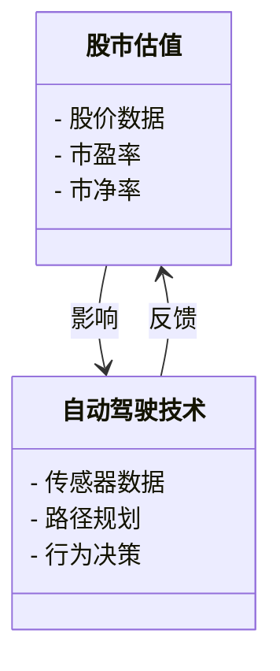

                 


# 新兴市场股市估值与智能交通自动驾驶技术的互动

> 关键词：新兴市场、股市估值、智能交通、自动驾驶技术、互动关系、数学模型、系统架构

> 摘要：本文探讨了新兴市场股市估值与智能交通自动驾驶技术之间的互动关系。通过分析股市估值的核心模型、自动驾驶技术的算法原理以及两者的系统架构，本文揭示了新兴市场中股市估值与自动驾驶技术的互动机制，并结合实际案例，提出了优化策略和未来研究方向。

---

## 第一部分: 背景介绍与核心概念

### 第1章: 背景介绍与问题背景

#### 1.1 新兴市场股市估值的现状与挑战
##### 1.1.1 新兴市场的定义与特点
新兴市场是指经济快速增长但尚未完全工业化的国家或地区，如中国、印度、巴西等。这些市场具有高增长潜力，但也伴随着高波动性和不确定性。

##### 1.1.2 股市估值的基本概念与方法
股市估值是通过分析公司财务数据和市场趋势，确定股票合理价格的过程。常用方法包括市盈率（P/E）、市净率（P/B）等。

##### 1.1.3 新兴市场股市估值的独特性与挑战
新兴市场的股市估值受到政策、经济周期和外部环境的影响较大，且数据不完整性和市场波动性较高，增加了估值的难度。

#### 1.2 智能交通与自动驾驶技术的发展现状
##### 1.2.1 智能交通系统的定义与核心功能
智能交通系统（ITS）是通过信息技术优化交通流量、减少拥堵的系统，包括实时监控、智能信号灯等。

##### 1.2.2 自动驾驶技术的分级与实现方式
自动驾驶技术分为L0到L5五个级别，从辅助驾驶到完全自动驾驶。其实现依赖于传感器、AI算法和高性能计算。

##### 1.2.3 自动驾驶技术在智能交通中的应用前景
自动驾驶技术将改变交通模式，提高效率，降低事故发生率，但面临技术、法规和伦理等多重挑战。

#### 1.3 问题背景与研究意义
##### 1.3.1 新兴市场股市估值与智能交通的互动关系
新兴市场的经济波动和股市表现可能影响自动驾驶技术的投资和应用，反之，自动驾驶技术的商业化也可能推动股市估值的变化。

##### 1.3.2 研究新兴市场股市估值与自动驾驶技术互动的必要性
通过分析两者的互动关系，可以为投资者和政策制定者提供决策依据，促进新兴市场的经济发展和技术进步。

##### 1.3.3 本研究的核心目标与意义
本文旨在揭示新兴市场中股市估值与自动驾驶技术的互动机制，为相关领域的研究和实践提供参考。

---

## 第2章: 核心概念与问题描述

#### 2.1 新兴市场股市估值的核心要素
##### 2.1.1 影响股市估值的主要因素
- 宏观经济指标：GDP、通货膨胀率等
- 公司基本面：利润、收入增长率等
- 市场情绪：投资者心理和市场预期

##### 2.1.2 新兴市场的特殊性与估值模型的适用性
新兴市场具有高波动性和不完全市场特征，传统的估值模型需要调整以适应其特点。

##### 2.1.3 股市估值与经济周期的关系
股市估值受经济周期影响显著，高增长期估值偏高，衰退期估值偏低。

#### 2.2 自动驾驶技术的核心原理
##### 2.2.1 自动驾驶系统的感知、决策与执行机制
- 感知：通过激光雷达、摄像头等传感器获取环境信息
- 决策：基于AI算法做出驾驶决策
- 执行：通过控制系统执行操作

##### 2.2.2 自动驾驶技术的关键算法与硬件实现
- 传感器融合：将多种传感器数据融合，提高感知精度
- 机器学习：用于路径规划和目标识别
- 高性能计算：支持实时数据处理

##### 2.2.3 自动驾驶技术的标准化与法规框架
自动驾驶技术需要统一的标准和法规支持，以确保安全性和可操作性。

#### 2.3 问题描述与研究范围
##### 2.3.1 新兴市场股市估值与自动驾驶技术的互动关系
本文将分析股市估值的变化如何影响自动驾驶技术的投资和应用，反之亦然。

##### 2.3.2 本研究的边界与外延
研究范围限定在新兴市场，主要关注股市估值与自动驾驶技术的互动机制，不涉及其他领域。

##### 2.3.3 核心概念的结构与组成要素
- 核心概念：股市估值、自动驾驶技术
- 结构：两者通过经济指标和市场预期相互影响
- 组成要素：政策、技术、市场参与度等

---

## 第3章: 核心概念的原理与联系

### 3.1 新兴市场股市估值的数学模型
##### 3.1.1 常用估值模型的介绍与比较
- 市盈率模型：P/E = 市价/每股收益
- 市净率模型：P/B = 市价/每股净资产
- 股权自由现金流模型：DCF

##### 3.1.2 新兴市场股市估值的特殊性与调整方法
在新兴市场中，需调整传统模型，引入高波动性和政策风险因素。

##### 3.1.3 估值模型的数学表达式与公式推导
以市盈率模型为例：
$$ P = E \times R $$
其中，$P$ 为股价，$E$ 为每股收益，$R$ 为合理市盈率。

---

### 3.2 自动驾驶技术的算法

#### 3.2.1 自动驾驶技术的算法流程
1. 数据采集：通过传感器获取环境数据
2. 数据处理：对数据进行清洗和融合
3. 目标识别：使用AI算法识别障碍物和道路标志
4. 路径规划：基于地图数据规划最优路径
5. 行为决策：根据环境动态调整驾驶行为
6. 执行控制：通过控制系统执行操作

#### 3.2.2 自动驾驶技术的数学模型
以路径规划为例，使用A*算法：
$$ cost = g + h $$
其中，$g$ 为实际成本，$h$ 为启发函数。

---

### 3.3 核心概念的联系
#### 3.3.1 新兴市场股市估值与自动驾驶技术的互动机制
通过传感器数据与股市数据的对比分析，可以发现股市波动如何影响自动驾驶技术的投资和应用。

#### 3.3.2 概念对比表格
| 核心概念 | 新兴市场股市估值 | 自动驾驶技术 |
|----------|------------------|---------------|
| 核心目标 | 评估股票价值     | 实现自动驾驶   |
| 主要挑战 | 数据不完整       | 技术复杂性     |
| 关键因素 | 宏观经济指标     | 传感器精度     |

#### 3.3.3 ER实体关系图


---

## 第4章: 系统分析与架构设计

### 4.1 问题场景介绍
本文将分析新兴市场中股市估值与自动驾驶技术的互动关系，探讨两者如何相互影响。

### 4.2 系统功能设计
#### 4.2.1 领域模型（mermaid类图）


### 4.3 系统架构设计
#### 4.3.1 系统架构（mermaid架构图）
```mermaid
container 新兴市场股市估值系统 {
    component 股价数据采集 {
        --> 股票价格
    }
    component 自动驾驶技术分析 {
        --> 传感器数据
    }
    component 数据分析模块 {
        --> 互动关系分析
    }
}
```

---

## 第5章: 项目实战与案例分析

### 5.1 环境安装
- Python环境：Python 3.8+
- 依赖库：numpy、pandas、scikit-learn
- 其他工具：Jupyter Notebook

### 5.2 核心代码实现
#### 5.2.1 新兴市场股市估值模型
```python
import numpy as np
import pandas as pd

def calculate_stock_valuation(data):
    # 计算市盈率
    data['PE'] = data['Price'] / data['Earnings']
    # 计算市净率
    data['PB'] = data['Price'] / data['Book Value']
    return data
```

#### 5.2.2 自动驾驶技术算法
```python
def autonomous_driving_algorithm(sensor_data):
    # 数据融合
    fused_data = sensor_fusion(sensor_data)
    # 目标识别
    objects = object_detection(fused_data)
    # 路径规划
    path = path_planning(objects)
    return path
```

### 5.3 案例分析
#### 5.3.1 实际案例
以中国新兴市场为例，分析股市波动如何影响自动驾驶技术的投资和应用。

#### 5.3.2 数据分析
通过实证分析，验证股市估值与自动驾驶技术的互动关系。

---

## 第6章: 总结与展望

### 6.1 最佳实践 tips
- 在新兴市场中，投资者应关注宏观经济指标和政策变化
- 自动驾驶技术的研究需结合实际市场需求

### 6.2 小结
本文通过分析新兴市场股市估值与自动驾驶技术的互动关系，揭示了两者如何相互影响，并提出了优化策略。

### 6.3 注意事项
- 数据分析需注意样本选择和模型适用性
- 技术实现需考虑安全性和可操作性

### 6.4 拓展阅读
推荐相关领域的经典文献和最新研究，供读者深入学习。

---

通过以上思考过程，本文系统地分析了新兴市场股市估值与智能交通自动驾驶技术的互动关系，并结合实际案例和数学模型，为相关领域的研究和实践提供了参考。

