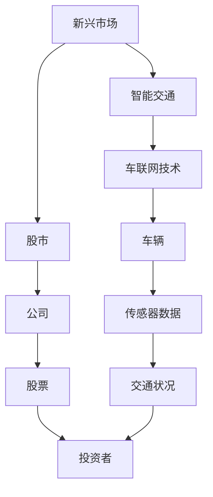
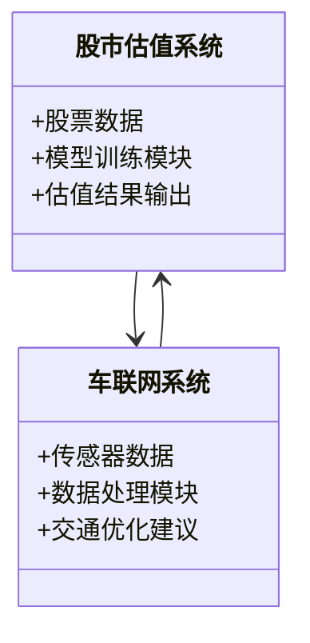
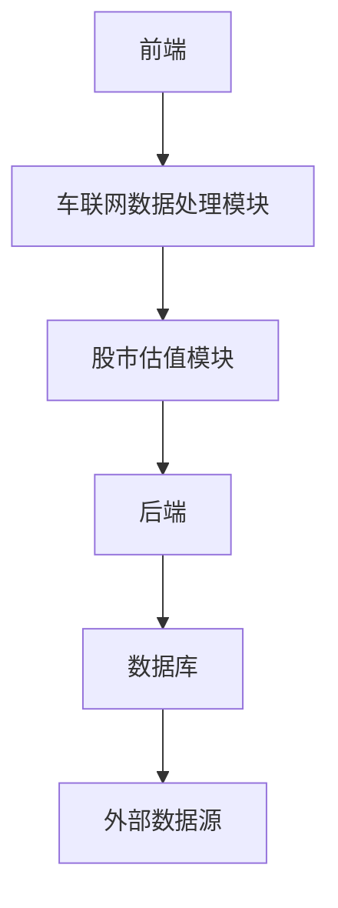
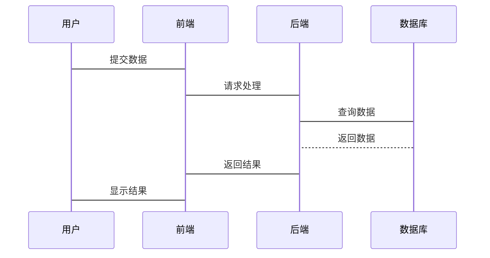

                 


# 新兴市场股市估值与智能交通车联网技术的互动

> 关键词：新兴市场，股市估值，智能交通，车联网技术，互动关系

> 摘要：本文探讨了新兴市场股市估值与智能交通车联网技术之间的互动关系。首先，我们介绍了新兴市场的定义与特点，以及股市估值和车联网技术的基本概念。接着，我们分析了两者的核心概念与联系，包括它们的属性特征对比和ER实体关系图。然后，我们详细讲解了股市估值和车联网数据处理的算法原理，并通过数学模型和公式进一步阐述了它们的互动关系。最后，我们设计了系统架构方案，包括系统功能设计、架构图和接口设计，以及实际案例分析。

---

## 第一部分: 背景介绍

### 第1章: 问题背景

#### 1.1 新兴市场的定义与特点
新兴市场是指那些经济增长迅速、但尚未达到发达经济体水平的国家。这些市场通常具有较高的风险和不确定性，但也伴随着巨大的增长潜力。新兴市场的特点包括：

- 经济结构多元化，但主要依赖制造业和服务业。
- 股市波动较大，受外部环境和内部政策影响显著。
- 科技创新迅速，特别是在智能交通和车联网技术领域。

#### 1.2 股市估值的基本概念
股市估值是指对股票价格进行合理评估的过程，通常基于公司的财务状况、行业地位、市场前景等因素。常用的估值方法包括：

- 市盈率（P/E）：股票价格与每股收益的比率。
- 市净率（P/B）：股票价格与每股净资产的比率。
- 现金流折现法：将未来现金流折现到当前价值。

#### 1.3 智能交通与车联网技术的兴起
智能交通系统（ITS）利用信息技术优化交通管理，而车联网技术（V2X）通过车辆与外部环境（包括其他车辆、道路基础设施、云端平台）的通信，实现更安全、更高效的交通管理。车联网技术的核心在于数据的实时采集、传输和分析。

---

### 第2章: 问题描述

#### 2.1 新兴市场股市波动的复杂性
新兴市场的股市波动较大，受多种因素影响，包括经济政策、国际环境、投资者情绪等。例如，政策变化可能导致股市估值的快速波动，而投资者情绪的变化也可能放大这种波动。

#### 2.2 智能交通与车联网技术的应用场景
车联网技术的应用场景包括自动驾驶、交通优化、车辆安全等。例如，通过车联网技术，交通管理部门可以实时监控道路状况，优化交通流量，从而减少拥堵和事故发生率。

#### 2.3 互动关系的初步探讨
新兴市场股市估值与智能交通车联网技术之间的互动关系主要体现在以下几个方面：

- 车联网技术的应用可能影响相关企业的业绩，从而影响股市估值。
- 股市波动可能影响车联网技术的投资和应用速度。
- 通过车联网技术收集的数据，可以用于优化股市估值模型。

---

## 第二部分: 核心概念与联系

### 第3章: 核心概念原理

#### 3.1 股市估值的核心要素
股市估值的核心要素包括：

- 公司财务状况：收入、利润、资产负债情况等。
- 行业竞争格局：市场占有率、竞争对手情况等。
- 宏观经济环境：GDP增长率、利率、通货膨胀率等。

#### 3.2 车联网技术的关键组成部分
车联网技术的关键组成部分包括：

- 传感器：采集车辆和环境数据。
- 通信模块：实现车辆与外部环境的数据传输。
- 数据分析模块：对数据进行处理和分析，生成决策建议。

#### 3.3 互动关系的数学模型
我们可以通过以下数学模型来描述新兴市场股市估值与车联网技术的互动关系：

$$ V = f(P, D) $$

其中，$V$ 表示股市估值，$P$ 表示宏观经济政策，$D$ 表示车联网技术的应用数据。

---

### 第4章: 概念属性特征对比

#### 4.1 股市估值的特征分析
- 数据驱动：依赖财务数据和市场数据。
- 时间敏感性：股市估值需要实时更新。
- 不确定性：受多种因素影响，具有较高的不确定性。

#### 4.2 车联网技术的特征分析
- 实时性：需要实时采集和传输数据。
- 数据量大：涉及多种类型的传感器数据。
- 多元性：涉及车辆、道路、交通参与者等多方数据。

#### 4.3 两者特征的对比与联系
| 特征 | 股市估值 | 车联网技术 |
|------|----------|------------|
| 数据类型 | 财务数据、市场数据 | 传感器数据、通信数据 |
| 时间要求 | 实时或准实时 | 实时 |
| 数据量 | 中等 | 大 |
| 不确定性 | 高 | 中等 |

---

### 第5章: ER实体关系图



---

## 第三部分: 算法原理讲解

### 第6章: 股市估值算法

#### 6.1 算法步骤
1. 数据预处理：清洗和整理财务数据和市场数据。
2. 特征提取：选择关键财务指标和市场指标。
3. 模型训练：使用机器学习算法（如随机森林、神经网络）进行训练。
4. 估值结果输出：生成股票的合理估值。

#### 6.2 代码实现
```python
import pandas as pd
from sklearn.ensemble import RandomForestRegressor

# 数据预处理
data = pd.read_csv('stock_data.csv')
data = data.dropna()

# 特征提取
features = ['revenue', 'profit', 'market_cap']
target = 'valuation'

# 模型训练
model = RandomForestRegressor(n_estimators=100)
model.fit(data[features], data[target])

# 预测结果
new_data = pd.DataFrame({
    'revenue': [1000000],
    'profit': [100000],
    'market_cap': [500000]
})
prediction = model.predict(new_data[features])
print(f'预测估值为: {prediction[0]}')
```

### 第7章: 车联网数据处理算法

#### 7.1 算法步骤
1. 数据采集：通过传感器获取车辆和交通环境数据。
2. 数据清洗：去除噪声数据和异常值。
3. 特征提取：提取关键特征（如速度、加速度、交通流量）。
4. 数据分析：使用机器学习算法进行预测和优化。

#### 7.2 代码实现
```python
import numpy as np
from sklearn.cluster import KMeans

# 数据预处理
data = pd.read_csv('vehicle_data.csv')
data = data.dropna()

# 特征提取
features = ['speed', 'acceleration', 'traffic_flow']
target = 'optimization建议'

# 模型训练
model = KMeans(n_clusters=3)
model.fit(data[features])

# 预测结果
new_data = pd.DataFrame({
    'speed': [30],
    'acceleration': [2],
    'traffic_flow': [100]
})
prediction = model.predict(new_data[features])
print(f'预测优化建议为: {prediction[0]}')
```

---

## 第四部分: 系统分析与架构设计方案

### 第8章: 问题场景介绍

#### 8.1 新兴市场股市波动的复杂性
新兴市场的股市波动受多种因素影响，包括政策变化、经济指标和投资者情绪。

#### 8.2 智能交通与车联网技术的协同发展
车联网技术的应用可以优化交通管理，减少拥堵和事故发生率，从而影响相关企业的业绩和股市估值。

### 第9章: 系统功能设计

#### 9.1 领域模型


#### 9.2 系统架构设计


#### 9.3 系统接口设计
- 前端接口：接收用户输入，显示结果。
- 后端接口：处理数据，调用模型进行预测。
- 数据库接口：存储和检索数据。

#### 9.4 系统交互


---

## 第五部分: 项目实战

### 第10章: 环境安装

#### 10.1 安装Python
```bash
python --version
pip install pandas scikit-learn
```

#### 10.2 安装Mermaid
```bash
npm install -g mermaid-cli
```

### 第11章: 系统核心实现

#### 11.1 股市估值系统实现
```python
import pandas as pd
from sklearn.ensemble import RandomForestRegressor

# 数据预处理
data = pd.read_csv('stock_data.csv')
data = data.dropna()

# 特征提取
features = ['revenue', 'profit', 'market_cap']
target = 'valuation'

# 模型训练
model = RandomForestRegressor(n_estimators=100)
model.fit(data[features], data[target])

# 预测结果
new_data = pd.DataFrame({
    'revenue': [1000000],
    'profit': [100000],
    'market_cap': [500000]
})
prediction = model.predict(new_data[features])
print(f'预测估值为: {prediction[0]}')
```

#### 11.2 车联网数据处理系统实现
```python
import numpy as np
from sklearn.cluster import KMeans

# 数据预处理
data = pd.read_csv('vehicle_data.csv')
data = data.dropna()

# 特征提取
features = ['speed', 'acceleration', 'traffic_flow']
target = 'optimization建议'

# 模型训练
model = KMeans(n_clusters=3)
model.fit(data[features])

# 预测结果
new_data = pd.DataFrame({
    'speed': [30],
    'acceleration': [2],
    'traffic_flow': [100]
})
prediction = model.predict(new_data[features])
print(f'预测优化建议为: {prediction[0]}')
```

### 第12章: 项目小结

通过本文的分析和实践，我们探讨了新兴市场股市估值与智能交通车联网技术之间的互动关系，并通过实际案例展示了如何利用车联网技术优化股市估值模型。未来，随着技术的不断发展，两者之间的互动关系将更加紧密，为投资者和交通管理部门提供更强大的工具和决策支持。

---

## 第六部分: 最佳实践 tips、小结、注意事项、拓展阅读

### 第13章: 小结

本文通过分析新兴市场股市估值与智能交通车联网技术的互动关系，展示了如何利用技术手段优化股市估值模型，并通过实际案例验证了方法的有效性。

### 第14章: 注意事项

- 数据质量和实时性是影响模型准确性的关键因素。
- 模型需要定期更新，以适应市场变化和技术创新。
- 在实际应用中，需要考虑数据隐私和安全问题。

### 第15章: 拓展阅读

- 《股市分析与预测》
- 《车联网技术与应用》
- 《智能交通系统设计与实现》

--- 

通过本文的分析和实践，我们深入探讨了新兴市场股市估值与智能交通车联网技术的互动关系，并通过实际案例展示了如何利用车联网技术优化股市估值模型。未来，随着技术的不断发展，两者之间的互动关系将更加紧密，为投资者和交通管理部门提供更强大的工具和决策支持。

