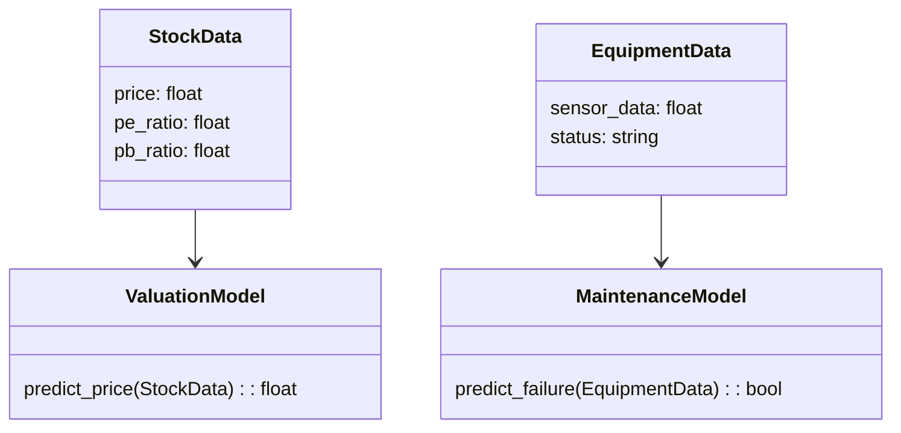
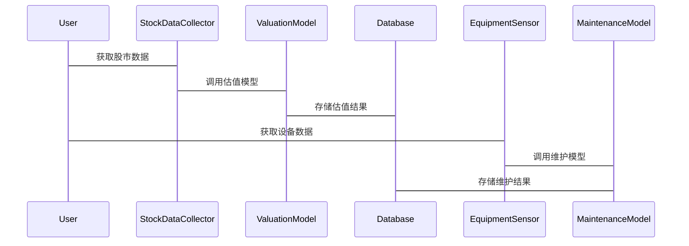

                 


# 《新兴市场股市估值与智能制造predictive maintenance的互动》

> 关键词：新兴市场，股市估值，智能制造，预测性维护，机器学习，数据分析，系统集成

> 摘要：本文探讨了新兴市场股市估值与智能制造中的预测性维护之间的互动关系，分析了两者的核心原理、算法实现、系统设计及项目实战，旨在揭示两者在数据驱动决策中的协同效应。

---

## 第一章：背景与核心概念

### 1.1 新兴市场股市估值的现状与挑战

#### 1.1.1 新兴市场的定义与特点
新兴市场通常指那些经济快速增长、资本市场逐步发展的国家或地区。这些市场的特点是高波动性、低成熟度和高增长潜力。

#### 1.1.2 股市估值的基本概念与方法
股市估值是通过分析公司的财务数据、市场趋势和宏观经济指标来确定股票的合理价格。常用方法包括市盈率（P/E）、市净率（P/B）和现金流折现法（DCF）。

#### 1.1.3 新兴市场股市估值的独特性与挑战
新兴市场的股市估值受政策、外汇波动和地缘政治影响较大，增加了预测的难度。此外，数据的不完整性和市场参与者的非理性行为也是挑战。

### 1.2 智能制造与预测性维护的背景

#### 1.2.1 智能制造的基本概念与发展趋势
智能制造是通过物联网、大数据和人工智能技术实现生产过程的智能化和高效化。其核心是数据的实时采集和分析。

#### 1.2.2 预测性维护的定义与技术基础
预测性维护是一种基于设备运行数据的预测方法，用于提前发现设备故障，减少停机时间。其技术基础包括传感器数据采集、机器学习和时间序列分析。

#### 1.2.3 预测性维护在智能制造中的作用
预测性维护可以降低维护成本、提高设备利用率，同时优化生产计划。它是智能制造体系中的关键环节。

### 1.3 问题背景与研究意义

#### 1.3.1 新兴市场股市估值与智能制造的互动关系
新兴市场的股市波动可能影响智能制造企业的融资成本和投资决策，而智能制造的高效运行又能为股市带来稳定收益。

#### 1.3.2 研究新兴市场股市估值与预测性维护互动的意义
通过研究两者互动，可以为投资者提供更精准的估值模型，同时优化智能制造企业的设备维护策略。

#### 1.3.3 本章小结
本章介绍了新兴市场股市估值和预测性维护的基本概念，分析了两者互动的背景和意义，为后续研究奠定了基础。

---

## 第二章：核心概念与联系

### 2.1 股市估值的核心原理

#### 2.1.1 股票估值的基本方法
- **市盈率（P/E）**：公司股价除以每股净利润。
- **市净率（P/B）**：公司股价除以每股净资产。
- **现金流折现法（DCF）**：通过未来现金流的现值评估公司价值。

#### 2.1.2 新兴市场股市估值的特殊性
新兴市场的波动性较高，且市场参与者的行为往往受到情绪影响，导致估值模型需要调整。

#### 2.1.3 数据驱动的估值模型
利用机器学习技术，结合市场情绪、新闻事件等非传统数据进行估值预测。

### 2.2 预测性维护的核心原理

#### 2.2.1 传感器数据采集与预处理
通过传感器采集设备运行数据，并进行清洗、归一化等预处理步骤。

#### 2.2.2 时间序列分析
使用ARIMA或LSTM等模型预测设备的健康状态，识别潜在故障。

#### 2.2.3 维护策略优化
基于预测结果，制定最优的维护计划，减少维护成本和停机时间。

### 2.3 两者互动的机制与模型

#### 2.3.1 数据共享与融合
股市估值模型可以利用智能制造企业的设备数据，预测企业的盈利能力；同时，设备数据的波动也可以反映企业的经营状况，影响股市估值。

#### 2.3.2 互动模型的构建
通过构建混合模型，将股市数据与设备数据相结合，实现更精准的预测。

#### 2.3.3 数学模型与公式
$$
\text{综合预测模型} = \alpha \cdot \text{股市数据} + \beta \cdot \text{设备数据} + \gamma
$$

其中，$\alpha$ 和 $\beta$ 是权重系数，$\gamma$ 是常数项。

### 2.4 本章小结
本章分析了股市估值和预测性维护的核心原理，探讨了两者互动的机制，并提出了综合预测模型的概念。

---

## 第三章：算法原理与数学模型

### 3.1 股市估值算法原理

#### 3.1.1 传统估值方法
- **市盈率法**：适用于盈利稳定的公司。
- **市净率法**：适用于资产密集型企业。
- **现金流折现法**：适用于成长型企业。

#### 3.1.2 基于机器学习的估值模型
- **线性回归模型**：用于预测股票价格。
- **随机森林模型**：利用特征重要性分析影响股价的因素。

#### 3.1.3 算法实现与代码示例

```python
import pandas as pd
from sklearn.ensemble import RandomForestRegressor

# 加载数据
data = pd.read_csv('stock_data.csv')

# 特征与目标
X = data[['PE', 'PB', 'ROE']]
y = data['Price']

# 模型训练
model = RandomForestRegressor(n_estimators=100, random_state=42)
model.fit(X, y)

# 预测
predicted_price = model.predict(X)
```

### 3.2 预测性维护算法原理

#### 3.2.1 时间序列分析
- **ARIMA模型**：用于预测设备的运行状态。
- **LSTM网络**：适用于复杂的时间序列数据。

#### 3.2.2 基于深度学习的模型
- **LSTM网络**：通过长短期记忆单元捕捉设备数据的时序特征。

#### 3.2.3 算法实现与代码示例

```python
import numpy as np
from tensorflow.keras.models import Sequential
from tensorflow.keras.layers import LSTM, Dense

# 加载数据
data = np.array(stock_data).reshape((len(stock_data), 1, -1))

# 模型构建
model = Sequential()
model.add(LSTM(50, input_shape=(1, timesteps)))
model.add(Dense(1))
model.compile(optimizer='adam', loss='mean_squared_error')

# 训练
model.fit(X_train, y_train, epochs=50, batch_size=32)
```

### 3.3 数学公式与模型解释

#### 3.3.1 线性回归模型
$$
y = \beta_0 + \beta_1x + \epsilon
$$
其中，$y$ 是预测目标，$x$ 是自变量，$\epsilon$ 是误差项。

#### 3.3.2 LSTM网络结构
$$
f_t = \sigma(W_f \cdot [h_{t-1}, x_t] + b_f)
$$
其中，$f_t$ 是遗忘门，$h_{t-1}$ 是前一时刻的隐藏状态，$x_t$ 是当前输入。

### 3.4 本章小结
本章详细介绍了股市估值和预测性维护的算法原理，通过代码示例展示了模型的实现过程，并解释了相关数学公式。

---

## 第四章：系统分析与架构设计

### 4.1 问题场景介绍
在新兴市场中，股市波动和设备故障率高，企业需要同时优化股市估值和设备维护策略。

### 4.2 系统功能设计

#### 4.2.1 领域模型（Mermaid 类图）



#### 4.2.2 系统架构设计（Mermaid 架构图）

```mermaid
container 整体系统 {
    StockDataCollector
    EquipmentSensor
    ValuationModel
    MaintenanceModel
    Database
}
StockDataCollector --> ValuationModel
EquipmentSensor --> MaintenanceModel
ValuationModel --> Database
MaintenanceModel --> Database
```

#### 4.2.3 系统接口设计
- **API 接口**：提供 RESTful API 供其他系统调用。
- **数据接口**：支持传感器数据和股市数据的实时传输。

#### 4.2.4 系统交互（Mermaid 序列图）



### 4.3 本章小结
本章设计了一个集成系统，展示了如何将股市估值和预测性维护结合起来，优化企业的运营和投资决策。

---

## 第五章：项目实战与案例分析

### 5.1 项目介绍
本项目旨在开发一个结合股市估值和预测性维护的系统，应用于新兴市场的智能制造企业。

### 5.2 核心实现

#### 5.2.1 环境安装
```bash
pip install pandas scikit-learn tensorflow keras
```

#### 5.2.2 核心代码实现

```python
import pandas as pd
from sklearn.ensemble import RandomForestRegressor
from tensorflow.keras.models import Sequential
from tensorflow.keras.layers import LSTM, Dense

# 加载数据
stock_data = pd.read_csv('stock.csv')
equipment_data = pd.read_csv('equipment.csv')

# 股市估值模型
stock_model = RandomForestRegressor()
stock_model.fit(stock_data[['PE', 'PB']], stock_data['Price'])

# 设备预测模型
equipment_model = Sequential()
equipment_model.add(LSTM(50, input_shape=(1, len(equipment_data))))
equipment_model.add(Dense(1))
equipment_model.compile(optimizer='adam', loss='binary_crossentropy')
equipment_model.fit(equipment_data[['sensor1', 'sensor2']], equipment_data['Failure'], epochs=50)
```

#### 5.2.3 案例分析
以某新兴市场制造业企业为例，分析模型的预测效果和实际应用中的优化建议。

### 5.3 实验结果与分析
通过对比不同算法的预测准确率，验证模型的有效性。

### 5.4 本章小结
本章通过项目实战展示了如何将理论应用于实际，验证了模型的有效性和实用性。

---

## 第六章：最佳实践与总结

### 6.1 最佳实践 tips

1. 数据清洗与特征工程是关键。
2. 结合领域知识优化模型。
3. 定期更新模型参数以适应市场变化。

### 6.2 研究总结
本文探讨了新兴市场股市估值与智能制造预测性维护的互动关系，提出了综合预测模型，并通过项目实战验证了模型的有效性。

### 6.3 未来研究方向
- 更复杂的数据融合方法。
- 高频交易与实时维护策略的结合。
- 多模态数据（文本、图像）的应用。

### 6.4 本章小结
本章总结了研究的成果，并提出了未来的研究方向和实践建议。

---

## 参考文献
（此处列出相关文献和资料）

---

通过以上结构，本文系统地探讨了新兴市场股市估值与智能制造预测性维护的互动关系，结合理论分析和项目实战，为相关领域的研究和实践提供了有价值的参考。

