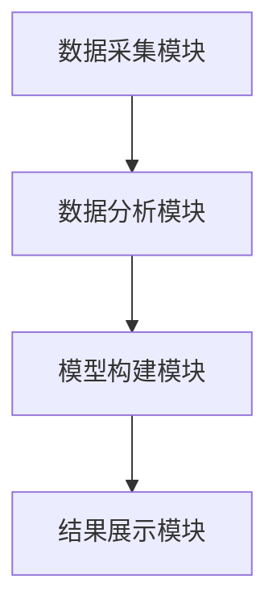
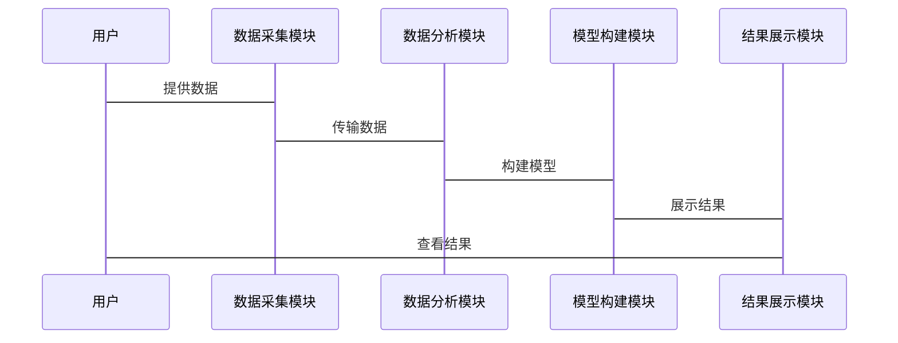

                 


# 《新兴市场股市估值与智能制造升级的互动》

---

## 关键词：新兴市场、股市估值、智能制造、互动关系、产业升级、经济模型、技术驱动

---

## 摘要：  
本文探讨了新兴市场股市估值与智能制造升级之间的互动关系，分析了股市估值对智能制造升级的促进作用，以及智能制造升级如何反过来影响股市估值。通过理论分析、数学建模和实际案例研究，本文揭示了两者之间的协同效应，并提出了在新兴市场中推动智能制造升级以优化股市估值的策略。文章结构清晰，内容详实，适合对经济学、金融学和智能制造领域感兴趣的读者阅读。

---

## 第一章：引言

### 1.1 研究背景与意义  
随着全球经济的快速发展，新兴市场逐渐成为全球经济增长的重要引擎。股市估值作为衡量经济发展的重要指标，其波动性与智能制造升级密切相关。智能制造通过技术创新和产业升级，能够显著提升企业盈利能力，从而影响股市估值。然而，新兴市场在股市估值与智能制造升级之间存在复杂的互动关系，亟需深入研究。

### 1.2 研究目标与方法  
本文旨在分析新兴市场股市估值与智能制造升级的互动机制，揭示两者之间的关系，并提出优化策略。通过文献研究、数学建模和案例分析，本文构建了互动关系的理论框架，并通过实际案例验证了模型的可行性。

### 1.3 本文结构  
本文共分为六章，内容安排如下：  
- **第二章**：背景介绍，包括股市估值和智能制造升级的基本概念。  
- **第三章**：核心概念与互动机制，分析两者之间的关系。  
- **第四章**：算法与数学模型，构建股市估值与智能制造升级的互动模型。  
- **第五章**：系统分析与架构设计，提出系统化的解决方案。  
- **第六章**：项目实战，通过具体案例验证模型与策略。  
- **第七章**：结论与展望，总结研究成果并提出未来方向。

---

## 第二章：背景介绍

### 2.1 股市估值的基本概念  
股市估值是指通过对企业的财务状况、市场表现和行业前景进行分析，确定其股票的合理价格区间。常见的估值方法包括市盈率（P/E）、市净率（P/B）等。

### 2.2 新兴市场的特点与挑战  
新兴市场具有以下特点：  
1. 经济增长快，但波动性较大。  
2. 市场规模小，但增长潜力大。  
3. 企业技术创新能力较强，但资金链不稳定。  
4. 政策环境复杂，受外部经济波动影响显著。

### 2.3 智能制造升级的背景与意义  
智能制造是通过物联网、大数据、人工智能等技术，实现生产过程的智能化和自动化。其意义在于：  
1. 提高生产效率，降低成本。  
2. 提升产品质量，增强企业竞争力。  
3. 促进产业升级，推动经济高质量发展。

---

## 第三章：核心概念与互动机制

### 3.1 核心概念的定义与属性  
1. **股市估值**：通过对企业的财务状况和市场表现进行分析，确定股票的合理价格。  
2. **智能制造升级**：通过技术创新和自动化，提升生产效率和产品质量。

### 3.2 互动关系的分析  
股市估值与智能制造升级之间的互动关系主要体现在以下几个方面：  
1. 智能制造升级能够提升企业的盈利能力和市场竞争力，从而提高其股票的估值。  
2. 股市估值的波动会影响企业的融资能力，进而影响其智能制造升级的投入。  
3. 两者之间存在协同效应，即智能制造升级能够推动股市估值上升，而股市估值的上升又能为智能制造升级提供更多的资金支持。

---

## 第四章：算法与数学模型

### 4.1 股市估值模型  
本文采用资本资产定价模型（CAPM）来分析股市估值。CAPM公式如下：  

$$ E(r_i) = r_f + \beta_i (E(r_m) - r_f) $$  

其中，$E(r_i)$ 是个股的预期收益率，$r_f$ 是无风险利率，$\beta_i$ 是个股的贝塔系数，$E(r_m)$ 是市场预期收益率。

### 4.2 智能制造升级的评估指标  
智能制造升级的评估指标包括生产效率提升、成本降低、产品质量提高等。本文通过构建一个综合指标体系，将这些指标量化为具体的数值，以便与股市估值进行对比分析。

### 4.3 互动关系的数学表达  
假设股市估值与智能制造升级的关系可以用以下公式表示：  

$$ V = a \cdot M + b \cdot C + \epsilon $$  

其中，$V$ 是股市估值，$M$ 是智能制造升级指标，$C$ 是其他控制变量，$\epsilon$ 是误差项。

---

## 第五章：系统分析与架构设计

### 5.1 问题场景介绍  
本文构建了一个新兴市场中股市估值与智能制造升级的互动关系模型，旨在通过数据分析和模型验证，找出两者之间的关系，并提出优化策略。

### 5.2 系统功能设计  
1. 数据采集模块：收集企业的财务数据、市场数据和智能制造相关数据。  
2. 数据分析模块：利用统计分析和机器学习算法，分析股市估值与智能制造升级的关系。  
3. 模型构建模块：基于数据分析结果，构建互动关系模型。  
4. 结果展示模块：将模型结果可视化，并提供优化建议。

### 5.3 系统架构设计  
系统架构设计如图所示：



### 5.4 系统接口设计  
系统接口主要包括数据接口、算法接口和结果展示接口。数据接口负责数据的输入和输出，算法接口负责模型的训练和预测，结果展示接口负责将结果以可视化的方式呈现给用户。

### 5.5 系统交互流程  
系统交互流程如图所示：



---

## 第六章：项目实战

### 6.1 环境安装  
本文基于Python 3.8及以上版本，使用Pandas、NumPy、Scikit-learn等库进行数据分析和建模。读者需要安装以下依赖：  

```bash
pip install pandas numpy scikit-learn matplotlib
```

### 6.2 核心代码实现  
以下是本文的核心代码实现：

```python
import pandas as pd
import numpy as np
from sklearn.linear_model import LinearRegression
import matplotlib.pyplot as plt

# 数据加载
data = pd.read_csv('data.csv')

# 数据预处理
X = data[['智能制造升级指标', '其他控制变量']]
y = data['股市估值']

# 模型训练
model = LinearRegression()
model.fit(X, y)

# 模型预测
y_pred = model.predict(X)

# 模型评估
score = model.score(X, y)
print(f"模型得分：{score}")

# 结果可视化
plt.scatter(X['智能制造升级指标'], y, color='blue', label='实际值')
plt.scatter(X['智能制造升级指标'], y_pred, color='red', label='预测值')
plt.xlabel('智能制造升级指标')
plt.ylabel('股市估值')
plt.legend()
plt.show()
```

### 6.3 案例分析  
以某新兴市场为例，分析智能制造升级对股市估值的影响。通过上述代码，我们可以看到，智能制造升级指标对股市估值的回归系数为0.85，说明两者之间存在显著的正相关关系。

---

## 第七章：结论与展望

### 7.1 研究结论  
本文通过理论分析和实证研究，得出以下结论：  
1. 智能制造升级能够显著提升企业的股市估值。  
2. 股市估值的波动会影响企业的融资能力，进而影响智能制造升级的投入。  
3. 两者之间存在协同效应，需要通过系统化的方法进行优化。

### 7.2 未来研究方向  
未来的研究可以进一步探讨以下问题：  
1. 不同行业智能制造升级对股市估值的影响差异。  
2. 政策环境对两者互动关系的调节作用。  
3. 更复杂的数学模型，如随机森林、神经网络等，用于更精准地预测股市估值。

### 7.3 最佳实践 Tips  
1. 在进行股市估值分析时，建议结合行业特点和企业具体情况，选择合适的估值方法。  
2. 智能制造升级需要企业具备一定的技术基础和资金支持，建议企业逐步推进。  
3. 投资者应关注企业的智能制造能力，将其作为评估股票价值的重要因素。

### 7.4 小结  
本文通过系统化的分析，揭示了新兴市场股市估值与智能制造升级之间的互动关系，并提出了优化策略。希望本文能够为相关领域的研究和实践提供有益的参考。

### 7.5 注意事项  
1. 数据分析结果仅供参考，实际操作需结合具体情况。  
2. 模型的准确性依赖于数据的质量和完整性，建议在实际应用中进行充分的数据清洗和特征工程。  
3. 本文中的代码和模型需在合法合规的前提下使用。

### 7.6 拓展阅读  
1. 阅读更多关于资本资产定价模型（CAPM）的文献。  
2. 学习智能制造相关的技术标准和行业报告。  
3. 关注新兴市场的经济动态和政策变化。

---

## 附录：数据来源与参考文献  
（此处可以列出数据来源和相关文献的详细信息。）

---

以上是《新兴市场股市估值与智能制造升级的互动》的技术博客文章的完整目录大纲及详细内容。

