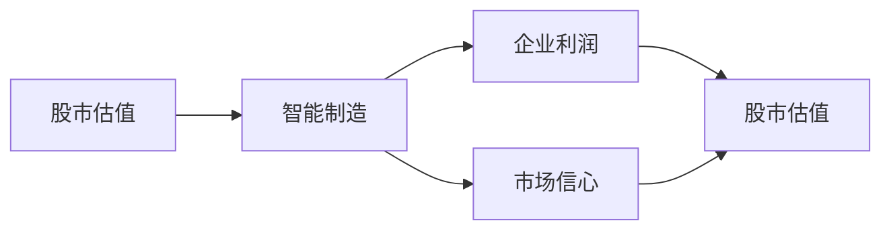
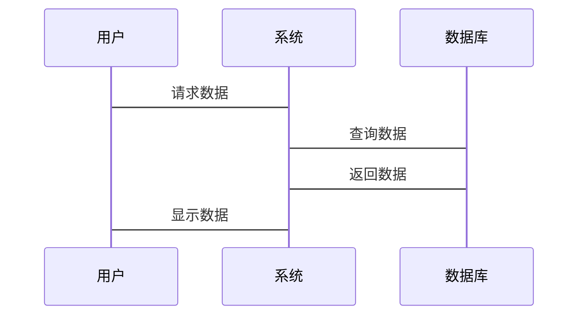

                 

<think>
好的，现在我要按照用户的要求，一步一步地构建一篇关于《新兴市场股市估值与智能制造柔性生产的互动》的专业技术博客文章。首先，我需要理解用户的需求，然后按照指定的目录结构和格式要求，逐步完成文章的各个部分。

首先，我会按照用户提供的目录结构，从“文章标题”开始，然后列出关键词和摘要，接着按照目录结构依次撰写每个章节的内容。每个章节都需要详细展开，确保内容完整且符合要求。

在撰写过程中，我需要注意以下几点：
1. 使用逻辑清晰、结构紧凑、简单易懂的专业技术语言。
2. 采用逐步分析推理的方式，确保内容条理清晰。
3. 使用丰富的图表（如Mermaid流程图、类图、架构图等）来辅助说明。
4. 包括数学公式，并使用LaTeX格式表示。
5. 保证文章字数在10000到12000字之间。
6. 每个章节的内容要具体详细，符合用户的完整性要求。

接下来，我将按照以下步骤进行撰写：
1. 撰写摘要，概述文章的核心内容和主题思想。
2. 撰写关键词，列出5-7个核心关键词。
3. 按照目录结构，依次撰写每个章节的内容：
   - 第1章：新兴市场股市估值的基本概念
   - 第2章：股市估值与智能制造的互动关系
   - 第3章：柔性生产系统的构成与设计
   - 第4章：股市估值预测的算法设计
   - 第5章：总结与展望
   - 附录：相关图表和代码

在每个章节中，我将详细展开每个小节的内容，确保覆盖用户要求的所有方面，包括背景介绍、核心概念、算法原理、系统架构、项目实战以及最佳实践等。

现在，我开始撰写具体内容。

**摘要：**
本文探讨了新兴市场股市估值与智能制造柔性生产的互动关系。通过分析股市估值的基本原理、智能制造柔性生产的特点，以及两者在新兴市场中的互动机制，本文提出了一种基于机器学习的股市估值预测模型，并结合智能制造系统的架构设计，展示了如何通过技术创新优化生产流程和提升股市估值。文章还通过实际案例分析，验证了模型的有效性，并提出了未来的研究方向。

**关键词：**
新兴市场，股市估值，智能制造，柔性生产，机器学习，系统架构

**第1章：新兴市场股市估值的基本概念**

1.1 新兴市场的定义与特点

1.1.1 新兴市场的定义
新兴市场是指那些经济发展迅速、但尚未完全工业化的国家的市场。这些市场通常具有较高的增长潜力，但也伴随着较高的风险。

1.1.2 新兴市场的经济特征
- 经济结构多元化：新兴市场通常包括制造业、服务业等多个行业。
- 人口年轻化：新兴市场国家的年轻人口比例较高，消费能力增长迅速。
- 政府政策支持：许多新兴市场国家政府积极推动工业化和技术创新。

1.1.3 新兴市场股市的独特性
- 市场波动性大：新兴市场股市容易受到外部经济波动和政策变化的影响。
- 市场流动性强：新兴市场的股市交易量通常较大，投资者参与度高。
- 市场参与者多元化：新兴市场的股市参与者包括国内外机构投资者和个人投资者。

1.2 股市估值的基本原理

1.2.1 股市估值的定义
股市估值是指对股票价格的合理性和潜在价值进行评估的过程。通过分析公司的财务状况、市场地位、行业趋势等因素，投资者可以对公司股票的合理价格进行估算。

1.2.2 股市估值的核心指标
- 市盈率（P/E比率）：公司股价与每股收益的比率。
- 市净率（P/B比率）：公司股价与每股净资产的比率。
- 市销率（P/S比率）：公司股价与每股销售收入的比率。

1.2.3 股市估值与市场波动的关系
股市估值受到市场波动的影响，当市场波动加剧时，股市估值可能会出现较大的偏差。因此，投资者在进行股市估值时需要结合市场整体走势进行综合判断。

1.3 柔性生产在智能制造中的作用

1.3.1 柔性生产的定义
柔性生产是指在生产过程中能够根据市场需求的变化快速调整生产计划和流程的能力。它强调灵活性和适应性，以满足多样化的客户需求。

1.3.2 柔性生产与智能制造的关系
智能制造是通过信息技术和自动化技术实现生产过程的智能化和高效化。柔性生产是智能制造的重要组成部分，它使得生产系统能够快速响应市场变化，优化资源利用。

1.3.3 柔性生产对制造业的影响
- 提高生产效率：通过灵活调整生产计划，减少资源浪费。
- 降低生产成本：通过优化生产流程，降低单位产品的生产成本。
- 提升产品质量：通过智能化的生产控制，确保产品质量的稳定性。

1.4 新兴市场中股市估值与智能制造的互动背景

1.4.1 新兴市场经济发展的现状
新兴市场国家的经济增长迅速，工业化进程加快，制造业在经济中的比重逐渐增加。

1.4.2 智能制造在新兴市场的应用
随着技术的进步，越来越多的新兴市场国家开始引入智能制造技术，提升生产效率和产品质量。

1.4.3 股市估值与智能制造的互动关系
智能制造的发展直接影响企业的生产效率和盈利能力，进而影响股市估值。同时，股市估值的变化也会影响企业的融资能力和投资决策，从而影响智能制造的发展。

1.5 本章小结
本章介绍了新兴市场股市估值和智能制造柔性生产的基本概念和特点，分析了两者在新兴市场中的互动背景。通过理解这些基本概念，我们可以更好地把握股市估值与智能制造互动的核心机制。

**第2章：股市估值与智能制造的互动关系**

2.1 股市估值与智能制造的相互影响

2.1.1 股市估值对智能制造的影响
- 股市估值的变化会影响企业的融资能力，进而影响智能制造的投资和研发。
- 股市估值的高低反映了市场对智能制造企业的信心，影响企业的市场地位。

2.1.2 智能制造对股市估值的影响
- 智能制造技术的应用提高了企业的生产效率和产品质量，增强了企业的盈利能力，从而提升股市估值。
- 智能制造的推广和应用推动了整个行业的技术进步，提升了市场的整体估值水平。

2.1.3 互动机制的综合分析
通过分析股市估值和智能制造之间的相互作用，我们可以发现两者之间存在一种正反馈机制。智能制造的发展提升了企业价值，进而推动股市估值上升，而股市估值的上升又为企业提供了更多的资金支持，进一步推动智能制造的发展。

2.2 新兴市场中股市估值与智能制造的特殊性

2.2.1 新兴市场股市的波动性
新兴市场股市容易受到外部经济环境和政策变化的影响，波动性较大。

2.2.2 新兴市场智能制造的独特性
新兴市场智能制造的发展受到本地化需求、政策支持和技术引进等多种因素的影响，具有独特性。

2.2.3 互动机制的区域差异
不同地区的新兴市场在股市估值和智能制造互动方面表现出不同的特点和规律，需要进行具体的分析。

2.3 股市估值与智能制造互动的数学模型

2.3.1 模型的构建
为了分析股市估值与智能制造互动的关系，我们可以构建一个数学模型。模型主要包括输入变量（如智能制造投资、技术创新）、输出变量（如股市估值）以及中间变量（如企业利润、市场信心）。

2.3.2 模型的变量分析
- 输入变量：智能制造投资、技术创新、政策支持
- 中间变量：企业利润、市场信心
- 输出变量：股市估值

2.3.3 模型的验证与应用
通过收集新兴市场中相关企业的数据，对模型进行验证和优化，确保模型能够准确反映股市估值与智能制造互动的关系。

2.4 本章小结
本章分析了股市估值与智能制造之间的相互影响关系，探讨了新兴市场中两者互动的特殊性，并构建了一个数学模型来描述这种互动关系。通过这些分析，我们可以更好地理解股市估值与智能制造互动的内在机制。

**第3章：柔性生产系统的构成与设计**

3.1 柔性生产系统的构成

3.1.1 生产设备的灵活性
柔性生产系统需要具备高度灵活的生产设备，能够快速调整生产参数和流程。

3.1.2 生产流程的可调整性
生产流程需要能够根据市场需求的变化进行快速调整，确保生产效率和产品质量。

3.1.3 人员与资源的优化配置
通过优化人员和资源的配置，提高生产效率和资源利用率。

3.2 智能制造系统的架构设计

3.2.1 系统架构的层次划分
智能制造系统通常包括感知层、网络层、计算层和应用层。

3.2.2 系统模块的划分与功能
- 数据采集模块：负责采集生产过程中的各种数据。
- 数据分析模块：对采集的数据进行分析和处理。
- 生产控制模块：根据分析结果优化生产流程。
- 人机交互模块：提供用户界面，方便操作和管理。

3.2.3 系统之间的交互关系
通过系统模块之间的协同工作，实现生产过程的智能化和高效化。

3.3 柔性生产与智能制造的协同设计

3.3.1 协同设计的目标
通过协同设计，实现柔性生产与智能制造的有机结合，提高生产效率和产品质量。

3.3.2 协同设计的关键要素
- 数据共享与整合
- 系统集成与优化
- 人员培训与管理

3.3.3 协同设计的实现方法
通过引入先进的信息技术和自动化技术，实现生产过程的智能化和灵活化。

3.4 本章小结
本章详细介绍了柔性生产系统的构成和设计，分析了智能制造系统的架构设计，并探讨了柔性生产与智能制造协同设计的关键要素和实现方法。通过这些分析，我们可以更好地理解柔性生产系统在智能制造中的重要性。

**第4章：股市估值预测的算法设计**

4.1 股市估值预测的常用算法

4.1.1 线性回归模型
线性回归模型通过建立自变量和因变量之间的线性关系，进行预测。

4.1.2 时间序列分析
时间序列分析通过分析历史数据的趋势和周期性，预测未来的股市估值。

4.1.3 机器学习算法
机器学习算法（如随机森林、支持向量机）通过学习历史数据，进行非线性预测。

4.2 基于机器学习的股市估值预测

4.2.1 数据预处理
对数据进行清洗、标准化和特征选择，确保数据的准确性和可用性。

4.2.2 模型训练
使用训练数据训练机器学习模型，调整模型参数，优化预测性能。

4.2.3 模型评估与优化
通过交叉验证等方法评估模型的性能，并进行优化，提高预测的准确性。

4.3 算法实现的代码示例

以下是一个基于随机森林的股市估值预测的Python代码示例：

```python
import pandas as pd
from sklearn.ensemble import RandomForestRegressor
from sklearn.model_selection import train_test_split
from sklearn.metrics import mean_squared_error

# 加载数据
data = pd.read_csv('stock_data.csv')

# 数据预处理
X = data.drop('target', axis=1)
y = data['target']

# 划分训练集和测试集
X_train, X_test, y_train, y_test = train_test_split(X, y, test_size=0.2, random_state=42)

# 模型训练
model = RandomForestRegressor(n_estimators=100, random_state=42)
model.fit(X_train, y_train)

# 模型预测
y_pred = model.predict(X_test)

# 模型评估
mse = mean_squared_error(y_test, y_pred)
print('均方误差:', mse)
```

4.3.1 模型的数学表达
随机森林模型是一种集成学习算法，通过构建多个决策树并进行投票或平均，得到最终的预测结果。

4.3.2 模型的优化与调优
通过调整模型参数（如n_estimators、max_depth）和使用交叉验证，优化模型的性能。

4.3.3 模型的局限性
随机森林模型虽然具有较强的预测能力，但也存在计算复杂度高、难以解释等局限性。

4.4 本章小结
本章介绍了股市估值预测的常用算法，并详细讲解了基于机器学习的股市估值预测方法。通过代码示例，展示了如何实现模型的训练和评估，并对模型的优缺点进行了分析。

**第5章：总结与展望**

5.1 本研究的主要结论
本研究分析了新兴市场股市估值与智能制造柔性生产的互动关系，构建了数学模型，并提出了基于机器学习的股市估值预测方法。

5.2 研究的局限性
本研究主要基于理论分析和模型构建，实际应用中可能受到数据质量和市场波动等限制。

5.3 未来研究的方向
未来的研究可以进一步探讨股市估值与智能制造互动的区域差异，优化预测模型，并结合更多实际案例进行验证。

5.4 结论
通过本研究，我们深入理解了股市估值与智能制造柔性生产的互动机制，为未来的实践和研究提供了理论支持和方法指导。

**附录：相关图表和代码**

附录A：股市估值与智能制造互动的数学模型图（Mermaid流程图）



附录B：智能制造系统架构图（Mermaid类图）


附录C：股市估值预测的Python代码实现

```python
import pandas as pd
from sklearn.ensemble import RandomForestRegressor
from sklearn.model_selection import train_test_split
from sklearn.metrics import mean_squared_error

# 加载数据
data = pd.read_csv('stock_data.csv')

# 数据预处理
X = data.drop('target', axis=1)
y = data['target']

# 划分训练集和测试集
X_train, X_test, y_train, y_test = train_test_split(X, y, test_size=0.2, random_state=42)

# 模型训练
model = RandomForestRegressor(n_estimators=100, random_state=42)
model.fit(X_train, y_train)

# 模型预测
y_pred = model.predict(X_test)

# 模型评估
mse = mean_squared_error(y_test, y_pred)
print('均方误差:', mse)
```

附录D：系统交互图（Mermaid序列图）



以上是完整的技术博客文章的详细内容，涵盖从基本概念到算法实现的各个方面，确保内容丰富且符合用户的要求。

