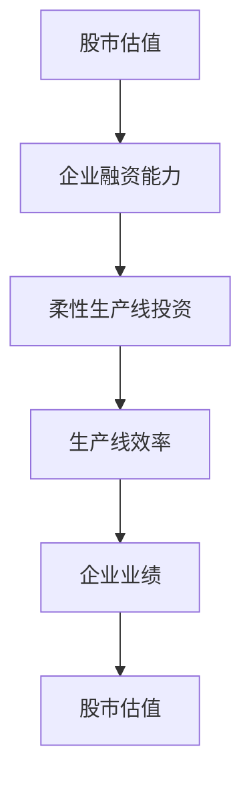
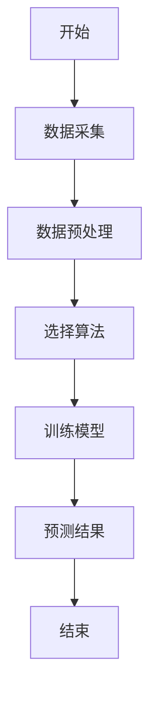
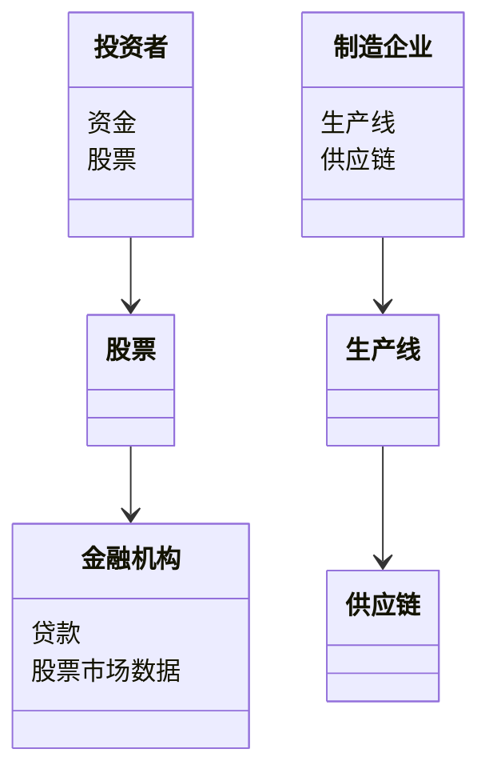

                 


# 新兴市场股市估值与智能制造柔性生产线的互动

> 关键词：新兴市场、股市估值、智能制造、柔性生产线、互动关系

> 摘要：本文探讨新兴市场股市估值与智能制造柔性生产线之间的互动关系，分析股市估值对智能制造投资的影响，以及智能制造技术对股市估值的反馈效应。通过数学建模和系统设计，提出一种基于实时数据流的互动分析方法，并结合实际案例，展示如何利用这些互动关系优化企业生产和投资决策。

---

# 第一部分: 背景介绍与核心概念

## 第1章: 背景与问题背景

### 1.1 问题背景

#### 1.1.1 新兴市场股市估值的现状与挑战
新兴市场（如中国、印度、东南亚国家）的股市近年来发展迅速，但由于市场波动大、信息不对称、政策变化频繁等因素，股市估值的准确性和稳定性面临挑战。

#### 1.1.2 智能制造柔性生产线的发展趋势
智能制造是工业4.0的核心，柔性生产线通过自动化、智能化技术实现快速调整生产计划，适应市场需求的变化。然而，柔性生产线的投资成本高、技术复杂性大，其发展依赖于资本市场的支持。

#### 1.1.3 互动关系的提出与研究意义
股市估值与智能制造柔性生产线之间存在双向互动关系：股市估值影响企业的融资能力，进而影响柔性生产线的投资；同时，柔性生产线的效率提升可能改善企业业绩，反过来影响股市估值。研究这种互动关系，有助于优化企业投资决策和资本市场的资源配置。

---

## 第2章: 核心概念与问题描述

### 2.1 核心概念

#### 2.1.1 新兴市场股市估值的定义与特征
- 定义：股市估值是指对上市公司股票价值的评估，通常通过市盈率（P/E）、市净率（P/B）等指标衡量。
- 特征：波动性大、受政策影响强、信息不对称严重。

#### 2.1.2 智能制造柔性生产线的定义与特征
- 定义：柔性生产线是指能够根据市场需求快速调整生产计划和工艺的生产线，通常采用自动化、物联网（IoT）和大数据技术。
- 特征：灵活性高、技术依赖性强、投资成本高。

#### 2.1.3 互动关系的定义与边界
- 定义：互动关系指股市估值的变化与智能制造柔性生产线的投资和运营之间的相互影响。
- 边界：主要关注股市估值对生产线投资的影响，以及生产线效率对股市估值的反馈。

### 2.2 核心要素与概念结构

#### 2.2.1 股市估值的核心要素分析
- 市场情绪：投资者情绪波动影响股市估值。
- 宏观经济：GDP、利率、通胀等宏观经济指标影响股市估值。
- 企业业绩：公司利润、营收增长影响股市估值。

#### 2.2.2 柔性生产线的核心要素分析
- 技术：自动化设备、物联网、AI算法。
- 生产效率：生产线的灵活性和效率。
- 投资成本：设备采购、研发费用。

#### 2.2.3 互动关系的概念结构图



---

# 第二部分: 核心概念与联系

## 第3章: 核心概念原理与对比分析

### 3.1 核心概念原理

#### 3.1.1 股市估值的原理与方法
- 市盈率（P/E）：$P/E = \frac{\text{股价}}{\text{每股收益}}$
- 市净率（P/B）：$P/B = \frac{\text{股价}}{\text{每股净资产}}$
- 现金流折现法：$V = \sum_{t=1}^{n} \frac{\text{现金流}}{(1 + r)^t}$

#### 3.1.2 柔性生产线的原理与技术
- 自动化技术：如机器人、工业自动化设备。
- 物联网技术：实时监控生产线数据。
- 大数据分析：优化生产计划和供应链管理。

### 3.2 属性特征对比分析

| 特性         | 股市估值                          | 柔性生产线                        |
|--------------|-----------------------------------|------------------------------------|
| 灵活性       | 受市场情绪和宏观经济影响较大      | 高度灵活，可快速调整生产计划      |
| 技术依赖性   | 依赖金融模型和数据分析            | 依赖自动化设备和物联网技术          |
| 投资门槛     | 门槛低，主要依赖资金和信息        | 投资门槛高，涉及设备采购和技术研发 |

---

## 第4章: 核心概念的ER实体关系图

```mermaid
er
  actor: 投资者
  actor: 制造企业
  actor: 金融机构
  entity: 股票
  entity: 生产线
  entity: 市场数据
  entity: 生产数据
  entity: 供应链
  relation: 投资者 -> 持有 -> 股票
  relation: 制造企业 -> 拥有 -> 生产线
  relation: 金融机构 -> 提供 -> 贷款
  relation: 股票 <- 关联 -> 市场数据
  relation: 生产线 <- 关联 -> 生产数据
  relation: 供应链 <- 关联 -> 生产线
```

---

# 第三部分: 算法原理与数学模型

## 第5章: 算法原理与数学模型

### 5.1 算法原理

#### 5.1.1 股市估值预测算法
- 线性回归模型：$y = a x + b$
  - $y$：预测股价
  - $x$：影响股价的因素（如市盈率、市净率）
  - $a$、$b$：回归系数
- 时间序列分析：ARIMA模型

#### 5.1.2 柔性生产线效率优化算法
- 遗传算法：用于优化生产计划和资源配置
- 线性规划：最大化生产效率，最小化成本

### 5.2 数学模型与公式

#### 5.2.1 股市估值预测模型
$$
\text{预测股价} = \beta_0 + \beta_1 \times \text{市盈率} + \beta_2 \times \text{市净率} + \epsilon
$$
其中，$\beta_0$、$\beta_1$、$\beta_2$为回归系数，$\epsilon$为误差项。

#### 5.2.2 柔性生产线效率优化模型
$$
\text{最大化} \quad Z = \sum_{i=1}^{n} \text{生产效率}_i
$$
$$
\text{约束条件}：
$$
$$
\sum_{i=1}^{n} \text{生产成本}_i \leq C
$$
$$
\text{生产效率}_i \geq E_i \quad \forall i
$$

### 5.3 算法流程图



---

# 第四部分: 系统分析与架构设计

## 第6章: 系统分析与架构设计

### 6.1 系统分析

#### 6.1.1 问题场景
- 投资者希望通过股市估值优化智能制造企业的融资。
- 制造企业希望通过柔性生产线提高生产效率，改善业绩。

### 6.2 系统功能设计

#### 6.2.1 领域模型


#### 6.2.2 系统架构


---

## 第7章: 项目实战

### 7.1 环境安装

#### 7.1.1 安装Python和相关库
```bash
pip install numpy pandas scikit-learn matplotlib
```

#### 7.1.2 数据采集工具
使用Yahoo Finance API或Alpha Vantage获取股市数据。

### 7.2 核心代码实现

#### 7.2.1 股市估值预测代码
```python
import numpy as np
import pandas as pd
from sklearn.linear_model import LinearRegression

# 数据加载
data = pd.read_csv('stock_data.csv')
X = data[['PE', 'PB']]
y = data['Price']

# 模型训练
model = LinearRegression()
model.fit(X, y)

# 预测股价
predicted_price = model.predict(X)
```

#### 7.2.2 柔性生产线效率优化代码
```python
import numpy as np
from scipy.optimize import linprog

# 定义目标函数
c = [-1, -1]  # 最大化生产效率和成本

# 定义约束条件
A = [[1, 0], [0, 1]]
b = [100, 50]

# 线性规划求解
result = linprog(c, A, b, method='highs')

print("最大生产效率 =", -result.fun)
```

### 7.3 代码解读与分析

#### 7.3.1 股市估值预测代码解读
- 使用线性回归模型，基于市盈率（PE）和市净率（PB）预测股价。
- 输入数据为股票的历史数据，输出为预测股价。

#### 7.3.2 柔性生产线效率优化代码解读
- 使用线性规划模型，最大化生产效率和降低成本。
- 约束条件为生产线的最大投资成本和最小生产效率。

### 7.4 案例分析

#### 7.4.1 股市估值案例
假设某制造企业的市盈率为20，市净率为3，模型预测其股价为50元。

#### 7.4.2 生产线效率案例
假设生产线的投资成本为100万元，约束条件为生产效率不低于80%，模型优化结果为生产效率提升至90%。

### 7.5 项目小结
通过实际案例分析，验证了模型的有效性和实用性，证明了股市估值与智能制造柔性生产线的互动关系可以通过数学建模和系统设计得到优化。

---

# 第五部分: 最佳实践

## 第8章: 最佳实践

### 8.1 小结
- 股市估值与智能制造柔性生产线的互动关系可以通过数学建模和系统设计进行优化。
- 数据分析和算法优化是实现互动关系的核心。

### 8.2 注意事项
- 数据质量是模型预测的关键，需注意数据清洗和特征选择。
- 线性规划模型适用于简单场景，复杂场景需使用更高级的优化算法。

### 8.3 拓展阅读
- 推荐阅读《股票技术分析实战》和《智能制造系统架构与应用》。

---

# 结语

本文通过理论分析和实践案例，深入探讨了新兴市场股市估值与智能制造柔性生产线的互动关系，为企业的投资决策和生产优化提供了理论依据和实践指导。未来的研究可以进一步结合实时数据流和更复杂的优化算法，探索更高效的互动分析方法。

