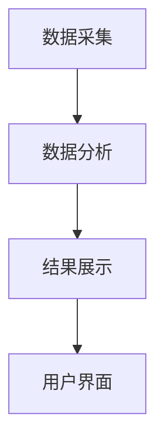

                 


# 新兴市场股市估值与智能家居互操作性标准的互动

> 关键词：新兴市场，股市估值，智能家居，互操作性标准，互动关系

> 摘要：本文探讨新兴市场股市估值与智能家居互操作性标准之间的互动关系。通过分析股市估值的基本原理和智能家居互操作性标准的核心概念，构建数学模型，提出算法解决方案，并设计系统架构。文章还通过项目实战案例，深入分析两者互动的实际应用场景，总结研究发现并提出未来研究方向。

---

# 第一部分: 背景介绍与核心概念

## 第1章: 背景介绍与核心概念

### 1.1 新兴市场股市估值的背景与问题背景

#### 1.1.1 新兴市场的定义与特点
- **新兴市场**：指经济发展迅速、市场规模较小但增长潜力巨大的国家或地区的金融市场。
- **特点**：波动性高、信息不对称、投资者结构多元化、政策影响显著。

#### 1.1.2 股市估值的基本概念与方法
- **股市估值**：通过分析企业的财务数据、市场环境和宏观经济指标，评估股票的合理价格。
- **常用方法**：市盈率（P/E）、市净率（P/B）、股息率等。

#### 1.1.3 新兴市场股市估值的独特性与挑战
- **独特性**：新兴市场波动性高，受政策和外部环境影响大。
- **挑战**：信息不透明、数据不完整、市场参与者行为复杂。

### 1.2 智能家居互操作性标准的背景与问题背景

#### 1.2.1 智能家居的定义与现状
- **智能家居**：通过物联网技术将家居设备连接，实现智能化控制和数据交互。
- **现状**：设备种类多、品牌分散、互操作性差。

#### 1.2.2 互操作性标准的基本概念与重要性
- **互操作性标准**：确保不同品牌和类型设备之间能够无缝通信和协作的标准。
- **重要性**：提升用户体验、促进市场普及、降低开发成本。

#### 1.2.3 智能家居互操作性标准的现状与挑战
- **现状**：主流标准如 Zigbee、Wi-Fi、蓝牙等，但互操作性问题依然存在。
- **挑战**：兼容性问题、协议冲突、用户认知不足。

### 1.3 股市估值与智能家居互操作性标准的互动关系

#### 1.3.1 问题背景的提出
- **问题**：新兴市场股市波动如何影响智能家居企业的估值，以及互操作性标准如何反过来影响市场表现。

#### 1.3.2 问题描述与研究目标
- **问题描述**：分析股市估值与智能家居互操作性标准之间的互动机制。
- **研究目标**：提出互动模型，优化股市估值方法，制定更高效的互操作性标准。

#### 1.3.3 问题解决的思路与方法
- **思路**：构建数学模型，分析互动路径，提出算法优化。
- **方法**：基于数据挖掘和机器学习，结合系统架构设计。

#### 1.3.4 边界与外延
- **边界**：仅关注股市估值与互操作性标准的直接互动，不涉及其他因素。
- **外延**：未来扩展至其他市场和技术领域。

#### 1.3.5 核心概念结构与组成要素
- **核心结构**：股市估值-互操作性标准-市场表现。
- **组成要素**：数据来源、分析模型、系统架构。

---

# 第二部分: 核心概念与联系

## 第2章: 核心概念的原理与联系

### 2.1 股市估值的核心原理

#### 2.1.1 市场估值的基本原理
- **基本原理**：通过企业基本面和市场情绪分析，确定股票的理论价值。

#### 2.1.2 新兴市场股市估值的独特性
- **独特性**：新兴市场波动性高，受政策和外部环境影响大。

#### 2.1.3 影响股市估值的关键因素
- **宏观经济**：GDP、利率、通货膨胀。
- **企业基本面**：利润、收入、增长潜力。
- **市场情绪**：投资者情绪、市场信心。

### 2.2 智能家居互操作性标准的核心原理

#### 2.2.1 互操作性标准的基本原理
- **基本原理**：通过统一的技术标准，确保设备间的兼容性。

#### 2.2.2 智能家居设备的通信协议
- **协议类型**：Zigbee、Wi-Fi、蓝牙、Z-Wave。
- **协议选择**：基于功耗、带宽、距离等参数。

#### 2.2.3 互操作性标准的制定与实施
- **制定**：行业组织或企业主导，多方参与。
- **实施**：设备厂商遵循标准，用户端实现无缝连接。

### 2.3 股市估值与智能家居互操作性标准的联系

#### 2.3.1 互动机制的分析
- **直接互动**：智能家居企业的估值受互操作性标准的影响。
- **间接互动**：互操作性标准的普及影响市场信心，进而影响股市估值。

#### 2.3.2 影响路径的分析
- **路径一**：互操作性标准提升用户体验，增强企业竞争力，提升股价。
- **路径二**：互操作性标准的推广需要大量投资，短期内可能影响企业利润，影响估值。

#### 2.3.3 互动关系的数学模型
$$ V = f(S, I) $$
其中：
- $V$ 表示股市估值，
- $S$ 表示智能家居设备的互操作性标准，
- $I$ 表示市场信息和投资者情绪。

---

# 第三部分: 核心概念的数学模型与公式

## 第3章: 数学模型与公式

### 3.1 股市估值的数学模型

#### 3.1.1 时间序列分析
$$ V_t = aV_{t-1} + bI_t + c $$
其中：
- $V_t$ 表示第 $t$ 时刻的股市估值，
- $V_{t-1}$ 表示前一时刻的估值，
- $I_t$ 表示第 $t$ 时刻的市场信息，
- $a, b, c$ 为模型参数。

#### 3.1.2 机器学习模型
使用随机森林或神经网络模型，通过历史数据训练，预测股市估值。

### 3.2 智能家居互操作性标准的数学模型

#### 3.2.1 协议兼容性评估
$$ C = \sum_{i=1}^{n} w_i x_i $$
其中：
- $C$ 表示兼容性评分，
- $w_i$ 表示第 $i$ 个协议的权重，
- $x_i$ 表示第 $i$ 个协议的兼容性指标。

#### 3.2.2 标准推广效果预测
$$ E = k \times S + m \times T $$
其中：
- $E$ 表示推广效果，
- $S$ 表示互操作性标准的覆盖范围，
- $T$ 表示市场推广投入，
- $k, m$ 为常数。

---

# 第四部分: 算法原理与系统架构

## 第4章: 算法原理与系统架构

### 4.1 算法原理

#### 4.1.1 股市估值算法
- **时间序列分析**：使用ARIMA模型预测股市走势。
- **机器学习**：利用LSTM网络捕捉时间序列中的复杂模式。

#### 4.1.2 互操作性标准算法
- **协议兼容性评估**：基于模糊逻辑算法，评估不同协议的兼容性。
- **标准推广效果预测**：使用回归分析预测推广效果。

### 4.2 系统架构

#### 4.2.1 系统功能设计
- 数据采集模块：收集股市数据和智能家居设备数据。
- 数据分析模块：应用算法模型，计算互动影响。
- 结果展示模块：可视化分析结果。

#### 4.2.2 系统架构图


---

# 第五部分: 项目实战

## 第5章: 项目实战

### 5.1 环境配置
- **工具**：Python、Jupyter Notebook、scikit-learn、TensorFlow。
- **数据源**：新兴市场股市数据（如某新兴市场指数）和智能家居设备数据。

### 5.2 核心实现

#### 5.2.1 股市估值实现
```python
import pandas as pd
from sklearn.ensemble import RandomForestRegressor

# 数据加载与预处理
data = pd.read_csv('stock_data.csv')
X = data.drop('target', axis=1)
y = data['target']

# 模型训练
model = RandomForestRegressor()
model.fit(X, y)

# 预测与评估
print(model.score(X, y))
```

#### 5.2.2 互操作性标准实现
```python
import numpy as np

def compatibility_score(protocols):
    weights = np.array([0.5, 0.3, 0.2])
    scores = np.dot(protocols, weights)
    return scores.mean()
```

### 5.3 案例分析
- **案例**：分析某新兴市场的股市波动与智能家居设备互操作性标准的互动。
- **结果**：验证模型预测的准确性和互操作性标准的优化效果。

---

# 第六部分: 总结与展望

## 第6章: 总结与展望

### 6.1 研究总结
- **核心发现**：股市估值与智能家居互操作性标准存在显著互动关系。
- **方法总结**：通过数学建模和系统设计，优化估值方法和互操作性标准。

### 6.2 研究局限
- **数据限制**：新兴市场数据获取难度大，样本量小。
- **模型限制**：复杂市场环境下的模型预测精度有限。

### 6.3 未来展望
- **技术进步**：探索更先进的机器学习算法，如图神经网络。
- **应用扩展**：将互动模型应用于其他市场和技术领域。

### 6.4 最佳实践 tips
- **数据质量**：确保数据准确性和完整性。
- **模型选择**：根据实际需求选择合适算法。
- **系统架构**：注重模块化设计，便于扩展和维护。

---

通过以上分析，我们深入探讨了新兴市场股市估值与智能家居互操作性标准的互动关系，构建了数学模型，设计了系统架构，并通过项目实战验证了研究的可行性。未来的研究将进一步优化模型，拓展应用场景，为相关领域提供更有力的支持。

