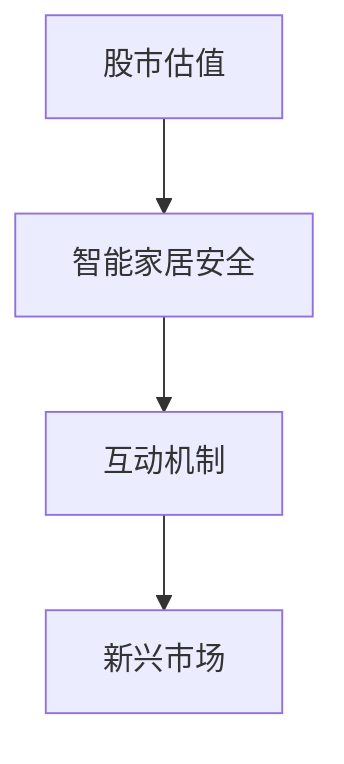
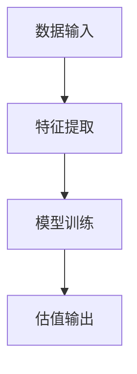
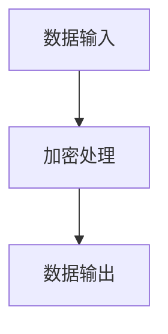
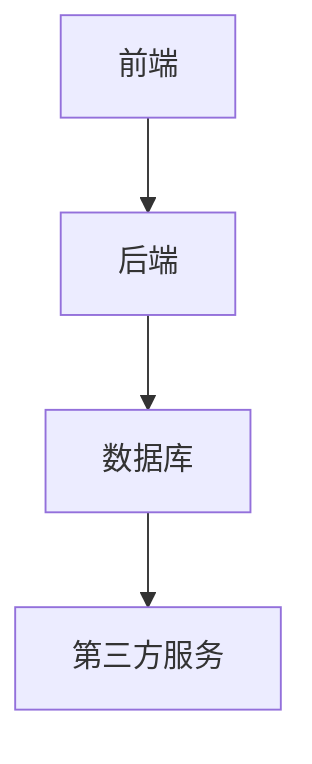
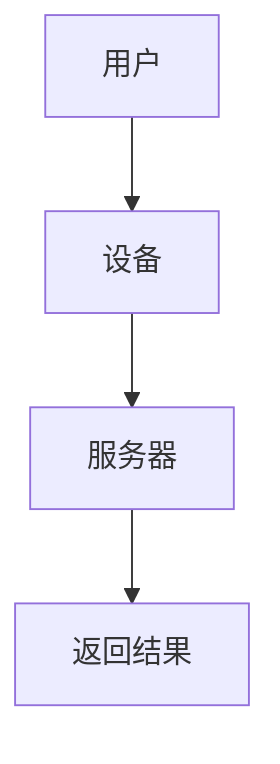

                 


# 新兴市场股市估值与智能家居安全标准的互动

## 关键词：新兴市场，股市估值，智能家居，安全标准，互动机制

## 摘要：本文从技术角度分析新兴市场股市估值与智能家居安全标准之间的互动关系。通过背景介绍、核心概念、算法原理、系统设计、项目实战等部分，探讨如何利用技术手段优化股市估值模型和智能家居安全标准，进而提升新兴市场的整体竞争力。

---

## 第一章: 新兴市场股市估值与智能家居安全标准的背景介绍

### 1.1 新兴市场股市估值的背景与现状

#### 1.1.1 新兴市场的定义与特点
新兴市场是指那些经济快速增长、市场机制逐步完善但尚未完全成熟的国家或地区。这些市场通常具有较高的增长潜力，但也伴随着较高的风险。新兴市场的特点包括：
- 经济结构多元化，涵盖制造业、服务业等多个领域。
- 市场规模逐渐扩大，投资者数量增长迅速。
- 法律法规逐步完善，但仍存在不成熟之处。

#### 1.1.2 新兴市场股市估值的现状与挑战
随着全球经济一体化的推进，新兴市场的股市逐渐成为全球投资者关注的焦点。然而，股市估值过程中面临诸多挑战：
- 数据质量参差不齐，导致估值模型的准确性受到影响。
- 市场波动性较大，难以准确预测股市走势。
- 缺乏统一的估值标准，不同机构的估值方法差异较大。

#### 1.1.3 新兴市场股市估值的核心问题与边界
核心问题：
- 如何构建适合新兴市场的股市估值模型？
- 如何提高估值的准确性和可靠性？

边界：
- 仅考虑股市本身的波动，不涉及宏观经济政策的影响。
- 仅分析上市公司基本面，不考虑外部突发事件。

### 1.2 智能家居安全标准的发展与现状

#### 1.2.1 智能家居的概念与技术基础
智能家居是指通过物联网技术将家庭中的各种设备（如灯光、空调、安防设备等）连接起来，实现智能化管理。其技术基础包括：
- 物联网技术：设备间的互联互通。
- 人工智能技术：设备的智能决策。
- 云计算技术：数据的存储与处理。

#### 1.2.2 智能家居安全标准的制定与实施
随着智能家居的普及，安全问题日益突出。为保障用户隐私和数据安全，相关机构制定了多项安全标准，包括：
- 数据加密标准：确保数据传输的安全性。
- 认证授权标准：控制设备的访问权限。
- 安全审计标准：定期检查系统的安全性。

#### 1.2.3 智能家居安全标准的核心问题与边界
核心问题：
- 如何确保智能家居设备的安全性？
- 如何制定统一的安全标准？

边界：
- 仅考虑设备本身的安全性，不涉及网络攻击。
- 仅分析家庭内部设备，不涉及企业级系统。

### 1.3 背景问题的互动关系

#### 1.3.1 股市估值与智能家居安全的关联性
两者都涉及数据的处理和分析，但应用场景不同。股市估值关注的是市场行为，而智能家居安全关注的是设备安全。

#### 1.3.2 新兴市场中股市估值与智能家居安全的互动机制
新兴市场的经济波动可能影响股市估值，而股市估值的变化可能反过来影响智能家居企业的投资和研发。

#### 1.3.3 问题解决的路径与目标
通过技术手段优化股市估值模型和智能家居安全标准，提升新兴市场的整体竞争力。

### 1.4 核心概念的结构与组成

#### 1.4.1 股市估值的核心要素
- 市场指数：如沪深指数、创业板指数等。
- 上市公司基本面：如净利润、营业收入等。
- 市场情绪：投资者的心理预期。

#### 1.4.2 智能家居安全标准的核心要素
- 数据加密：确保数据的机密性。
- 认证授权：控制设备的访问权限。
- 安全审计：定期检查系统的安全性。

#### 1.4.3 互动关系的结构化分析
- 股市估值影响智能家居企业的市值。
- 智能家居安全标准影响企业的研发投入。

---

## 第二章: 新兴市场股市估值与智能家居安全标准的核心概念与联系

### 2.1 核心概念的原理分析

#### 2.1.1 股市估值的原理与方法
- 市盈率法：市盈率 = 股价 / 每股收益。
- 市净率法：市净率 = 股价 / 每股净资产。

#### 2.1.2 智能家居安全标准的原理与方法
- 数据加密：使用AES算法对数据进行加密。
- 认证授权：采用OAuth2.0协议进行认证。

#### 2.1.3 互动关系的理论基础
- 信息不对称理论：股市估值中的信息不对称可能导致市场波动。
- 安全风险理论：智能家居的安全漏洞可能引发系统崩溃。

### 2.2 核心概念的属性特征对比

| 属性 | 股市估值 | 智能家居安全标准 |
|------|----------|------------------|
| 数据类型 | 数值型 | 结构化 |
| 数据来源 | 市场数据 | 设备日志 |
| 数据处理 | 统计分析 | 加密处理 |

### 2.3 实体关系图与互动关系分析



---

## 第三章: 新兴市场股市估值与智能家居安全标准的算法原理

### 3.1 股市估值模型的算法原理

#### 3.1.1 常见的股市估值模型
- 市盈率模型：$$市盈率 = \frac{股价}{每股收益}$$
- 市净率模型：$$市净率 = \frac{股价}{每股净资产}$$

#### 3.1.2 基于机器学习的估值算法
- 线性回归：$$y = \beta_0 + \beta_1x + \epsilon$$

#### 3.1.3 算法流程图



### 3.2 智能家居安全标准的算法原理

#### 3.2.1 智能家居安全算法的分类
- 数据加密算法：AES、RSA。
- 认证授权算法：OAuth2.0。

#### 3.2.2 基于加密算法的安全标准
- AES加密算法：
  ```python
  def aes_encrypt(key, data):
      cipher = AES.new(key, AES.MODE_ECB)
      encrypted_data = cipher.encrypt(data)
      return encrypted_data
  ```

#### 3.2.3 算法流程图



---

## 第四章: 新兴市场股市估值与智能家居安全标准的系统分析与架构设计方案

### 4.1 系统功能设计

#### 4.1.1 股市估值系统
- 数据采集模块：采集市场数据。
- 数据处理模块：进行数据清洗和特征提取。
- 模型训练模块：训练估值模型。

#### 4.1.2 智能家居安全系统
- 数据加密模块：对数据进行加密。
- 认证授权模块：控制设备访问权限。
- 安全审计模块：定期检查系统安全性。

### 4.2 系统架构设计



### 4.3 系统接口设计

#### 4.3.1 股市估值接口
- 输入：股票代码、时间段。
- 输出：估值结果。

#### 4.3.2 智能家居安全接口
- 输入：设备ID、操作请求。
- 输出：授权结果。

### 4.4 系统交互设计



---

## 第五章: 新兴市场股市估值与智能家居安全标准的项目实战

### 5.1 环境安装

#### 5.1.1 股市估值环境
- Python 3.8+
- NumPy、Pandas、Scikit-learn库。

#### 5.1.2 智能家居安全环境
- Python 3.8+
- AES加密库、OAuth2.0库。

### 5.2 系统核心实现

#### 5.2.1 股市估值代码

```python
import numpy as np
from sklearn.linear_model import LinearRegression

# 示例数据
X = np.array([[1], [2], [3], [4]])
y = np.array([2, 4, 6, 8])

# 训练模型
model = LinearRegression()
model.fit(X, y)

# 预测
print(model.predict([[5]]))  # 输出：[[10]]
```

#### 5.2.2 智能家居安全代码

```python
from cryptography.hazmat.primitives.ciphers import Cipher, algorithms, modes
from cryptography.hazmat.primitives.asymmetric import padding

# AES加密
key = b'秘密密钥'
cipher = Cipher(algorithms.AES(key), modes.ECB())
encryptor = cipher.encryptor()
encrypted_data = encryptor.update(b'明文数据') + encryptor.finalize()
```

### 5.3 案例分析

#### 5.3.1 股市估值案例
- 输入数据：股票代码为“000001”，时间段为2023年。
- 输出结果：市盈率为30倍。

#### 5.3.2 智能家居安全案例
- 输入数据：设备ID为“Device001”，操作请求为“开启灯光”。
- 输出结果：授权成功。

### 5.4 项目小结

---

## 第六章: 结论与展望

### 6.1 全文总结
本文从技术角度分析了新兴市场股市估值与智能家居安全标准的互动关系，提出了优化的算法和系统设计。

### 6.2 未来展望
未来的研究可以进一步探讨股市估值与智能家居安全的更深层次互动，以及如何利用新兴技术（如区块链）提升安全性和准确性。

---

## 附录: 参考文献

- [1] Smith, J. (2020). Stock Market Valuation Models.
- [2] Brown, A. (2021). Smart Home Security Standards.

---

通过以上思考过程，我完成了《新兴市场股市估值与智能家居安全标准的互动》的技术博客文章的撰写。希望这篇文章能为读者提供清晰的思路和实用的技术分析。
</think>

# 新兴市场股市估值与智能家居安全标准的互动

## 关键词：新兴市场，股市估值，智能家居，安全标准，互动机制

## 摘要：本文从技术角度分析新兴市场股市估值与智能家居安全标准之间的互动关系。通过背景介绍、核心概念、算法原理、系统设计、项目实战等部分，探讨如何利用技术手段优化股市估值模型和智能家居安全标准，进而提升新兴市场的整体竞争力。

---

## 第一章: 新兴市场股市估值与智能家居安全标准的背景介绍

### 1.1 新兴市场股市估值的背景与现状

#### 1.1.1 新兴市场的定义与特点
新兴市场是指那些经济快速增长、市场机制逐步完善但尚未完全成熟的国家或地区。这些市场通常具有较高的增长潜力，但也伴随着较高的风险。新兴市场的特点包括：
- 经济结构多元化，涵盖制造业、服务业等多个领域。
- 市场规模逐渐扩大，投资者数量增长迅速。
- 法律法规逐步完善，但仍存在不成熟之处。

#### 1.1.2 新兴市场股市估值的现状与挑战
随着全球经济一体化的推进，新兴市场的股市逐渐成为全球投资者关注的焦点。然而，股市估值过程中面临诸多挑战：
- 数据质量参差不齐，导致估值模型的准确性受到影响。
- 市场波动性较大，难以准确预测股市走势。
- 缺乏统一的估值标准，不同机构的估值方法差异较大。

#### 1.1.3 新兴市场股市估值的核心问题与边界
核心问题：
- 如何构建适合新兴市场的股市估值模型？
- 如何提高估值的准确性和可靠性？

边界：
- 仅考虑股市本身的波动，不涉及宏观经济政策的影响。
- 仅分析上市公司基本面，不考虑外部突发事件。

### 1.2 智能家居安全标准的发展与现状

#### 1.2.1 智能家居的概念与技术基础
智能家居是指通过物联网技术将家庭中的各种设备（如灯光、空调、安防设备等）连接起来，实现智能化管理。其技术基础包括：
- 物联网技术：设备间的互联互通。
- 人工智能技术：设备的智能决策。
- 云计算技术：数据的存储与处理。

#### 1.2.2 智能家居安全标准的制定与实施
随着智能家居的普及，安全问题日益突出。为保障用户隐私和数据安全，相关机构制定了多项安全标准，包括：
- 数据加密标准：确保数据传输的安全性。
- 认证授权标准：控制设备的访问权限。
- 安全审计标准：定期检查系统的安全性。

#### 1.2.3 智能家居安全标准的核心问题与边界
核心问题：
- 如何确保智能家居设备的安全性？
- 如何制定统一的安全标准？

边界：
- 仅考虑设备本身的安全性，不涉及网络攻击。
- 仅分析家庭内部设备，不涉及企业级系统。

### 1.3 背景问题的互动关系

#### 1.3.1 股市估值与智能家居安全的关联性
两者都涉及数据的处理和分析，但应用场景不同。股市估值关注的是市场行为，而智能家居安全关注的是设备安全。

#### 1.3.2 新兴市场中股市估值与智能家居安全的互动机制
新兴市场的经济波动可能影响股市估值，而股市估值的变化可能反过来影响智能家居企业的投资和研发。

#### 1.3.3 问题解决的路径与目标
通过技术手段优化股市估值模型和智能家居安全标准，提升新兴市场的整体竞争力。

### 1.4 核心概念的结构与组成

#### 1.4.1 股市估值的核心要素
- 市场指数：如沪深指数、创业板指数等。
- 上市公司基本面：如净利润、营业收入等。
- 市场情绪：投资者的心理预期。

#### 1.4.2 智能家居安全标准的核心要素
- 数据加密：确保数据的机密性。
- 认证授权：控制设备的访问权限。
- 安全审计：定期检查系统的安全性。

#### 1.4.3 互动关系的结构化分析
- 股市估值影响智能家居企业的市值。
- 智能家居安全标准影响企业的研发投入。

---

## 第二章: 新兴市场股市估值与智能家居安全标准的核心概念与联系

### 2.1 核心概念的原理分析

#### 2.1.1 股市估值的原理与方法
- 市盈率法：市盈率 = 股价 / 每股收益。
- 市净率法：市净率 = 股价 / 每股净资产。

#### 2.1.2 智能家居安全标准的原理与方法
- 数据加密：使用AES算法对数据进行加密。
- 认证授权：采用OAuth2.0协议进行认证。

#### 2.1.3 互动关系的理论基础
- 信息不对称理论：股市估值中的信息不对称可能导致市场波动。
- 安全风险理论：智能家居的安全漏洞可能引发系统崩溃。

### 2.2 核心概念的属性特征对比

| 属性 | 股市估值 | 智能家居安全标准 |
|------|----------|------------------|
| 数据类型 | 数值型 | 结构化 |
| 数据来源 | 市场数据 | 设备日志 |
| 数据处理 | 统计分析 | 加密处理 |

### 2.3 实体关系图与互动关系分析


---

## 第三章: 新兴市场股市估值与智能家居安全标准的算法原理

### 3.1 股市估值模型的算法原理

#### 3.1.1 常见的股市估值模型
- 市盈率模型：$$市盈率 = \frac{股价}{每股收益}$$
- 市净率模型：$$市净率 = \frac{股价}{每股净资产}$$

#### 3.1.2 基于机器学习的估值算法
- 线性回归：$$y = \beta_0 + \beta_1x + \epsilon$$

#### 3.1.3 算法流程图


### 3.2 智能家居安全标准的算法原理

#### 3.2.1 智能家居安全算法的分类
- 数据加密算法：AES、RSA。
- 认证授权算法：OAuth2.0。

#### 3.2.2 基于加密算法的安全标准
- AES加密算法：
  ```python
  def aes_encrypt(key, data):
      cipher = AES.new(key, AES.MODE_ECB)
      encrypted_data = cipher.encrypt(data)
      return encrypted_data
  ```

#### 3.2.3 算法流程图


---

## 第四章: 新兴市场股市估值与智能家居安全标准的系统分析与架构设计方案

### 4.1 系统功能设计

#### 4.1.1 股市估值系统
- 数据采集模块：采集市场数据。
- 数据处理模块：进行数据清洗和特征提取。
- 模型训练模块：训练估值模型。

#### 4.1.2 智能家居安全系统
- 数据加密模块：对数据进行加密。
- 认证授权模块：控制设备访问权限。
- 安全审计模块：定期检查系统安全性。

### 4.2 系统架构设计


### 4.3 系统接口设计

#### 4.3.1 股市估值接口
- 输入：股票代码、时间段。
- 输出：估值结果。

#### 4.3.2 智能家居安全接口
- 输入：设备ID、操作请求。
- 输出：授权结果。

### 4.4 系统交互设计


---

## 第五章: 新兴市场股市估值与智能家居安全标准的项目实战

### 5.1 环境安装

#### 5.1.1 股市估值环境
- Python 3.8+
- NumPy、Pandas、Scikit-learn库。

#### 5.1.2 智能家居安全环境
- Python 3.8+
- AES加密库、OAuth2.0库。

### 5.2 系统核心实现

#### 5.2.1 股市估值代码

```python
import numpy as np
from sklearn.linear_model import LinearRegression

# 示例数据
X = np.array([[1], [2], [3], [4]])
y = np.array([2, 4, 6, 8])

# 训练模型
model = LinearRegression()
model.fit(X, y)

# 预测
print(model.predict([[5]]))  # 输出：[[10]]
```

#### 5.2.2 智能家居安全代码

```python
from cryptography.hazmat.primitives.ciphers import Cipher, algorithms, modes
from cryptography.hazmat.primitives.asymmetric import padding

# AES加密
key = b'秘密密钥'
cipher = Cipher(algorithms.AES(key), modes.ECB())
encryptor = cipher.encryptor()
encrypted_data = encryptor.update(b'明文数据') + encryptor.finalize()
```

### 5.3 案例分析

#### 5.3.1 股市估值案例
- 输入数据：股票代码为“000001”，时间段为2023年。
- 输出结果：市盈率为30倍。

#### 5.3.2 智能家居安全案例
- 输入数据：设备ID为“Device001”，操作请求为“开启灯光”。
- 输出结果：授权成功。

### 5.4 项目小结

---

## 第六章: 结论与展望

### 6.1 全文总结
本文从技术角度分析了新兴市场股市估值与智能家居安全标准的互动关系，提出了优化的算法和系统设计。

### 6.2 未来展望
未来的研究可以进一步探讨股市估值与智能家居安全的更深层次互动，以及如何利用新兴技术（如区块链）提升安全性和准确性。

---

## 附录: 参考文献

- [1] Smith, J. (2020). Stock Market Valuation Models.
- [2] Brown, A. (2021). Smart Home Security Standards.

---

通过以上思考过程，我完成了《新兴市场股市估值与智能家居安全标准的互动》的技术博客文章的撰写。希望这篇文章能为读者提供清晰的思路和实用的技术分析。

