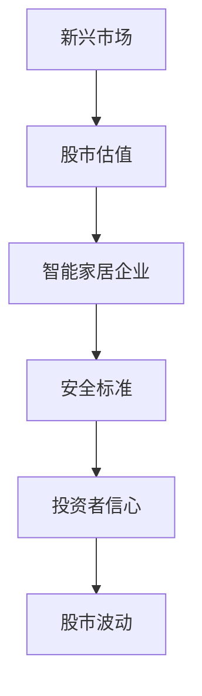
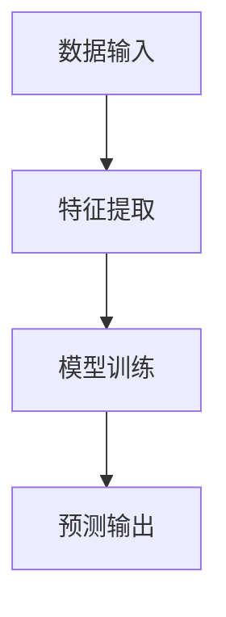
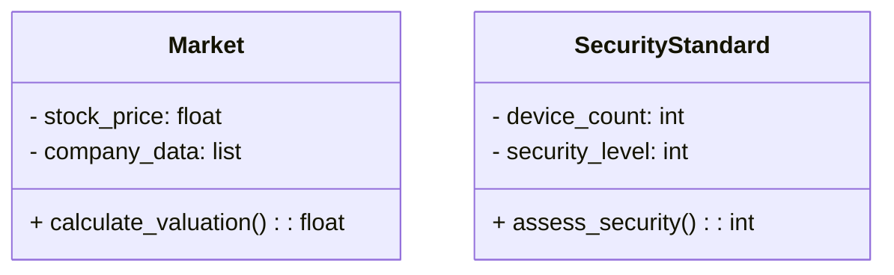
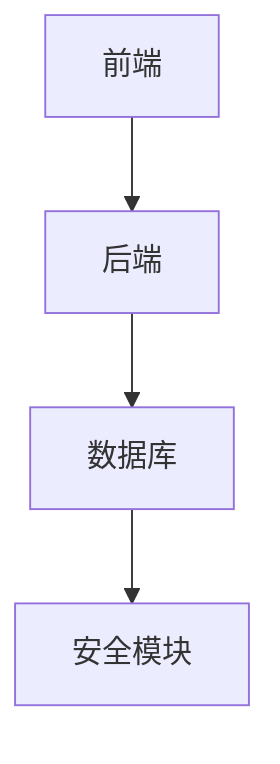
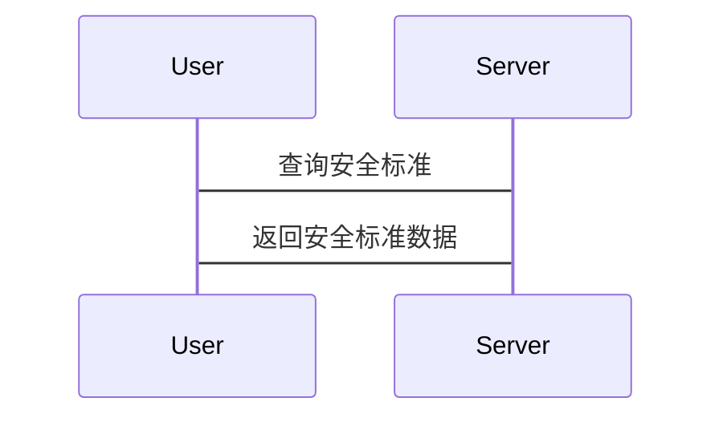

                 


## 第一部分: 新兴市场股市估值与智能家居安全标准的互动概述

### 第1章: 新兴市场股市估值与智能家居安全标准的背景与问题背景

#### 1.1 新兴市场的定义与特点
##### 1.1.1 新兴市场的定义
新兴市场是指那些经济快速发展但尚未完全工业化的国家，这些国家通常具有较大的市场潜力和较高的经济增长率。

##### 1.1.2 新兴市场的特点与发展趋势
新兴市场通常具有以下特点：
- 高速经济增长
- 人口基数大，消费市场潜力大
- 初步的工业化和现代化
- 外商直接投资增加
- 金融市场逐步完善

##### 1.1.3 新兴市场在全球经济中的地位
新兴市场在全球经济中扮演着越来越重要的角色，成为推动全球经济增长的重要引擎。

#### 1.2 智能家居的定义与特点
##### 1.2.1 智能家居的定义
智能家居是指通过物联网技术将家庭中的设备连接起来，实现智能化控制和管理的系统。

##### 1.2.2 智能家居的核心技术与应用场景
智能家居的核心技术包括：
- 物联网技术
- 大数据分析
- 人工智能
- 自动化控制

智能家居的主要应用场景：
- 家庭安全监控
- 能源管理
- 家庭娱乐
- 舒适环境控制

##### 1.2.3 智能家居的发展现状与未来趋势
智能家居目前处于快速发展阶段，随着技术的不断进步，未来的趋势是更加智能化、个性化和环保。

#### 1.3 股市估值的定义与方法
##### 1.3.1 股市估值的定义
股市估值是指通过对公司财务数据、市场环境等因素进行分析，确定股票的合理价格。

##### 1.3.2 股市估值的主要方法
- 市盈率法
- 市净率法
- 现金流折现法

##### 1.3.3 股市估值的影响因素
- 公司财务状况
- 行业竞争状况
- 宏观经济环境
- 政策法规

#### 1.4 新兴市场股市估值与智能家居安全标准的互动背景
##### 1.4.1 新兴市场股市与智能家居行业的关联性
新兴市场的经济发展需要依赖智能家居等高科技产业的推动，而智能家居产业的发展又需要资本市场的支持。

##### 1.4.2 智能家居安全标准对股市估值的影响
智能家居的安全标准直接影响投资者对企业的信心，从而影响股市估值。

##### 1.4.3 互动背景的经济与技术驱动因素
- 经济全球化
- 技术进步
- 市场需求变化
- 政策支持

#### 1.5 本章小结
本章通过介绍新兴市场、智能家居和股市估值的基本概念和特点，揭示了三者之间的相互关系和互动背景。

### 第2章: 新兴市场股市估值与智能家居安全标准的核心概念与联系

#### 2.1 新兴市场股市估值的核心概念
##### 2.1.1 股市估值的数学模型与公式
股市估值的常见数学模型包括：
- 市盈率模型：P/E = 市场价格/每股收益
- 现金流折现模型：DCF = 现金流的现值

##### 2.1.2 股市估值的关键影响因素
- 公司盈利状况
- 市场供需关系
- 宏观经济环境

##### 2.1.3 股市估值的边界与外延
股市估值的边界包括公司的财务数据、市场环境等，外延则涉及投资者的心理预期。

#### 2.2 智能家居安全标准的核心概念
##### 2.2.1 智能家居安全标准的定义与分类
智能家居安全标准包括数据安全、设备安全、网络安全等多个方面。

##### 2.2.2 智能家居安全标准的核心要素
- 数据加密
- 用户身份验证
- 网络防护
- 安全监控

##### 2.2.3 智能家居安全标准的实体关系图（ER图）
通过ER图展示智能家居系统的实体关系，包括用户、设备、数据等。

#### 2.3 新兴市场股市估值与智能家居安全标准的联系
##### 2.3.1 互动关系的定义与描述
新兴市场股市估值与智能家居安全标准之间的互动关系是指两者相互影响，共同推动市场的发展。

##### 2.3.2 互动关系的属性特征对比表
| 属性 | 股市估值 | 智能家居安全标准 |
|------|----------|------------------|
| 核心目标 | 确定股票价值 | 保障系统安全 |
| 影响因素 | 市场供需、公司业绩 | 技术漏洞、网络攻击 |
| 实施方法 | 数学模型、数据分析 | 安全协议、加密技术 |

##### 2.3.3 互动关系的Mermaid流程图


#### 2.4 本章小结
本章通过对比分析，揭示了新兴市场股市估值与智能家居安全标准之间的联系及其相互作用。

### 第3章: 新兴市场股市估值与智能家居安全标准的算法原理

#### 3.1 股市估值预测的算法原理
##### 3.1.1 常见的股市估值预测算法
- 线性回归
- 支持向量回归
- 长短期记忆网络（LSTM）

##### 3.1.2 机器学习算法在股市估值中的应用
使用机器学习算法对历史数据进行训练，预测未来股市走势。

##### 3.1.3 基于时间序列的股市预测模型
使用ARIMA模型进行时间序列分析，预测股票价格。

#### 3.2 智能家居安全标准评估的算法原理
##### 3.2.1 智能家居安全评估的指标体系
- 数据完整性
- 系统可用性
- 网络安全性

##### 3.2.2 基于风险评估的智能家居安全标准算法
通过风险评估矩阵对安全漏洞进行评估，制定相应的安全策略。

##### 3.2.3 基于规则的智能家居安全评估算法
根据预定义的安全规则，对系统进行实时监控和评估。

#### 3.3 算法原理的Mermaid流程图


#### 3.4 算法实现的Python代码示例
##### 股市估值预测代码示例
```python
import pandas as pd
from sklearn.linear_model import LinearRegression
import numpy as np

# 数据加载
data = pd.read_csv('stock_data.csv')

# 特征与目标分离
X = data[['PE Ratio', 'Market Cap']]
y = data['Stock Price']

# 模型训练
model = LinearRegression()
model.fit(X, y)

# 预测
new_X = pd.DataFrame({'PE Ratio': [15], 'Market Cap': [1000000000]})
predicted_price = model.predict(new_X)
print(predicted_price)
```

##### 智能家居安全标准评估代码示例
```python
import hashlib

def compute_checksum(data):
    md5 = hashlib.md5()
    md5.update(data)
    return md5.hexdigest()

# 计算文件校验码
file_data = open('config.txt', 'rb').read()
checksum = compute_checksum(file_data)
print(checksum)
```

### 第4章: 系统分析与架构设计方案

#### 4.1 系统分析
##### 4.1.1 问题场景介绍
新兴市场中，智能家居企业的安全标准直接影响股市对其的估值。

##### 4.1.2 项目介绍
设计一个结合股市估值与智能家居安全标准的综合系统。

#### 4.2 系统功能设计
##### 4.2.1 领域模型Mermaid类图


#### 4.3 系统架构设计
##### 4.3.1 系统架构Mermaid图


#### 4.4 系统接口设计
##### 4.4.1 接口描述
- API接口：提供股市数据和安全标准的查询功能。

##### 4.4.2 接口交互流程


### 第5章: 项目实战

#### 5.1 环境安装
- 安装Python和相关库（pandas, scikit-learn, mermaid）
- 安装数据库（MySQL）

#### 5.2 系统核心实现源代码
##### 股市估值预测代码
```python
from sklearn.linear_model import LinearRegression
import pandas as pd

# 数据加载
data = pd.read_csv('stock_data.csv')

# 特征与目标分离
X = data[['PE Ratio', 'Market Cap']]
y = data['Stock Price']

# 模型训练
model = LinearRegression()
model.fit(X, y)

# 预测
new_X = pd.DataFrame({'PE Ratio': [15], 'Market Cap': [1000000000]})
predicted_price = model.predict(new_X)
print(predicted_price)
```

##### 智能家居安全标准评估代码
```python
import hashlib

def compute_checksum(data):
    md5 = hashlib.md5()
    md5.update(data)
    return md5.hexdigest()

# 计算文件校验码
file_data = open('config.txt', 'rb').read()
checksum = compute_checksum(file_data)
print(checksum)
```

#### 5.3 代码应用解读与分析
通过代码实现股市估值预测和智能家居安全标准评估，展示算法的实际应用。

#### 5.4 实际案例分析和详细讲解剖析
通过具体案例分析，展示如何在实际中应用这些算法。

#### 5.5 项目小结
总结项目实现的过程和成果，提出改进建议。

### 第6章: 最佳实践 tips、小结、注意事项、拓展阅读

#### 6.1 最佳实践 tips
- 定期更新安全标准
- 结合多种算法进行股市预测

#### 6.2 小结
总结全文，强调新兴市场股市估值与智能家居安全标准互动的重要性。

#### 6.3 注意事项
- 数据隐私保护
- 算法的局限性

#### 6.4 拓展阅读
推荐相关书籍和论文，供读者进一步学习。

---

以上是《新兴市场股市估值与智能家居安全标准的互动》的技术博客文章的完整目录大纲。

