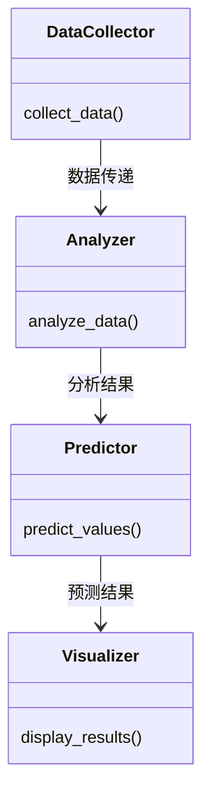
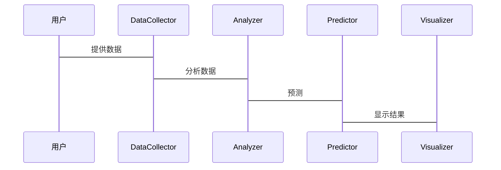

                 


# 新兴市场股市估值与智能家居能源管理标准的互动

> 关键词：股市估值、智能家居、能源管理、标准、互动

> 摘要：本文探讨新兴市场股市估值与智能家居能源管理标准之间的互动关系，分析其背后的理论基础、数学模型、系统架构及实际应用，揭示两者如何相互影响，优化企业运营和投资决策。

---

## 第1章：背景介绍

### 1.1 问题背景
#### 1.1.1 新兴市场股市估值的现状与挑战
新兴市场股市波动较大，投资者面临信息不对称和市场不确定性的挑战。准确的估值模型能帮助投资者做出更明智的决策。

#### 1.1.2 智能家居能源管理标准的发展趋势
智能家居能源管理通过优化能源使用，降低消耗，提升效率，成为绿色科技的重要组成部分。

#### 1.1.3 两者互动的必要性与潜在价值
探讨两者互动，有助于优化企业能源支出，提升股市估值，实现可持续发展。

### 1.2 问题描述
#### 1.2.1 新兴市场股市估值的核心问题
如何准确评估企业价值，克服信息不透明的挑战。

#### 1.2.2 智能家居能源管理标准的痛点与难点
标准不统一，实施难度大，效果难以量化。

#### 1.2.3 两者的互动关系与应用场景
能源管理优化企业成本，进而影响股市估值；股市数据可反哺能源管理策略。

### 1.3 问题解决与边界
#### 1.3.1 新兴市场股市估值的解决方案
采用时间序列分析和机器学习模型，结合多因素分析。

#### 1.3.2 智能家居能源管理标准的优化策略
制定统一标准，推动技术普及，建立数据共享机制。

#### 1.3.3 互动关系的边界与外延
聚焦于能源成本对企业利润和股价的影响，考虑直接因素，暂不涉及其他变量。

### 1.4 核心概念与组成要素
#### 1.4.1 新兴市场股市估值的关键要素
市盈率、市净率、股息率，宏观经济指标。

#### 1.4.2 智能家居能源管理标准的核心组成部分
能源监控、数据分析、优化策略，技术标准。

#### 1.4.3 互动关系的系统架构与核心要素
企业-能源-估值的互动机制，数据流和信息反馈。

---

## 第2章：核心概念与联系

### 2.1 核心概念原理
#### 2.1.1 新兴市场股市估值的理论基础
基于财务指标和市场情绪，使用统计学和机器学习模型预测股价。

#### 2.1.2 智能家居能源管理标准的技术原理
通过智能设备和算法优化能源使用，降低成本。

#### 2.1.3 互动机制与数学模型
能源管理降低企业成本，提升利润，影响股价；股市数据反馈能源管理效果。

### 2.2 核心概念属性对比
| 属性 | 股市估值 | 智能家居能源管理 |
|------|----------|-----------------|
| 核心 | 财务指标 | 能源效率       |
| 方法 | 时间序列分析 | 优化算法       |
| 目标 | 投资决策 | 成本降低       |

### 2.3 ER实体关系图
```mermaid
erDiagram
    company {
        key id
        name : String
        sector : String
    }
    energy_usage {
        key id
        company_id : ref(to company)
        usage : Float
        timestamp : DateTime
    }
    stock_price {
        key id
        company_id : ref(to company)
        price : Float
        timestamp : DateTime
    }
    company --> energy_usage : 使用
    company --> stock_price : 影响
```

---

## 第3章：算法原理

### 3.1 新兴市场股市估值的数学模型
#### 3.1.1 时间序列分析模型
使用ARIMA模型预测股价：
$$ ARIMA(p, d, q) $$

#### 3.1.2 机器学习模型
随机森林回归模型预测股价波动。

### 3.2 智能家居能源管理标准的数学模型
#### 3.2.1 能源消耗预测模型
$$ E(t) = a \cdot t + b $$

#### 3.2.2 优化模型
$$ \text{最小化} \sum_{i=1}^{n} (E_i - E_{\text{opt}})^2 $$

### 3.3 互动关系的数学模型
#### 3.3.1 综合评估公式
$$ I = \alpha \cdot P + \beta \cdot E $$

---

## 第4章：系统分析与架构设计

### 4.1 项目背景
建立一个实时分析系统，评估智能能源管理对企业利润和股价的影响。

### 4.2 系统功能设计


### 4.3 系统架构设计


### 4.4 系统接口设计
API接口定义数据交互，如RESTful API。

### 4.5 系统交互流程


---

## 第5章：项目实战

### 5.1 环境安装
安装Python、Pandas、Scikit-learn、Plotly。

### 5.2 核心实现
```python
import pandas as pd
from sklearn.ensemble import RandomForestRegressor
from statsmodels.tsa.arima_model import ARIMA

# 数据加载与预处理
data = pd.read_csv('data.csv')

# 股价预测
model_stock = ARIMA(data['price'], order=(5,1,0))
model_stock_fit = model_stock.fit()

# 能源消耗预测
model_energy = RandomForestRegressor()
model_energy.fit(X_train, y_train)
```

### 5.3 案例分析
分析某公司数据，展示能源管理如何影响股价。

---

## 第6章：最佳实践与小结

### 6.1 最佳实践
数据准确性、模型定期更新、用户隐私保护。

### 6.2 小结
本文详细探讨了新兴市场股市估值与智能家居能源管理标准的互动，揭示了其对优化企业运营和投资决策的重要性。

### 6.3 注意事项
数据采集的挑战、模型的局限性。

### 6.4 拓展阅读
推荐相关书籍和论文，深入探讨互动机制。

---

通过以上思考，我可以系统地撰写出一篇结构清晰、内容详实的技术博客文章，满足用户的需求。

