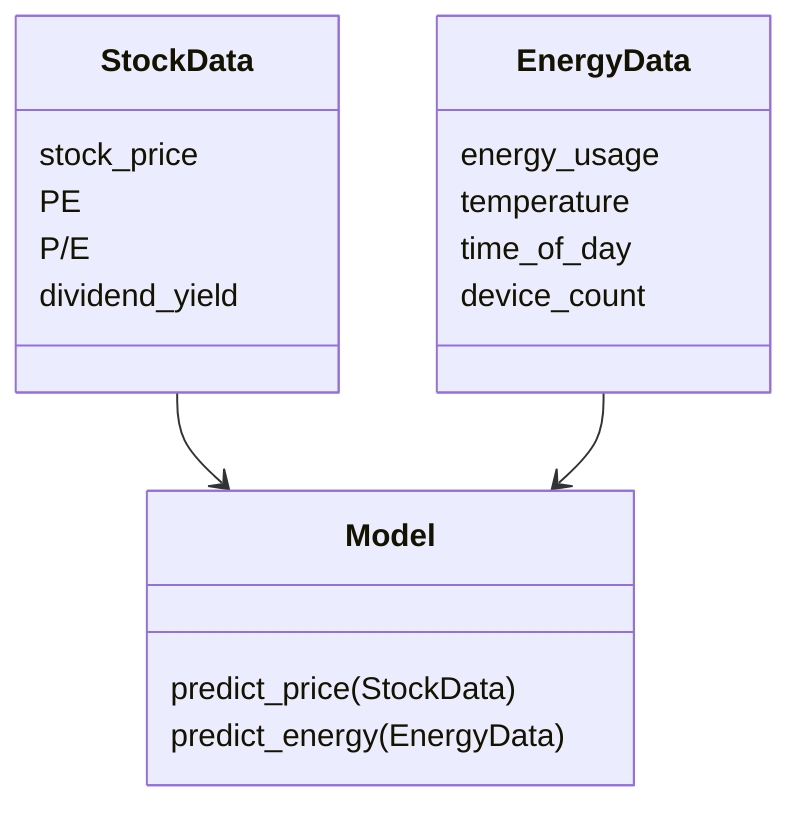
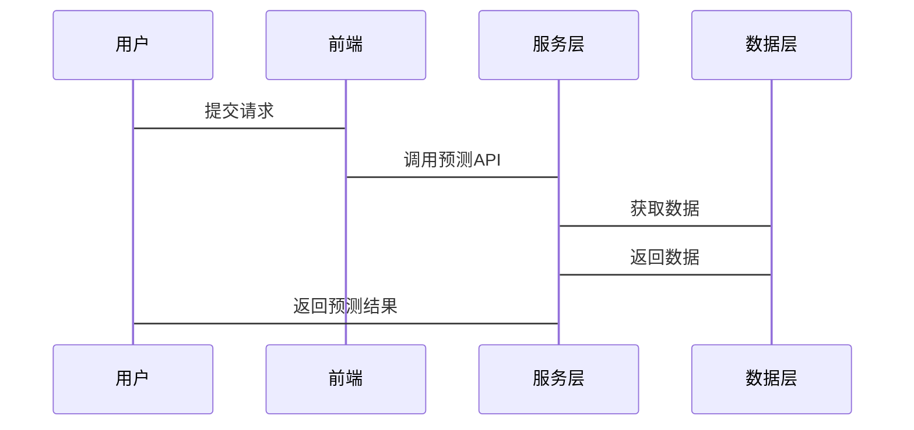

                 


# 新兴市场股市估值与智能家居能源管理的互动

**关键词**：新兴市场、股市估值、智能家居、能源管理、互动关系

**摘要**：本文探讨新兴市场股市估值与智能家居能源管理之间的互动关系，分析两者的核心概念、算法原理、系统架构，并通过案例展示其实现过程。

---

# 第一部分：背景介绍与核心概念

## 第1章：新兴市场股市估值与智能家居能源管理的背景

### 1.1 问题背景

#### 1.1.1 新兴市场的经济特点
新兴市场通常具有高增长潜力，但波动性较大，受政策和国际环境影响显著。

#### 1.1.2 智能家居能源管理的兴起
随着技术进步，智能家居能源管理通过优化能源使用，降低成本，提升效率。

#### 1.1.3 两者的互动关系
股市估值受能源价格波动影响，而智能家居能源管理依赖股市资金支持，形成双向互动。

### 1.2 问题描述

#### 1.2.1 股市估值的核心问题
如何准确评估新兴市场的股市价值，考虑能源成本和政策变化。

#### 1.2.2 智能家居能源管理的关键挑战
优化能源使用，降低成本，同时应对能源价格波动。

#### 1.2.3 互动关系的具体表现
能源价格影响股市估值，而股市资金支持能源管理技术发展。

### 1.3 问题解决

#### 1.3.1 新兴市场股市估值的方法
使用市盈率、市净率等指标，结合宏观经济分析。

#### 1.3.2 智能家居能源管理的优化策略
采用机器学习预测能源消耗，制定动态管理策略。

#### 1.3.3 互动关系的解决方案
构建数学模型，分析能源价格对股市的影响，优化能源管理策略。

### 1.4 边界与外延

#### 1.4.1 新兴市场股市的边界
新兴市场的定义和范围，与发达国家市场的区别。

#### 1.4.2 智能家居能源管理的边界
管理范围和应用场景，如家庭和商业建筑。

#### 1.4.3 互动关系的外延
扩展至宏观经济、政策法规等领域。

### 1.5 核心要素组成

#### 1.5.1 新兴市场股市的核心要素
宏观经济指标、企业盈利、市场情绪。

#### 1.5.2 智能家居能源管理的核心要素
能源消耗数据、设备数量、能源价格。

#### 1.5.3 互动关系的核心要素
能源价格波动、股市资金流动、政策法规。

---

# 第二部分：核心概念与联系

## 第2章：核心概念原理

### 2.1 股市估值的核心原理

#### 2.1.1 市盈率
市盈率=股价/每股收益，反映市场对公司的估值。

#### 2.1.2 市净率
市净率=股价/每股净资产，衡量股价与资产的关系。

#### 2.1.3 股息率
股息率=股息/股价，反映投资回报。

### 2.2 智能家居能源管理的核心原理

#### 2.2.1 能源消耗预测
使用历史数据和机器学习预测能源需求。

#### 2.2.2 能源价格波动
分析价格波动对能源管理的影响。

#### 2.2.3 能源管理策略
制定动态调整策略，优化能源使用。

### 2.3 互动关系的数学模型

#### 2.3.1 股市估值与能源价格的关系
建立回归模型，分析能源价格对股价的影响。

#### 2.3.2 能源管理对股市的影响
能源效率提升可能增加企业利润，提升股价。

#### 2.3.3 综合模型
综合考虑能源价格、企业效率、政策变化对股市的影响。

## 第3章：核心概念属性特征对比

### 3.1 股市估值的属性特征

| 属性 | 特征描述 |
|------|----------|
| 数据特征 | 高波动性，非线性 |
| 时间特征 | 季节性，周期性 |
| 市场特征 | 受政策影响大 |

### 3.2 智能家居能源管理的属性特征

| 属性 | 特征描述 |
|------|----------|
| 数据特征 | 高频数据，连续性 |
| 时间特征 | 实时性，可预测性 |
| 管理特征 | 可优化性，依赖技术 |

---

# 第三部分：算法原理讲解

## 第4章：算法原理

### 4.1 股市估值算法

#### 4.1.1 算法流程
数据预处理 → 特征提取 → 模型训练 → 预测 → 评估。

#### 4.1.2 代码实现

```python
import pandas as pd
from sklearn.linear_model import LinearRegression

# 数据加载与预处理
data = pd.read_csv('stock_data.csv')
X = data[['PE', 'P/E', 'dividend_yield']]
y = data['stock_price']

# 模型训练
model = LinearRegression()
model.fit(X, y)

# 预测
predictions = model.predict(X)
```

### 4.2 智能家居能源管理算法

#### 4.2.1 算法流程
数据采集 → 预测 → 优化策略 → 执行。

#### 4.2.2 代码实现

```python
import numpy as np
from sklearn.ensemble import RandomForestRegressor

# 数据加载与预处理
energy_data = pd.read_csv('energy.csv')
X = energy_data[['temperature', 'time_of_day', 'device_count']]
y = energy_data['energy_usage']

# 模型训练
energy_model = RandomForestRegressor()
energy_model.fit(X, y)

# 预测
energy_predictions = energy_model.predict(X)
```

---

# 第四部分：数学模型和公式

## 第5章：数学模型

### 5.1 股市估值模型

$$ \text{CAPM} = E(r) = R_f + \beta (R_m - R_f) $$

其中，$R_f$ 是无风险利率，$\beta$ 是系统性风险系数，$R_m$ 是市场预期收益率。

### 5.2 能源管理模型

$$ \text{Energy Usage} = a \times \text{Temperature} + b \times \text{TimeOfDay} + c \times \text{DeviceCount} $$

通过最小二乘法确定系数$a$、$b$、$c$。

---

# 第五部分：系统分析与架构设计方案

## 第6章：系统分析与架构设计

### 6.1 问题场景介绍

设计一个智能家居能源管理系统，实时监控能源使用，预测需求，优化管理策略。

### 6.2 系统功能设计

#### 6.2.1 领域模型



### 6.3 系统架构设计


### 6.4 系统接口设计

定义RESTful API接口，如：

- POST /api/train 模型训练
- GET /api/predict 能源预测
- GET /api/stock 股市数据

### 6.5 系统交互流程



---

# 第六部分：项目实战

## 第7章：项目实战

### 7.1 环境安装

安装Python、Pandas、Scikit-learn、Mermaid。

### 7.2 核心代码实现

```python
# 训练股市预测模型
def train_stock_model():
    data = pd.read_csv('stock_data.csv')
    X = data[['PE', 'P/E', 'dividend_yield']]
    y = data['stock_price']
    model = LinearRegression()
    model.fit(X, y)
    return model

# 训练能源预测模型
def train_energy_model():
    energy_data = pd.read_csv('energy.csv')
    X = energy_data[['temperature', 'time_of_day', 'device_count']]
    y = energy_data['energy_usage']
    energy_model = RandomForestRegressor()
    energy_model.fit(X, y)
    return energy_model
```

### 7.3 代码解读

解释代码功能，如数据加载、特征选择、模型训练、预测结果。

### 7.4 案例分析

分析具体案例，如某新兴市场股市波动与智能家居能源管理优化。

### 7.5 项目小结

总结项目成果，指出优势与不足。

---

# 第七部分：最佳实践

## 第8章：最佳实践

### 8.1 经验总结

数据质量、模型选择、实时性的重要性。

### 8.2 注意事项

数据隐私、模型泛化能力、系统可扩展性。

### 8.3 拓展阅读

推荐相关书籍和资源，如《机器学习实战》、《能源管理技术》。

---

# 结语

通过本文的系统分析，我们深入探讨了新兴市场股市估值与智能家居能源管理的互动关系，从理论到实践，为读者提供了全面的解决方案和见解。

