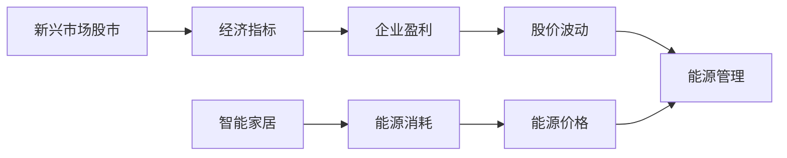
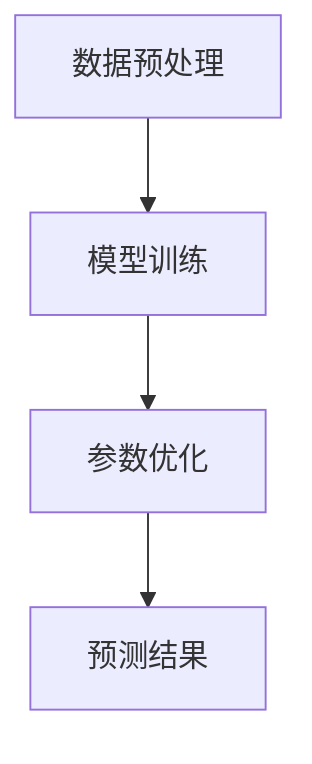
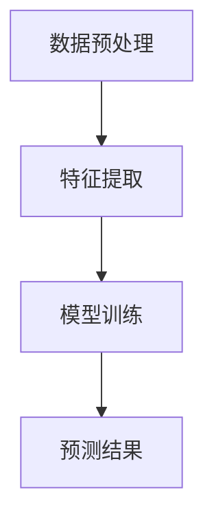
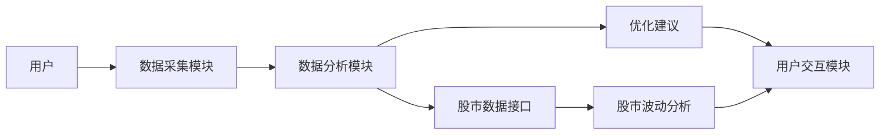

                 


# 《新兴市场股市估值与智能家居能源管理系统的互动》

---

## 关键词：  
新兴市场股市、股市估值、智能家居、能源管理系统、能源管理、互动关系、时间序列分析、机器学习、系统架构、能源价格、股市波动、经济影响

---

## 摘要：  
本文深入探讨新兴市场股市估值与智能家居能源管理系统的互动关系，结合技术背景、核心概念、算法原理和系统设计，分析两者如何相互影响并为经济发展提供新思路。通过时间序列分析和机器学习算法，揭示股市波动与能源管理的潜在关联，最后结合实际案例，提出系统设计方案和优化建议。

---

## 第一部分: 新兴市场股市估值与智能家居能源管理系统的互动概述

### 第1章: 新兴市场股市估值基础

#### 1.1 新兴市场股市估值的定义与特点
- **定义**：新兴市场股市估值是指对新兴经济体股票市场的整体价值进行评估，通常通过市盈率、市净率等指标衡量。
- **特点**：
  - 市场波动性高，受政策和经济因素影响显著。
  - 投资者结构多元化，包括机构和个人投资者。
  - 市场流动性相对较低，影响股票定价。

#### 1.2 新兴市场股市估值的重要性
- 作为经济发展晴雨表，股市估值反映了国家经济状况。
- 为投资者提供决策依据，影响资本分配效率。
- 为政府制定经济政策提供参考。

#### 1.3 新兴市场股市估值的挑战
- 数据获取困难，市场透明度较低。
- 经济波动大，影响估值准确性。
- 政治和经济风险较高，影响投资者信心。

---

### 第2章: 智能家居能源管理系统概述

#### 2.1 智能家居能源管理系统的定义与组成
- **定义**：通过智能设备和数据分析，优化家庭能源使用效率的系统。
- **组成模块**：
  - 数据采集模块：收集能源使用数据。
  - 数据分析模块：处理数据，生成优化建议。
  - 用户交互模块：提供可视化界面，供用户查看和操作。
  - 自动控制模块：根据分析结果自动调整能源使用。

#### 2.2 智能家居能源管理系统的功能
- 实时监控能源消耗。
- 预测能源需求，优化使用计划。
- 提供节能建议，降低能源浪费。
- 支持远程控制，方便用户管理。

#### 2.3 智能家居能源管理系统的优势
- 提高能源使用效率，降低成本。
- 减少环境污染，促进可持续发展。
- 提供智能化服务，提升用户体验。

---

### 第3章: 新兴市场股市估值与智能家居能源管理系统的互动关系

#### 3.1 互动关系的背景与意义
- **背景**：随着全球经济一体化，新兴市场股市与智能家居能源管理系统的互动日益频繁。
- **意义**：通过分析两者关系，可以揭示经济与技术的深层联系，为政策制定和技术创新提供参考。

#### 3.2 互动关系的核心要素分析
- **股市波动对能源管理的影响**：
  - 股市下跌可能引发能源企业投资减少，影响能源供应。
  - 股市上涨可能推动能源技术创新，促进能源管理系统的普及。
- **能源管理对股市稳定的作用**：
  - 通过优化能源使用，降低企业成本，提升企业盈利能力。
  - 通过减少能源浪费，降低经济运行成本，间接稳定股市。

---

## 第二部分: 核心概念与联系

### 第4章: 核心概念原理与对比分析

#### 4.1 核心概念的属性特征对比
| **属性**         | **新兴市场股市估值**                     | **智能家居能源管理系统**                     |
|------------------|------------------------------------------|------------------------------------------|
| **核心目标**     | 评估股市整体价值                         | 优化能源使用效率                           |
| **输入数据**     | 股价、市盈率、市净率等                    | 能源消耗数据、用户行为数据                 |
| **输出结果**     | 股票价值评估、投资建议                   | 节能优化方案、能源使用计划                |
| **影响因素**     | 经济政策、企业盈利、投资者情绪           | 能源价格、用户需求、技术进步               |

#### 4.2 实体关系图


---

## 第三部分: 算法原理讲解

### 第5章: 股市估值与能源消耗预测算法

#### 5.1 时间序列分析算法

##### 5.1.1 ARIMA模型原理
- **定义**：ARIMA（自回归积分滑动平均模型）是一种常用的时间序列预测方法。
- **模型公式**：
  $$ ARIMA(p, d, q) $$
  - $p$：自回归阶数。
  - $d$：差分阶数。
  - $q$：移动平均阶数。

##### 5.1.2 算法流程图


##### 5.1.3 Python代码实现
```python
# 示例代码：ARIMA模型实现
from statsmodels.tsa.arima_model import ARIMA
import pandas as pd

# 数据加载与预处理
data = pd.read_csv('stock_data.csv')
data = data['Adj Close'].values

# 模型训练
model = ARIMA(data, order=(5, 1, 0))
model_fit = model.fit()

# 预测结果
forecast = model_fit.forecast(steps=5)
print(forecast)
```

---

### 第6章: 机器学习算法在能源消耗预测中的应用

#### 6.1 机器学习算法简介
- **机器学习**：通过数据训练模型，实现对能源消耗的预测。
- **常用算法**：线性回归、支持向量机（SVM）、随机森林等。

#### 6.2 机器学习算法流程图


---

## 第四部分: 系统分析与架构设计

### 第7章: 智能家居能源管理系统架构设计

#### 7.1 问题场景介绍
- 用户希望通过智能家居系统优化能源使用，降低能源消耗成本。
- 系统需要实时监控能源消耗，提供优化建议，并与股市数据进行关联分析。

#### 7.2 系统功能设计
- **数据采集模块**：收集家庭能源消耗数据。
- **数据分析模块**：分析数据，预测能源消耗趋势。
- **用户交互模块**：提供可视化界面，供用户查看和操作。
- **自动控制模块**：根据分析结果，自动调整能源使用。

#### 7.3 系统架构设计


---

## 第五部分: 项目实战

### 第8章: 智能家居能源管理系统实现

#### 8.1 环境安装
- 安装Python、Pandas、NumPy、Scikit-learn等库。

#### 8.2 系统核心实现
```python
# 示例代码：能源消耗预测
import pandas as pd
from sklearn.linear_model import LinearRegression

# 数据加载
data = pd.read_csv('energy_data.csv')

# 特征提取
features = data[['Temperature', 'Humidity']]
target = data['EnergyConsumption']

# 模型训练
model = LinearRegression()
model.fit(features, target)

# 预测结果
forecast = model.predict(features)
print(forecast)
```

#### 8.3 实际案例分析
- **案例背景**：某新兴市场国家的家庭能源消耗数据与股市数据的关联分析。
- **数据来源**：家庭能源消耗数据和股市数据。
- **分析结果**：通过模型预测，发现能源消耗与股市波动存在一定的相关性，优化能源管理可以间接影响股市稳定。

---

## 第六部分: 总结与展望

### 第9章: 总结

#### 9.1 最佳实践 tips
- 在实施智能家居能源管理系统时，需注重数据的实时性和准确性。
- 结合股市数据进行分析，可以更好地理解能源管理对经济的影响。
- 定期更新模型，以适应市场变化和用户需求。

#### 9.2 小结
本文通过分析新兴市场股市估值与智能家居能源管理系统的互动关系，揭示了技术与经济的深层联系。通过时间序列分析和机器学习算法，提出了优化能源管理的解决方案，为经济发展提供了新思路。

#### 9.3 注意事项
- 数据隐私保护是系统设计中的重要考虑因素。
- 模型的准确性和稳定性直接影响系统的实用性。
- 系统的可扩展性需在设计阶段充分考虑。

#### 9.4 拓展阅读
- 《时间序列分析与应用》
- 《机器学习在金融领域的应用》
- 《智能家居系统设计与实现》

---

通过以上内容，我们系统地分析了新兴市场股市估值与智能家居能源管理系统的互动关系，并结合技术背景、核心概念、算法原理和系统设计，为读者提供了全面的解决方案。

