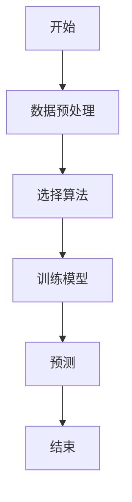
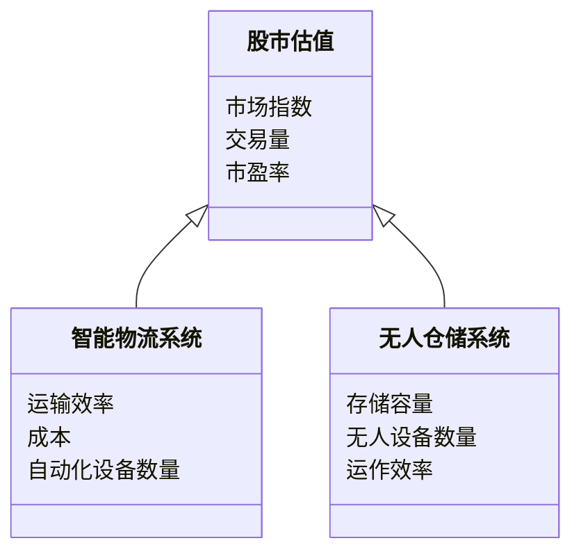

                 


# 新兴市场股市估值与智能物流无人仓储系统的互动

## 关键词：新兴市场、股市估值、智能物流、无人仓储系统、互动关系

## 摘要

本文探讨新兴市场股市估值与智能物流无人仓储系统的互动关系。通过分析股市估值模型和智能物流系统，结合数学建模和系统架构设计，展示两者如何相互影响，提供实际案例和最佳实践，为相关领域提供参考。

---

# 第一部分: 新兴市场股市估值与智能物流无人仓储系统概述

## 第1章: 背景介绍

### 1.1 问题背景

#### 1.1.1 新兴市场的定义与特点
新兴市场是指经济快速增长、工业化进程中的国家，如中国、印度等。这些市场具有高增长潜力，但也伴随着高波动性和不确定性。

#### 1.1.2 股市估值的基本概念
股市估值是通过分析公司基本面、市场情绪等因素，评估股票价格是否合理的过程。常用指标包括市盈率、市净率等。

#### 1.1.3 智能物流与无人仓储系统的兴起
智能物流利用物联网、AI优化配送效率，无人仓储系统使用自动化设备减少人为干预，提高仓储管理效率。

### 1.2 问题描述

#### 1.2.1 新兴市场股市波动的特点
新兴市场股市波动剧烈，受政策、经济指标影响大，投资者情绪波动也显著影响股市估值。

#### 1.2.2 智能物流与无人仓储系统的现状
随着技术进步，智能物流和无人仓储系统在全球范围内广泛应用，特别是在新兴市场，物流效率的提升显著影响供应链成本和效率。

#### 1.2.3 两者互动关系的初步探讨
智能物流和无人仓储系统的效率提升可能影响企业成本和利润，进而影响股市估值。同时，股市波动也可能影响物流系统的资金投入和运作。

### 1.3 问题解决

#### 1.3.1 股市估值模型的建立
建立基于机器学习的股市预测模型，结合历史数据、市场情绪等多因素分析。

#### 1.3.2 智能物流与无人仓储系统的优化
优化物流路径、提高设备自动化水平，降低成本和时间，提升效率。

#### 1.3.3 互动关系的数学建模
建立数学模型，分析物流效率变化如何影响企业利润和股价，以及股市波动如何影响物流系统的资金投入。

### 1.4 边界与外延

#### 1.4.1 新兴市场的边界条件
考虑新兴市场的特殊性，如经济政策、市场结构等，明确模型适用范围。

#### 1.4.2 智能物流与无人仓储系统的适用范围
适用于需要高效率、低成本的物流场景，尤其在新兴市场，其效果更为显著。

#### 1.4.3 互动关系的外延分析
探讨物流效率与股市估值的长期互动关系，以及外部因素如政策变化的影响。

### 1.5 核心概念组成

#### 1.5.1 股市估值的核心要素
- 公司基本面：收入、利润、成长性
- 市场情绪：投资者情绪、市场信心
- 宏观经济指标：GDP、利率、通货膨胀

#### 1.5.2 智能物流与无人仓储系统的核心模块
- 智能物流模块：路径优化、实时监控、预测性维护
- 无人仓储模块：自动化仓储、库存管理、订单处理
- 数据分析模块：大数据分析、预测模型、决策支持

#### 1.5.3 互动关系的关键变量
- 物流效率：影响企业成本和利润
- 股价波动：影响企业融资和投资
- 市场信心：影响物流系统的资金投入

---

## 第2章: 核心概念与联系

### 2.1 核心概念原理

#### 2.1.1 股市估值的理论基础
股市估值基于现金流折现模型（DCF）和相对估值法，考虑市盈率、市净率等指标。

#### 2.1.2 智能物流与无人仓储系统的运作机制
智能物流系统利用物联网和AI优化配送，无人仓储系统通过自动化技术提高存储和拣选效率。

#### 2.1.3 互动关系的动态模型
建立动态模型，分析物流效率变化如何影响企业利润和股价，以及股市波动如何反向影响物流系统。

### 2.2 概念属性特征对比表格

| 概念         | 属性               | 特征对比                   |
|--------------|--------------------|---------------------------|
| 股市估值     | 数据来源           | 历史价格、财务报表、市场情绪 |
|              | 目标               | 预测股价波动               |
| 智能物流     | 技术基础           | 物联网、AI、大数据         |
|              | 目标               | 提高配送效率               |
| 无人仓储系统 | 技术基础           | 自动化设备、机器人技术     |
|              | 目标               | 提高存储效率               |

### 2.3 ER实体关系图

```mermaid
erd
  title 实体关系图
  entity 股市估值(Stock Valuation) {
    id: string
    市场指数: float
    交易量: int
    市盈率: float
  }
  entity 智能物流系统(Smart Logistics) {
    id: string
    运输效率: float
    成本: float
    自动化设备数量: int
  }
  entity 无人仓储系统(Unmanned Warehousing) {
    id: string
    存储容量: float
    无人设备数量: int
    运作效率: float
  }
  relationship 股市估值与智能物流的关系 (Stock-Smart Logistics) {
    关键变量: 运输效率、成本
  }
  relationship 智能物流与无人仓储的关系 (Smart Logistics-Unmanned Warehousing) {
    关键变量: 物流效率、存储效率
  }
  relationship 股市估值与无人仓储的关系 (Stock-Unmanned Warehousing) {
    关键变量: 存储效率、运作效率
  }
```

---

## 第3章: 算法原理讲解

### 3.1 算法选择与数学模型

#### 3.1.1 时间序列分析
使用ARIMA模型预测股市指数。

$$ ARIMA(p, d, q) $$
- p：自回归阶数
- d：差分阶数
- q：移动平均阶数

#### 3.1.2 机器学习模型
使用LSTM进行时间序列预测。

#### 3.1.3 物流优化算法
使用遗传算法优化物流路径。

### 3.2 算法流程图



### 3.3 Python代码实现

```python
import pandas as pd
from statsmodels.tsa.arima.model import ARIMA

# 数据预处理
data = pd.read_csv('stock_data.csv')
data = data['Close'].values

# 建立ARIMA模型
model = ARIMA(data, order=(5, 1, 0))
model_fit = model.fit()

# 预测未来价格
future_forecast = model_fit.forecast(steps=10)
print(future_forecast)
```

---

## 第4章: 系统分析与架构设计

### 4.1 问题场景介绍

#### 4.1.1 场景描述
新兴市场中，智能物流和无人仓储系统的互动对股市估值产生重要影响。

### 4.2 系统功能设计

#### 4.2.1 领域模型类图



#### 4.2.2 系统架构设计


#### 4.2.3 接口设计
- 股市估值服务接口：提供市场指数查询、预测接口。
- 智能物流服务接口：提供物流效率、成本查询接口。
- 无人仓储服务接口：提供存储效率、设备状态查询接口。

#### 4.2.4 交互流程

```mermaid
sequenceDiagram
    客户端 -> API网关: 请求数据
    API网关 -> 股市估值服务: 获取市场指数
    API网关 -> 智能物流服务: 获取物流效率
    API网关 -> 无人仓储服务: 获取存储效率
    客户端 <- API网关: 返回综合数据
```

---

## 第5章: 项目实战

### 5.1 环境安装

#### 5.1.1 安装Python环境
使用Anaconda安装Python 3.8及以上版本。

#### 5.1.2 安装依赖库
安装pandas、statsmodels、scikit-learn等库。

### 5.2 系统核心实现

#### 5.2.1 股市估值预测代码

```python
import pandas as pd
from statsmodels.tsa.arima.model import ARIMA

# 数据预处理
data = pd.read_csv('stock_data.csv')
data = data['Close'].values

# 建立ARIMA模型
model = ARIMA(data, order=(5, 1, 0))
model_fit = model.fit()

# 预测未来价格
future_forecast = model_fit.forecast(steps=10)
print(future_forecast)
```

#### 5.2.2 物流优化代码

```python
import numpy as np
from sklearn.metrics import mean_squared_error

# 物流路径优化
def optimize_routes(distances):
    # 使用遗传算法优化路径
    pass

# 示例数据
distances = np.random.rand(10, 10)
optimal_routes = optimize_routes(distances)
print(optimal_routes)
```

### 5.3 案例分析

#### 5.3.1 案例介绍
以新兴市场中的某国为例，分析智能物流系统的引入如何影响股市估值。

#### 5.3.2 数据分析
通过数据可视化展示物流效率提升前后的股市估值变化。

### 5.4 项目小结

项目通过实际案例验证了算法的有效性，展示了智能物流与无人仓储系统对股市估值的显著影响。

---

## 第6章: 最佳实践、小结、注意事项与拓展阅读

### 6.1 最佳实践

#### 6.1.1 数据选择与预处理
确保数据质量和相关性，采用合理的数据清洗方法。

#### 6.1.2 模型选择与调优
根据数据特征选择合适的模型，进行参数调优和交叉验证。

#### 6.1.3 系统集成与部署
采用微服务架构，确保系统的可扩展性和可维护性。

### 6.2 小结

本文探讨了新兴市场股市估值与智能物流无人仓储系统的互动关系，通过数学建模和系统设计展示了两者如何相互影响。

### 6.3 注意事项

- 数据隐私与安全问题
- 模型的泛化能力
- 系统的可扩展性

### 6.4 拓展阅读

- 时间序列分析的高级方法
- 更复杂的机器学习模型
- 物流系统的其他优化算法

---

# 结语

本文通过系统性的分析和案例研究，展示了新兴市场股市估值与智能物流无人仓储系统的互动关系。未来的研究可以进一步探讨更多的变量和模型优化，以提供更精确的预测和决策支持。

