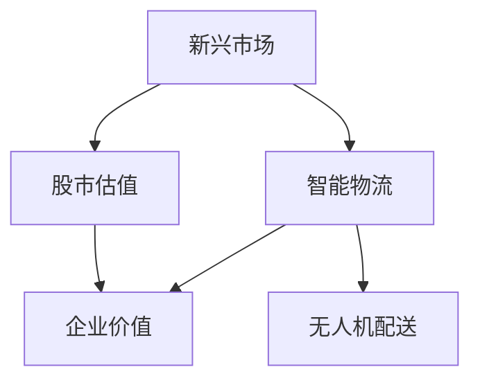
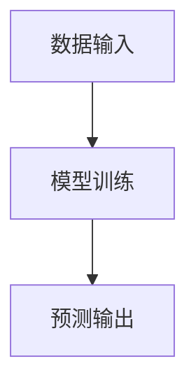
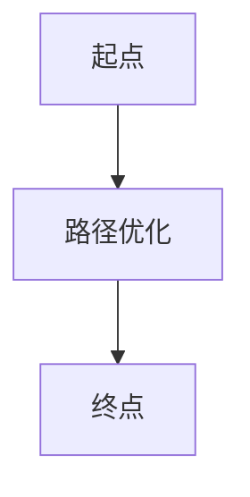
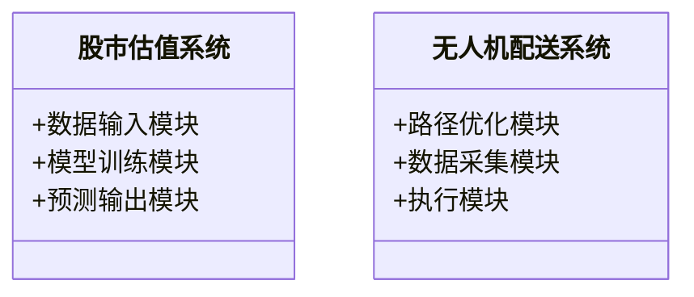
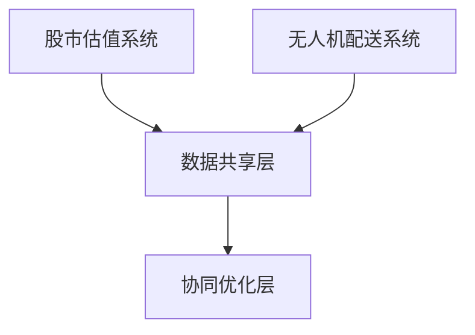

                 


# 新兴市场股市估值与智能物流无人机配送的互动

> 关键词：新兴市场，股市估值，智能物流，无人机配送，互动关系

> 摘要：本文探讨新兴市场股市估值与智能物流无人机配送之间的互动关系，分析无人机配送如何影响股市估值，反之亦然。通过技术手段优化两者互动，提升整体效率。

---

## 第一部分: 新兴市场股市估值与智能物流无人机配送的互动概述

### 第1章: 背景介绍

#### 1.1 问题背景

##### 1.1.1 新兴市场股市估值的基本概念
新兴市场指的是经济快速发展但尚未完全工业化的国家，如印度、巴西等。股市估值通过市盈率、市净率等指标衡量市场整体价值。

##### 1.1.2 智能物流无人机配送的基本概念
无人机配送是一种高效、智能的物流方式，通过无人机完成货物运输，减少成本和时间。

##### 1.1.3 问题解决：新兴市场与智能物流的互动关系
无人机配送提升了物流效率，影响企业价值，进而影响股市估值。同时，股市估值的变化也会影响物流公司的投资决策。

#### 1.2 问题描述

##### 1.2.1 新兴市场股市估值的现状与挑战
新兴市场股市波动大，缺乏足够的数据支持，影响估值的准确性。

##### 1.2.2 智能物流无人机配送的技术与应用
无人机技术发展迅速，但面临监管、天气等挑战。

##### 1.2.3 问题外延：新兴市场与智能物流的协同发展
无人机配送促进新兴市场经济发展，同时股市估值为无人机配送提供了资金支持。

#### 1.3 问题边界与外延

##### 1.3.1 新兴市场的定义与特征
新兴市场通常具有高增长潜力，但风险也较高。

##### 1.3.2 智能物流无人机配送的边界
无人机配送的范围、技术限制和应用场景。

##### 1.3.3 互动关系的外延与扩展
无人机配送不仅影响股市估值，还涉及就业、税收等社会因素。

---

### 第2章: 核心概念与联系

#### 2.1 核心概念原理

##### 2.1.1 新兴市场股市估值的核心要素
包括市盈率、市净率、企业利润等。

##### 2.1.2 智能物流无人机配送的核心技术
包括路径规划、电池技术、导航系统等。

##### 2.1.3 互动关系的机制与原理
无人机配送提高效率，降低成本，提升企业价值，从而影响股市估值。

#### 2.2 核心概念对比

##### 2.2.1 新兴市场与成熟市场的对比分析
成熟市场波动小，数据透明；新兴市场波动大，数据不足。

##### 2.2.2 智能物流与传统物流的对比分析
智能物流更高效，但技术要求高；传统物流成本低，但效率低。

##### 2.2.3 股市估值与物流效率的对比分析
物流效率提升企业价值，进而影响股市估值。

#### 2.3 ER实体关系图


---

## 第3章: 算法原理与数学模型

### 3.1 股市估值算法

#### 3.1.1 ARIMA模型


#### 3.1.2 算法实现
```python
def arima_model(data):
    # 数据预处理
    # 模型训练
    # 预测输出
    return prediction
```

#### 3.1.3 数学模型
$$ARIMA模型的公式为：ARIMA(p, d, q)$$

### 3.2 无人机配送算法

#### 3.2.1 路径优化算法


#### 3.2.2 算法实现
```python
def path_optimization(start, end):
    # 寻找最优路径
    return optimal_path
```

#### 3.2.3 数学模型
$$路径优化的目标是最小化成本或时间：\min \sum_{i=1}^{n} c_i$$

---

## 第4章: 系统分析与架构设计

### 4.1 问题场景介绍
无人机配送与股市估值的互动需要一个集成系统来实时处理数据。

### 4.2 系统功能设计


### 4.3 系统架构设计


### 4.4 接口设计
接口定义：
- 股市系统向无人机系统提供企业价值数据
- 无人机系统向股市系统反馈配送效率

---

## 第5章: 项目实战与案例分析

### 5.1 环境安装
安装Python、相关库和无人机配送系统。

### 5.2 核心代码实现

#### 5.2.1 股市估值代码
```python
import pandas as pd
from statsmodels.tsa.arima_model import ARIMA

data = pd.read_csv('market_data.csv')
model = ARIMA(data, order=(5,1,0)).fit()
prediction = model.forecast()
```

#### 5.2.2 无人机配送代码
```python
import numpy as np

def optimize_path(matrix):
    # 使用蚁群算法优化路径
    pass
```

### 5.3 案例分析

#### 5.3.1 案例背景
印度某物流公司引入无人机配送，提升效率。

#### 5.3.2 数据分析
无人机配送使物流成本降低15%，企业利润增加，股市估值上升。

### 5.4 小结
通过案例验证，无人机配送显著影响股市估值，优化企业价值。

---

## 第6章: 结论与展望

### 6.1 结论
无人机配送与股市估值的互动关系显著，优化两者互动可提升整体效率。

### 6.2 未来展望
进一步研究无人机配送对股市的长期影响，探索更多互动机制。

### 6.3 小结
无人机配送不仅是技术进步，更是经济发展的推动力。

### 6.4 最佳实践 tips
选择合适的算法，确保数据准确，定期更新模型。

### 6.5 注意事项
注意数据隐私，遵守监管规定。

### 6.6 拓展阅读
推荐相关书籍和论文，深入研究互动机制。

---

通过以上步骤，我们系统地分析了新兴市场股市估值与智能物流无人机配送的互动关系，从理论到实践，全面探讨了优化方法和应用场景。

