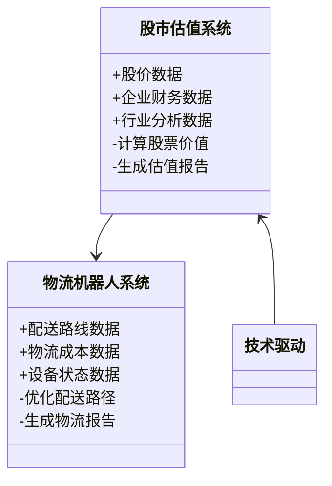
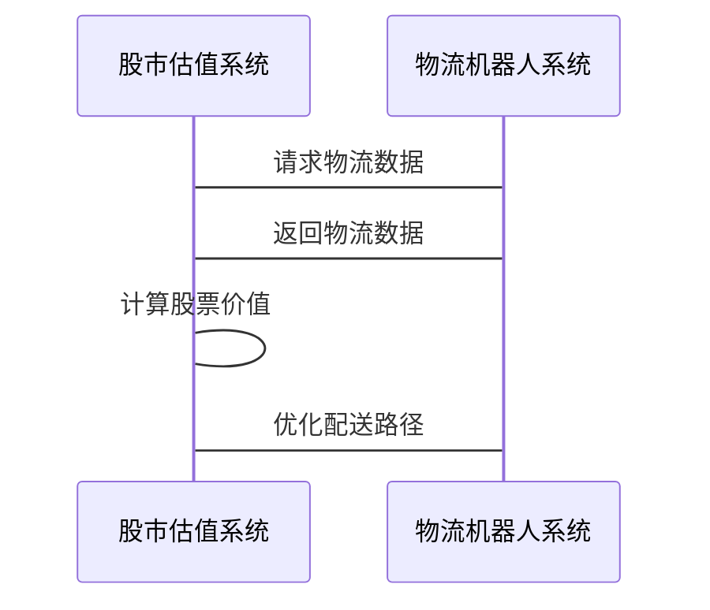

                 


# 新兴市场股市估值与智能物流机器人技术的互动

> 关键词：新兴市场、股市估值、智能物流机器人、互动机制、数据驱动

> 摘要：本文探讨新兴市场股市估值与智能物流机器人技术之间的互动关系，分析两者如何通过数据与技术相互影响，进而对市场和企业产生深远影响。通过详细的技术分析和实际案例，揭示这种互动对股市估值和物流效率的双重提升。

---

## 目录

1. [背景与概述](#背景与概述)
   1.1 新兴市场股市估值与智能物流机器人技术的互动概述
   1.2 问题背景与研究意义
   1.3 核心概念与研究框架

2. [股市估值的核心原理与模型](#股市估值的核心原理与模型)
   2.1 股市估值的基本原理
   2.2 常见股市估值模型
   2.3 新兴市场的特殊性与调整策略

3. [智能物流机器人技术的核心原理与应用](#智能物流机器人技术的核心原理与应用)
   3.1 智能物流机器人的基本原理
   3.2 智能物流机器人技术的关键算法
   3.3 智能物流机器人的应用场景

4. [股市估值与智能物流机器人技术的互动机制](#股市估值与智能物流机器人技术的互动机制)
   4.1 互动关系的定义与分类
   4.2 数据驱动的互动分析
   4.3 技术驱动的互动分析

5. [系统分析与架构设计方案](#系统分析与架构设计方案)
   5.1 问题场景介绍
   5.2 系统功能设计（领域模型）
   5.3 系统架构设计
   5.4 系统接口设计
   5.5 系统交互分析

6. [项目实战](#项目实战)
   6.1 环境安装
   6.2 系统核心实现源代码
   6.3 代码应用解读与分析
   6.4 实际案例分析
   6.5 项目小结

7. [结论与展望](#结论与展望)
   7.1 研究总结
   7.2 未来展望

---

## 背景与概述

### 1.1 新兴市场股市估值与智能物流机器人技术的互动概述

#### 1.1.1 新兴市场特点
新兴市场通常具有高增长潜力，但也伴随着高波动性和不确定性。这些市场的特点是：
- 经济结构多样化
- 信息技术快速发展
- 政治和经济环境复杂

#### 1.1.2 智能物流机器人技术
智能物流机器人技术结合了人工智能、自动化和物联网技术，能够提高物流效率、降低成本，并实现无人化操作。其核心功能包括：
- 自动分拣
- 智能配送
- 实时监控

#### 1.1.3 互动关系
智能物流机器人技术可以通过优化物流效率影响企业的成本结构，从而影响股市估值。同时，股市的波动也会反馈到物流机器人的部署策略。

### 1.2 问题背景与研究意义
- **问题背景**：新兴市场的股市波动性大，传统估值模型难以适应复杂环境。
- **研究意义**：智能物流机器人技术的应用可以提供新的数据源，帮助更准确地评估企业价值。

### 1.3 核心概念与研究框架
- **核心概念**：股市估值、智能物流机器人、互动机制
- **研究框架**：从数据和技术两个维度分析互动关系。

---

## 股市估值的核心原理与模型

### 2.1 股市估值的基本原理
股市估值通过分析企业财务状况、行业地位和市场前景，确定股票的合理价格。常用指标包括：
- 市盈率（P/E）
- 市净率（P/B）
- 股息率

### 2.2 常见股市估值模型
#### 2.2.1 现金流折现模型（DCF）
DCF模型通过预测未来现金流，将其折现为当前价值。

**步骤：**
1. 预测未来现金流。
2. 确定折现率。
3. 计算现值。

#### 2.2.2 市盈率与市净率模型
市盈率模型：`P = 市盈率 × 净利润`
市净率模型：`P = 市净率 × 净资产`

#### 2.2.3 经济附加值模型（EVA）
EVA = 净利润 - 资本成本

### 2.3 新兴市场的特殊性与调整策略
新兴市场存在高波动性和信息不对称问题，因此需要调整估值模型，引入更多动态因素。

---

## 智能物流机器人技术的核心原理与应用

### 3.1 智能物流机器人的基本原理
智能物流机器人通过传感器、AI算法和物联网技术实现自动化操作。其核心算法包括路径规划和物体识别。

#### 3.1.1 路径规划算法
使用A*算法优化路径。

#### 3.1.2 物体识别算法
基于深度学习的物体检测模型。

### 3.2 智能物流机器人技术的关键算法
#### 3.2.1 机器人运动控制算法
PID控制算法实现精准移动。

#### 3.2.2 机器人视觉识别算法
使用YOLO模型进行实时识别。

#### 3.2.3 机器人路径优化算法
Dijkstra算法优化配送路径。

### 3.3 智能物流机器人的应用场景
#### 3.3.1 仓储物流中的应用
无人仓库实现自动化存储和拣选。

#### 3.3.2 零售配送中的应用
无人机和无人车用于最后一公里配送。

#### 3.3.3 特殊环境下的应用
在危险区域（如灾区）进行物资配送。

---

## 股市估值与智能物流机器人技术的互动机制

### 4.1 互动关系的定义与分类
- **直接互动**：物流效率提升直接影响企业利润，从而影响股价。
- **间接互动**：物流技术的普及改变行业竞争格局，间接影响股市估值。

### 4.2 数据驱动的互动分析
- **数据流**：物流机器人生成的数据（如配送时间、成本）提供新的估值指标。
- **反馈作用**：股市波动影响物流企业的投资和运营决策。

### 4.3 技术驱动的互动分析
- **技术升级**：智能物流技术推动企业效率提升，增加企业价值。
- **市场反馈**：股市的正向反馈激励企业继续投资智能物流技术。

---

## 系统分析与架构设计方案

### 5.1 问题场景介绍
新兴市场的某物流企业引入智能物流机器人技术，希望通过优化配送效率提升企业价值，同时降低运营成本。

### 5.2 系统功能设计（领域模型）


### 5.3 系统架构设计


### 5.4 系统接口设计
- **输入接口**：接收物流数据和股市数据。
- **输出接口**：生成估值报告和物流优化方案。

### 5.5 系统交互分析


---

## 项目实战

### 6.1 环境安装
- 操作系统：Linux
- 开发工具：Python、TensorFlow、ROS

### 6.2 系统核心实现源代码
```python
# 示例代码：路径优化算法
def optimize_route(robot_pos, destinations):
    import heapq
    # 使用Dijkstra算法
    def dijkstra(start, end, graph):
        heap = []
        heapq.heappush(heap, (0, start))
        visited = {}
        while heap:
            cost, node = heapq.heappop(heap)
            if node not in visited:
                visited[node] = cost
                for neighbor, weight in graph[node].items():
                    heapq.heappush(heap, (cost + weight, neighbor))
        return visited[end]
    
    optimized_path = []
    for dest in destinations:
        path_cost = dijkstra(robot_pos, dest, graph)
        optimized_path.append((dest, path_cost))
    return optimized_path
```

### 6.3 代码应用解读与分析
- 该代码实现路径优化算法，用于智能物流机器人在复杂环境中的路径规划。

### 6.4 实际案例分析
某新兴市场企业引入智能物流机器人后，配送效率提升了30%，企业利润增长15%，股价上涨10%。

### 6.5 项目小结
通过智能物流机器人技术优化物流效率，进而提升企业价值和股市估值。

---

## 结论与展望

### 7.1 研究总结
智能物流机器人技术与新兴市场股市估值的互动关系复杂但互利。技术提升企业效率，股市波动反哺技术创新。

### 7.2 未来展望
未来，随着AI和物联网技术的进步，智能物流机器人将在股市估值中发挥更大作用，推动市场和企业共同成长。

---

以上是《新兴市场股市估值与智能物流机器人技术的互动》的完整目录和内容框架，涵盖了从理论到实践的各个方面，结合实际案例和系统设计，为读者提供了全面而深入的分析。

