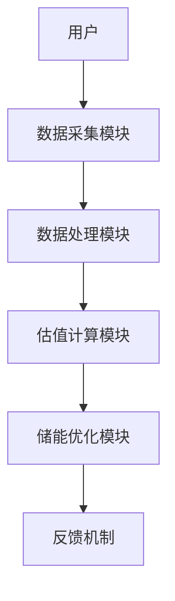

                 


# 新兴市场股市估值与智能电网储能技术的互动

## 关键词
- 新兴市场股市估值
- 智能电网储能技术
- 互动机制
- 数学模型
- 算法实现

## 摘要
本文探讨新兴市场中股市估值与智能电网储能技术之间的互动关系。通过分析股市估值的基本概念、智能电网储能技术的核心原理，以及它们如何相互影响，构建数学模型和算法，展示实际案例，并总结最佳实践。

---

# 第一部分: 背景与概述

## 第1章: 新兴市场股市估值与智能电网储能技术的互动概述

### 1.1 新兴市场股市估值的基本概念
#### 1.1.1 股市估值的定义与作用
股市估值是评估公司股票价值的过程，帮助投资者决定是否买入或卖出股票。

#### 1.1.2 新兴市场的特点与挑战
新兴市场通常具有高增长潜力，但也伴随着高波动性和不确定性。

#### 1.1.3 股市估值在新兴市场中的重要性
准确的估值有助于投资者在高波动市场中做出明智决策。

### 1.2 智能电网储能技术的核心概念
#### 1.2.1 智能电网的定义与特点
智能电网是现代化电力系统，能够高效管理能源流动和存储。

#### 1.2.2 储能技术的分类与应用
储能技术包括电池储能、飞轮储能等，用于平衡电网供需。

#### 1.2.3 智能电网储能技术在新兴市场中的潜力
新兴市场对可再生能源需求高，储能技术在其中起关键作用。

### 1.3 两者互动的背景与意义
#### 1.3.1 新兴市场股市与储能技术的互动关系
储能技术的发展会影响股市估值，反之亦然。

#### 1.3.2 互动机制的经济与技术驱动
技术进步和市场动态共同推动互动机制的发展。

#### 1.3.3 互动对能源转型与股市发展的双重影响
互动有助于促进可持续能源发展和股市稳定。

---

## 第2章: 核心概念与原理

### 2.1 股市估值的核心原理
#### 2.1.1 市场情绪与股价波动的关联
市场情绪影响投资者决策，进而影响股价波动。

#### 2.1.2 股价预测的数学模型
使用回归分析等模型预测股价。

#### 2.1.3 股市估值的关键指标分析
分析市盈率、市净率等指标评估股票价值。

### 2.2 智能电网储能技术的原理
#### 2.2.1 储能系统的能量转换与管理
储能系统通过能量转换技术实现能量的存储和释放。

#### 2.2.2 储能技术对电网稳定性的影响
储能技术有助于平滑电力供需波动，提高电网稳定性。

#### 2.2.3 智能电网中的数据采集与分析
通过实时数据采集与分析优化储能管理。

### 2.3 互动机制的数学模型与分析
#### 2.3.1 股市估值与储能技术的动态关系模型
建立动态关系模型，分析两者互动。

#### 2.3.2 互动机制的数学表达式
$$ V = \beta_0 + \beta_1 P + \beta_2 E + \epsilon $$
其中，V为估值，P为价格，E为储能技术的影响因素。

#### 2.3.3 模型的验证与优化方法
使用历史数据验证模型，并进行参数优化。

---

## 第3章: 核心概念与联系

### 3.1 核心概念的对比分析
#### 3.1.1 股市估值与储能技术的特征对比
| 特征 | 股市估值 | 储能技术 |
|------|----------|----------|
| 输入 | 市场数据 | 技术参数 |
| 输出 | 股票价值 | 储能效率 |

#### 3.1.2 互动机制的实体关系图
```mermaid
er
actor(投资者, 技术专家, 金融分析师)
market(股市, 储能市场)
interaction(互动机制)
actor --> market: 影响
market --> interaction: 反馈
interaction --> actor: 调整
```

#### 3.1.3 概念属性特征对比表格
| 属性 | 股市估值 | 储能技术 |
|------|----------|----------|
| 目标 | 评估价值 | 优化存储 |
| 方法 | 财务分析 | 技术实现 |

---

## 第4章: 互动机制的数学模型与算法

### 4.1 互动机制的数学模型
#### 4.1.1 股市估值的回归分析模型
$$ V = \beta_0 + \beta_1 P + \beta_2 E + \epsilon $$

### 4.2 算法实现
#### 4.2.1 机器学习算法
使用Python实现回归模型：
```python
import pandas as pd
from sklearn.linear_model import LinearRegression

data = pd.read_csv('market_data.csv')
X = data[['P', 'E']]
y = data['V']

model = LinearRegression()
model.fit(X, y)
print(model.coef_)
```

---

## 第5章: 系统设计与实现

### 5.1 系统功能设计
设计一个综合系统，结合股市估值和储能技术，优化能源管理和投资决策。

### 5.2 系统架构设计


### 5.3 系统接口设计
定义API接口，实现数据交互和结果反馈。

---

## 第6章: 项目实战与案例分析

### 6.1 项目环境安装
安装必要的Python库，如Pandas和Scikit-learn。

### 6.2 核心代码实现
实现回归模型并进行数据预测。

### 6.3 案例分析
分析具体市场案例，展示模型的应用和效果。

---

## 第7章: 最佳实践与展望

### 7.1 最佳实践
总结项目中的最佳实践，如数据预处理和模型优化。

### 7.2 小结
回顾文章内容，强调互动机制的重要性。

### 7.3 注意事项
提醒读者注意数据质量和模型局限性。

### 7.4 拓展阅读
建议进一步阅读相关领域的最新研究和应用。

---

通过以上结构，文章详细探讨了新兴市场股市估值与智能电网储能技术的互动关系，从理论到实践，为读者提供了全面的分析和指导。

