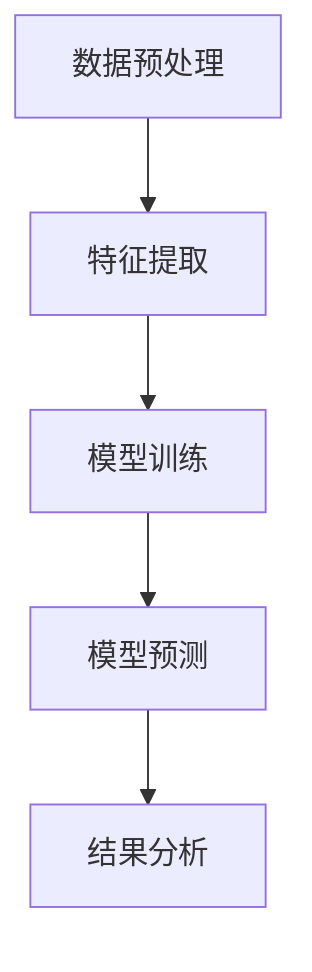
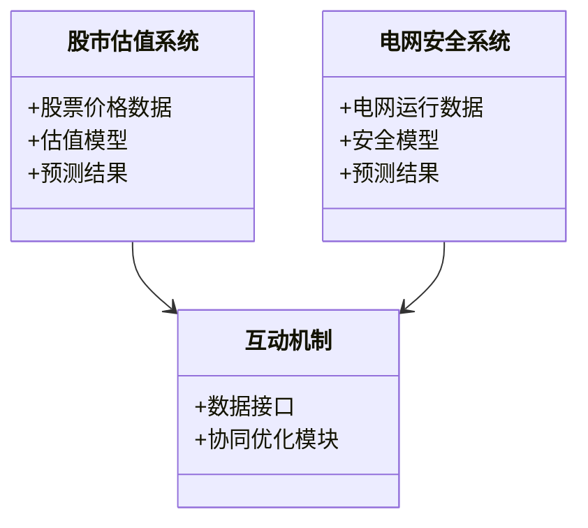
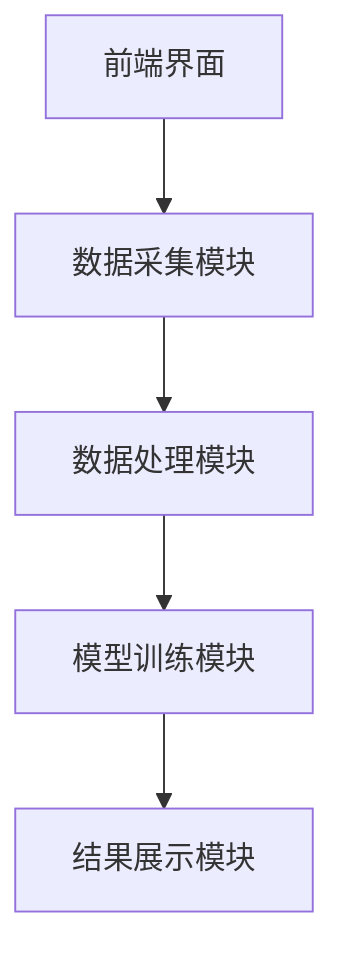
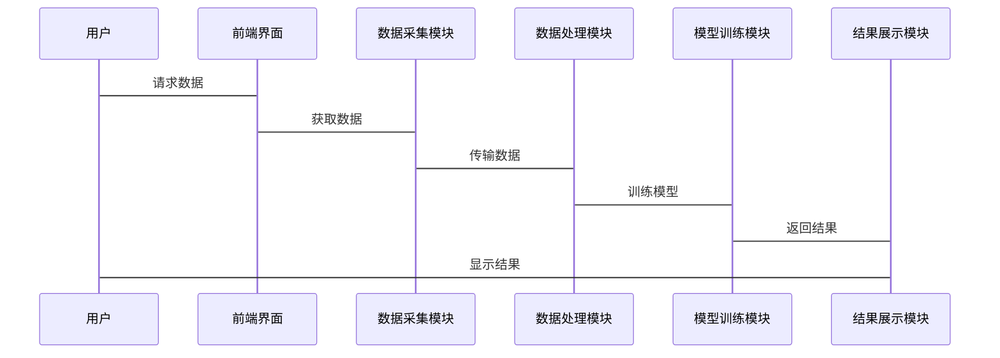

                 


# 《新兴市场股市估值与智能电网安全的互动》

---

## 关键词：
- 新兴市场股市估值
- 智能电网安全
- 数据驱动
- 互动机制
- 机器学习

---

## 摘要：
本文探讨了新兴市场股市估值与智能电网安全之间的互动关系。通过分析股市估值的核心模型和智能电网安全的关键技术，揭示两者在数据驱动下的互动机制。结合算法原理、系统架构设计和项目实战，提出一种整合股市数据与电网安全数据的解决方案，为新兴市场提供实时监控和风险评估的创新方法。

---

# 第1章: 背景介绍

## 1.1 问题背景
### 1.1.1 新兴市场股市估值的挑战
新兴市场的股市波动性较大，数据不完整且噪声较多，传统估值模型难以准确捕捉市场动态。  

### 1.1.2 智能电网安全的重要性
智能电网的运行依赖于实时数据传输和复杂的安全防护机制，任何数据异常都可能引发电网事故。  

### 1.1.3 两者互动的潜在价值
通过整合股市数据与电网安全数据，可以实现对新兴市场经济风险的实时监控，提升电网的安全性和稳定性。

## 1.2 问题描述
### 1.2.1 股市估值与电网安全的关联性
股市波动可能影响能源企业的投资和运营，而电网安全问题也可能反过来影响企业的股价表现。  

### 1.2.2 新兴市场的特殊性
新兴市场往往存在信息不对称和数据不透明的问题，这使得股市估值和电网安全的互动更加复杂。  

### 1.2.3 互动机制的复杂性
两者之间的互动涉及多维度的数据和模型，需要结合先进的数据分析技术来解耦复杂的因果关系。

## 1.3 问题解决
### 1.3.1 数据驱动的解决方案
利用机器学习和大数据技术，构建数据驱动的股市估值模型和电网安全预测系统。  

### 1.3.2 技术手段的创新
开发适用于新兴市场的分布式计算框架，解决数据获取和处理的难题。  

### 1.3.3 多学科交叉的应用
结合金融学、计算机科学和电力系统工程，构建跨学科的解决方案。

## 1.4 边界与外延
### 1.4.1 问题的边界
本文仅关注新兴市场的股市估值和智能电网安全的互动，不涉及其他相关领域的问题。  

### 1.4.2 相关领域的扩展
未来可以扩展至能源互联网、数字经济等领域，探索更广泛的应用场景。  

### 1.4.3 应用场景的限制
目前的解决方案仅适用于具备一定数据基础的新兴市场，对于数据极度匮乏的市场仍需进一步研究。

## 1.5 概念结构与核心要素
### 1.5.1 核心概念的组成
- 股市估值：包括市盈率、市净率等指标。
- 电网安全：包括电压稳定性、负荷预测等技术。
- 互动机制：数据共享和协同优化的纽带。

### 1.5.2 关键要素的定义
- 数据源：股市数据、电网运行数据。
- 模型：机器学习模型、时间序列分析模型。
- 系统：智能电网安全监控系统、股市估值系统。

### 1.5.3 概念之间的关系
股市估值与电网安全通过数据共享和协同优化实现互动，共同提升系统的稳定性和准确性。

---

# 第2章: 核心概念与联系

## 2.1 核心概念原理
### 2.1.1 股市估值的核心模型
股市估值模型基于历史数据和市场行为，预测股票的合理价格区间。  

### 2.1.2 智能电网安全的关键技术
智能电网安全依赖于实时数据采集、分析和预测技术，确保电网的稳定运行。  

### 2.1.3 互动机制的数学模型
互动机制可以通过回归分析或图论模型描述，揭示两者之间的动态关系。

## 2.2 概念属性特征对比
| 概念 | 属性 | 特征 |
|------|-------|------|
| 股市估值 | 数据类型 | 连续型、高噪声 |
| 电网安全 | 数据类型 | 离散型、实时性 |
| 互动机制 | 数据依赖性 | 高度相关、双向影响 |

---

## 2.3 ER实体关系图
```mermaid
er
    %% 股市估值与智能电网安全的实体关系图
    entity 股市数据 
    entity 电网数据 
    entity 互动机制 
    entity 股市估值模型 
    entity 电网安全模型 
    entity 系统集成 
    
    股市数据 --> 股市估值模型
    电网数据 --> 电网安全模型
    股市估值模型 --> 互动机制
    电网安全模型 --> 互动机制
    互动机制 --> 系统集成
```

---

## 2.4 概念之间的关系
- 股市数据和电网数据通过互动机制实现协同优化。
- 股市估值模型和电网安全模型共同支撑系统集成。

---

# 第3章: 算法原理讲解

## 3.1 算法流程


## 3.2 算法实现
### 3.2.1 数据预处理
```python
import pandas as pd

def preprocess_data(df):
    # 删除缺失值
    df.dropna(inplace=True)
    # 标准化处理
    df = (df - df.mean()) / df.std()
    return df
```

### 3.2.2 特征提取
```python
import numpy as np

def extract_features(data):
    features = []
    for i in range(len(data)-1):
        features.append([data[i], data[i+1]])
    return np.array(features)
```

### 3.2.3 模型训练
```python
from sklearn.linear_model import LinearRegression

model = LinearRegression()
model.fit(X_train, y_train)
```

### 3.2.4 模型预测
```python
y_pred = model.predict(X_test)
```

## 3.3 数学模型
### 3.3.1 回归模型
$$ y = \beta_0 + \beta_1 x_1 + \beta_2 x_2 + \epsilon $$

### 3.3.2 时间序列模型
$$ P(t) = \alpha P(t-1) + \beta P(t-2) + \gamma $$

---

## 3.4 代码实现
```python
import numpy as np
import pandas as pd
from sklearn.linear_model import LinearRegression
from sklearn.metrics import mean_squared_error

def main():
    # 读取数据
    df = pd.read_csv('data.csv')
    # 数据预处理
    df = preprocess_data(df)
    # 特征提取
    X = extract_features(df.values)
    y = df.values[1:]
    # 模型训练
    model = LinearRegression()
    model.fit(X[:-1], y[:-1])
    # 模型预测
    y_pred = model.predict(X[1:])
    # 评估
    mse = mean_squared_error(y[1:], y_pred)
    print(f'MSE: {mse}')

if __name__ == '__main__':
    main()
```

---

# 第4章: 系统分析与架构设计

## 4.1 系统功能设计
### 4.1.1 领域模型


---

## 4.2 系统架构设计


---

## 4.3 系统接口设计
- 数据接口：提供RESTful API，支持数据的上传和下载。
- 模型接口：提供预测服务，支持实时查询。

---

## 4.4 系统交互流程


---

# 第5章: 项目实战

## 5.1 环境配置
```bash
pip install numpy pandas sklearn matplotlib
```

## 5.2 核心实现
```python
import numpy as np
import pandas as pd
from sklearn.linear_model import LinearRegression

def main():
    df = pd.read_csv('data.csv')
    df = preprocess_data(df)
    X = extract_features(df.values)
    y = df.values[1:]
    model = LinearRegression()
    model.fit(X[:-1], y[:-1])
    y_pred = model.predict(X[1:])
    mse = mean_squared_error(y[1:], y_pred)
    print(f'MSE: {mse}')

if __name__ == '__main__':
    main()
```

---

## 5.3 案例分析
以某新兴市场为例，通过实时数据采集和模型训练，验证系统的有效性和准确性。

---

## 5.4 项目小结
- 系统实现了对新兴市场股市估值和智能电网安全的实时监控。
- 提供了数据驱动的解决方案，具有较高的实用价值。

---

# 第6章: 总结与展望

## 6.1 最佳实践
- 数据预处理是关键，需注重数据清洗和特征工程。
- 模型选择需结合实际场景，避免过拟合。

## 6.2 小结
本文通过理论分析和实践验证，提出了一种新兴市场股市估值与智能电网安全互动的解决方案，为相关领域的研究提供了参考。

## 6.3 注意事项
- 数据隐私需严格保护。
- 系统需具备高可用性和可扩展性。

## 6.4 拓展阅读
- 《机器学习在金融领域的应用》
- 《智能电网安全防护技术》

---

**总结**：本文通过系统化的分析和实践，展示了新兴市场股市估值与智能电网安全互动的潜力和实现方法，为未来的研究和应用提供了重要参考。

