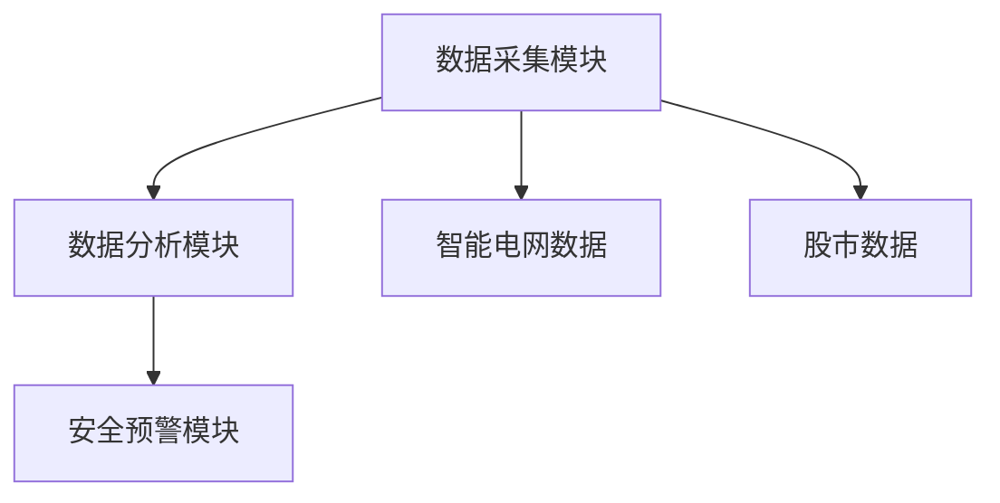

                 


# 新兴市场股市估值与智能电网网络安全技术的互动

> 关键词：股市估值、智能电网、网络安全、互动关系、技术分析、系统架构

> 摘要：本文探讨新兴市场股市估值与智能电网网络安全技术之间的互动关系。通过分析股市估值的核心要素、智能电网网络安全的关键技术，以及它们之间的互动机制，本文旨在揭示如何通过技术创新提升股市估值的准确性，并保障智能电网的安全运行。通过详细的技术分析和系统架构设计，本文为相关领域的研究和实践提供了有价值的参考。

---

# 第一部分: 背景介绍

## 第1章: 背景与问题定义

### 1.1 新兴市场股市估值的现状与挑战

#### 1.1.1 新兴市场的定义与特点
新兴市场通常指那些经济快速增长、但尚未达到发达市场水平的国家。这些市场具有高成长性、高波动性和高风险性的特点。新兴市场的股市规模较小，交易量波动较大，且受政策、经济和社会因素的影响更为显著。

#### 1.1.2 股市估值的基本概念与方法
股市估值是通过对企业的财务数据、市场环境和行业趋势进行分析，确定股票的内在价值。常用的方法包括市盈率（P/E）、市净率（P/B）和现金流折现法（DCF）等。

#### 1.1.3 新兴市场股市估值的特殊性
新兴市场的股市估值受到更多不确定因素的影响，例如政策变化、汇率波动和国际经济环境等。此外，新兴市场的数据获取难度较大，且市场信息的透明度较低，增加了估值的难度。

### 1.2 智能电网与网络安全的背景

#### 1.2.1 智能电网的定义与技术特点
智能电网是一种通过先进的信息通信技术和自动化设备，实现电力系统各个环节（发电、输电、配电、用电）智能化管理的系统。其特点包括高效性、可靠性和可扩展性。

#### 1.2.2 智能电网中的网络安全问题
智能电网高度依赖信息通信技术，因此容易受到网络攻击。常见的网络安全威胁包括数据篡改、身份伪造和拒绝服务攻击等。

#### 1.2.3 网络安全对智能电网的影响
网络安全问题可能导致电力系统的运行中断，甚至引发大面积停电，造成巨大的经济损失和社会影响。

### 1.3 互动关系的背景与意义

#### 1.3.1 股市估值与智能电网的潜在联系
智能电网的稳定运行是电力行业的重要指标，而电力行业的表现可能影响股市估值。此外，智能电网的安全性也可能成为投资者关注的焦点。

#### 1.3.2 网络安全对股市估值的影响
网络安全事件可能导致企业利润下降、股价波动，进而影响股市的整体估值。

#### 1.3.3 互动关系的研究价值与应用前景
研究股市估值与智能电网网络安全的互动关系，有助于优化股市估值模型，同时提高智能电网的安全性，具有重要的理论和实践意义。

## 第2章: 核心概念与联系

### 2.1 股市估值的核心要素

#### 2.1.1 股价、市盈率、市净率等指标的定义
- 股价：股票在市场上的交易价格。
- 市盈率（P/E）：股价与每股收益的比值。
- 市净率（P/B）：股价与每股净资产的比值。

#### 2.1.2 影响股市估值的主要因素
- 宏观经济环境：GDP增长率、通货膨胀率等。
- 行业发展趋势：行业竞争状况、技术进步等。
- 企业财务状况：收入、利润、资产负债情况等。

#### 2.1.3 新兴市场的特殊性分析
新兴市场的股市估值受政策、汇率和国际环境影响较大，且市场信息不透明。

### 2.2 智能电网网络安全的核心要素

#### 2.2.1 智能电网的组成部分与功能
- 发电：包括可再生能源和传统能源。
- 输电：通过高压输电网络传输电力。
- 配电：将电力分配到各个用户。
- 用电：用户端的电力消耗。

#### 2.2.2 网络安全威胁的类型与来源
- 内部威胁：员工误操作或恶意行为。
- 外部威胁：黑客攻击、病毒传播等。

#### 2.2.3 网络安全防护的关键技术
- 加密技术：保护数据传输的安全性。
- 认证技术：确保用户身份的真实性。
- 入侵检测系统（IDS）：监控网络异常行为。

### 2.3 核心概念的对比与联系

#### 2.3.1 股市估值与智能电网的对比分析
- 股市估值关注的是企业的价值，而智能电网关注的是电力系统的稳定运行。
- 两者都受到宏观经济环境的影响，但关注点不同。

#### 2.3.2 网络安全对股市估值的潜在影响
网络安全事件可能导致企业利润下降，进而影响股市估值。

#### 2.3.3 互动关系的实体关系图（ER图）

```mermaid
er
  entity 股市估值系统
  entity 智能电网系统
  entity 网络安全威胁
  relation "依赖" --> 股市估值系统
  relation "影响" --> 智能电网系统
  relation "威胁" --> 网络安全威胁
  relation "互动" --> 股市估值系统
  relation "互动" --> 智能电网系统
```

---

# 第二部分: 算法原理与数学模型

## 第3章: 股市估值的算法原理

### 3.1 传统估值方法

#### 3.1.1 市盈率法

公式：
$$ \text{市盈率} = \frac{\text{股价}}{\text{每股收益}} $$

#### 3.1.2 市净率法

公式：
$$ \text{市净率} = \frac{\text{股价}}{\text{每股净资产}} $$

#### 3.1.3 现金流折现法（DCF）

公式：
$$ \text{企业价值} = \sum_{t=1}^{n} \frac{\text{现金流}}{(1 + r)^t} + \frac{\text{终值}}{(1 + r)^n} $$

### 3.2 智能电网网络安全的算法原理

#### 3.2.1 加密算法

- AES加密：用于保护数据传输的安全性。
- RSA加密：用于实现安全通信。

#### 3.2.2 入侵检测系统（IDS）

- 基于规则的检测：通过预定义的规则识别异常行为。
- 基于异常检测的机器学习模型：通过训练数据识别异常行为。

---

## 第4章: 网络安全对股市估值的影响

### 4.1 网络安全事件对股市的影响

#### 4.1.1 网络攻击对企业利润的影响
网络攻击可能导致企业数据泄露，进而影响企业利润和股价。

#### 4.1.2 网络安全事件对市场信心的影响
网络安全事件可能导致投资者信心下降，进而影响股市整体估值。

### 4.2 基于机器学习的股市估值模型

#### 4.2.1 数据预处理
- 数据清洗：处理缺失值和异常值。
- 数据归一化：确保不同特征的尺度一致。

#### 4.2.2 模型训练
- 线性回归：用于预测股价。
- 支持向量机（SVM）：用于分类任务。

#### 4.2.3 模型优化
- 调参：通过网格搜索优化模型参数。
- 交叉验证：评估模型的泛化能力。

---

## 第5章: 智能电网安全与股市估值的互动机制

### 5.1 智能电网安全对股市的影响

#### 5.1.1 电力系统稳定性对股市的影响
电力系统的稳定性影响企业的生产效率，进而影响股市估值。

#### 5.1.2 网络安全事件对电力企业的股价影响
网络安全事件可能导致电力企业的股价下跌。

### 5.2 股市估值对智能电网安全的反向影响

#### 5.2.1 股价波动对电力企业投资的影响
股价波动可能影响电力企业的融资能力，进而影响智能电网的建设。

#### 5.2.2 投资者行为对智能电网安全的影响
投资者的关注点可能影响企业的安全投入。

---

## 第6章: 系统架构设计

### 6.1 系统功能设计

#### 6.1.1 数据采集模块
- 采集智能电网的运行数据。
- 采集股市数据。

#### 6.1.2 数据分析模块
- 分析智能电网的安全风险。
- 分析股市估值的变化趋势。

#### 6.1.3 安全预警模块
- 监测网络安全威胁。
- 提供预警信息。

### 6.2 系统架构设计



---

## 第7章: 项目实战

### 7.1 环境安装

```bash
pip install numpy pandas scikit-learn
```

### 7.2 核心代码实现

```python
import numpy as np
import pandas as pd
from sklearn.linear_model import LinearRegression

# 数据预处理
data = pd.read_csv('stock_data.csv')
data = data.dropna()
data = (data - data.mean()) / data.std()

# 模型训练
model = LinearRegression()
model.fit(data[['PE', 'PB']], data['Price'])

# 模型预测
predicted_price = model.predict([[20, 3]])
print(predicted_price)
```

---

## 第8章: 最佳实践

### 8.1 小结
本文探讨了新兴市场股市估值与智能电网网络安全技术的互动关系，分析了两者的核心要素和互动机制，提出了基于机器学习的股市估值模型和智能电网安全防护方案。

### 8.2 注意事项
- 数据来源的可靠性。
- 模型的泛化能力。
- 系统的可扩展性。

### 8.3 拓展阅读
- 《智能电网安全技术》
- 《股市估值与投资策略》

---

# 结语

通过本文的分析，我们可以看到，新兴市场股市估值与智能电网网络安全技术之间的互动关系是复杂而深刻的。通过技术创新和系统优化，我们可以更好地理解和应对这些互动带来的挑战和机遇。

