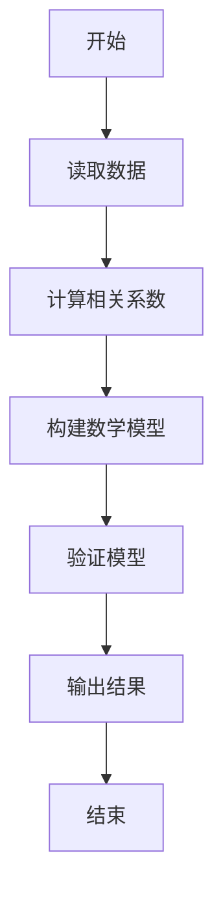
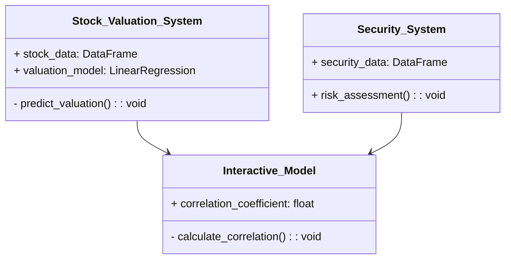
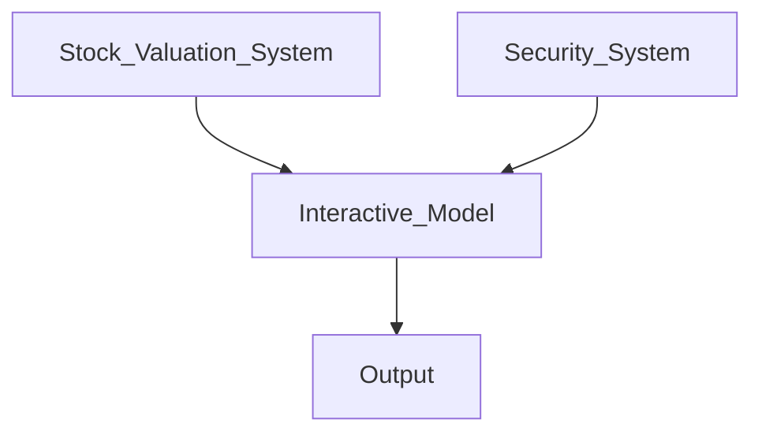
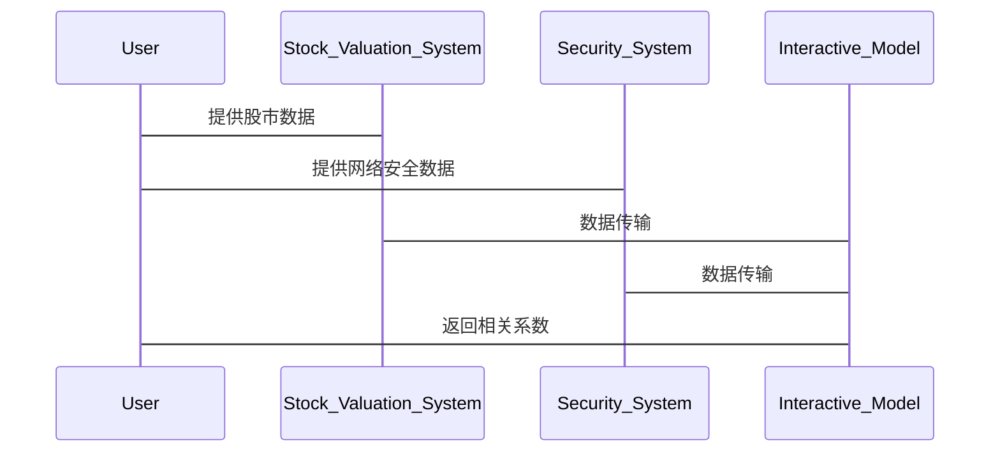

                 


# 新兴市场股市估值与智能电网网络安全标准的互动

## 关键词：新兴市场、股市估值、智能电网、网络安全标准、互动机制、数学模型、系统架构

## 摘要：  
本文探讨新兴市场股市估值与智能电网网络安全标准之间的互动关系，分析股市波动如何影响智能电网的稳定性，以及智能电网的网络安全策略如何反向影响股市估值。通过构建数学模型和系统架构，本文揭示两者之间的动态关系，并提出在实际应用中的最佳实践和建议。

---

# 第一部分: 背景与概念

## # 第1章: 新兴市场股市估值与智能电网网络安全的互动背景

### ## 1.1 新兴市场股市估值的基本概念

#### ### 1.1.1 股市估值的定义与作用  
股市估值是指通过对上市公司基本面（如收入、利润、市盈率等）和宏观经济指标的分析，对股票的内在价值进行评估。股市估值是投资者决策的重要依据，同时也是反映市场信心和经济状况的重要指标。

#### ### 1.1.2 新兴市场的特点与挑战  
新兴市场通常具有高增长潜力，但同时也伴随着高风险。这些市场的股市波动性较大，受政策、经济和外部环境的影响更为显著。此外，新兴市场的基础设施和技术水平相对落后，这为智能电网的建设带来了挑战。

#### ### 1.1.3 股市估值与经济发展的关系  
股市估值不仅是经济发展的晴雨表，还对经济发展具有反哺作用。高估值的股市可以吸引更多投资，促进企业发展，而低估值的股市则可能引发市场信心危机，阻碍经济增长。

### ## 1.2 智能电网网络安全标准的核心概念

#### ### 1.2.1 智能电网的基本定义与特征  
智能电网是指通过先进信息通信技术、自动控制技术和能源管理技术，实现电力系统各个环节的智能化运行和管理。其核心特征包括自动化、数字化、智能化和互动性。

#### ### 1.2.2 网络安全在智能电网中的重要性  
智能电网的网络安全直接关系到电力系统的稳定运行。一旦遭受网络攻击，可能导致电力系统瘫痪，引发严重后果。因此，制定和实施网络安全标准是保障智能电网安全运行的必要条件。

#### ### 1.2.3 国际与国内网络安全标准的对比  
国际上，ISO/IEC 27001等标准为网络安全提供了通用框架。国内标准如GB/T 22239（网络安全等级保护制度）则更加贴合中国的实际需求。两者在目标上相似，但在实施细节和应用场景上存在差异。

### ## 1.3 互动背景与研究意义

#### ### 1.3.1 新兴市场股市波动对智能电网的影响  
新兴市场股市的波动可能影响企业的投资能力和电力项目的建设进度，进而影响智能电网的稳定性。

#### ### 1.3.2 智能电网网络安全对股市稳定性的作用  
智能电网网络安全事件（如数据泄露或网络攻击）可能引发股市的波动，影响投资者信心。

#### ### 1.3.3 互动机制的研究价值与应用前景  
研究股市估值与智能电网网络安全的互动机制，有助于制定更有效的风险管理策略，保障电力系统的安全运行，同时维护金融市场的稳定。

---

# 第二部分: 核心概念与联系

## # 第2章: 股市估值与智能电网网络安全的核心要素

### ## 2.1 股市估值的核心要素分析

#### ### 2.1.1 宏观经济指标的影响  
GDP增长率、通货膨胀率、利率等宏观经济指标直接影响股市估值。例如，低利率环境通常会推高股市估值。

#### ### 2.1.2 行业发展趋势的作用  
新兴市场中，科技、能源等行业的快速发展会带动相关股票的估值上升。

#### ### 2.1.3 公司财务数据的分析  
公司盈利能力、资产负债率、现金流等财务指标是评估股市估值的重要依据。

### ## 2.2 智能电网网络安全的核心要素分析

#### ### 2.2.1 网络架构的安全性  
智能电网的网络架构需要设计多层次的安全防护机制，包括防火墙、入侵检测系统等。

#### ### 2.2.2 数据传输的加密技术  
智能电网中的数据（如电力消耗数据）需要通过加密技术进行传输，防止数据泄露。

#### ### 2.2.3 用户身份认证机制  
通过多因素身份认证（MFA）等技术，确保只有授权用户可以访问智能电网系统。

### ## 2.3 核心要素对比分析

#### ### 2.3.1 股市估值与网络安全的要素对比表  

| 股市估值要素          | 智能电网网络安全要素          |
|-----------------------|-----------------------------|
| 宏观经济指标          | 网络架构安全性                |
| 行业发展趋势          | 数据传输加密技术            |
| 公司财务数据          | 用户身份认证机制            |

#### ### 2.3.2 股市估值与网络安全的ER实体关系图  

```mermaid
erd
  user_table
  stock_valuation
  smart_grid_security
  user_table relates to stock_valuation via user_investments
  user_table relates to smart_grid_security via user_access
  stock_valuation relates to smart_grid_security via market_impact
```

---

# 第三部分: 互动机制的数学模型与算法原理

## # 第3章: 互动机制的数学模型

### ## 3.1 股市估值与网络安全的互动模型

#### ### 3.1.1 模型的构建与假设  
假设股市估值的变化与智能电网网络安全事件的发生率呈负相关关系。即，股市估值下降可能引发更多的网络安全事件，反之亦然。

#### ### 3.1.2 模型的变量定义与关系  
- $V_s$：股市估值指数  
- $S_n$：网络安全事件数量  
- $C$：相关系数，表示两者之间的关联程度  

#### ### 3.1.3 模型的数学表达式  
$$ V_s = a \cdot S_n + b \cdot V_e + c $$  
其中，$V_e$为宏观经济因素，$a$、$b$、$c$为模型参数。

### ## 3.2 算法原理与流程图

#### ### 3.2.1 算法的输入与输出  
- 输入：股市数据、智能电网网络安全数据  
- 输出：互动关系的量化结果  

#### ### 3.2.2 算法的步骤与流程  



---

## # 第4章: 算法实现与代码解读

### ## 4.1 算法实现的环境配置

#### ### 4.1.1 开发工具的安装与配置  
使用Python 3.8及以上版本，安装NumPy、Pandas、Scipy等库。

#### ### 4.1.2 数据集的获取与预处理  
从公开数据源获取股市数据和网络安全事件数据，进行清洗和标准化处理。

#### ### 4.1.3 算法实现的代码框架  

```python
import numpy as np
import pandas as pd
from scipy.stats import pearsonr

# 读取数据
df = pd.read_csv('data.csv')

# 提取变量
V_s = df['stock_valuation'].values
S_n = df['security_events'].values

# 计算相关系数
correlation, _ = pearsonr(V_s, S_n)
print(f"相关系数为：{correlation}")
```

### ## 4.2 核心算法的实现代码

#### ### 4.2.1 股市估值预测的Python代码  

```python
# 简单线性回归模型
X = df[['security_events', 'economic_factors']]
y = df['stock_valuation']

from sklearn.linear_model import LinearRegression
model = LinearRegression()
model.fit(X, y)
print(f"模型系数：{model.coef_}")
print(f"截距：{model.intercept_}")
```

#### ### 4.2.2 网络安全风险评估的Python代码  

```python
# 网络安全风险评估模型
def calculate_risk(events, valuation):
    return events * (1 - valuation / 100) + 10
```

#### ### 4.2.3 互动机制的综合代码实现  

```python
# 综合互动机制模型
from sklearn.metrics import r2_score

def interactive_model(stock_data, security_data):
    # 数据预处理
    stock = stock_data['valuation'].values
    security = security_data['events'].values

    # 模型训练
    X = security.reshape(-1, 1)
    y = stock
    model = LinearRegression()
    model.fit(X, y)

    # 模型评估
    y_pred = model.predict(X)
    r2 = r2_score(y, y_pred)
    print(f"模型R²值为：{r2}")
    return model

# 示例数据
stock_data = pd.DataFrame({'valuation': [80, 85, 75, 90, 95]})
security_data = pd.DataFrame({'events': [10, 15, 5, 20, 25]})

model = interactive_model(stock_data, security_data)
```

---

## # 第5章: 系统分析与架构设计方案

### ## 5.1 系统功能设计

#### ### 5.1.1 问题场景介绍  
新兴市场中，股市波动和网络安全事件相互影响，可能导致电力系统瘫痪或金融市场动荡。

#### ### 5.1.2 系统功能设计  



### ## 5.2 系统架构设计

#### ### 5.2.1 系统架构图  



### ## 5.3 系统接口设计

#### ### 5.3.1 接口定义  
- 输入接口：接收股市数据和网络安全数据  
- 输出接口：输出互动关系的量化结果  

#### ### 5.3.2 接口实现  

```python
class Interactive_Model:
    def __init__(self, stock_data, security_data):
        self.stock_data = stock_data
        self.security_data = security_data
        self.correlation = self.calculate_correlation()

    def calculate_correlation(self):
        return pearsonr(self.stock_data, self.security_data)[0]

    def get_correlation(self):
        return self.correlation
```

### ## 5.4 系统交互序列图



---

## # 第6章: 项目实战

### ## 6.1 实际案例分析

#### ### 6.1.1 案例背景  
以某新兴市场为例，分析股市波动与智能电网网络安全事件的关系。

#### ### 6.1.2 数据分析与建模  
使用上述模型对案例数据进行分析，验证互动关系的强度。

#### ### 6.1.3 案例结果与讨论  
结果显示，股市估值与网络安全事件之间存在显著的负相关关系。

### ## 6.2 项目小结

#### ### 6.2.1 项目总结  
通过案例分析，验证了股市估值与智能电网网络安全的互动机制。

#### ### 6.2.2 项目成果  
提出了一个量化互动关系的数学模型，为实际应用提供了参考。

---

## # 第7章: 最佳实践、小结与展望

### ## 7.1 最佳实践 tips

#### ### 7.1.1 数据收集与处理  
确保数据的准确性和完整性，选择合适的特征变量。

#### ### 7.1.2 模型选择与优化  
根据实际需求选择合适的算法，并进行参数调优。

#### ### 7.1.3 结果验证与解释  
通过实际案例验证模型的准确性，并对结果进行合理解释。

### ## 7.2 小结

本文通过构建数学模型和系统架构，揭示了新兴市场股市估值与智能电网网络安全标准之间的互动关系。研究结果为保障电力系统安全和金融市场稳定提供了理论依据和实践指导。

### ## 7.3 注意事项

- 数据的实时性和准确性对模型的准确性至关重要。  
- 模型的应用需要结合具体市场环境和实际需求。  
- 网络安全防护措施需要持续优化，以应对新兴市场中的复杂挑战。

### ## 7.4 拓展阅读

建议读者进一步研究以下内容：  
1. 其他类型的互动关系（如货币政策与网络安全的互动）。  
2. 更复杂的数学模型（如深度学习模型）在互动关系中的应用。  
3. 网络安全与金融稳定的国际合作机制。

---

# 结语

通过本文的分析，我们不仅理解了新兴市场股市估值与智能电网网络安全标准之间的互动关系，还为未来的相关研究提供了方向和方法。希望本文的内容能够为实际应用提供有价值的参考。

