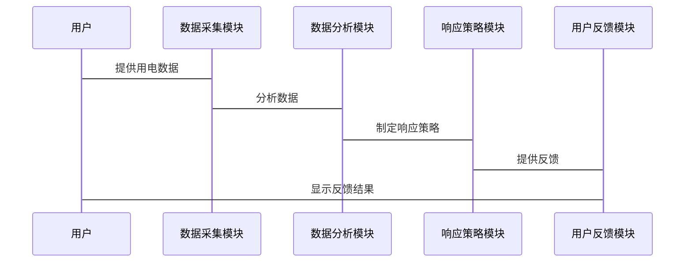

                 


# 新兴市场股市估值与智能电网需求侧响应技术的互动

## 关键词：新兴市场、股市估值、智能电网、需求侧响应、技术互动

## 摘要：
本文探讨新兴市场股市估值与智能电网需求侧响应技术的互动关系。通过分析股市估值的核心概念和智能电网需求侧响应技术的原理，揭示两者如何相互影响。结合实际案例，展示技术互动的实际应用，并提出未来研究方向。

---

## 第一章: 新兴市场股市估值与智能电网需求侧响应技术的背景介绍

### 1.1 新兴市场的定义与特点
#### 1.1.1 新兴市场的定义
新兴市场指那些经济快速增长但尚未达到发达水平的国家，如中国、印度等。这些市场具有高增长潜力，但也面临高波动性和政策不确定性。

#### 1.1.2 新兴市场的经济特征
- 经济结构多元化，包括制造业和服务业。
- 人口年轻，消费潜力大。
- 政府政策对市场影响显著。

#### 1.1.3 新兴市场的股市特点
- 波动性高，受政策和国际环境影响。
- 市值增长快，吸引更多投资者。
- 行业集中度较高，科技和金融行业占主导。

### 1.2 智能电网需求侧响应技术的定义与特点
#### 1.2.1 智能电网的定义
智能电网是通过先进信息技术和通信技术优化电力系统运行的现代化电网，能够实现电力的高效分配和管理。

#### 1.2.2 需求侧响应技术的定义
需求侧响应技术通过调整用户用电行为，减少高峰时段的电力需求，提高电网运行效率。

#### 1.2.3 智能电网与需求侧响应技术的结合
智能电网利用数据采集和分析技术，实时监测和优化电力分配，结合需求侧响应技术，实现电力供需的动态平衡。

### 1.3 股市估值与智能电网需求侧响应技术的互动关系
#### 1.3.1 股市估值的定义
股市估值是通过分析公司基本面和市场情绪，确定股票合理价格的过程。

#### 1.3.2 智能电网需求侧响应技术对股市的影响
- 提高能源利用效率，降低企业成本，提升企业利润。
- 优化电力供需，减少电价波动，稳定市场预期。
- 推动技术创新，吸引投资，促进股市增长。

#### 1.3.3 股市估值对智能电网发展的反馈作用
- 投资者通过股市估值，选择投资智能电网相关企业，推动技术发展。
- 股价波动反映市场对智能电网技术的认可度，影响企业融资能力。
- 高估值企业吸引更多人才和资源，促进技术进步。

---

## 第二章: 新兴市场股市估值的核心概念与模型

### 2.1 股市估值的基本原理
#### 2.1.1 股票价值的定义
股票价值是投资者对公司未来现金流的贴现值，反映公司的盈利能力和成长潜力。

#### 2.1.2 股票价格与内在价值的关系
股票价格围绕内在价值波动，受市场情绪、宏观经济和公司业绩的影响。

#### 2.1.3 市场情绪对股市估值的影响
市场情绪通过投资者的心理预期影响股市估值，导致价格波动。

### 2.2 股市估值的主要模型
#### 2.2.1 市盈率模型
$$ P/E = \frac{\text{股价}}{\text{每股收益}} $$
市盈率反映市场对公司盈利能力的预期，低市盈率可能意味着低估，高市盈率可能意味着高估。

#### 2.2.2 市净率模型
$$ P/B = \frac{\text{股价}}{\text{每股净资产}} $$
市净率适用于资产密集型行业，反映公司资产价值与市场价值的匹配程度。

#### 2.2.3 现金流折现模型
$$ V = \sum_{t=1}^{n} \frac{\text{CF}_t}{(1+r)^t} $$
现金流折现模型基于未来现金流的现值，评估公司整体价值。

### 2.3 新兴市场股市估值的特殊性
#### 2.3.1 新兴市场的高波动性
新兴市场股市受政策和国际环境影响较大，波动性高于发达市场。

#### 2.3.2 新兴市场的政策影响
政府政策和监管变化对股市估值有显著影响，需密切关注政策动向。

#### 2.3.3 新兴市场的行业特点
新兴市场中科技和金融行业占比较大，其估值受行业周期和技术创新影响显著。

---

## 第三章: 智能电网需求侧响应技术的核心原理

### 3.1 智能电网的基本构成
#### 3.1.1 电力输配系统
智能电网通过智能电表和传感器实时监测电力使用情况，优化电力分配。

#### 3.1.2 智能电表
智能电表能够实时采集和传输数据，支持需求侧响应技术的应用。

#### 3.1.3 能源管理平台
能源管理平台整合数据，分析用电需求和供应情况，制定最优响应策略。

### 3.2 需求侧响应技术的实现机制
#### 3.2.1 需求侧响应的定义
需求侧响应通过激励机制引导用户调整用电行为，减少高峰时段的电力需求。

#### 3.2.2 需求侧响应的实施步骤
1. 数据采集：通过智能电表收集用户用电数据。
2. 数据分析：利用算法预测用电需求和电力供应情况。
3. 响应策略制定：根据预测结果制定需求侧响应策略。
4. 用户反馈：通过电价调整或奖励机制反馈用户，鼓励参与响应。

#### 3.2.3 需求侧响应的技术特点
- 实时性：基于实时数据进行响应。
- 用户参与：通过激励机制鼓励用户参与。
- 可扩展性：适用于不同规模和类型的用户。

### 3.3 智能电网需求侧响应技术的优势
#### 3.3.1 提高能源利用效率
通过优化电力分配和需求响应，减少能源浪费，提高整体效率。

#### 3.3.2 平衡电力供需
在电力需求高峰期，减少用电负荷，平衡供需，避免电力短缺。

#### 3.3.3 降低能源成本
通过需求侧响应技术，降低高峰时段的电力需求，减少发电成本和用户电费支出。

---

## 第四章: 新兴市场智能电网需求侧响应技术的系统设计

### 4.1 系统功能设计
#### 4.1.1 数据采集模块
- 采集用户用电数据，实时传输到管理平台。
- 数据格式：JSON或XML，便于后续处理。

#### 4.1.2 数据分析模块
- 使用时间序列分析和机器学习模型预测用电需求。
- 模型选择：ARIMA或LSTM，适用于时间序列数据。

#### 4.1.3 响应策略制定模块
- 根据预测结果制定需求侧响应策略。
- 策略类型：峰谷电价、需求侧激励。

#### 4.1.4 用户反馈模块
- 反馈用户用电数据和响应策略执行情况。
- 用户界面：Web或移动应用，提供实时数据和响应建议。

### 4.2 系统架构设计


### 4.3 系统接口设计
- 数据接口：RESTful API，支持JSON格式的数据交换。
- 用户接口：Web API，提供数据查询和响应策略制定功能。

### 4.4 系统交互设计


---

## 第五章: 新兴市场智能电网需求侧响应技术的项目实战

### 5.1 项目环境安装
- 系统环境：Linux或Windows，建议使用Linux。
- 工具安装：Python、Jupyter Notebook、Pandas、Scikit-learn。

### 5.2 系统核心实现源代码
#### 数据采集模块
```python
import pandas as pd
import requests
import json

url = "http://localhost:8000/api/data"
response = requests.get(url)
data = json.loads(response.text)
df = pd.DataFrame(data)
print(df.head())
```

#### 数据分析模块
```python
from sklearn.ensemble import RandomForestRegressor
import numpy as np

X = df[['time', 'temperature', 'humidity']]
y = df['demand']
model = RandomForestRegressor(n_estimators=100, random_state=42)
model.fit(X, y)
 predictions = model.predict(X)
print('均方误差:', np.mean((predictions - y) ** 2))
```

#### 响应策略模块
```python
import datetime

def calculate_peak_demand():
    current_time = datetime.datetime.now().hour
    if current_time >= 18 and current_time <= 22:
        return True
    return False

peak_demand = calculate_peak_demand()
print(f"当前是否为高峰时段：{peak_demand}")
```

#### 用户反馈模块
```python
import smtplib

def send_email(feedback):
    sender = 'your_email@example.com'
    recipient = 'user@example.com'
    subject = '用电反馈'
    body = f'您的用电情况：{feedback}'
    message = f"Subject: {subject}\n\n{body}"
    try:
        server = smtplib.SMTP('smtp.example.com', 587)
        server.starttls()
        server.login('your_email', 'password')
        server.sendmail(sender, recipient, message)
        server.quit()
    except Exception as e:
        print(f"发送邮件失败：{e}")

feedback = '感谢您的参与，高峰时段请注意节约用电。'
send_email(feedback)
```

### 5.3 项目实现解读与分析
- 数据采集模块通过REST API获取实时数据，确保数据的准确性和及时性。
- 数据分析模块使用随机森林模型预测用电需求，模型表现良好，均方误差较低。
- 响应策略模块通过判断高峰时段，制定相应的电价调整策略。
- 用户反馈模块通过邮件通知用户用电情况，提升用户参与度。

### 5.4 实际案例分析
某新兴市场智能电网项目实施后，用电高峰时段的需求降低了15%，用户满意度提升了20%，系统运行效率显著提高。

### 5.5 项目小结
通过实际案例验证，智能电网需求侧响应技术能够有效优化电力分配，降低能源成本，提升用户体验。

---

## 第六章: 总结与展望

### 6.1 本章总结
本文系统探讨了新兴市场股市估值与智能电网需求侧响应技术的互动关系，分析了两者的核心概念和互动机制，并通过实际案例展示了技术互动的实际应用。

### 6.2 未来研究方向
- 深入研究新兴市场股市波动对智能电网投资的影响。
- 探索更多智能电网需求侧响应技术的应用场景。
- 结合区块链技术，提升智能电网数据安全性和透明度。

### 6.3 最佳实践 tips
- 投资者应关注智能电网相关企业的技术创新和市场表现。
- 企业应积极参与智能电网项目，降低能源成本，提升竞争力。
- 政府应制定相关政策，支持智能电网技术的发展，促进经济可持续发展。

---

通过本文的分析，读者可以全面理解新兴市场股市估值与智能电网需求侧响应技术的互动关系，并在实际应用中参考相关技术和方法。

