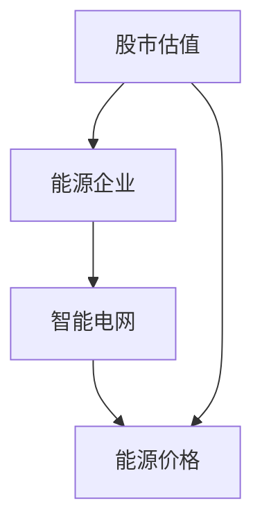
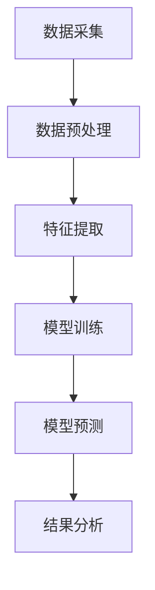
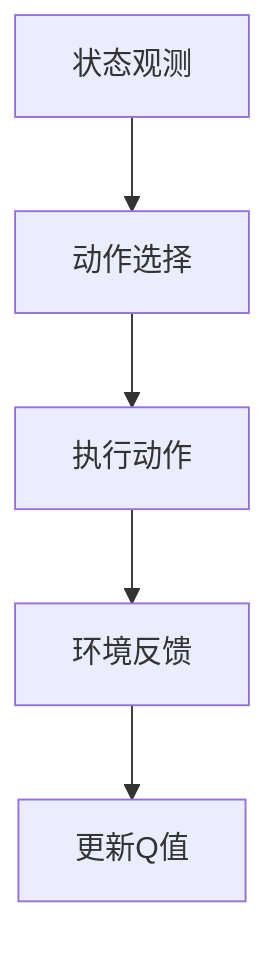
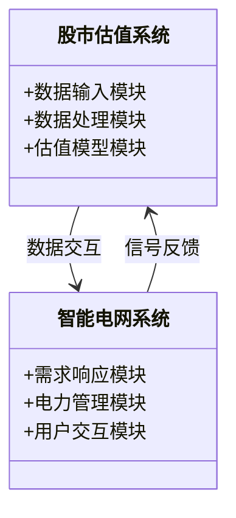
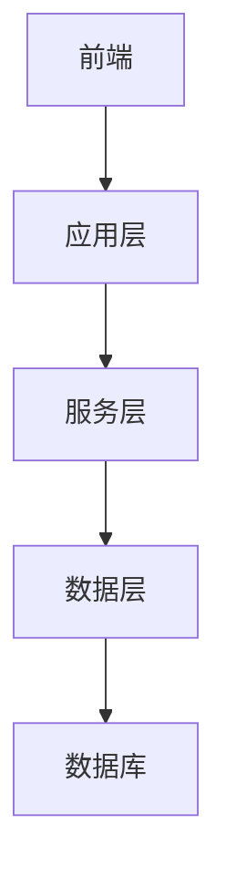
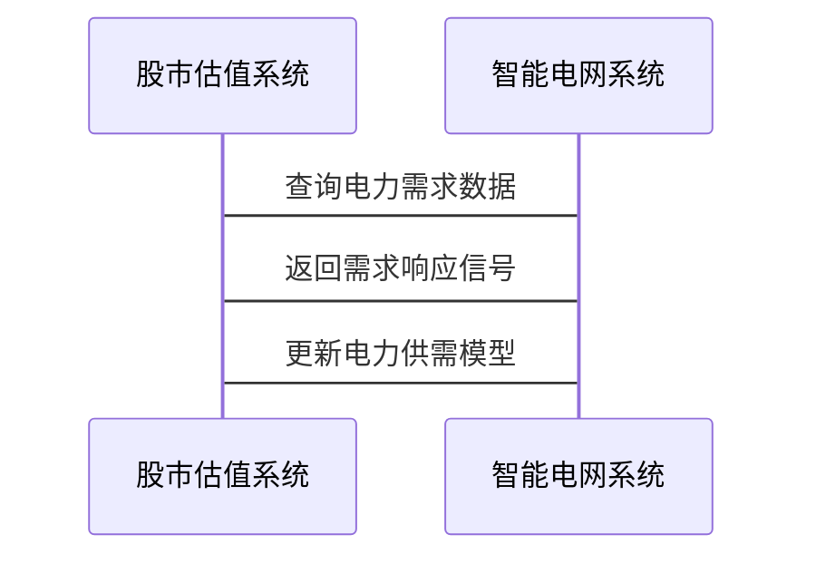

                 


# 新兴市场股市估值与智能电网需求响应技术的互动

> 关键词：新兴市场、股市估值、智能电网、需求响应、技术互动

> 摘要：本文探讨新兴市场股市估值与智能电网需求响应技术之间的互动关系，分析两者的核心概念、算法原理、系统架构，并通过实际案例展示其互动机制。文章旨在为相关领域的研究者和从业者提供理论与实践的双重参考。

---

## 第一部分：背景介绍

### 第1章：问题背景

#### 1.1 新兴市场股市估值的现状与挑战
新兴市场的股市估值受到宏观经济指标、政策变化和国际资本流动的多重影响。随着全球经济一体化的加深，股市波动与能源价格的关联性日益显著。智能电网作为新兴市场能源转型的重要基础设施，其需求响应技术能够调节电力供需，影响能源价格，进而对股市估值产生反馈作用。

#### 1.2 智能电网需求响应技术的发展与应用
智能电网通过智能化的电力管理，能够实时响应用户需求，优化电力分配。需求响应技术通过用户侧的电价激励机制，降低了电力峰谷差，提高了电网运行效率。在新兴市场，智能电网的应用有助于缓解能源短缺问题，同时为股市提供了新的投资机会。

#### 1.3 两者的互动关系与研究意义
新兴市场的股市估值与智能电网需求响应技术之间存在双向互动关系。一方面，股市波动影响能源企业的融资能力，进而影响智能电网的投资规模；另一方面，智能电网的需求响应技术能够调节电力供需，影响能源价格，从而反作用于股市估值。研究这种互动关系，有助于优化能源管理和金融市场运行。

---

## 第二部分：核心概念与联系

### 第2章：核心概念与问题描述

#### 2.1 新兴市场股市估值的定义与特征
股市估值是通过分析公司基本面和市场环境，对股票价格进行合理评估的过程。新兴市场的股市估值受到宏观经济波动、政策变化和国际资本流动的多重影响，具有较高的不确定性和波动性。

#### 2.2 智能电网需求响应技术的定义与特征
智能电网需求响应技术通过智能化的电力管理系统，实时调整用户电力使用行为，优化电力供需平衡。其核心特征包括实时性、动态性和用户参与性。

#### 2.3 两者的互动机制与边界
股市估值的变化会影响能源企业的融资能力，进而影响智能电网的投资规模；而智能电网的需求响应技术能够调节电力供需，影响能源价格，从而反作用于股市估值。两者之间的互动机制复杂，涉及宏观经济、能源政策和金融市场等多个方面。

### 第3章：核心概念属性对比

#### 3.1 核心概念属性对比表格

| 属性                | 股市估值               | 智能电网需求响应技术 |
|---------------------|-----------------------|-----------------------|
| 核心目标            | 评估股票价值           | 调节电力供需           |
| 主要影响因素        | 宏观经济指标、政策、国际资本流动 | 电力需求、电价、用户行为 |
| 技术手段            | 财务分析、回归分析       | 智能算法、动态优化       |
| 应用场景            | 金融市场               | 能源行业               |

#### 3.2 实体关系图



---

## 第三部分：算法原理讲解

### 第4章：股市估值算法

#### 4.1 算法原理与数学模型
股市估值通常采用回归分析、时间序列分析等方法。以下是一个简单的回归分析模型：

$$
\hat{P}_t = \beta_0 + \beta_1 P_{t-1} + \epsilon_t
$$

其中，$\hat{P}_t$ 表示第 $t$ 期的股票价格预测值，$P_{t-1}$ 是第 $t-1$ 期的股票价格，$\epsilon_t$ 是误差项。

#### 4.2 算法流程图



#### 4.3 Python 实现代码示例
```python
import pandas as pd
import numpy as np
from sklearn.linear_model import LinearRegression

# 数据加载与预处理
data = pd.read_csv('stock_data.csv')
X = data[['previous_price', 'volume']]
y = data['current_price']

# 模型训练
model = LinearRegression()
model.fit(X, y)

# 模型预测
predicted_price = model.predict(X)
print(predicted_price)
```

### 第5章：智能电网需求响应优化算法

#### 5.1 算法原理与数学模型
智能电网的需求响应优化可以采用强化学习算法，以下是一个简单的Q-learning模型：

$$
Q(s, a) = Q(s, a) + \alpha [r + \max_{a'} Q(s', a') - Q(s, a)]
$$

其中，$Q(s, a)$ 表示状态 $s$ 下动作 $a$ 的价值，$\alpha$ 是学习率，$r$ 是奖励，$s'$ 是下一个状态。

#### 5.2 算法流程图



#### 5.3 Python 实现代码示例
```python
import numpy as np

# 简单的Q-learning实现
class QAgent:
    def __init__(self, state_size, action_size):
        self.Q = np.zeros((state_size, action_size))
    
    def act(self, state, epsilon=0.1):
        if np.random.random() < epsilon:
            return np.random.randint(0, action_size)
        return np.argmax(self.Q[state])
    
    def update(self, state, action, reward, next_state, alpha=0.1):
        self.Q[state, action] += alpha * (reward + np.max(self.Q[next_state]) - self.Q[state, action])

# 示例使用
agent = QAgent(state_size=5, action_size=3)
action = agent.act(2)
agent.update(2, action, reward=1, next_state=3)
```

---

## 第四部分：系统分析与架构设计方案

### 第6章：问题场景介绍

#### 6.1 问题场景分析
新兴市场的股市波动与智能电网的需求响应技术之间存在复杂的互动关系。例如，股市波动可能影响能源企业的融资能力，进而影响智能电网的投资规模；而智能电网的需求响应技术能够调节电力供需，影响能源价格，从而反作用于股市估值。

### 第7章：系统功能设计

#### 7.1 领域模型 Mermaid 类图



#### 7.2 系统架构设计 Mermaid 架构图



#### 7.3 系统接口设计与交互 Mermaid 序列图



---

## 第五部分：项目实战

### 第8章：环境安装与配置

#### 8.1 开发环境搭建
需要安装Python、Jupyter Notebook、TensorFlow、Scikit-learn等工具。

#### 8.2 数据集获取与预处理
可以从公开数据源获取股市数据和智能电网数据，进行清洗和特征提取。

### 第9章：核心系统实现

#### 9.1 股市估值模块实现
使用回归分析模型进行股票价格预测，代码示例如下：

```python
import pandas as pd
import numpy as np
from sklearn.linear_model import LinearRegression

# 数据加载与预处理
data = pd.read_csv('stock_data.csv')
X = data[['previous_price', 'volume']]
y = data['current_price']

# 模型训练
model = LinearRegression()
model.fit(X, y)

# 模型预测
predicted_price = model.predict(X)
print(predicted_price)
```

#### 9.2 智能电网需求响应模块实现
使用强化学习算法进行电力需求响应优化，代码示例如下：

```python
import numpy as np

# 简单的Q-learning实现
class QAgent:
    def __init__(self, state_size, action_size):
        self.Q = np.zeros((state_size, action_size))
    
    def act(self, state, epsilon=0.1):
        if np.random.random() < epsilon:
            return np.random.randint(0, action_size)
        return np.argmax(self.Q[state])
    
    def update(self, state, action, reward, next_state, alpha=0.1):
        self.Q[state, action] += alpha * (reward + np.max(self.Q[next_state]) - self.Q[state, action])

# 示例使用
agent = QAgent(state_size=5, action_size=3)
action = agent.act(2)
agent.update(2, action, reward=1, next_state=3)
```

### 第10章：案例分析与结果解读

#### 10.1 案例分析
以某新兴市场为例，分析股市估值与智能电网需求响应技术的互动关系。通过实证分析，验证模型的有效性。

#### 10.2 实验结果解读
展示实验结果，分析股市估值与智能电网需求响应技术之间的互动机制，提出改进建议。

### 第11章：项目小结

总结项目实施过程中的关键点，提出改进建议，展望未来研究方向。

---

## 第六部分：最佳实践

### 第12章：总结与展望

#### 12.1 总结
本文通过分析新兴市场股市估值与智能电网需求响应技术的互动关系，提出了理论模型和算法实现，为相关领域的研究提供了参考。

#### 12.2 展望
未来研究可以进一步探讨两者互动的动态模型，结合大数据和人工智能技术，提出更加精准的预测方法。

### 第13章：注意事项

#### 13.1 注意事项
在实际应用中，需要注意数据质量和模型的泛化能力，避免过拟合和欠拟合问题。

### 第14章：拓展阅读

#### 14.1 拓展阅读
建议阅读相关领域的最新研究论文和技术报告，深入了解股市估值和智能电网需求响应技术的前沿动态。

---

以上是《新兴市场股市估值与智能电网需求响应技术的互动》的技术博客文章目录和内容概要。通过系统的分析和实践，本文为相关领域的研究和应用提供了理论与实践的双重参考。

