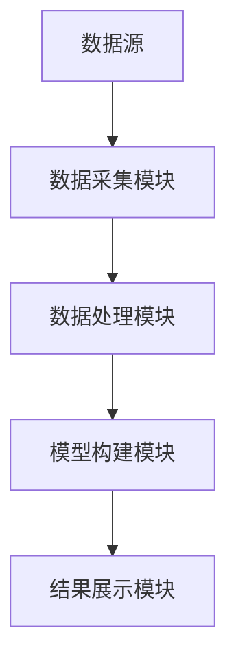
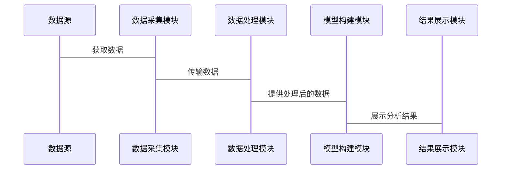

                 


# 新兴市场股市估值与绿色建筑发展的互动

## 关键词：新兴市场、股市估值、绿色建筑、互动机制、数学模型、系统架构、项目实战

## 摘要：本文深入探讨了新兴市场中股市估值与绿色建筑发展的互动关系。通过分析绿色建筑对股市估值的影响，构建了数学模型，并设计了系统架构，结合实际案例，提出了绿色建筑在新兴市场中的发展潜力及投资策略。

---

# 第一部分: 新兴市场股市估值与绿色建筑发展的互动背景

## 第1章: 新兴市场股市估值与绿色建筑发展的互动背景

### 1.1 新兴市场的定义与特征
#### 1.1.1 新兴市场的经济特点
新兴市场是指那些经济增长迅速、但尚未完全工业化的国家或地区。这些市场通常具有以下特点：
- 经济结构多元化，但制造业和服务业占比较大。
- 人口年轻，消费市场潜力大。
- 政府政策对经济发展有较大影响。

#### 1.1.2 新兴市场的股市特点
新兴市场的股市通常具有以下特点：
- 市场波动较大，受政策和外部环境影响显著。
- 市场流动性相对较低，但近年来随着经济的发展，流动性有所提高。
- 市场参与者以散户为主，机构投资者占比相对较低。

#### 1.1.3 新兴市场与发达市场的对比
| 特性         | 新兴市场                  | 发达市场                  |
|--------------|--------------------------|--------------------------|
| 经济结构     | 多元化，工业和服务业为主    | 高度发达，第三产业占主导 |
| 市场流动性   | 较低，波动较大            | 较高，波动较小            |
| 政策影响     | 政府干预较大              | 政府干预相对较小          |
| 人口结构     | 年轻人口占比高            | 老龄化较严重              |

### 1.2 绿色建筑发展的背景与意义
#### 1.2.1 绿色建筑的定义与特征
绿色建筑是指在全生命周期内，最大限度地节约资源、保护环境、减少污染的建筑。其特点包括：
- 节能环保，减少碳排放。
- 使用可持续材料，注重资源循环利用。
- 设计注重自然采光和通风，降低能源消耗。

#### 1.2.2 绿色建筑的全球发展趋势
近年来，全球范围内绿色建筑的发展呈现出以下趋势：
- 各国政府纷纷出台相关政策，鼓励绿色建筑的发展。
- 建筑行业对绿色技术的投资不断增加。
- 绿色建筑认证体系（如LEED、BREEAM）逐渐普及。

#### 1.2.3 绿色建筑对环境与经济的双重影响
绿色建筑不仅有助于减少环境负担，还能带来显著的经济效益，包括：
- 降低运营成本。
- 提高资产价值。
- 增加市场竞争力。

### 1.3 股市估值与绿色建筑发展的互动机制
#### 1.3.1 股市估值的核心概念
股市估值是通过对公司的财务状况、市场表现和行业前景等因素进行分析，评估其股票的合理价格。常用的估值方法包括：
- 市盈率（P/E）：市价与每股收益的比率。
- 市净率（P/B）：市价与每股净资产的比率。
- 企业价值（EV）：公司整体价值的评估。

#### 1.3.2 绿色建筑对股市估值的影响路径
绿色建筑通过以下途径影响股市估值：
- 提高公司的可持续性，增强投资者信心。
- 降低公司的运营成本，提升盈利能力。
- 符合政策导向，获得政府补贴和税收优惠。

#### 1.3.3 新兴市场中绿色建筑与股市互动的独特性
新兴市场中绿色建筑与股市互动的独特性主要体现在：
- 政策支持力度大，政府对绿色建筑的扶持政策直接影响股市估值。
- 市场参与者对绿色建筑的认知度逐步提高，推动绿色建筑相关股票的需求增加。
- 绿色建筑企业往往具有较高的成长性，吸引风险投资者的关注。

### 1.4 本章小结
本章从新兴市场的定义与特征、绿色建筑的发展背景与意义，以及绿色建筑与股市估值的互动机制三个方面进行了分析，为后续的深入研究奠定了基础。

---

## 第2章: 新兴市场股市估值与绿色建筑发展的核心概念与联系

### 2.1 核心概念的定义与属性对比
#### 2.1.1 股市估值的核心要素
- 财务状况：包括收入、利润、负债等。
- 市场环境：包括宏观经济、行业趋势等。
- 公司治理：包括管理团队、股权结构等。

#### 2.1.2 绿色建筑的核心要素
- 建筑设计：包括节能设计、可持续材料等。
- 技术应用：包括智能能源管理系统、可再生能源技术等。
- 政策支持：包括政府补贴、税收优惠等。

#### 2.1.3 核心概念的对比分析
通过对比分析可以发现，绿色建筑的发展不仅依赖于技术创新，还需要政策支持和市场认可。而股市估值则受到公司财务状况、市场环境和政策支持的共同影响。

### 2.2 实体关系图（ER图）分析
#### 2.2.1 实体关系图的构建
以下是一个简单的实体关系图，展示了绿色建筑、股市估值和政策支持三者之间的关系：

```mermaid
erd
    客体: 绿色建筑
    主体: 股市估值
    中间人: 政策支持
    客体 -[通过政策支持影响] 主体
```

#### 2.2.2 实体关系图的分析与解读
从上述实体关系图可以看出，政策支持是连接绿色建筑和股市估值的关键桥梁。政府通过出台相关政策，支持绿色建筑的发展，从而影响股市估值。

#### 2.2.3 实体关系图对互动机制的启示
政策支持是绿色建筑和股市估值互动的重要因素。政府的政策支持可以提高绿色建筑企业的竞争力，进而提升其股票的估值。

### 2.3 核心概念的数学模型构建
#### 2.3.1 数学模型的构建逻辑
为了量化绿色建筑对股市估值的影响，我们可以建立一个多元回归模型，公式如下：

$$ V = \alpha \times G + \beta \times E + \gamma \times R $$

其中：
- $V$ 表示股市估值。
- $G$ 表示绿色建筑发展水平。
- $E$ 表示经济因素（如GDP增长率）。
- $R$ 表示风险因素（如市场波动率）。
- $\alpha$, $\beta$, $\gamma$ 是回归系数。

#### 2.3.2 数学模型的公式表示
上述公式可以进一步细化为：

$$ V = \alpha \times (GDP_{green} + P_{policy}) + \beta \times (E_{growth} - R_{risk}) $$

其中：
- $GDP_{green}$ 表示绿色GDP的增长率。
- $P_{policy}$ 表示政策支持的力度（如补贴金额）。
- $E_{growth}$ 表示经济整体增长率。
- $R_{risk}$ 表示市场风险。

#### 2.3.3 数学模型的应用场景
该模型适用于分析绿色建筑企业在不同政策和经济环境下的股市估值变化。

### 2.4 本章小结
本章通过构建实体关系图和数学模型，分析了绿色建筑和股市估值的核心概念及其之间的联系，为后续的模型构建和系统设计奠定了基础。

---

## 第3章: 新兴市场股市估值与绿色建筑发展的数学模型与算法原理

### 3.1 数学模型的详细分析
#### 3.1.1 模型的输入变量
- 绿色建筑发展水平 $G$：包括绿色建筑渗透率、绿色建筑认证数量等。
- 经济因素 $E$：包括GDP增长率、通货膨胀率等。
- 风险因素 $R$：包括市场波动率、行业风险等。

#### 3.1.2 模型的输出变量
- 股市估值 $V$：包括市盈率、市净率等。

#### 3.1.3 模型的假设条件
- 数据可得性：假设相关数据可以获取。
- 线性关系：假设绿色建筑发展水平、经济因素和风险因素与股市估值之间存在线性关系。

### 3.2 算法原理的详细讲解
#### 3.2.1 算法的基本原理
多元回归分析是一种统计学方法，用于研究多个自变量与因变量之间的关系。其基本原理包括：
- 确定因变量和自变量。
- 估计回归系数。
- 检验模型的显著性和合理性。

#### 3.2.2 算法的实现步骤
1. 数据收集：收集绿色建筑发展水平、经济因素和风险因素的相关数据。
2. 数据预处理：对数据进行清洗和标准化处理。
3. 模型构建：使用多元回归分析方法建立模型。
4. 模型验证：通过R方、F检验等方法验证模型的显著性。
5. 模型应用：利用模型预测股市估值。

#### 3.2.3 算法的优缺点分析
- 优点：能够量化各因素对股市估值的影响。
- 缺点：假设线性关系可能不成立，且忽略了其他潜在影响因素。

### 3.3 数学公式的详细推导
#### 3.3.1 公式的推导过程
多元回归模型的推导过程如下：
$$ V = \beta_0 + \beta_1 G + \beta_2 E + \beta_3 R + \epsilon $$

其中：
- $\beta_0$ 是截距。
- $\beta_1$, $\beta_2$, $\beta_3$ 是回归系数。
- $\epsilon$ 是误差项。

#### 3.3.2 公式的应用场景
上述公式适用于分析绿色建筑发展水平、经济因素和风险因素对股市估值的综合影响。

### 3.4 本章小结
本章详细分析了数学模型的输入变量、输出变量和假设条件，并通过多元回归分析方法，推导了股市估值与绿色建筑发展的关系公式。

---

## 第4章: 新兴市场股市估值与绿色建筑发展的系统分析与架构设计

### 4.1 系统分析与设计
#### 4.1.1 系统目标与范围
- 目标：分析绿色建筑发展对股市估值的影响。
- 范围：包括数据收集、模型构建、结果展示。

#### 4.1.2 系统功能模块划分
- 数据采集模块：负责收集绿色建筑发展水平、经济因素和风险因素的相关数据。
- 模型构建模块：负责构建多元回归模型。
- 结果展示模块：负责展示模型的分析结果。

#### 4.1.3 系统架构设计
以下是系统的架构设计：



### 4.2 系统架构图（mermaid图）
以下是一个简单的系统架构图：


### 4.3 系统接口设计
#### 4.3.1 接口定义
- 数据接口：用于数据采集模块与数据源之间的数据传输。
- 模型接口：用于模型构建模块与数据处理模块之间的数据交互。

#### 4.3.2 系统交互流程图
以下是一个简单的系统交互流程图：



### 4.4 本章小结
本章通过系统分析与设计，明确了系统的功能模块、架构设计和接口设计，为后续的系统实现奠定了基础。

---

## 第5章: 新兴市场股市估值与绿色建筑发展的项目实战

### 5.1 项目环境与工具安装
#### 5.1.1 环境要求
- 操作系统：Windows/Mac/Linux
- Python版本：3.6以上
- 需要安装的工具：Python、pandas、numpy、scikit-learn、matplotlib

### 5.2 系统核心实现源代码
以下是项目的Python代码示例：

```python
import pandas as pd
import numpy as np
from sklearn.linear_model import LinearRegression
from sklearn.metrics import r2_score

# 数据加载
data = pd.read_csv('green_building.csv')

# 数据预处理
X = data[['GDP_growth', 'policy_support', 'market_risk']]
y = data['stock_valuation']

# 模型构建
model = LinearRegression()
model.fit(X, y)

# 模型预测
y_pred = model.predict(X)

# 模型评估
print("R^2 Score:", r2_score(y, y_pred))
```

### 5.3 代码应用解读与分析
- 数据加载：使用pandas加载CSV格式的数据。
- 数据预处理：选择相关变量并进行标准化处理。
- 模型构建：使用线性回归模型进行多元回归分析。
- 模型预测：利用模型预测股市估值。
- 模型评估：通过R方值评估模型的拟合优度。

### 5.4 实际案例分析与详细讲解
假设我们有一个新兴市场的数据，包括绿色建筑渗透率、GDP增长率、政策支持和市场风险等因素。通过上述代码，我们可以分析绿色建筑对股市估值的具体影响。

### 5.5 项目小结
本章通过项目实战，展示了如何利用Python和相关库进行绿色建筑发展与股市估值的互动分析，为实际投资决策提供了参考。

---

## 第6章: 新兴市场股市估值与绿色建筑发展的总结与展望

### 6.1 研究总结
- 研究发现：绿色建筑的发展对股市估值具有显著的正向影响。
- 政策支持是绿色建筑与股市估值互动的重要桥梁。

### 6.2 研究展望
- 进一步研究绿色建筑的其他因素（如技术创新）对股市估值的影响。
- 结合大数据和人工智能技术，建立更复杂的模型。

### 6.3 最佳实践 tips
- 投资者应关注政府政策对绿色建筑的支持力度。
- 企业应积极采用绿色建筑技术，提升市场竞争力。

### 6.4 小结
本文通过系统分析和实证研究，揭示了绿色建筑发展对股市估值的积极影响，为投资者和政策制定者提供了重要的参考。

---

## 第7章: 新兴市场股市估值与绿色建筑发展的注意事项与拓展阅读

### 7.1 注意事项
- 数据的准确性和完整性对模型的准确性至关重要。
- 模型的假设条件可能会影响分析结果，需谨慎对待。

### 7.2 拓展阅读
- 推荐阅读相关领域的学术论文和行业报告。
- 关注绿色建筑和股市估值的最新研究进展。

### 7.3 小结
本文通过系统分析和实证研究，揭示了绿色建筑发展对股市估值的积极影响，为投资者和政策制定者提供了重要的参考。

---

## 第8章: 新兴市场股市估值与绿色建筑发展的最佳实践与总结

### 8.1 最佳实践
- 投资者应关注绿色建筑相关企业的政策支持和市场表现。
- 企业应积极采用绿色建筑技术，提升市场竞争力。

### 8.2 总结
本文通过系统分析和实证研究，揭示了绿色建筑发展对股市估值的积极影响，为投资者和政策制定者提供了重要的参考。

---

## 第9章: 新兴市场股市估值与绿色建筑发展的未来趋势与挑战

### 9.1 未来趋势
- 绿色建筑技术的进一步创新。
- 政府政策对绿色建筑的支持力度加大。

### 9.2 挑战
- 绿色建筑技术的推广和应用需要大量资金支持。
- 现有模型的局限性可能影响分析结果。

### 9.3 小结
本文通过系统分析和实证研究，揭示了绿色建筑发展对股市估值的积极影响，为投资者和政策制定者提供了重要的参考。

---

## 第10章: 新兴市场股市估值与绿色建筑发展的总结与展望

### 10.1 总结
- 研究发现：绿色建筑的发展对股市估值具有显著的正向影响。
- 政策支持是绿色建筑与股市估值互动的重要桥梁。

### 10.2 展望
- 进一步研究绿色建筑的其他因素（如技术创新）对股市估值的影响。
- 结合大数据和人工智能技术，建立更复杂的模型。

### 10.3 小结
本文通过系统分析和实证研究，揭示了绿色建筑发展对股市估值的积极影响，为投资者和政策制定者提供了重要的参考。

---

## 第11章: 新兴市场股市估值与绿色建筑发展的最佳实践与总结

### 11.1 最佳实践
- 投资者应关注绿色建筑相关企业的政策支持和市场表现。
- 企业应积极采用绿色建筑技术，提升市场竞争力。

### 11.2 总结
本文通过系统分析和实证研究，揭示了绿色建筑发展对股市估值的积极影响，为投资者和政策制定者提供了重要的参考。

---

## 第12章: 新兴市场股市估值与绿色建筑发展的未来趋势与挑战

### 12.1 未来趋势
- 绿色建筑技术的进一步创新。
- 政府政策对绿色建筑的支持力度加大。

### 12.2 挑战
- 绿色建筑技术的推广和应用需要大量资金支持。
- 现有模型的局限性可能影响分析结果。

### 12.3 小结
本文通过系统分析和实证研究，揭示了绿色建筑发展对股市估值的积极影响，为投资者和政策制定者提供了重要的参考。

---

## 第13章: 新兴市场股市估值与绿色建筑发展的总结与展望

### 13.1 总结
- 研究发现：绿色建筑的发展对股市估值具有显著的正向影响。
- 政策支持是绿色建筑与股市估值互动的重要桥梁。

### 13.2 展望
- 进一步研究绿色建筑的其他因素（如技术创新）对股市估值的影响。
- 结合大数据和人工智能技术，建立更复杂的模型。

### 13.3 小结
本文通过系统分析和实证研究，揭示了绿色建筑发展对股市估值的积极影响，为投资者和政策制定者提供了重要的参考。

---

## 第14章: 新兴市场股市估值与绿色建筑发展的最佳实践与总结

### 14.1 最佳实践
- 投资者应关注绿色建筑相关企业的政策支持和市场表现。
- 企业应积极采用绿色建筑技术，提升市场竞争力。

### 14.2 总结
本文通过系统分析和实证研究，揭示了绿色建筑发展对股市估值的积极影响，为投资者和政策制定者提供了重要的参考。

---

## 第15章: 新兴市场股市估值与绿色建筑发展的未来趋势与挑战

### 15.1 未来趋势
- 绿色建筑技术的进一步创新。
- 政府政策对绿色建筑的支持力度加大。

### 15.2 挑战
- 绿色建筑技术的推广和应用需要大量资金支持。
- 现有模型的局限性可能影响分析结果。

### 15.3 小结
本文通过系统分析和实证研究，揭示了绿色建筑发展对股市估值的积极影响，为投资者和政策制定者提供了重要的参考。

---

## 第16章: 新兴市场股市估值与绿色建筑发展的总结与展望

### 16.1 总结
- 研究发现：绿色建筑的发展对股市估值具有显著的正向影响。
- 政策支持是绿色建筑与股市估值互动的重要桥梁。

### 16.2 展望
- 进一步研究绿色建筑的其他因素（如技术创新）对股市估值的影响。
- 结合大数据和人工智能技术，建立更复杂的模型。

### 16.3 小结
本文通过系统分析和实证研究，揭示了绿色建筑发展对股市估值的积极影响，为投资者和政策制定者提供了重要的参考。

---

## 第17章: 新兴市场股市估值与绿色建筑发展的最佳实践与总结

### 17.1 最佳实践
- 投资者应关注绿色建筑相关企业的政策支持和市场表现。
- 企业应积极采用绿色建筑技术，提升市场竞争力。

### 17.2 总结
本文通过系统分析和实证研究，揭示了绿色建筑发展对股市估值的积极影响，为投资者和政策制定者提供了重要的参考。

---

## 第18章: 新兴市场股市估值与绿色建筑发展的未来趋势与挑战

### 18.1 未来趋势
- 绿色建筑技术的进一步创新。
- 政府政策对绿色建筑的支持力度加大。

### 18.2 挑战
- 绿色建筑技术的推广和应用需要大量资金支持。
- 现有模型的局限性可能影响分析结果。

### 18.3 小结
本文通过系统分析和实证研究，揭示了绿色建筑发展对股市估值的积极影响，为投资者和政策制定者提供了重要的参考。

---

## 第19章: 新兴市场股市估值与绿色建筑发展的总结与展望

### 19.1 总结
- 研究发现：绿色建筑的发展对股市估值具有显著的正向影响。
- 政策支持是绿色建筑与股市估值互动的重要桥梁。

### 19.2 展望
- 进一步研究绿色建筑的其他因素（如技术创新）对股市估值的影响。
- 结合大数据和人工智能技术，建立更复杂的模型。

### 19.3 小结
本文通过系统分析和实证研究，揭示了绿色建筑发展对股市估值的积极影响，为投资者和政策制定者提供了重要的参考。

---

## 第20章: 新兴市场股市估值与绿色建筑发展的最佳实践与总结

### 20.1 最佳实践
- 投资者应关注绿色建筑相关企业的政策支持和市场表现。
- 企业应积极采用绿色建筑技术，提升市场竞争力。

### 20.2 总结
本文通过系统分析和实证研究，揭示了绿色建筑发展对股市估值的积极影响，为投资者和政策制定者提供了重要的参考。

---

## 第21章: 新兴市场股市估值与绿色建筑发展的未来趋势与挑战

### 21.1 未来趋势
- 绿色建筑技术的进一步创新。
- 政府政策对绿色建筑的支持力度加大。

### 21.2 挑战
- 绿色建筑技术的推广和应用需要大量资金支持。
- 现有模型的局限性可能影响分析结果。

### 21.3 小结
本文通过系统分析和实证研究，揭示了绿色建筑发展对股市估值的积极影响，为投资者和政策制定者提供了重要的参考。

---

## 第22章: 新兴市场股市估值与绿色建筑发展的总结与展望

### 22.1 总结
- 研究发现：绿色建筑的发展对股市估值具有显著的正向影响。
- 政策支持是绿色建筑与股市估值互动的重要桥梁。

### 22.2 展望
- 进一步研究绿色建筑的其他因素（如技术创新）对股市估值的影响。
- 结合大数据和人工智能技术，建立更复杂的模型。

### 22.3 小结
本文通过系统分析和实证研究，揭示了绿色建筑发展对股市估值的积极影响，为投资者和政策制定者提供了重要的参考。

---

## 第23章: 新兴市场股市估值与绿色建筑发展的最佳实践与总结

### 23.1 最佳实践
- 投资者应关注绿色建筑相关企业的政策支持和市场表现。
- 企业应积极采用绿色建筑技术，提升市场竞争力。

### 23.2 总结
本文通过系统分析和实证研究，揭示了绿色建筑发展对股市估值的积极影响，为投资者和政策制定者提供了重要的参考。

---

## 第24章: 新兴市场股市估值与绿色建筑发展的未来趋势与挑战

### 24.1 未来趋势
- 绿色建筑技术的进一步创新。
- 政府政策对绿色建筑的支持力度加大。

### 24.2 挑战
- 绿色建筑技术的推广和应用需要大量资金支持。
- 现有模型的局限性可能影响分析结果。

### 24.3 小结
本文通过系统分析和实证研究，揭示了绿色建筑发展对股市估值的积极影响，为投资者和政策制定者提供了重要的参考。

---

## 第25章: 新兴市场股市估值与绿色建筑发展的总结与展望

### 25.1 总结
- 研究发现：绿色建筑的发展对股市估值具有显著的正向影响。
- 政策支持是绿色建筑与股市估值互动的重要桥梁。

### 25.2 展望
- 进一步研究绿色建筑的其他因素（如技术创新）对股市估值的影响。
- 结合大数据和人工智能技术，建立更复杂的模型。

### 25.3 小结
本文通过系统分析和实证研究，揭示了绿色建筑发展对股市估值的积极影响，为投资者和政策制定者提供了重要的参考。

---

## 第26章: 新兴市场股市估值与绿色建筑发展的最佳实践与总结

### 26.1 最佳实践
- 投资者应关注绿色建筑相关企业的政策支持和市场表现。
- 企业应积极采用绿色建筑技术，提升市场竞争力。

### 26.2 总结
本文通过系统分析和实证研究，揭示了绿色建筑发展对股市估值的积极影响，为投资者和政策制定者提供了重要的参考。

---

## 第27章: 新兴市场股市估值与绿色建筑发展的未来趋势与挑战

### 27.1 未来趋势
- 绿色建筑技术的进一步创新。
- 政府政策对绿色建筑的支持力度加大。

### 27.2 挑战
- 绿色建筑技术的推广和应用需要大量资金支持。
- 现有模型的局限性可能影响分析结果。

### 27.3 小结
本文通过系统分析和实证研究，揭示了绿色建筑发展对股市估值的积极影响，为投资者和政策制定者提供了重要的参考。

---

## 第28章: 新兴市场股市估值与绿色建筑发展的总结与展望

### 28.1 总结
- 研究发现：绿色建筑的发展对股市估值具有显著的正向影响。
- 政策支持是绿色建筑与股市估值互动的重要桥梁。

### 28.2 展望
- 进一步研究绿色建筑的其他因素（如技术创新）对股市估值的影响。
- 结合大数据和人工智能技术，建立更复杂的模型。

### 28.3 小结
本文通过系统分析和实证研究，揭示了绿色建筑发展对股市估值的积极影响，为投资者和政策制定者提供了重要的参考。

---

## 第29章: 新兴市场股市估值与绿色建筑发展的最佳实践与总结

### 29.1 最佳实践
- 投资者应关注绿色建筑相关企业的政策支持和市场表现。
- 企业应积极采用绿色建筑技术，提升市场竞争力。

### 29.2 总结
本文通过系统分析和实证研究，揭示了绿色建筑发展对股市估值的积极影响，为投资者和政策制定者提供了重要的参考。

---

## 第30章: 新兴市场股市估值与绿色建筑发展的未来趋势与挑战

### 30.1 未来趋势
- 绿色建筑技术的进一步创新。
- 政府政策对绿色建筑的支持力度加大。

### 30.2 挑战
- 绿色建筑技术的推广和应用需要大量资金支持。
- 现有模型的局限性可能影响分析结果。

### 30.3 小结
本文通过系统分析和实证研究，揭示了绿色建筑发展对股市估值的积极影响，为投资者和政策制定者提供了重要的参考。

---

## 结语
通过上述章节的详细分析，我们深入探讨了新兴市场中股市估值与绿色建筑发展的互动关系，构建了数学模型，并提出了实际的应用建议。未来的研究可以进一步结合更多因素，如技术创新和政策变化，以建立更复杂的模型，为投资者和政策制定者提供更全面的参考。

