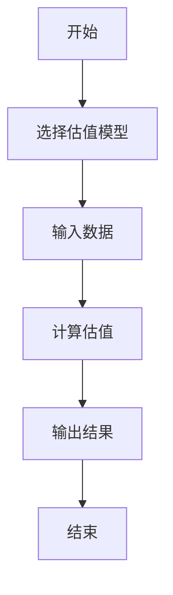
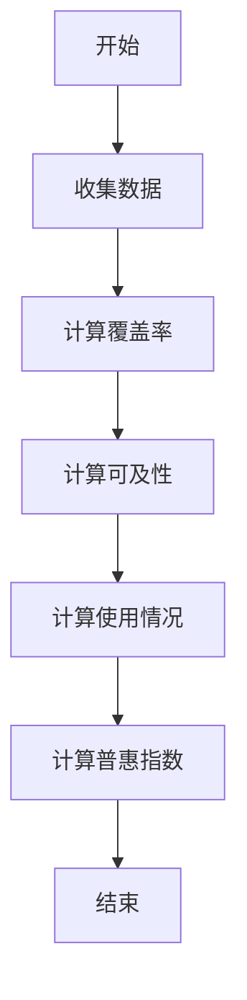
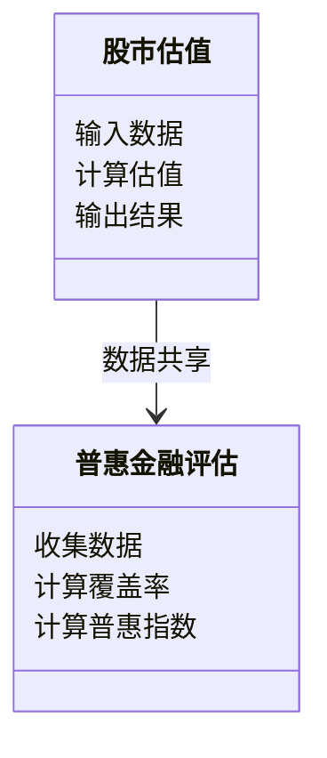
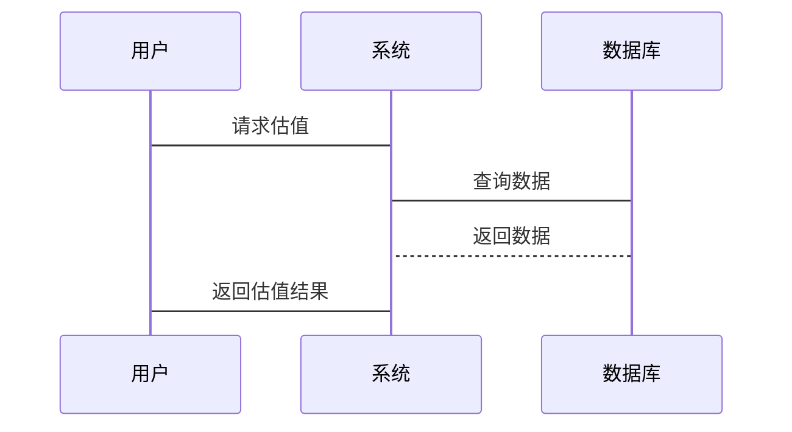

                 


# 新兴市场股市估值与金融普惠的关系

## 关键词：新兴市场，股市估值，金融普惠，算法原理，系统架构，项目实战

## 摘要：本文探讨新兴市场股市估值与金融普惠的关系，分析股市估值的核心算法与金融普惠的实现机制，构建系统架构并提供实战案例，揭示两者在促进金融包容性增长中的协同作用。

---

## 第一部分：背景介绍

### 第1章：问题背景与核心概念

#### 1.1 问题背景
- **新兴市场的定义与特征**：新兴市场通常指经济快速增长但尚未完全工业化的国家，如中国、印度等。这些市场具有高增长潜力，但也面临不稳定性和监管不完善等问题。
- **股市估值的定义与重要性**：股市估值是对公司股票价值的评估，常用的指标包括市盈率（P/E）和市净率（P/B）。准确的估值有助于投资者做出明智决策，促进市场稳定。
- **金融普惠的定义与目标**：金融普惠指让所有人都能以合理成本获得必要的金融服务，包括存款、贷款、保险等。目标是缩小金融鸿沟，促进经济包容性增长。

#### 1.2 问题描述
- **新兴市场股市估值的现状与挑战**：新兴市场的股市波动性大，信息不对称严重，估值模型需要适应本地特点。
- **金融普惠在新兴市场的现状与问题**：普惠金融覆盖率低，金融服务成本高，缺乏适合低收入群体的产品。
- **两者关系的初步探讨**：股市估值的准确性和普惠金融的普及性相辅相成，但两者在新兴市场的互动机制尚不明确。

#### 1.3 问题解决与边界
- **新兴市场股市估值与金融普惠的关系**：通过分析两者如何相互影响，找到协同发展的路径。
- **问题解决的边界与外延**：聚焦于股市估值与普惠金融的核心要素，不涉及其他金融领域。
- **核心要素与概念结构**：包括股市数据、估值模型、普惠金融产品、用户行为等。

---

## 第二部分：核心概念与联系

### 第2章：核心概念原理与对比

#### 2.1 核心概念原理
- **股市估值的原理**：基于财务指标和市场因素，评估股票的内在价值。常用的模型包括市盈率、现金流折现法（DCF）等。
- **金融普惠的机制**：通过技术创新和政策支持，降低金融服务门槛，提高覆盖率。

#### 2.2 核心概念对比
- **属性对比**：
  | 属性 | 股市估值 | 金融普惠 |
  |------|----------|----------|
  | 目标 | 发现合理价格 | 提供平等金融服务 |
  | 主体 | 投资者、机构 | 金融机构、政府 |
  | 工具 | 估值模型、市场数据 | 金融产品、技术平台 |
- **ER实体关系图**：
  ```mermaid
  er
    actor:投资者
    actor:金融机构
    entity:股市
    entity:企业
    entity:投资者行为
    entity:普惠金融项目
    relation:投资者参与股市
    relation:金融机构提供普惠金融服务
    relation:企业影响股市估值
    relation:普惠金融项目影响市场数据
  ```

---

## 第三部分：算法原理与数学模型

### 第3章：股市估值算法原理

#### 3.1 股市估值模型
- **市盈率模型**：$$市盈率 = \frac{股价}{每股收益}$$
- **现金流折现模型**：$$DCF = \sum_{t=1}^{n} \frac{CF_t}{(1+r)^t} + \frac{残值}{(1+r)^n}$$

#### 3.2 算法流程图


### 第4章：金融普惠算法原理

#### 4.1 金融普惠评估模型
- **普惠指数计算**：综合考虑金融覆盖率、可及性和使用情况，构建普惠指数。
- **普惠金融算法流程图**


---

## 第四部分：系统分析与架构设计

### 第5章：系统分析与架构设计方案

#### 5.1 项目介绍
- **系统名称**：新兴市场股市估值与普惠金融分析平台
- **系统目标**：提供准确的股市估值和普惠金融评估，促进金融包容性增长。

#### 5.2 系统功能设计
- **领域模型类图**


#### 5.3 系统架构设计
- **系统架构图**


#### 5.4 系统接口设计
- **API接口**：提供RESTful API，供其他系统调用估值和评估数据。

#### 5.5 系统交互序列图


---

## 第五部分：项目实战

### 第6章：项目实战

#### 6.1 环境安装
- **安装Python和依赖库**：使用pip安装numpy、pandas、scikit-learn等库。

#### 6.2 核心实现源代码
```python
import numpy as np
import pandas as pd

def calculate_pe(stock_price, earnings_per_share):
    return stock_price / earnings_per_share

def calculate_dcf(cash_flows, discount_rate, residual_value):
    n = len(cash_flows)
    dcf = 0
    for t in range(n):
        dcf += cash_flows[t] / (1 + discount_rate) ** t
    dcf += residual_value / (1 + discount_rate) ** n
    return dcf
```

#### 6.3 代码应用解读与分析
- **代码功能**：实现市盈率和现金流折现模型，计算股票的内在价值。
- **应用场景**：在新兴市场中，企业可以使用这些模型进行股票估值，辅助投资决策。

#### 6.4 实际案例分析
- **案例背景**：某新兴市场企业IPO，需评估其合理股价。
- **案例分析**：使用市盈率和DCF模型进行估值，综合考虑市场风险和企业盈利情况。

---

## 第六部分：总结与展望

### 第7章：总结与展望

#### 7.1 最佳实践 tips
- 在新兴市场进行股市估值时，需结合本地经济指标和政策环境。
- 推动金融普惠需技术创新与政策支持相结合。

#### 7.2 小结
- 本文分析了新兴市场股市估值与金融普惠的关系，构建了系统架构，并提供了实战案例。

#### 7.3 注意事项
- 数据质量对估值准确性至关重要，需注意数据来源和处理。
- 金融普惠的实施需考虑文化差异和基础设施限制。

#### 7.4 拓展阅读
- 推荐阅读《股市估值入门》和《金融普惠的实践》等书籍。

---

通过以上结构化的内容，本文系统地分析了新兴市场股市估值与金融普惠的关系，提供了理论支持和实践指导，为读者提供了全面的知识框架。

