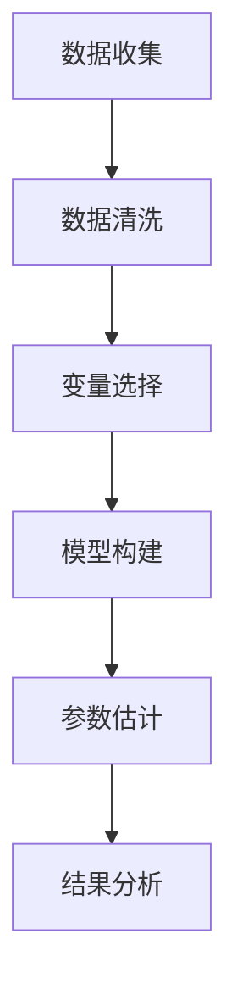
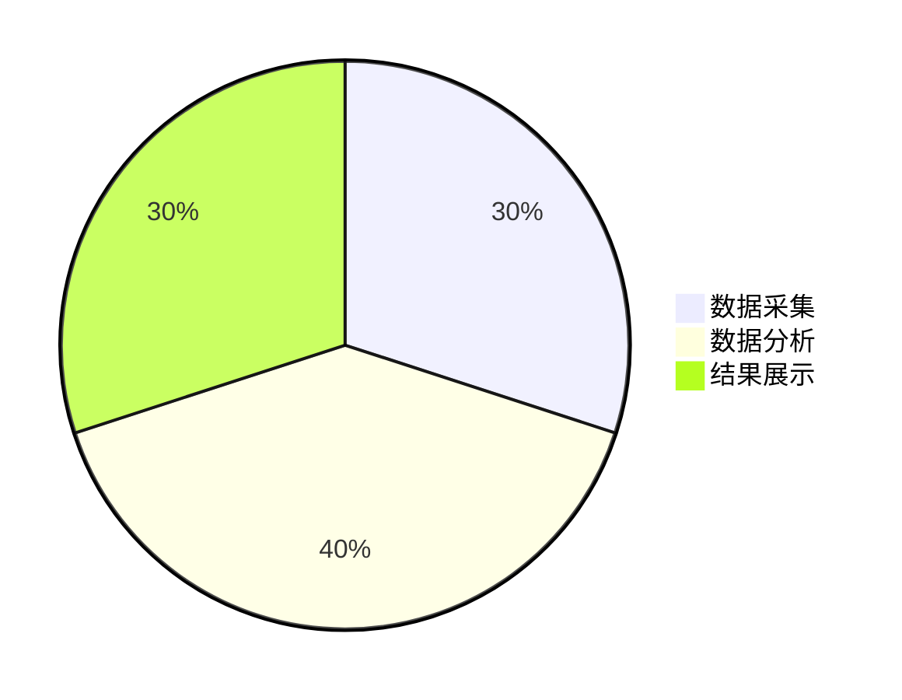
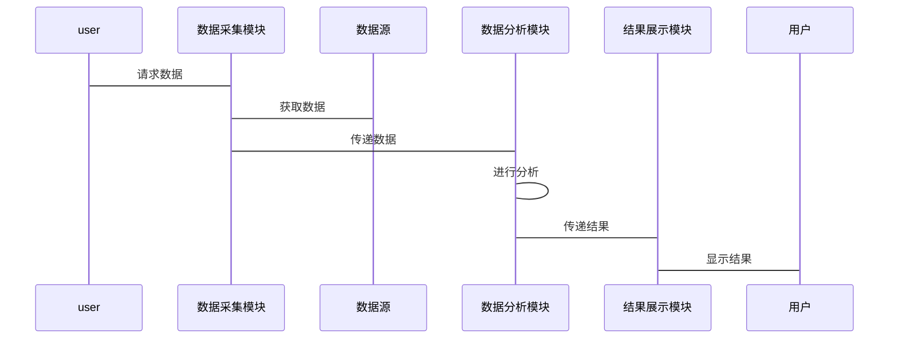

                 


# 《新兴市场股市估值与高等教育发展的互动》

## 关键词：新兴市场，股市估值，高等教育，互动，统计分析，计量经济模型

## 摘要：  
本文探讨新兴市场中股市估值与高等教育发展的互动关系。通过分析股市估值的指标和高等教育的经济影响，构建理论框架，运用统计分析和计量经济模型进行实证研究，揭示两者之间的相互作用机制，并提出政策建议。

---

# 第1章: 背景介绍

## 1.1 问题背景
### 1.1.1 新兴市场股市估值的重要性
新兴市场的股市估值是衡量经济健康的重要指标，反映了市场对未来的预期。股市估值的波动往往与国家政策、全球经济环境密切相关。

### 1.1.2 高等教育发展的必要性
高等教育是知识经济的核心驱动力，通过培养高素质人才，推动技术创新和产业升级。在新兴市场中，高等教育的普及和发展对经济的长期增长至关重要。

### 1.1.3 两者互动的现实意义
股市估值的高低影响企业的融资能力，而高等教育的发展则影响企业的技术创新能力。两者在新兴市场中相互作用，共同影响经济的可持续发展。

## 1.2 问题描述
### 1.2.1 股市估值与高等教育的关系
股市估值不仅是企业价值的体现，也反映了社会整体的教育水平和创新能力。高等教育的发展能够提升企业的技术实力，从而影响股市估值。

### 1.2.2 新兴市场中的特殊性
新兴市场通常具有较高的增长潜力，但也面临更多的不确定性和波动性。股市估值的波动性和高等教育的发展速度在这些市场中具有特殊性。

### 1.2.3 互动机制的复杂性
股市估值与高等教育之间的互动机制涉及多个变量，包括政府政策、企业投资、技术创新等。这些因素共同作用，使得互动机制较为复杂。

## 1.3 问题解决
### 1.3.1 理论框架的构建
构建一个包含股市估值和高等教育的理论模型，分析两者之间的相互作用关系。

### 1.3.2 数据分析方法的选择
选择合适的统计分析和计量经济模型，用于实证研究。

### 1.3.3 案例研究的设计
选取具有代表性的新兴市场国家，进行案例分析，验证理论模型的合理性。

## 1.4 边界与外延
### 1.4.1 研究范围的界定
明确研究的范围，包括新兴市场的定义、研究的时间跨度等。

### 1.4.2 相关概念的区分
区分股市估值和高等教育的其他相关概念，避免混淆。

### 1.4.3 研究的局限性
讨论研究的局限性，例如数据的可获得性、模型的简化假设等。

## 1.5 概念结构与核心要素
### 1.5.1 核心概念的组成
股市估值的核心概念包括市盈率、市净率等，高等教育的核心概念包括教育支出、毕业率等。

### 1.5.2 要素之间的关系
股市估值和高等教育之间的关系可以通过多种方式体现，例如高等教育的发展能够提高企业的创新能力，从而影响股市估值。

### 1.5.3 模型的初步构建
初步构建一个理论模型，展示股市估值和高等教育之间的相互作用关系。

---

# 第2章: 核心概念与联系

## 2.1 核心概念原理
### 2.1.1 股市估值的基本原理
股市估值是通过对企业的财务指标进行分析，评估其市场价值。常用的指标包括市盈率（P/E）、市净率（P/B）等。

### 2.1.2 高等教育的经济影响
高等教育通过培养高素质人才，促进技术创新和产业升级，从而推动经济增长。

### 2.1.3 互动机制的理论基础
股市估值和高等教育之间的互动可以通过技术创新、企业竞争力等中介因素来实现。

## 2.2 概念属性特征对比
### 2.2.1 股市估值的属性
- 市盈率
- 市净率
- 涨跌幅

### 2.2.2 高等教育的属性
- 教育支出
- 毕业生人数
- 就业率

### 2.2.3 属性对比分析
通过对比分析，揭示股市估值和高等教育在不同维度上的异同点。

## 2.3 ER实体关系图
```mermaid
er
    entity 股市估值 {
        key 股票代码
        attribute 市盈率, 市净率, 涨跌幅
    }
    entity 高等教育 {
        key 学校代码
        attribute 教育支出, 毕业生人数, 就业率
    }
    relationship 互动机制 {
        股市估值 -->> 高等教育: 影响
        高等教育 -->> 股市估值: 反向影响
    }
```

---

# 第3章: 算法原理讲解

## 3.1 统计分析方法
### 3.1.1 数据收集与预处理
- 数据来源：选取新兴市场的股市数据和高等教育数据。
- 数据清洗：处理缺失值、异常值等。

### 3.1.2 描述性统计分析
- 计算均值、方差等统计指标，描述数据分布情况。

### 3.1.3 相关性分析
- 计算股市估值和高等教育指标之间的相关系数。

## 3.2 计量经济模型
### 3.2.1 多元回归模型
$$ Y = \beta_0 + \beta_1 X_1 + \beta_2 X_2 + \epsilon $$
其中，$Y$ 是股市估值，$X_1$ 和 $X_2$ 是高等教育相关的变量。

### 3.2.2 时间序列分析
- 使用ARIMA模型分析股市估值的波动性。

### 3.2.3 静态与动态模型对比
- 静态模型：截面数据分析。
- 动态模型：面板数据分析，考虑时间效应。

## 3.3 算法流程图


---

# 第4章: 系统分析与架构设计

## 4.1 项目场景介绍
- 项目目标：分析新兴市场中股市估值与高等教育的互动关系。
- 项目范围：选取几个新兴市场国家，进行实证研究。

## 4.2 系统功能设计
- 数据采集模块：收集股市估值和高等教育相关数据。
- 数据分析模块：实现统计分析和计量经济模型。
- 结果展示模块：可视化分析结果。

## 4.3 系统架构设计


## 4.4 系统接口设计
- 数据接口：与数据源对接，获取实时数据。
- 用户界面：展示分析结果，提供交互功能。

## 4.5 系统交互设计


---

# 第5章: 项目实战

## 5.1 环境安装
- 安装Python、Pandas、Statsmodels等工具。

## 5.2 核心代码实现
```python
import pandas as pd
import statsmodels.api as sm

# 数据预处理
data = pd.read_csv('data.csv')
data = data.dropna()

# 多元回归模型
model = sm.OLS(y, X).fit()
print(model.summary())
```

## 5.3 案例分析
- 以某新兴市场为例，分析高等教育发展对股市估值的影响。

## 5.4 结果解读
- 解释回归系数的意义，分析高等教育和股市估值之间的关系。

## 5.5 项目小结
总结项目的主要发现，指出研究的局限性，并提出改进建议。

---

# 第6章: 总结与展望

## 6.1 主要发现
- 高等教育发展对股市估值具有显著影响。
- 不同新兴市场中，影响程度存在差异。

## 6.2 政策建议
- 政府应加大对高等教育的投入。
- 企业应注重技术创新，提升市场竞争力。

## 6.3 未来研究
- 扩大样本量，增加研究的覆盖范围。
- 引入更多变量，提高模型的解释力。

---

# 附录

## 附录A: 数据来源与处理
- 数据来源：世界银行、金融数据库等。

## 附录B: 工具与库
- Python、Pandas、Statsmodels等工具的简介。

## 附录C: 参考文献
- 列举相关文献和参考资料。

---

以上是《新兴市场股市估值与高等教育发展的互动》的技术博客文章目录大纲，涵盖从背景介绍到项目实战的完整内容。

