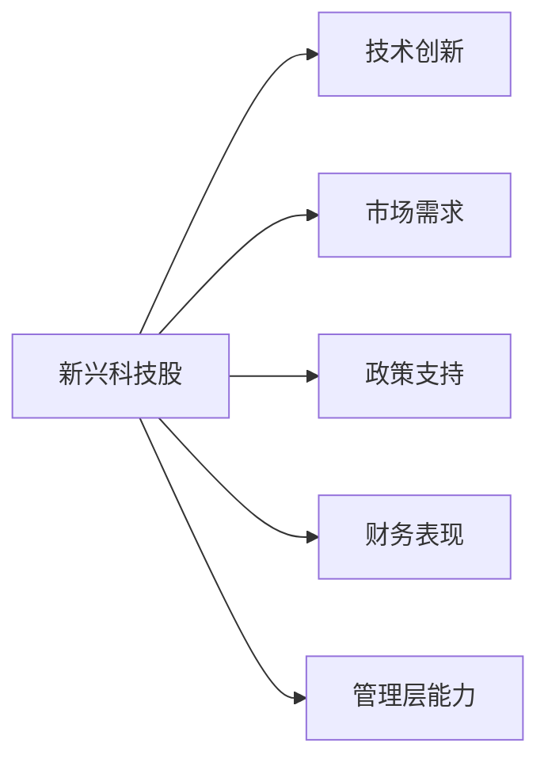
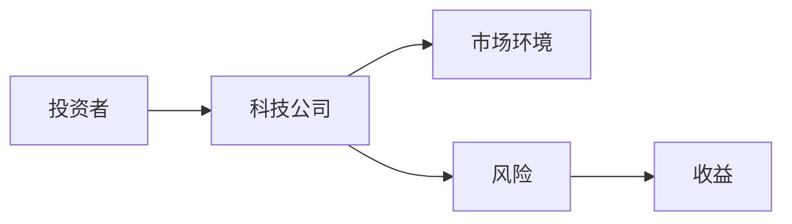
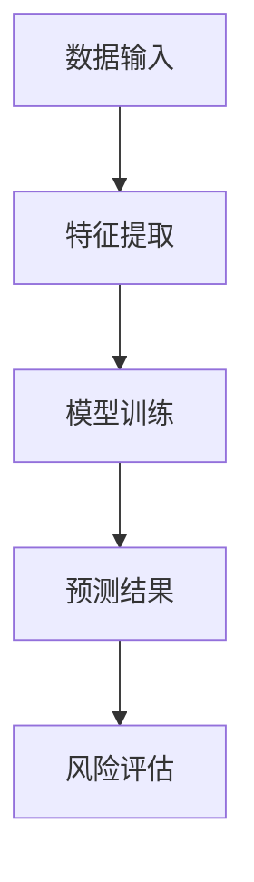
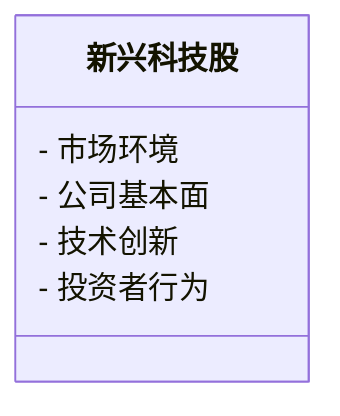

                 


# 新兴科技股投资：机遇与风险分析

> 关键词：新兴科技股、科技股投资、投资策略、风险评估、数学模型、系统架构、项目实战

> 摘要：本文深入分析新兴科技股投资的机遇与风险，从背景、核心概念、投资策略、算法原理、系统架构到项目实战，全面解析科技股投资的逻辑与方法。通过量化分析和数学模型，帮助投资者制定科学的投资策略，同时通过系统架构和项目实战，提供切实可行的投资方案。

---

# 第一部分：新兴科技股投资背景与核心概念

## 第1章：新兴科技股投资的背景与问题背景

### 1.1 问题背景与问题描述

#### 1.1.1 新兴科技股的定义与范围
新兴科技股是指那些代表新兴科技领域的公司股票，涵盖人工智能、大数据、云计算、区块链、物联网、5G通信等领域。这些公司通常处于高速成长阶段，具有较高的创新能力和市场潜力。

#### 1.1.2 科技股投资的现状与趋势
近年来，科技股投资热度持续上升。随着技术进步和市场需求的增长，科技股的表现往往优于传统行业股。然而，科技股的波动性也较大，投资风险较高。

#### 1.1.3 问题解决的核心目标
本文旨在通过分析新兴科技股的特征、市场环境和投资者行为，构建科学的投资策略，帮助投资者在机遇与风险之间找到平衡点。

### 1.2 新兴科技股的核心概念

#### 1.2.1 新兴科技股的定义与特征
新兴科技股的特征包括高成长性、高波动性、技术依赖性和市场敏感性。这些特征使得科技股的投资需要特别关注技术创新、市场需求和政策环境。

#### 1.2.2 科技股投资的边界与外延
科技股投资的边界包括公司规模、市值、行业分类和技术成熟度。外延则涉及产业链上下游、技术创新能力和市场竞争力。

#### 1.2.3 核心要素组成与概念结构
新兴科技股的核心要素包括技术创新、市场需求、政策支持、财务表现和管理层能力。概念结构通过图1-1展示：



---

## 第2章：新兴科技股的核心概念与联系

### 2.1 核心概念的原理分析

#### 2.1.1 科技股的行业属性
科技股的行业属性包括高研发投入、高技术门槛和高成长潜力。这些属性使得科技股的投资需要关注公司的研发能力和技术储备。

#### 2.1.2 新兴科技股的市场特征
新兴科技股的市场特征包括高波动性、高增长性和高风险性。市场波动受政策、技术和经济环境的影响较大。

#### 2.1.3 投资者行为模式
投资者行为模式包括理性决策和非理性决策。理性投资者注重基本面分析和长期价值，而非理性投资者受市场情绪影响较大。

### 2.2 核心概念属性对比表

| 特性         | 新兴科技股             | 传统行业股           |
|--------------|----------------------|--------------------|
| 行业属性      | 高科技、高成长       | 传统行业、低成长     |
| 市场波动性     | 高                   | 低                 |
| 技术依赖性     | 高                   | 低                 |
| 投资风险      | 高                   | 中/低             |
| 投资回报      | 高                   | 中/低             |

### 2.3 实体关系图（ER图）



---

## 第3章：新兴科技股投资策略与风险评估

### 3.1 投资策略的制定

#### 3.1.1 量化分析方法
量化分析方法包括技术指标分析和基本面分析。技术指标分析包括MACD、KDJ等，基本面分析包括市盈率、市净率等。

#### 3.1.2 基于技术指标的投资策略
基于技术指标的投资策略包括趋势跟踪和均值回归。趋势跟踪策略关注股价的持续上涨，均值回归策略关注股价的回调。

#### 3.1.3 基于基本面分析的投资策略
基本面分析包括公司财务状况、管理层能力和行业前景。重点关注公司的盈利能力、成长能力和竞争优势。

### 3.2 风险评估模型

#### 3.2.1 风险因素分析
风险因素包括市场风险、技术风险、政策风险和流动性风险。

#### 3.2.2 风险评估指标
风险评估指标包括波动率、VaR（在险值）和贝塔系数。

#### 3.2.3 风险-收益权衡模型
风险-收益权衡模型通过CAPM（资本资产定价模型）进行分析：

$$ E(R_i) = R_f + \beta_i (R_m - R_f) $$

其中，\( E(R_i) \) 是个股的预期收益率，\( R_f \) 是无风险利率，\( \beta_i \) 是个股的贝塔系数，\( R_m \) 是市场预期收益率。

---

## 第4章：新兴科技股投资的算法原理

### 4.1 算法原理概述

#### 4.1.1 机器学习在投资中的应用
机器学习算法如支持向量机（SVM）和随机森林（Random Forest）可用于股票分类和预测。

#### 4.1.2 深度学习在风险评估中的应用
深度学习模型如LSTM可用于时间序列分析，预测股价波动。

#### 4.1.3 时间序列分析在股价预测中的应用
时间序列分析方法如ARIMA可用于预测股票价格的趋势。

### 4.2 算法流程图（Mermaid）



### 4.3 算法实现代码

```python
# 示例代码：简单线性回归模型
import numpy as np
import pandas as pd
from sklearn.linear_model import LinearRegression

data = pd.DataFrame({
    'price': [100, 105, 110, 115, 120],
    'risk': [5, 6, 7, 8, 9]
})

model = LinearRegression()
model.fit(data[['risk']], data['price'])

# 预测结果
print("预测价格：", model.predict([[10]]))
```

---

## 第5章：新兴科技股投资的系统架构

### 5.1 系统功能设计

#### 5.1.1 领域模型（Mermaid类图）



### 5.2 系统架构设计

#### 5.2.1 系统架构图（Mermaid架构图）


---

## 第6章：新兴科技股投资的项目实战

### 6.1 环境安装

#### 6.1.1 安装Python和相关库
安装Python和Pandas、Scikit-learn等库：

```bash
pip install numpy pandas scikit-learn
```

### 6.2 系统核心实现源代码

#### 6.2.1 示例代码：股票价格预测

```python
import numpy as np
import pandas as pd
from sklearn.linear_model import LinearRegression

data = pd.DataFrame({
    'price': [100, 105, 110, 115, 120],
    'risk': [5, 6, 7, 8, 9]
})

model = LinearRegression()
model.fit(data[['risk']], data['price'])

# 预测结果
print("预测价格：", model.predict([[10]]))
```

### 6.3 实际案例分析

#### 6.3.1 案例分析：人工智能公司

以某人工智能公司为例，分析其市场环境、财务状况和技术创新能力，制定相应的投资策略。

---

## 第7章：新兴科技股投资的最佳实践

### 7.1 小结
新兴科技股投资需要结合量化分析和基本面分析，制定科学的投资策略，同时注重风险控制。

### 7.2 注意事项
投资者应关注市场波动、政策变化和技术风险，避免盲目跟风。

### 7.3 拓展阅读
推荐阅读《科技股投资策略》和《风险管理与投资组合》等书籍。

---

通过以上分析，我们可以全面了解新兴科技股投资的机遇与风险，制定科学的投资策略，并通过系统架构和项目实战，提高投资效率和成功率。

