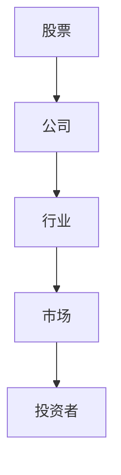
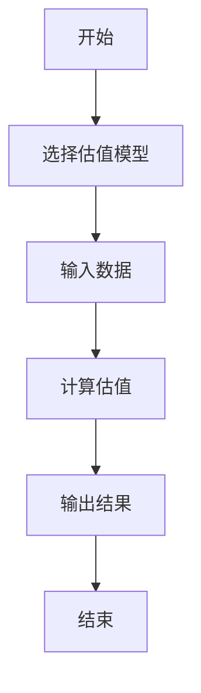
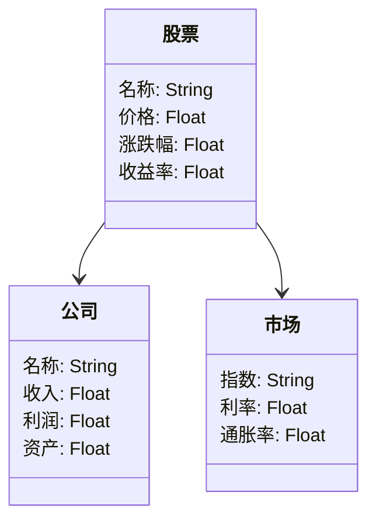
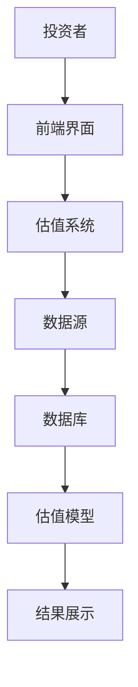
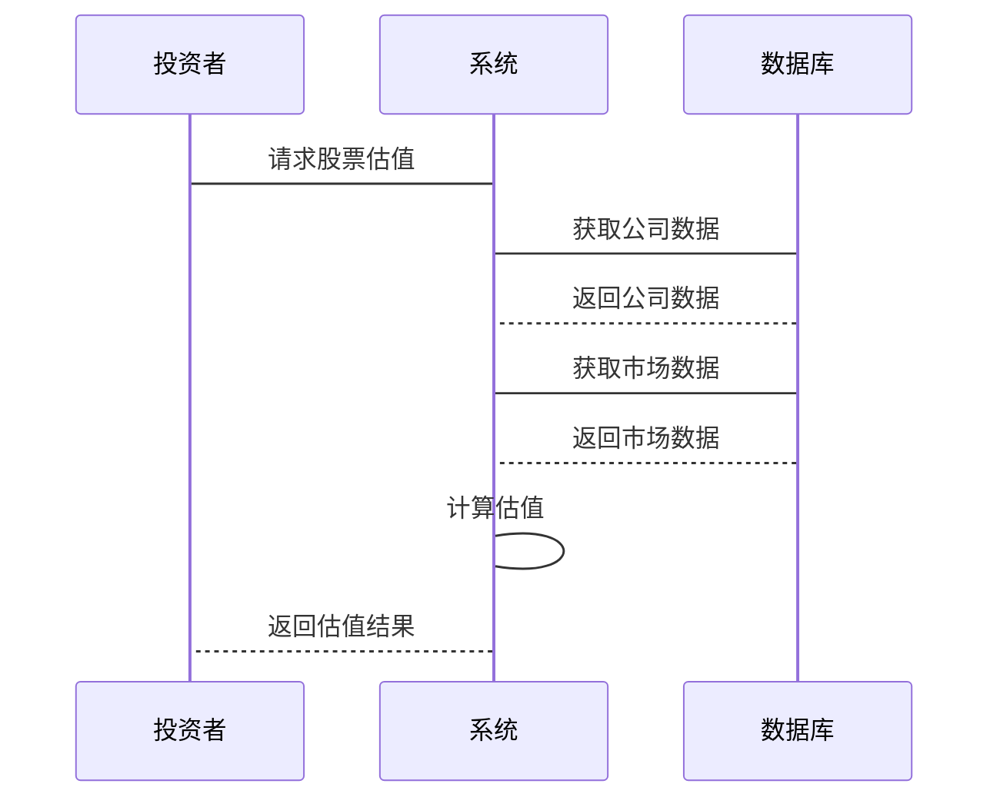

                 


# 新加坡股市估值: 亚洲金融中心的投资吸引力

> 关键词：新加坡股市、股票估值、金融中心、投资策略、亚洲市场

> 摘要：本文深入分析了新加坡股市的估值方法及其作为亚洲金融中心的投资吸引力。通过探讨股票估值的核心概念、常用模型和算法原理，结合新加坡市场的独特优势，为投资者提供了科学的投资决策依据。

---

# 第一部分: 新加坡股市估值的基础与背景

## 第1章: 新加坡股市估值概述

### 1.1 新加坡作为亚洲金融中心的地位

#### 1.1.1 新加坡的金融历史与发展
新加坡的金融市场起源于19世纪末，随着其港口贸易的繁荣，逐渐发展成为重要的国际金融中心。1965年独立后，新加坡政府通过一系列政策推动金融市场的国际化，使其成为亚洲乃至全球的金融枢纽。

#### 1.1.2 新加坡在亚洲金融体系中的作用
作为亚洲的金融中心，新加坡不仅是跨国企业的总部所在地，还是亚洲最大的外汇交易中心之一。其金融市场的稳定性和透明性使其成为投资者的首选。

#### 1.1.3 新加坡股市的国际化特征
新加坡股市（SGX）是全球重要的股票市场之一，吸引了大量国际企业和投资者。其国际化程度高，且具有较强的抗风险能力。

### 1.2 股票估值的基本概念与方法

#### 1.2.1 股票估值的定义与重要性
股票估值是通过对公司财务数据和市场环境的分析，确定股票的内在价值和市场价值的过程。准确的估值有助于投资者做出合理的投资决策。

#### 1.2.2 常用的股票估值方法
- **相对估值法**：通过比较股票与市场指数或其他股票的相对表现来确定其价值。
- **绝对估值法**：通过公司基本面分析和现金流折现模型（DCF）计算股票的内在价值。

#### 1.2.3 影响股票估值的主要因素
- **宏观经济因素**：GDP增长率、利率、通货膨胀率等。
- **公司基本面**：收入、利润、资产负债情况等。
- **市场情绪**：投资者情绪和市场流动性对股票估值有重要影响。

### 1.3 新加坡股市的独特优势

#### 1.3.1 新加坡股市的流动性分析
新加坡股市具有高流动性，尤其是在交易时段内，买卖订单能够快速成交，降低了交易成本。

#### 1.3.2 新加坡股市的国际化程度
新加坡吸引了大量国际企业上市，投资者可以投资全球化的资产，同时享受新加坡的税收优惠和法治环境。

#### 1.3.3 新加坡政府对金融市场的支持
新加坡政府通过政策支持和监管改革，不断提升金融市场的效率和吸引力。

### 1.4 本章小结
本章介绍了新加坡作为亚洲金融中心的地位，分析了股票估值的基本概念和方法，并探讨了新加坡股市的独特优势。

---

## 第2章: 新加坡股市估值的核心概念与模型

### 2.1 股票估值的基本原理

#### 2.1.1 股票的内在价值与市场价值
- **内在价值**：基于公司基本面的理论价值，是股票的真正价值。
- **市场价值**：市场参与者交易形成的当前价格，可能高于或低于内在价值。

#### 2.1.2 股票估值的三大假设
1. 市场是有效的，价格反映所有公开信息。
2. 投资者追求风险调整后的最大收益。
3. 公司的未来现金流可以合理预测。

#### 2.1.3 股票估值与投资回报的关系
准确的估值能够帮助投资者识别低估或高估的股票，从而获得超额回报。

### 2.2 常用股票估值模型

#### 2.2.1 市盈率（P/E）模型
- **公式**：$$P/E = \frac{P}{E}$$
- **解释**：P为股票价格，E为每股收益。市盈率反映了投资者为每元利润愿意支付的价格。

#### 2.2.2 市净率（P/B）模型
- **公式**：$$P/B = \frac{P}{B}$$
- **解释**：P为股票价格，B为每股净资产。适用于银行、房地产等资产密集型行业。

#### 2.2.3 现金流折现模型（DCF）
- **公式**：$$DCF = \sum_{t=1}^{n} \frac{CF_t}{(1+r)^t} + \frac{TV}{(1+r)^n}$$
- **解释**：CF_t为第t年的自由现金流，r为折现率，TV为终值。

#### 2.2.4 市销率（P/S）模型
- **公式**：$$P/S = \frac{P}{S}$$
- **解释**：P为股票价格，S为每股销售收入。适用于高成长但亏损的公司。

### 2.3 新加坡股市估值的特殊考虑

#### 2.3.1 新加坡市场的行业分布特点
新加坡股市涵盖金融、科技、能源等多个行业，且金融行业占比较大。

#### 2.3.2 新加坡股市中的蓝筹股与成长股
- **蓝筹股**：如新加坡银行（UOB）、新加坡电信（Singtel）等，具有稳定的收益和高分红。
- **成长股**：如科技公司，具有高增长潜力。

#### 2.3.3 新加坡政府债券收益率对股市估值的影响
新加坡政府债券收益率被视为市场无风险利率，影响股票的合理估值。

### 2.4 核心概念与联系

#### 2.4.1 股票估值的核心要素对比表
| 要素       | 定义                                   | 影响                                   | 示例                                   |
|------------|----------------------------------------|----------------------------------------|----------------------------------------|
| 内在价值   | 股票的理论价值                         | 估值的基础                           | DCF模型计算                         |
| 市盈率     | 价格与收益比                         | 相对估值指标                         | $$P/E = \frac{P}{E}$$               |
| 现金流     | 公司未来产生的现金流                 | 决定DCF模型的核心输入               | $$DCF = \sum \frac{CF_t}{(1+r)^t}$$ |

#### 2.4.2 股票估值的ER实体关系图


### 2.5 本章小结
本章详细介绍了股票估值的核心概念和常用模型，并结合新加坡股市的特点进行了分析。

---

## 第3章: 新加坡股市估值的算法原理

### 3.1 股票估值的算法选择

#### 3.1.1 不同估值模型的适用场景
- **市盈率模型**：适用于盈利稳定的公司。
- **市净率模型**：适用于资产密集型行业。
- **DCF模型**：适用于高成长性公司。

#### 3.1.2 新加坡股市适合的估值方法
结合新加坡市场的特点，市盈率和DCF模型是常用的估值工具。

#### 3.1.3 机器学习在股票估值中的应用
通过分析历史数据，机器学习可以辅助预测股票价格和识别潜在的投资机会。

### 3.2 基于市盈率的估值算法

#### 3.2.1 市盈率模型的数学公式
$$P = E \times P/E_{target}$$

#### 3.2.2 市盈率模型的实现步骤
1. 收集目标公司的每股收益（E）。
2. 确定合理的市盈率倍数（P/E_{target}）。
3. 计算目标股票的理论价格（P）。

#### 3.2.3 示例计算与分析
假设某公司每股收益为1.5元，目标市盈率为12倍，则理论价格为$$1.5 \times 12 = 18$$元。

### 3.3 基于现金流折现的估值算法

#### 3.3.1 DCF模型的核心公式
$$DCF = \sum_{t=1}^{n} \frac{CF_t}{(1+r)^t} + \frac{TV}{(1+r)^n}$$

#### 3.3.2 DCF模型的实现步骤
1. 预测未来现金流（CF_t）。
2. 确定合适的折现率（r）。
3. 计算终值（TV）。
4. 折现并求和得到DCF值。

#### 3.3.3 示例计算与分析
假设某公司未来5年的现金流分别为2, 2.5, 3, 3.5, 4元，折现率为8%，终值假设为20元。
计算DCF：
$$DCF = \frac{2}{1.08} + \frac{2.5}{1.08^2} + \frac{3}{1.08^3} + \frac{3.5}{1.08^4} + \frac{4}{1.08^5} + \frac{20}{1.08^5}$$

### 3.4 算法原理的流程图


### 3.5 本章小结
本章通过具体算法和实例分析，展示了如何在新加坡股市中应用市盈率和DCF模型进行估值。

---

## 第4章: 新加坡股市估值的系统分析与架构设计

### 4.1 问题场景介绍
投资者在新加坡股市中如何选择具有投资价值的股票？如何利用估值模型进行科学决策？

### 4.2 系统功能设计

#### 4.2.1 领域模型Mermaid类图


### 4.3 系统架构设计

#### 4.3.1 系统架构Mermaid架构图


### 4.4 系统接口设计
- **输入接口**：接收股票代码和市场数据。
- **输出接口**：提供估值结果和投资建议。

### 4.5 系统交互Mermaid序列图


### 4.6 本章小结
本章通过系统架构设计，展示了如何构建一个基于股票估值的系统，帮助投资者做出科学决策。

---

## 第5章: 新加坡股市估值的项目实战

### 5.1 环境安装
安装Python和相关库（如Pandas、NumPy、Matplotlib）。

### 5.2 核心实现源代码
```python
import pandas as pd
import numpy as np

def calculate_dcf(cash_flows, discount_rate, terminal_value):
    dcf = 0
    for t in range(len(cash_flows)):
        dcf += cash_flows[t] / (1 + discount_rate)**t
    dcf += terminal_value / (1 + discount_rate)**len(cash_flows)
    return dcf

# 示例数据
cash_flows = [2, 2.5, 3, 3.5, 4]
discount_rate = 0.08
terminal_value = 20

# 计算DCF
dcf_value = calculate_dcf(cash_flows, discount_rate, terminal_value)
print(f"DCF Value: {dcf_value}")
```

### 5.3 代码应用解读与分析
- **代码功能**：实现DCF模型的现金流折现计算。
- **输入数据**：未来现金流和终值。
- **输出结果**：DCF估值结果。

### 5.4 实际案例分析
以某科技公司为例，利用市盈率和DCF模型进行估值，并对比实际市场价格，分析其投资价值。

### 5.5 本章小结
本章通过实际案例，展示了如何利用Python代码进行股票估值。

---

## 第6章: 新加坡股市估值的最佳实践与注意事项

### 6.1 最佳实践 tips
1. 结合多种估值方法进行交叉验证。
2. 定期更新数据和模型。
3. 考虑宏观经济环境的变化。

### 6.2 小结
股票估值是一项复杂但重要的工作，投资者需要结合市场环境和公司基本面，合理选择估值模型。

### 6.3 注意事项
- 避免过度依赖单一模型。
- 考虑市场情绪和突发事件的影响。
- 定期回顾和调整投资组合。

### 6.4 拓展阅读
推荐阅读《投资学》、《股票估值实战技巧》等书籍。

---

## 附录: 新加坡股市估值相关工具与资源

### 1. 新加坡股市估值工具推荐
- **SGX官方网站**：提供实时股价和公司信息。
- ** Bloomberg Terminal**：专业的金融数据终端。
- **Python金融库**：如Pandas、NumPy等。

### 2. 新加坡股市估值相关书籍
- 《The Intelligent Investor》
- 《 valuation: A Multiparadigm Approach》

### 3. 在线资源与社区
- **Investing.com**：提供股票估值工具和市场分析。
- **Reddit的r/StockMarket**：投资者交流社区。

---

通过本文的详细分析，读者可以全面了解新加坡股市的估值方法和投资策略，为在亚洲金融中心的投资决策提供有力支持。

