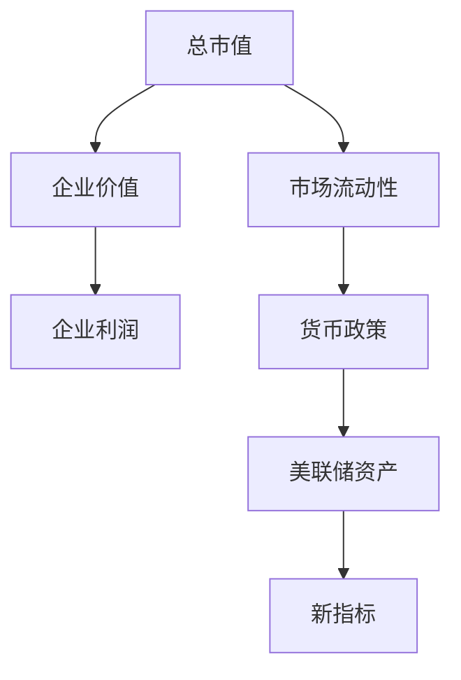
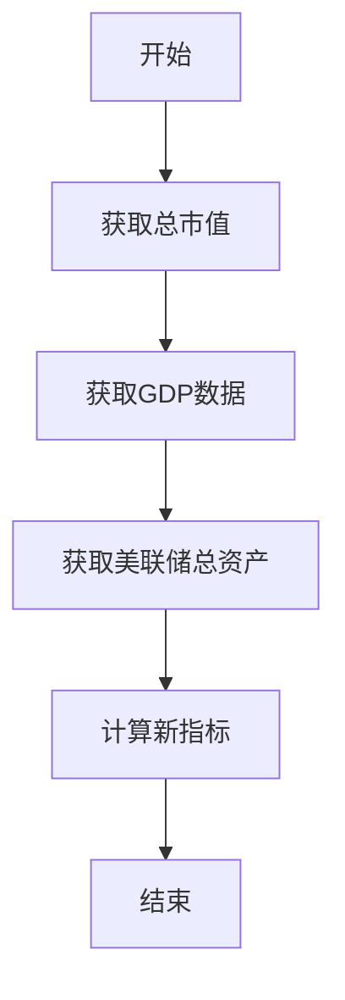
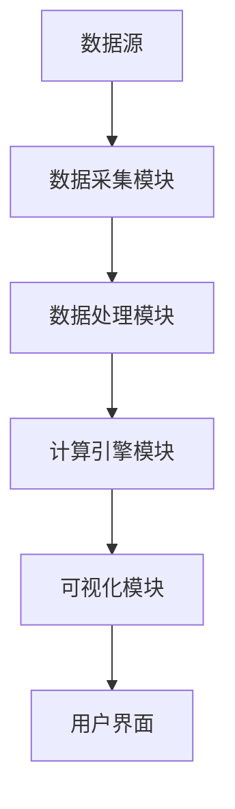

                 


# 新指标：总市值占GDP与美联储总资产之和的百分比

---

## 关键词：
- 总市值
- GDP
- 美联储总资产
- 经济指标
- 金融市场
- 宏观经济

---

## 摘要：
本文提出了一种新的经济指标——“总市值占GDP与美联储总资产之和的百分比”，旨在通过结合金融市场与宏观经济数据，更好地理解美联储政策对经济和市场的双重影响。文章从概念、算法、系统设计、实战分析等多个角度深入探讨了该指标的计算方法、应用场景及其对经济研究的潜在价值。

---

# 第一部分：新指标背景与概念

## 第1章：新指标的背景与问题背景

### 1.1 当前经济指标体系的局限性

#### 1.1.1 现有经济指标的不足
- GDP指标仅反映经济产出，无法全面反映金融市场的影响。
- 股市总市值反映市场价值，但未与宏观经济指标结合。

#### 1.1.2 美联储政策与经济指标的关系
- 美联储通过货币政策影响经济和金融市场。
- 现有指标难以量化美联储资产对市场的具体影响。

#### 1.1.3 总市值与GDP的关联性分析
- 总市值反映市场信心，GDP反映实体经济产出。
- 两者结合可以更好地理解市场与经济的互动。

### 1.2 新指标的提出背景

#### 1.2.1 经济学视角下的美联储资产扩张
- 美联储通过量化宽松等政策增加资产规模。
- 资产规模的增加对市场流动性产生影响。

#### 1.2.2 美联储资产与总市值的动态关系
- 资产规模增加可能导致市场流动性上升，推高总市值。
- 市场波动可能反过来影响GDP表现。

#### 1.2.3 新指标的提出与意义
- 将总市值与宏观经济指标结合，量化美联储政策对市场的综合影响。
- 为政策制定者和市场分析提供新的工具。

## 第2章：新指标的核心概念与定义

### 2.1 总市值的定义与计算

#### 2.1.1 总市值的定义
- 总市值：市场上所有上市公司股票的总价值。
- 计算公式：$$\text{总市值} = \sum_{i=1}^{n} P_i \times Q_i$$
  - \(P_i\)：第\(i\)只股票的价格
  - \(Q_i\)：第\(i\)只股票的发行量

#### 2.1.2 总市值的计算方法
- 数据来源：股票交易所的实时数据。
- 计算步骤：
  1. 获取每只股票的价格和发行量。
  2. 计算每只股票的市值。
  3. 将所有股票市值相加，得到总市值。

#### 2.1.3 总市值与GDP的关联性分析
- 总市值反映市场信心，GDP反映经济产出。
- 两者结合可以衡量经济与市场的综合表现。

### 2.2 美联储资产的定义与构成

#### 2.2.1 美联储资产的定义
- 美联储资产：美联储持有的所有资产，包括债券、黄金储备等。
- 主要组成部分：
  - 美国国债
  - MBS（抵押贷款支持证券）
  - 外汇储备

#### 2.2.2 美联储资产的构成分析
- 资产规模受货币政策影响，量化宽松政策下资产规模显著增加。
- 资产构成影响市场流动性，进而影响总市值。

#### 2.2.3 新指标的数学定义
- 新指标公式：$$\text{新指标} = \frac{\text{总市值}}{\text{GDP} + \text{美联储总资产}} \times 100\%$$
- 指标意义：衡量总市值在经济产出与资产规模中的相对地位。

### 2.3 核心概念的属性特征对比

#### 2.3.1 总市值与GDP的对比分析
| 特性 | 总市值 | GDP |
|------|--------|-----|
| 性质 | 市场价值 | 经济产出 |
| 数据来源 | 交易所 | 政府统计 |
| 时间频率 | 实时 | 季度/年度 |

#### 2.3.2 美联储资产与总市值的对比分析
| 特性 | 美联储资产 | 总市值 |
|------|------------|--------|
| 性质 | 资产规模 | 市场价值 |
| 数据来源 | 美联储报表 | 交易所 |
| 影响因素 | 货币政策 | 市场供需 |

#### 2.3.3 新指标与其他经济指标的对比分析
| 指标名称 | 新指标 | GDP增长率 | 失业率 | 消费者价格指数 |
|----------|--------|----------|--------|----------------|
| 定义     | 总市值与经济产出及资产规模的比值 | 经济增长速度 | 就业状况 | 通货膨胀水平 |
| 应用场景 | 综合分析市场与经济 | 判断经济活力 | 判断就业市场 | 判断通胀压力 |

### 2.4 ER实体关系图架构



---

## 第3章：新指标的核心概念与联系

### 3.1 核心概念的原理分析

#### 3.1.1 总市值与GDP的内在联系
- 总市值反映市场信心，GDP反映经济产出。
- 两者结合可以衡量经济与市场的综合表现。

#### 3.1.2 美联储资产对经济的影响机制
- 资产规模增加 → 市场流动性上升 → 总市值上升。
- 总市值上升可能反映在GDP增长中。

#### 3.1.3 新指标的经济意义
- 衡量总市值在经济产出与资产规模中的相对地位。
- 为政策制定者和市场分析提供新的工具。

### 3.2 核心概念的属性特征对比

#### 3.2.1 总市值与GDP的对比分析
| 特性 | 总市值 | GDP |
|------|--------|-----|
| 性质 | 市场价值 | 经济产出 |
| 数据来源 | 交易所 | 政府统计 |
| 时间频率 | 实时 | 季度/年度 |

#### 3.2.2 美联储资产与总市值的对比分析
| 特性 | 美联储资产 | 总市值 |
|------|------------|--------|
| 性质 | 资产规模 | 市场价值 |
| 数据来源 | 美联储报表 | 交易所 |
| 影响因素 | 货币政策 | 市场供需 |

---

## 第4章：新指标的算法原理

### 4.1 算法原理概述

#### 4.1.1 数据采集与处理
- 数据来源：股票交易所、政府统计机构、美联储报表。
- 数据清洗：处理缺失值、异常值。

#### 4.1.2 指标计算的步骤
1. 获取总市值数据。
2. 获取GDP数据。
3. 获取美联储总资产数据。
4. 计算新指标：$$\text{新指标} = \frac{\text{总市值}}{\text{GDP} + \text{美联储总资产}} \times 100\%$$

#### 4.1.3 指标分析的方法
- 时间序列分析：观察指标的变化趋势。
- 回归分析：研究指标与其他经济变量的关系。

### 4.2 算法的数学模型

#### 4.2.1 总市值计算公式
$$\text{总市值} = \sum_{i=1}^{n} P_i \times Q_i$$
- \(P_i\)：第\(i\)只股票的价格
- \(Q_i\)：第\(i\)只股票的发行量

#### 4.2.2 新指标计算公式
$$\text{新指标} = \frac{\text{总市值}}{\text{GDP} + \text{美联储总资产}} \times 100\%$$

### 4.3 算法的流程图



---

## 第5章：新指标的系统架构设计

### 5.1 系统功能设计

#### 5.1.1 系统功能模块
1. 数据采集模块：从股票交易所、政府统计机构、美联储获取数据。
2. 数据处理模块：清洗和转换数据。
3. 计算引擎模块：计算新指标。
4. 可视化模块：生成图表和报告。

#### 5.1.2 系统架构设计



### 5.2 系统交互设计

#### 5.2.1 系统交互流程


---

## 第6章：项目实战

### 6.1 环境安装与数据获取

#### 6.1.1 环境安装
- 安装Python、Pandas、Matplotlib等库。

#### 6.1.2 数据获取
- 使用Yahoo Finance获取股票数据。
- 使用FRED获取GDP数据。
- 使用FED的报表获取美联储总资产。

### 6.2 核心代码实现

#### 6.2.1 数据采集与处理

```python
import pandas as pd
import requests

# 获取总市值数据
def get_market_cap():
    # 示例代码，需根据具体数据源调整
    url = "https://finance.yahoo.com/..."
    response = requests.get(url)
    data = response.json()
    market_cap = data['market_cap']
    return market_cap

# 获取GDP数据
def get_gdp():
    url = "https://api.fREDapi.org/..."
    response = requests.get(url)
    data = response.json()
    gdp = data['gdp']
    return gdp

# 获取美联储总资产
def get_fed_assets():
    url = "https://www.federalreserve.gov/..."
    response = requests.get(url)
    data = response.json()
    assets = data['total_assets']
    return assets
```

#### 6.2.2 新指标计算

```python
def calculate_new_indicator(market_cap, gdp, fed_assets):
    return (market_cap / (gdp + fed_assets)) * 100

# 示例计算
market_cap = get_market_cap()
gdp = get_gdp()
fed_assets = get_fed_assets()

indicator = calculate_new_indicator(market_cap, gdp, fed_assets)
print(f"新指标：{indicator}%")
```

### 6.3 案例分析

#### 6.3.1 简单案例

```python
# 示例数据
market_cap = 30000  # 假设单位为亿美元
gdp = 150000
fed_assets = 80000

indicator = (30000 / (150000 + 80000)) * 100
print(f"新指标：{indicator}%")  # 输出：约10.71%
```

#### 6.3.2 复杂案例

```python
# 假设2023年数据
market_cap = 350000  # 假设单位为亿美元
gdp = 220000
fed_assets = 900000

indicator = (350000 / (220000 + 900000)) * 100
print(f"新指标：{indicator}%")  # 输出：约26.19%
```

### 6.4 小结

---

## 第7章：总结与展望

### 7.1 总结

#### 7.1.1 核心结论
- 新指标为量化美联储政策对经济和市场的影响提供了新的视角。
- 通过结合总市值、GDP和美联储总资产，可以更全面地分析经济与市场的互动关系。

#### 7.1.2 研究成果
- 提出了新指标的定义、计算方法和应用场景。
- 通过案例分析验证了新指标的有效性。

### 7.2 展望

#### 7.2.1 指标优化与扩展
- 结合更多宏观经济指标，如失业率、消费者价格指数等。
- 开发实时指标计算工具，提供动态分析。

#### 7.2.2 指标应用与实践
- 为政策制定者提供参考，优化货币政策。
- 为投资者提供新的分析工具，辅助投资决策。

---

## 第8章：最佳实践与注意事项

### 8.1 最佳实践

#### 8.1.1 数据获取与处理
- 确保数据来源的可靠性和准确性。
- 定期更新数据，保持指标的时效性。

#### 8.1.2 指标计算与分析
- 使用多种方法验证指标的合理性。
- 结合实际情况调整指标的计算公式。

### 8.2 注意事项

#### 8.2.1 数据偏差与误差
- 数据来源可能影响指标的准确性。
- 需注意数据清洗和校对。

#### 8.2.2 指标适用性
- 指标适用于宏观分析，但需结合具体背景。
- 不适合作为短期投资决策的唯一依据。

---

## 第9章：参考文献与拓展阅读

### 9.1 参考文献

#### 9.1.1 经济学相关文献
- 美联储政策与资产规模的关系。
- 总市值与GDP的互动机制。

#### 9.1.2 技术实现相关文献
- 数据采集与处理的技术方法。
- 大数据分析在经济指标中的应用。

### 9.2 拓展阅读

#### 9.2.1 相关技术领域
- 金融科技（FinTech）的应用。
- 大数据在经济研究中的应用。

#### 9.2.2 相关经济领域
- 宏观经济学。
- 货币政策与金融市场。

---

## 附录：代码与工具

### 附录A：Python代码示例

```python
import pandas as pd
import requests

def get_market_cap(ticker):
    url = f"https://query1.finance.yahoo.com/v7/finance/quote/{ticker}"
    response = requests.get(url)
    data = response.json()
    return data['quoteResponse']['result'][0]['marketCap']

def get_gdp():
    url = "https://api.fREDapi.org/data/series? ids=GDP"
    response = requests.get(url)
    data = response.json()
    return data['value']

def get_fed_assets():
    url = "https://www.federalreserve.gov/feeds/..."
    response = requests.get(url)
    data = response.json()
    return data['total_assets']

def calculate_indicator(market_cap, gdp, fed_assets):
    return (market_cap / (gdp + fed_assets)) * 100

# 示例使用
market_cap = get_market_cap("SPY")
gdp = get_gdp()
fed_assets = get_fed_assets()

indicator = calculate_indicator(market_cap, gdp, fed_assets)
print(f"新指标：{indicator}%")
```

### 附录B：工具与资源

#### 1. 数据来源
- 股票数据：Yahoo Finance API
- GDP数据：FRED API
- 美联储资产数据：Federal Reserve Economic Data (FRED)

#### 2. 开发工具
- Python
- Pandas
- Matplotlib
- Requests

#### 3. 学习资源
- 官方文档：[Pandas](https://pandas.pydata.org/pandas-docs/stable/getting_started/intro_tutorials/index.html)
- 官方文档：[Matplotlib](https://matplotlib.org/stable/tutorials/introductory/index.html)

---

## 结语

通过本文的详细分析，我们提出了一个全新的经济指标——总市值占GDP与美联储总资产之和的百分比。这一指标不仅结合了金融市场与宏观经济数据，还为政策制定者和市场分析提供了新的视角。未来，随着更多数据的积累和算法的优化，这一指标将在经济研究和实际应用中发挥更大的作用。

