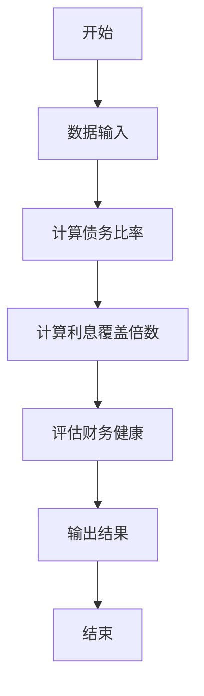
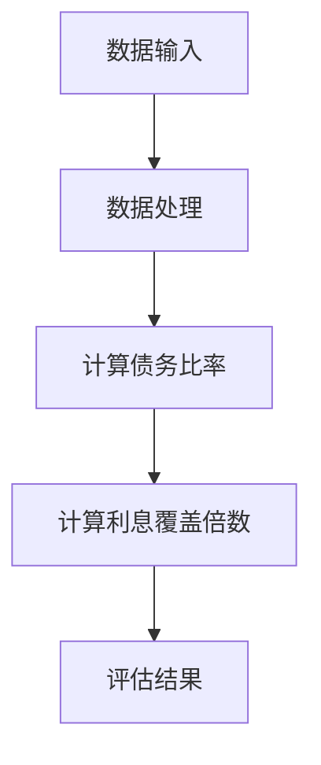

                 


# 无重大长期债务：巴菲特投资标准之一

## 关键词：巴菲特、投资标准、长期债务、财务健康、投资策略

## 摘要：巴菲特的投资理念中，无重大长期债务是关键标准之一。本文从背景、核心概念、算法原理、数学模型、系统分析、项目实战等方面详细探讨这一标准，帮助读者理解其重要性及实际应用。

---

## 第一部分：背景介绍

### 第1章：巴菲特投资理念概述

#### 1.1 巴菲特投资理念的核心

- **长期视角**：巴菲特强调长期投资，寻找能够持续创造价值的企业。
- **价值投资**：寻找市场价格低于内在价值的公司。
- **无长期债务的重要性**：避免公司因高负债而面临财务风险。

#### 1.2 无长期债务的重要性

- **财务健康**：无长期债务的公司更稳定，抗风险能力强。
- **股东权益**：减少债务负担，股东权益更安全。
- **企业风险**：高债务可能引发财务危机，影响企业长期发展。

#### 1.3 无长期债务的定义与背景

- **定义**：公司没有长期负债，主要依赖股东权益和短期负债维持运营。
- **区别于短期债务**：短期债务通常用于日常运营，风险较低。
- **投资标准背景**：巴菲特基于长期投资，避免企业因债务过重而陷入困境。

---

## 第二部分：核心概念与联系

### 第2章：无长期债务的核心概念

#### 2.1 无长期债务的特征

- **财务指标**：关注债务比率、利息覆盖倍数等指标。
- **盈利能力与偿债能力**：高盈利能力支持债务偿还，低债务压力。
- **资产负债表分析**：重点检查负债部分，确保无长期债务。

#### 2.2 核心概念对比分析

- **长期债务与短期债务对比**
  | 特性 | 长期债务 | 短期债务 |
  |------|----------|----------|
  | 还款期限 | 5年以上 | 1年以内 |
  | 风险 | 较高 | 较低 |
  
- **无长期债务与高负债企业的对比**
  - 无长期债务企业：财务压力小，风险低。
  - 高负债企业：财务风险高，易受经济波动影响。

- **财务杠杆影响**：无长期债务减少杠杆，降低风险，但可能限制企业扩张。

---

## 第三部分：算法原理讲解

### 第3章：财务健康评估算法

#### 3.1 财务健康评估模型

- **模型概述**：基于债务比率和利息覆盖倍数评估财务健康。
- **数据输入与处理**：收集公司财务报表数据，计算关键指标。
- **模型输出**：评估结果分为健康、亚健康、不健康三类。

#### 3.2 算法流程图



---

## 第四部分：数学模型与公式

### 第4章：关键数学模型

#### 4.1 债务比率计算

公式：$$\text{债务比率} = \frac{\text{总负债}}{\text{股东权益}}$$

- **解读**：比率越低，财务风险越小，符合巴菲特标准。

#### 4.2 利息覆盖倍数

公式：$$\text{利息覆盖倍数} = \frac{\text{EBIT}}{\text{利息支出}}$$

- **解读**：倍数越高，公司偿还债务利息的能力越强。

---

## 第五部分：系统分析与架构设计

### 第5章：系统架构设计

#### 5.1 系统功能设计

- **数据收集模块**：收集公司财务数据。
- **分析模块**：计算债务比率、利息覆盖倍数。
- **评估模块**：根据标准评估财务健康。

#### 5.2 系统架构图



---

## 第六部分：项目实战

### 第6章：项目实战

#### 6.1 环境配置

- **工具**：Python、Pandas、Matplotlib。

#### 6.2 核心实现代码

```python
import pandas as pd

def calculate_debt_ratio(df):
    debt = df['Total Liabilities'].sum()
    equity = df['Shareholders Equity'].sum()
    return debt / equity

def calculate_interest_coverage(df):
    ebit = df['EBIT'].sum()
    interest = df['Interest Expense'].sum()
    return ebit / interest

# 示例数据
data = {
    'Company': ['Company A', 'Company B'],
    'Total Liabilities': [100, 200],
    'Shareholders Equity': [50, 100],
    'EBIT': [50, 80],
    'Interest Expense': [10, 20]
}

df = pd.DataFrame(data)
dr = calculate_debt_ratio(df)
ic = calculate_interest_coverage(df)

print(f"Debt Ratio: {dr}")
print(f"Interest Coverage: {ic}")
```

#### 6.3 案例分析

- **公司A**：债务比率=2，利息覆盖倍数=5。
- **公司B**：债务比率=2，利息覆盖倍数=4。
- **结论**：公司A更符合无长期债务标准。

---

## 第七部分：总结与建议

### 第7章：总结

- **背景回顾**：长期债务对财务健康的影响。
- **核心概念**：无长期债务的定义与重要性。
- **算法与模型**：债务比率、利息覆盖倍数的计算。
- **系统设计**：数据处理、计算、评估的流程。
- **项目实战**：通过代码实现评估，案例分析。

### 第8章：最佳实践与小结

- **最佳实践**：定期评估企业财务状况，避免高负债。
- **小结**：无长期债务是巴菲特投资的关键标准，确保企业财务健康。
- **注意事项**：结合其他因素，全面评估企业价值。
- **拓展阅读**：深入学习巴菲特的投资策略和财务分析方法。

---

通过以上结构，文章详细探讨了无重大长期债务作为巴菲特投资标准之一的重要性，从理论到实践，帮助读者全面理解这一投资策略。

