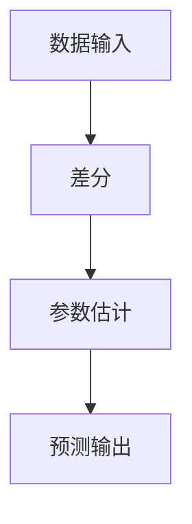
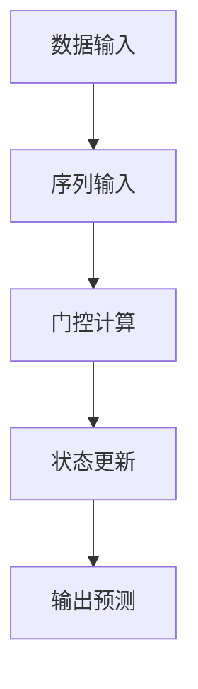
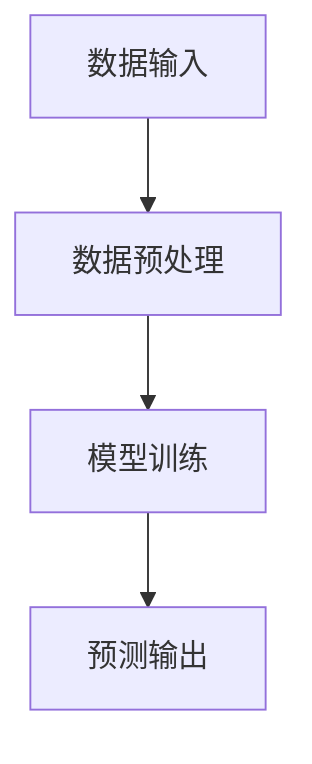

                 


# 《时间序列预测模型在金融市场中的比较研究》

---

## 关键词：时间序列预测、金融时间序列、ARIMA、LSTM、Prophet、金融建模

---

## 摘要

时间序列预测在金融市场中具有重要意义，能够帮助投资者和金融机构更好地理解市场趋势、优化投资策略和管理风险。本文系统地介绍了时间序列预测的核心概念、主要模型及其在金融领域的应用，并通过比较分析，探讨了不同模型的优缺点、适用场景和实际效果。文章结合实际案例，深入讲解了ARIMA、LSTM和Prophet等模型的实现原理和金融应用场景，为读者提供了一套全面的时间序列预测解决方案。

---

# 第三章: 时间序列预测模型的算法原理

## 3.1 ARIMA模型原理

### 3.1.1 ARIMA模型的定义

ARIMA（Autoregressive Integrated Moving Average）模型是一种经典的统计模型，适用于线性时间序列数据的预测。它通过自回归（AR）部分捕捉数据的自相关性，通过移动平均（MA）部分处理残差的波动性。

### 3.1.2 ARIMA模型的数学公式

ARIMA模型的数学表达式为：

$$
(1 - B)^d X_t = \phi(B) \theta(B) Z_t
$$

其中，\( B \) 是延迟算子，\( d \) 是差分的阶数，\( \phi(B) \) 是自回归多项式，\( \theta(B) \) 是移动平均多项式，\( Z_t \) 是白噪声。

### 3.1.3 ARIMA模型的实现流程



以下是一个使用Python实现ARIMA模型的示例代码：

```python
from statsmodels.tsa.arima.model import ARIMA

# 假设我们有训练数据train_data和测试数据test_data
model = ARIMA(train_data, order=(5, 1, 0))  # ARIMA(5,1,0)
model_fit = model.fit()

# 预测未来值
forecast = model_fit.forecast(steps=len(test_data))
```

### 3.1.4 ARIMA模型的优点与缺点

- **优点**：简单易懂，适合线性时间序列数据，易于实现。
- **缺点**：对非线性关系捕捉能力较弱，对异常值敏感。

---

## 3.2 LSTM模型原理

### 3.2.1 LSTM模型的定义

LSTM（Long Short-Term Memory）是一种基于递归神经网络（RNN）的深度学习模型，特别适合处理长序列数据中的非线性关系。

### 3.2.2 LSTM模型的结构

LSTM模型由三个门控（遗忘门、输入门和输出门）和一个细胞状态组成。其数学表达式如下：

$$
f_t = \sigma(W_f \cdot [h_{t-1}, x_t] + b_f)
$$

$$
i_t = \sigma(W_i \cdot [h_{t-1}, x_t] + b_i)
$$

$$
o_t = \sigma(W_o \cdot [h_{t-1}, x_t] + b_o)
$$

$$
c_t = f_t \cdot c_{t-1} + i_t \cdot tanh(W_c \cdot [h_{t-1}, x_t] + b_c)
$$

$$
h_t = o_t \cdot tanh(c_t)
$$`

其中，\( f_t \) 是遗忘门，\( i_t \) 是输入门，\( o_t \) 是输出门，\( c_t \) 是细胞状态，\( h_t \) 是隐藏层状态。

### 3.2.3 LSTM模型的实现流程



以下是一个使用Keras实现LSTM模型的示例代码：

```python
from keras.models import Sequential
from keras.layers import LSTM, Dense

# 构建模型
model = Sequential()
model.add(LSTM(50, input_shape=(timesteps, features)))
model.add(Dense(1))
model.compile(optimizer='adam', loss='mean_squared_error')

# 训练模型
model.fit(X_train, y_train, epochs=50, batch_size=32)

# 预测
y_pred = model.predict(X_test)
```

### 3.2.4 LSTM模型的优点与缺点

- **优点**：能够捕捉复杂的非线性关系，适合长序列预测。
- **缺点**：计算复杂度高，对数据量要求较大。

---

## 3.3 Prophet模型原理

### 3.3.1 Prophet模型的定义

Prophet是由Facebook开源的一种简单且强大的时间序列预测模型，特别适合处理具有明确时间依赖性的数据。

### 3.3.2 Prophet模型的核心思想

Prophet模型通过将时间序列分解为趋势（trend）、周期（seasonality）和噪声（noise）三部分，并通过回归模型分别建模。

### 3.3.3 Prophet模型的实现流程



以下是一个使用Prophet库的示例代码：

```python
from fbprophet import Prophet

# 初始化模型
model = Prophet()

# 训练模型
model.fit(train_data)

# 预测
future = model.make_future_dataframe(periods=30)
forecast = model.predict(future)
```

### 3.3.4 Prophet模型的优点与缺点

- **优点**：简单易用，适合非专业用户，预测效果优秀。
- **缺点**：对异常值和复杂周期性敏感。

---

## 3.4 其他时间序列预测模型

### 3.4.1 GARCH模型

GARCH（Generalized Autoregressive Conditional Heteroskedasticity）模型主要用于金融时间序列中的波动性预测，特别适合处理金融市场的异方差性问题。

### 3.4.2 软最大回归模型

Softmax回归模型通过将时间序列数据映射到潜在空间，利用Softmax函数进行概率预测，适用于多分类场景。

---

## 3.5 时间序列预测模型的对比分析

### 3.5.1 模型复杂度对比

| 模型       | 复杂度 | 适用场景               |
|------------|--------|------------------------|
| ARIMA      | 低     | 线性时间序列           |
| LSTM       | 高     | 非线性时间序列         |
| Prophet    | 中     | 通用时间序列           |
| GARCH      | 中     | 波动性预测             |

### 3.5.2 模型的可解释性对比

| 模型       | 可解释性 | 优点                          |
|------------|----------|------------------------------|
| ARIMA      | 高       | 明确的数学模型                |
| LSTM       | 低       | 能捕捉复杂非线性关系          |
| Prophet    | 中       | 简单易用，适合非专业用户        |
| GARCH      | 中       | 专注于波动性预测               |

### 3.5.3 模型的计算效率对比

| 模型       | 计算效率 | 优点                          |
|------------|----------|------------------------------|
| ARIMA      | 高       | 适合小数据集                 |
| LSTM       | 低       | 适合大数据集                 |
| Prophet    | 中       | 适合中等数据集               |
| GARCH      | 中       | 适合特定场景                 |

---

## 3.6 本章小结

本章详细讲解了ARIMA、LSTM和Prophet等时间序列预测模型的算法原理、数学公式和实现流程，并通过对比分析探讨了它们的优缺点及适用场景。这些模型在金融市场中的应用为投资者提供了多样化的选择，具体选择取决于数据特性、模型复杂度和计算资源。

---

接下来，我将继续完成第四章“系统分析与架构设计方案”，结合实际案例深入探讨如何在金融场景中构建时间序列预测系统。

