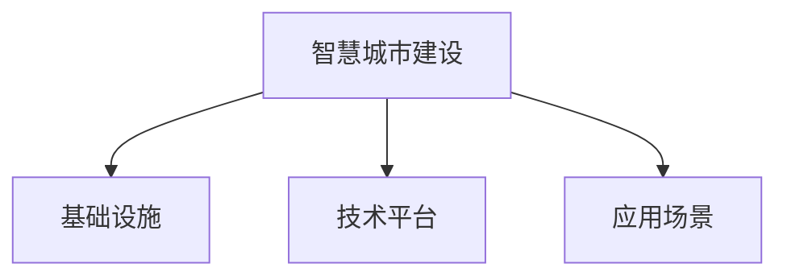
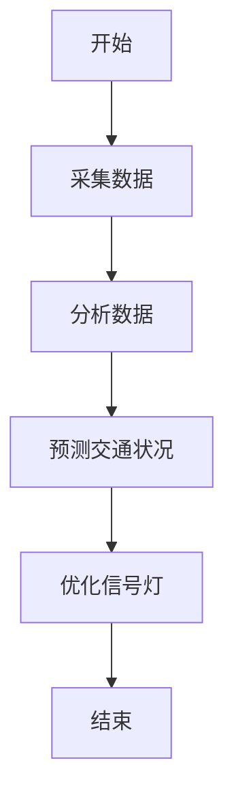
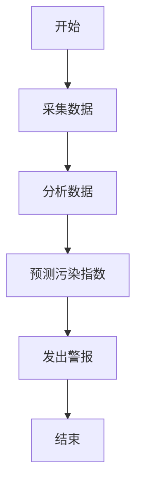

                 


# 智慧城市技术在可持续发展中的应用与投资

## 关键词：智慧城市，可持续发展，投资策略，物联网，大数据，人工智能

## 摘要：本文深入探讨了智慧城市技术在推动可持续发展中的应用，分析了相关技术的核心原理、系统架构及投资策略。通过实际案例和数学模型，展示了如何通过技术创新实现城市资源的高效利用和环境保护，为投资者提供了明确的指导和建议。

---

# 第一部分: 智慧城市技术与可持续发展的背景

## 第1章: 智慧城市与可持续发展的背景介绍

### 1.1 智慧城市的定义与核心概念
#### 1.1.1 智慧城市的起源与发展
- **起源**：从智能交通到智能城市的发展历程。
- **发展**：技术驱动下的城市数字化转型。

#### 1.1.2 可持续发展的基本概念
- **定义**：满足当代需求而不损害后代满足需求的能力。
- **核心领域**：经济、社会、环境的协调发展。

#### 1.1.3 智慧城市与可持续发展的关系
- **技术支撑**：通过技术创新实现资源高效利用。
- **目标一致**：减少资源消耗，降低环境影响。

### 1.2 智慧城市建设的背景与问题背景
#### 1.2.1 城市化带来的挑战
- **人口增长**：资源需求增加。
- **环境污染**：空气、水、土地污染问题。
- **交通拥堵**：城市交通效率低下。

#### 1.2.2 资源短缺与环境压力
- **能源危机**：化石能源不可再生。
- **水资源短缺**：全球水资源分布不均。
- **碳排放**：温室效应加剧气候变化。

#### 1.2.3 技术进步与智慧城市建设的结合
- **物联网**：实时感知城市运行状态。
- **大数据**：分析城市数据，优化决策。
- **人工智能**：提升城市管理效率。

### 1.3 智慧城市的核心问题与解决思路
#### 1.3.1 智慧城市面临的主要问题
- **数据孤岛**：信息共享困难。
- **技术整合**：不同系统兼容性问题。
- **隐私与安全**：数据泄露风险。

#### 1.3.2 技术如何解决这些问题
- **数据共享平台**：打破数据孤岛。
- **系统集成**：统一平台管理。
- **隐私保护技术**：加密和匿名化处理。

#### 1.3.3 可持续发展的边界与外延
- **边界**：城市规划的物理范围。
- **外延**：区域协调发展，智慧城市群。

### 1.4 智慧城市的核心要素与概念结构
#### 1.4.1 核心要素的构成
- **基础设施**：物联网设备、数据中心。
- **技术平台**：大数据分析、人工智能。
- **应用场景**：交通、能源、环境监测。

#### 1.4.2 概念结构图


#### 1.4.3 核心要素的特征对比
| 特征 | 基础设施 | 技术平台 | 应用场景 |
|------|-----------|-----------|-----------|
| 核心功能 | 数据采集 | 数据处理 | 服务提供 |
| 技术依赖 | 物联网 | 大数据、AI | 无 |
| 目标 | 支撑城市运行 | 优化决策 | 提供服务 |

### 1.5 本章小结
- 智慧城市通过技术创新解决城市化带来的问题。
- 可持续发展是智慧城市建设的核心目标。

---

# 第二部分: 智慧城市技术的核心概念与联系

## 第2章: 智慧城市技术的核心概念与联系

### 2.1 智慧城市技术的核心原理
#### 2.1.1 物联网技术
- **定义**：通过传感器和网络实现物物相连。
- **作用**：实时采集数据，优化资源配置。

#### 2.1.2 大数据与人工智能
- **大数据**：海量数据的收集与分析。
- **人工智能**：利用机器学习优化决策。

#### 2.1.3 云计算与边缘计算
- **云计算**：集中处理，资源共享。
- **边缘计算**：边缘设备实时处理数据。

### 2.2 核心概念的属性特征对比
| 技术 | 特点 | 优缺点 | 应用场景 |
|------|------|---------|-----------|
| 物联网 | 实时性高 | 高成本 | 智慧交通 |
| 大数据 | 数据量大 | 需要存储 | 城市规划 |
| 人工智能 | 自动化 | 学习周期长 | 智能服务 |

### 2.3 智慧城市技术的ER实体关系图
```mermaid
erDiagram
    actor 用户 {
        string 用户ID
        string 用户名
        string 密码
    }
    actor 设备 {
        string 设备ID
        string 设备类型
        string 设备状态
    }
    actor 数据中心 {
        string 数据ID
        string 数据类型
        string 数据值
    }
    用户 --> 设备 : 操作设备
    设备 --> 数据中心 : 传输数据
    数据中心 --> 用户 : 提供服务
```

### 2.4 本章小结
- 智慧城市技术通过物联网、大数据和人工智能实现高效管理。

---

# 第三部分: 智慧城市技术的算法原理与数学模型

## 第3章: 智慧城市技术的算法

### 3.1 智慧交通系统的算法
#### 3.1.1 算法原理
- **目标**：优化交通流量，减少拥堵。
- **方法**：基于实时数据，预测交通状况。

#### 3.1.2 算法流程图


#### 3.1.3 Python代码实现
```python
import pandas as pd
from sklearn.linear_model import LinearRegression

# 数据加载
data = pd.read_csv('traffic.csv')

# 模型训练
model = LinearRegression()
model.fit(data[['time', 'weather']], data['flow'])

# 预测
predicted_flow = model.predict([[10, '晴朗']])
print(predicted_flow)
```

#### 3.1.4 数学模型
- **线性回归模型**：
  $$ y = \beta_0 + \beta_1x + \epsilon $$
  其中，$y$ 是流量，$x$ 是时间，$\epsilon$ 是误差项。

### 3.2 环境监测系统的算法
#### 3.2.1 算法原理
- **目标**：实时监测环境数据，预防污染。
- **方法**：基于传感器数据，预测污染指数。

#### 3.2.2 算法流程图


#### 3.2.3 Python代码实现
```python
import pandas as pd
from sklearn.svm import SVC

# 数据加载
data = pd.read_csv('environment.csv')

# 模型训练
model = SVC()
model.fit(data[['PM2.5', 'NO2']], data['label'])

# 预测
predicted_label = model.predict([[25, 40]])
print(predicted_label)
```

#### 3.2.4 数学模型
- **支持向量机模型**：
  $$ \text{最大化} \  \  \gamma \geq 1 $$
  $$ \text{使得} \  \  y_i (w \cdot x_i + b) \geq 1 - \xi_i $$
  $$ \text{且} \  \  \xi_i \geq 0 $$

### 3.3 本章小结
- 智慧城市技术通过算法优化资源配置，提升城市管理效率。

---

## 附录: 智慧城市技术的投资策略

### 4.1 投资机会分析
- **技术驱动**：物联网、大数据、人工智能。
- **政策支持**：政府投资和补贴。

### 4.2 投资评估方法
- **净现值法**：评估项目收益。
- **风险评估**：技术风险、市场风险。

### 4.3 投资风险管理
- **分散投资**：降低风险。
- **长期视角**：关注长期回报。

### 4.4 投资组合优化
- **资产配置**：技术股与基础设施股结合。
- **定期评估**：根据市场变化调整策略。

---

## 总结
智慧城市技术在可持续发展中的应用是未来城市发展的关键，通过技术创新和合理投资，可以实现资源高效利用和环境保护。

