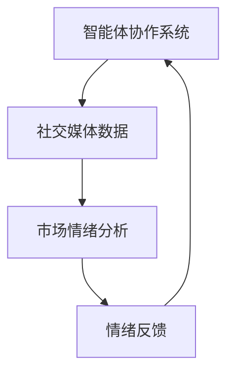
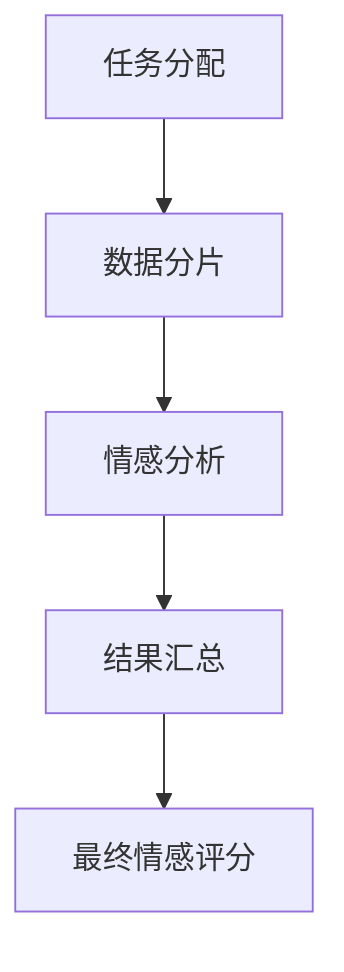
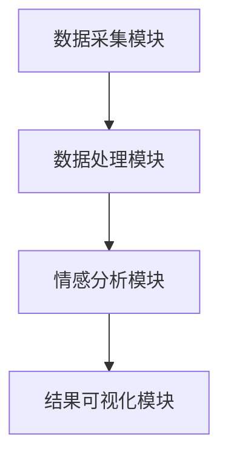
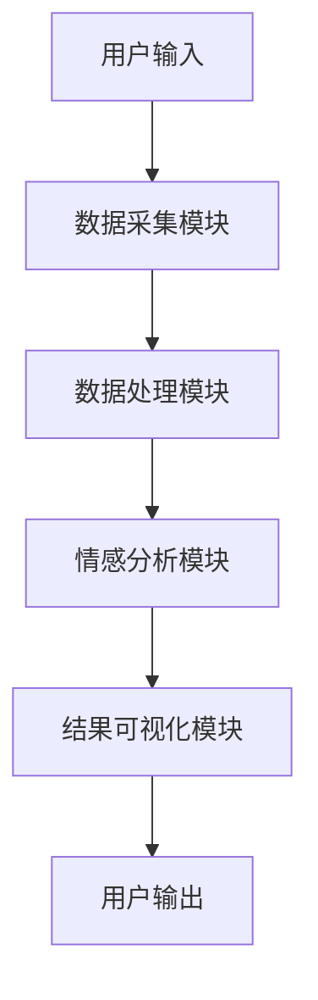

                 


# 智能体协作分析社交媒体数据：捕捉市场情绪变化

## 关键词：
- 智能体协作
- 社交媒体数据
- 市场情绪分析
- 多智能体系统
- 情感计算

## 摘要：
智能体协作分析社交媒体数据是一种新兴的技术，旨在通过多个智能体协同工作，从海量社交媒体数据中提取和分析市场情绪变化。本文将详细介绍智能体协作的基本概念、市场情绪分析的核心原理、智能体协作与市场情绪分析的协同优化策略，以及实际项目中的实现细节。通过本文的分析，读者可以全面理解智能体协作如何在社交媒体数据中捕捉市场情绪变化，并掌握相关技术的实现方法和最佳实践。

---

# 第一部分: 智能体协作分析社交媒体数据概述

## 第1章: 智能体协作与社交媒体数据分析

### 1.1 智能体协作的基本概念

#### 1.1.1 智能体的定义与特性
智能体（Agent）是指具有感知环境、自主决策和执行任务能力的实体。智能体可以是软件程序，也可以是物理设备，它们能够通过传感器或数据接口与外部环境交互。智能体的核心特性包括：
- **自主性**：智能体能够自主决策和执行任务，无需外部干预。
- **反应性**：智能体能够实时感知环境变化并做出反应。
- **协作性**：智能体能够与其他智能体或系统协同工作，完成复杂任务。
- **学习能力**：智能体能够通过数据学习和优化自身的行为。

#### 1.1.2 智能体协作的定义与特点
智能体协作是指多个智能体通过协同工作，共同完成复杂任务的过程。智能体协作的特点包括：
- **分布式计算**：智能体协作依赖于分布式计算架构，任务被分解为多个子任务，由不同智能体分别完成。
- **通信与协调**：智能体之间需要通过通信机制共享信息，并通过协调机制确保任务的一致性。
- **自适应性**：智能体协作系统能够根据环境变化动态调整任务分配和执行策略。

#### 1.1.3 社交媒体数据的特性与挑战
社交媒体数据具有以下特性：
- **多模态性**：社交媒体数据包括文本、图片、视频、用户行为等多种数据类型。
- **实时性**：社交媒体数据生成速度快，需要实时处理和分析。
- **海量性**：社交媒体平台每天生成海量数据，对存储和计算能力提出较高要求。

社交媒体数据分析的挑战包括：
- **数据清洗与预处理**：社交媒体数据中存在噪声、重复数据和不完整数据，需要进行清洗和预处理。
- **数据隐私与合规性**：社交媒体数据涉及用户隐私，需要遵守相关法律法规和数据保护要求。
- **数据实时性与延迟**：实时分析社交媒体数据需要高效的计算能力和低延迟的处理机制。

---

### 1.2 市场情绪分析的背景与意义

#### 1.2.1 市场情绪分析的定义
市场情绪分析是指通过分析社交媒体数据，识别市场参与者的情感倾向，从而预测市场行为和趋势的过程。市场情绪分析的核心目标是捕捉市场参与者的情绪变化，帮助投资者、企业和社会机构做出更明智的决策。

#### 1.2.2 社交媒体在市场情绪分析中的作用
社交媒体在市场情绪分析中具有重要作用：
- **实时性**：社交媒体数据生成速度快，能够反映市场参与者的情绪变化。
- **广泛性**：社交媒体覆盖了全球范围内的市场参与者，能够提供广泛的情绪数据。
- **多样性**：社交媒体数据包括文本、图片、视频等多种形式，能够提供多样化的信息。

#### 1.2.3 情绪分析对投资决策的影响
情绪分析对投资决策的影响主要体现在以下几个方面：
- **市场趋势预测**：通过分析社交媒体情绪数据，可以预测市场趋势，帮助投资者做出更明智的投资决策。
- **风险管理**：情绪分析可以帮助投资者识别市场风险，及时调整投资策略。
- **交易机会捕捉**：情绪分析可以帮助投资者发现市场中的交易机会，捕捉短期市场波动。

---

### 1.3 智能体协作分析的定义与优势

#### 1.3.1 智能体协作分析的定义
智能体协作分析是指通过多个智能体协同工作，对社交媒体数据进行分析和处理，以捕捉市场情绪变化的过程。智能体协作分析的核心目标是通过智能体的协作，提高数据分析的效率和准确性。

#### 1.3.2 智能体协作分析的优势
智能体协作分析具有以下优势：
- **高效性**：智能体协作分析通过分布式计算和并行处理，能够高效地处理海量社交媒体数据。
- **准确性**：智能体协作分析通过多智能体协同工作，能够提高数据分析的准确性和全面性。
- **灵活性**：智能体协作分析能够根据环境变化动态调整任务分配和执行策略，具有较强的灵活性。

#### 1.3.3 智能体协作分析的边界与外延
智能体协作分析的边界包括：
- **数据范围**：智能体协作分析仅限于社交媒体数据，不包括其他来源的数据。
- **任务范围**：智能体协作分析仅限于市场情绪分析，不包括其他类型的数据分析任务。
- **智能体数量**：智能体协作分析可以涉及多个智能体，但每个智能体的功能和任务是有限的。

---

## 第2章: 智能体协作与市场情绪分析的核心概念

### 2.1 智能体协作的核心概念

#### 2.1.1 智能体协作的结构与功能
智能体协作的结构包括：
- **智能体**：智能体是协作的基本单元，负责执行特定的任务。
- **通信机制**：智能体之间通过通信机制共享信息。
- **协调机制**：智能体之间通过协调机制确保任务的一致性和完整性。

智能体协作的功能包括：
- **数据采集**：智能体负责从社交媒体平台采集数据。
- **数据处理**：智能体负责对数据进行清洗、转换和预处理。
- **数据分析**：智能体负责对数据进行分析和挖掘，提取市场情绪信息。
- **结果输出**：智能体负责将分析结果输出给用户或系统。

#### 2.1.2 智能体协作的分类与应用场景
智能体协作的分类包括：
- **基于任务的智能体协作**：智能体协作的目标是完成特定任务。
- **基于知识的智能体协作**：智能体协作依赖于知识共享和知识表示。
- **基于行为的智能体协作**：智能体协作依赖于行为协调和行为规则。

智能体协作的应用场景包括：
- **社交媒体数据挖掘**：通过智能体协作分析社交媒体数据，提取市场情绪信息。
- **电子商务推荐系统**：通过智能体协作分析用户行为数据，推荐个性化产品。
- **智能客服系统**：通过智能体协作分析用户反馈数据，优化客户服务体验。

---

### 2.2 市场情绪分析的核心概念

#### 2.2.1 市场情绪的定义与分类
市场情绪的定义：
市场情绪是指市场参与者在特定时间点上的情感倾向，反映了市场参与者对市场的看法和态度。

市场情绪的分类：
- **积极情绪**：市场参与者对市场持乐观态度。
- **消极情绪**：市场参与者对市场持悲观态度。
- **中性情绪**：市场参与者对市场持中立态度。

#### 2.2.2 社交媒体数据中的情绪特征
社交媒体数据中的情绪特征包括：
- **文本情感**：通过分析文本内容，识别文本中的情感倾向。
- **用户行为**：通过分析用户行为数据，识别用户的偏好和态度。
- **网络结构**：通过分析社交媒体网络结构，识别用户之间的关系和影响。

#### 2.2.3 情绪分析的指标与评估方法
情绪分析的指标包括：
- **情感极性**：情感极性用于表示文本的情感倾向，通常分为积极、消极和中性三种。
- **情感强度**：情感强度用于表示情感的强烈程度，通常用0到1之间的数值表示。
- **情感分类**：情感分类用于将文本分为不同的情感类别，如正面、负面和中性。

情绪分析的评估方法包括：
- **准确率**：准确率用于衡量情绪分析模型的分类准确性。
- **召回率**：召回率用于衡量情绪分析模型的分类召回率。
- **F1分数**：F1分数用于衡量情绪分析模型的分类性能。

---

### 2.3 智能体协作与市场情绪分析的关系

#### 2.3.1 智能体协作在情绪分析中的作用
智能体协作在情绪分析中的作用包括：
- **数据采集**：智能体负责从社交媒体平台采集数据。
- **数据处理**：智能体负责对数据进行清洗、转换和预处理。
- **数据分析**：智能体负责对数据进行分析和挖掘，提取市场情绪信息。

#### 2.3.2 情绪分析对智能体协作的反馈机制
情绪分析对智能体协作的反馈机制包括：
- **情感反馈**：情绪分析结果可以作为智能体协作的反馈，指导智能体的行为和决策。
- **任务调整**：情绪分析结果可以作为任务调整的依据，优化智能体协作的任务分配和执行策略。

#### 2.3.3 智能体协作与情绪分析的协同优化
智能体协作与情绪分析的协同优化包括：
- **任务分配优化**：根据情绪分析结果，动态调整智能体的任务分配。
- **数据处理优化**：根据情绪分析结果，优化数据处理流程，提高数据处理效率。
- **模型优化**：根据情绪分析结果，优化智能体协作的模型和算法，提高分析准确性。

---

## 第3章: 智能体协作与市场情绪分析的核心概念对比

### 3.1 核心概念对比表

| 概念 | 智能体协作 | 市场情绪分析 |
|------|------------|--------------|
| **定义** | 多个智能体协同完成任务 | 通过数据挖掘情感倾向 |
| **输入** | 多模态数据 | 文本、语音等 |
| **输出** | 协作结果 | 情绪评分 |

### 3.2 实体关系图



---

# 第二部分: 智能体协作与市场情绪分析的核心算法与实现

## 第4章: 智能体协作与市场情绪分析的核心算法

### 4.1 情感分析算法

#### 4.1.1 基于规则的情感分析算法
基于规则的情感分析算法是一种简单的情感分析方法，通过预定义的规则和情感词典，对文本进行情感分类。

**算法步骤**：
1. **文本预处理**：对文本进行分词、去除停用词等预处理。
2. **情感词典构建**：构建情感词典，包含积极词汇和消极词汇。
3. **情感评分计算**：根据文本中的情感词汇，计算文本的情感评分。

**数学模型**：
情感评分计算公式：
$$
\text{情感评分} = \sum (\text{积极词汇} \times 1) + \sum (\text{消极词汇} \times -1)
$$

---

#### 4.1.2 基于机器学习的情感分析算法
基于机器学习的情感分析算法是一种更复杂的情感分析方法，通过训练机器学习模型，对文本进行情感分类。

**算法步骤**：
1. **文本预处理**：对文本进行分词、去除停用词等预处理。
2. **特征提取**：提取文本特征，如词袋模型、TF-IDF等。
3. **模型训练**：训练机器学习模型，如支持向量机、随机森林等。
4. **情感分类**：利用训练好的模型，对文本进行情感分类。

---

#### 4.1.3 智能体协作中的情感分析算法
智能体协作中的情感分析算法是一种结合了智能体协作和情感分析的算法，通过多个智能体协同工作，提高情感分析的准确性和效率。

**算法步骤**：
1. **任务分配**：将情感分析任务分配给多个智能体。
2. **数据分片**：将数据分片，分配给不同的智能体处理。
3. **情感分析**：每个智能体负责对分配的数据进行情感分析。
4. **结果汇总**：将各个智能体的分析结果汇总，得到最终的情感评分。

---

### 4.2 智能体协作中的情感特征提取

#### 4.2.1 情感特征提取的方法
情感特征提取的方法包括：
- **词袋模型**：词袋模型是一种简单的情感特征提取方法，通过统计文本中情感词汇的出现频率，构建情感特征向量。
- **TF-IDF**：TF-IDF是一种基于词频-逆文档频率的情感特征提取方法，用于衡量词汇在文本中的重要性。
- **词嵌入**：词嵌入是一种基于深度学习的情感特征提取方法，通过训练词向量模型，得到文本的情感特征向量。

#### 4.2.2 情感特征提取的优化
情感特征提取的优化包括：
- **特征选择**：通过特征选择算法，选择对情感分类最有影响力的特征。
- **特征加权**：通过特征加权算法，对特征进行加权处理，提高情感分类的准确性。
- **特征降维**：通过特征降维算法，减少特征维度，提高计算效率。

---

### 4.3 智能体协作与市场情绪分析的算法流程



---

## 第5章: 智能体协作与市场情绪分析的系统架构设计

### 5.1 系统功能设计

#### 5.1.1 数据采集模块
数据采集模块负责从社交媒体平台采集数据，包括文本、图片、视频等多种数据类型。

#### 5.1.2 数据处理模块
数据处理模块负责对数据进行清洗、转换和预处理，确保数据的准确性和完整性。

#### 5.1.3 情感分析模块
情感分析模块负责对数据进行情感分析，提取市场情绪信息。

#### 5.1.4 结果可视化模块
结果可视化模块负责将分析结果可视化，帮助用户更好地理解市场情绪变化。

---

### 5.2 系统架构设计

#### 5.2.1 系统架构图



#### 5.2.2 系统接口设计
系统接口设计包括：
- **数据接口**：用于数据采集模块与数据处理模块之间的数据传输。
- **通信接口**：用于智能体之间的通信和协作。
- **用户接口**：用于用户与系统的交互，包括数据输入和结果输出。

---

### 5.3 系统交互设计

#### 5.3.1 系统交互流程



#### 5.3.2 系统交互优化
系统交互优化包括：
- **用户体验优化**：通过优化用户界面和交互流程，提高用户的使用体验。
- **系统性能优化**：通过优化系统架构和算法，提高系统的处理效率和响应速度。

---

## 第6章: 智能体协作与市场情绪分析的项目实战

### 6.1 项目背景与目标

#### 6.1.1 项目背景
本项目旨在通过智能体协作分析社交媒体数据，捕捉市场情绪变化，帮助投资者和企业做出更明智的决策。

#### 6.1.2 项目目标
本项目的目標包括：
- **数据采集**：从社交媒体平台采集数据。
- **数据处理**：对数据进行清洗、转换和预处理。
- **情感分析**：对数据进行情感分析，提取市场情绪信息。
- **结果可视化**：将分析结果可视化，帮助用户理解市场情绪变化。

---

### 6.2 项目实现

#### 6.2.1 环境搭建
环境搭建包括：
- **安装Python**：安装Python编程语言，版本要求为3.6以上。
- **安装第三方库**：安装必要的第三方库，如numpy、pandas、scikit-learn等。

#### 6.2.2 数据采集

```python
import requests
from bs4 import BeautifulSoup

def get_social_media_data(url):
    response = requests.get(url)
    soup = BeautifulSoup(response.text, 'html.parser')
    data = []
    for item in soup.find_all('div', class_='tweet'):
        text = item.find('p').text
        timestamp = item.find('span', class_='time').text
        data.append({'text': text, 'timestamp': timestamp})
    return data
```

---

#### 6.2.3 数据处理

```python
from textblob import TextBlob
import pandas as pd

def preprocess_data(data):
    df = pd.DataFrame(data)
    df['text_clean'] = df['text'].apply(lambda x: x.lower().replace(',', ''))
    df['sentiment'] = df['text'].apply(lambda x: TextBlob(x).sentiment.polarity)
    return df
```

---

#### 6.2.4 情感分析

```python
from sklearn.model_selection import train_test_split
from sklearn.linear_model import LinearRegression
from sklearn.metrics import mean_squared_error

def train_sentiment_model(X, y):
    X_train, X_test, y_train, y_test = train_test_split(X, y, test_size=0.2, random_state=42)
    model = LinearRegression()
    model.fit(X_train, y_train)
    y_pred = model.predict(X_test)
    print(f'均方误差: {mean_squared_error(y_test, y_pred)}')
    return model
```

---

#### 6.2.5 结果可视化

```python
import matplotlib.pyplot as plt

def visualize_results(data, model):
    plt.figure(figsize=(10, 6))
    plt.scatter(data['timestamp'], data['sentiment'], c=data['sentiment'], cmap='viridis')
    plt.colorbar(label='情感评分')
    plt.xlabel('时间')
    plt.ylabel('情感评分')
    plt.title('市场情绪变化趋势')
    plt.show()
```

---

### 6.3 项目总结与经验分享

#### 6.3.1 项目总结
本项目通过智能体协作分析社交媒体数据，捕捉市场情绪变化，取得了较好的效果。通过智能体协作，提高了数据分析的效率和准确性，为投资者和企业提供了有价值的信息。

#### 6.3.2 经验分享
在项目实施过程中，我们总结了以下经验：
- **数据清洗的重要性**：数据清洗是数据分析的关键步骤，需要认真对待。
- **模型优化的必要性**：模型优化能够显著提高情感分析的准确性。
- **系统架构的设计**：系统架构的设计需要充分考虑可扩展性和可维护性。

---

# 第三部分: 智能体协作与市场情绪分析的高级主题与最佳实践

## 第7章: 智能体协作与市场情绪分析的高级主题

### 7.1 智能体协作的优化策略

#### 7.1.1 分布式计算的优化
分布式计算的优化包括：
- **负载均衡**：通过负载均衡算法，优化智能体之间的任务分配，提高系统的处理效率。
- **通信优化**：通过优化智能体之间的通信机制，减少通信延迟和带宽占用。

#### 7.1.2 智能体协作的可扩展性
智能体协作的可扩展性包括：
- **模块化设计**：通过模块化设计，提高智能体协作的可扩展性。
- **动态扩展**：通过动态扩展机制，根据任务需求，动态增加或减少智能体的数量。

---

### 7.2 市场情绪分析的可解释性

#### 7.2.1 情感分析的可解释性
情感分析的可解释性包括：
- **特征重要性**：通过特征重要性分析，识别对情感分类最有影响力的特征。
- **情感解释**：通过情感解释，识别文本中的情感关键词和情感语境。

#### 7.2.2 可解释性对投资决策的影响
可解释性对投资决策的影响包括：
- **决策透明性**：可解释性能够提高决策的透明性，帮助投资者更好地理解市场情绪变化。
- **风险管理**：可解释性能够帮助投资者识别市场风险，及时调整投资策略。

---

### 7.3 智能体协作与实时市场情绪分析

#### 7.3.1 实时分析的挑战
实时分析的挑战包括：
- **数据实时性**：实时分析需要处理海量实时数据，对系统的计算能力和存储能力提出较高要求。
- **算法延迟**：实时分析需要低延迟的算法，确保分析结果能够及时反馈。

#### 7.3.2 实时分析的优化
实时分析的优化包括：
- **流数据处理**：通过流数据处理技术，实时处理社交媒体数据。
- **在线学习**：通过在线学习算法，实时优化情感分析模型。

---

## 第8章: 智能体协作与市场情绪分析的最佳实践

### 8.1 最佳实践

#### 8.1.1 数据隐私与合规性
数据隐私与合规性包括：
- **数据加密**：通过数据加密技术，保护用户数据的安全。
- **数据匿名化**：通过数据匿名化技术，保护用户隐私。
- **数据合规性**：遵守相关法律法规，确保数据处理的合规性。

#### 8.1.2 系统性能优化
系统性能优化包括：
- **硬件优化**：通过优化硬件配置，提高系统的计算能力和存储能力。
- **软件优化**：通过优化软件架构和算法，提高系统的处理效率和响应速度。

---

### 8.2 未来发展趋势

#### 8.2.1 智能体协作的未来发展趋势
智能体协作的未来发展趋势包括：
- **智能化**：智能体协作将更加智能化，通过人工智能技术，提高智能体的自主决策能力。
- **分布式计算**：智能体协作将更加依赖分布式计算技术，提高系统的扩展性和可维护性。
- **边缘计算**：智能体协作将与边缘计算结合，提高系统的实时性和响应速度。

#### 8.2.2 市场情绪分析的未来发展趋势
市场情绪分析的未来发展趋势包括：
- **多模态分析**：市场情绪分析将更加注重多模态数据分析，包括文本、图片、视频等多种数据类型。
- **深度学习**：市场情绪分析将更加依赖深度学习技术，提高情感分析的准确性和可解释性。
- **实时分析**：市场情绪分析将更加注重实时性，帮助投资者和企业及时捕捉市场情绪变化。

---

# 第四部分: 总结与展望

## 第9章: 总结与展望

### 9.1 总结
通过本文的分析，我们可以看到智能体协作分析社交媒体数据是一种新兴的技术，具有广泛的应用前景。智能体协作分析通过多个智能体协同工作，能够高效地处理海量社交媒体数据，捕捉市场情绪变化，为投资者和企业提供了有价值的信息。

### 9.2 展望
未来，智能体协作分析将在市场情绪分析领域发挥更大的作用。随着人工智能技术的不断发展，智能体协作分析将更加智能化、分布式化和边缘化，为市场情绪分析提供更高效、更准确的解决方案。同时，智能体协作分析也将与其他领域结合，推动社会的进步和发展。

---

# 结语
智能体协作分析社交媒体数据：捕捉市场情绪变化，是一项具有重要意义的技术。通过本文的分析，我们不仅了解了智能体协作分析的基本概念和核心算法，还掌握了实际项目中的实现方法和最佳实践。希望本文能够为读者提供有价值的参考，帮助他们在市场情绪分析领域取得更大的成功。

