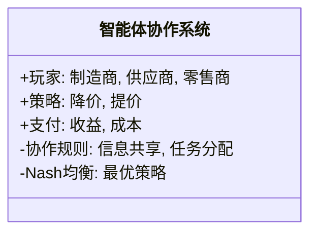

                 


# 智能体协作增强价值投资的供应链分析

---

## 关键词：
智能体协作, 供应链分析, 价值投资, 多智能体系统, 博弈论, 优化算法

---

## 摘要：
智能体协作在供应链分析中的应用为价值投资提供了新的视角。通过智能体的协作机制，可以优化供应链的各个环节，从而提升整体效率和投资回报。本文从智能体协作的基本概念出发，探讨其在供应链分析中的应用，结合博弈论模型和优化算法，提出了一种基于智能体协作的供应链分析框架，并通过实际案例验证了其有效性和优势。

---

## 第一部分: 智能体协作与价值投资概述

---

## 第1章: 智能体协作与价值投资的背景

### 1.1 智能体协作的基本概念

#### 1.1.1 智能体的定义与特征
智能体（Agent）是指在环境中能够感知并自主行动以实现目标的实体。智能体具有以下特征：
- **自主性**：能够在没有外部干预的情况下自主决策。
- **反应性**：能够感知环境并实时调整行为。
- **目标导向性**：所有行动都以实现特定目标为导向。
- **社交能力**：能够与其他智能体或人类进行交互和协作。

#### 1.1.2 智能体协作的定义
智能体协作是指多个智能体通过合作完成共同目标的过程。协作的核心在于智能体之间通过信息共享、任务分配和协同行动，最大化整体效益。

#### 1.1.3 价值投资的基本概念
价值投资是一种投资策略，旨在通过识别被低估的资产，长期持有以实现资本增值。其核心在于对资产内在价值的深入分析和判断。

---

### 1.2 智能体协作与供应链的关系

#### 1.2.1 供应链的基本概念
供应链是指从原材料采购、生产制造、仓储物流到最终交付给用户的整个过程。供应链管理的目标是优化流程，降低成本，提高效率。

#### 1.2.2 智能体协作在供应链中的作用
智能体协作可以通过以下方式优化供应链：
- **信息共享**：智能体之间共享市场数据、库存信息，提高决策的准确性。
- **任务分配**：根据智能体的能力和当前状态，动态分配任务。
- **协同优化**：通过协作，优化供应链中的各个环节，如采购、生产、物流等。

#### 1.2.3 供应链分析的核心问题
供应链分析的核心问题包括：
- **需求预测**：如何准确预测市场需求。
- **库存管理**：如何优化库存水平，减少成本。
- **供应商选择**：如何选择最优的供应商，降低采购成本。
- **物流优化**：如何优化物流路径，降低运输成本。

---

### 1.3 本书的研究目标与意义

#### 1.3.1 研究目标
本书旨在探讨智能体协作在供应链分析中的应用，提出一种基于智能体协作的优化方法，以提升供应链的效率和投资回报。

#### 1.3.2 研究意义
- **理论意义**：丰富智能体协作理论在供应链管理中的应用。
- **实践意义**：为企业提供一种新的供应链优化方法，提升竞争力。

#### 1.3.3 本书的结构安排
本书分为七章，内容安排如下：
1. 智能体协作与价值投资的背景。
2. 智能体协作机制。
3. 供应链分析基础。
4. 基于博弈论的协作算法。
5. 系统架构设计。
6. 项目实战。
7. 总结与展望。

---

## 第2章: 智能体协作机制

### 2.1 多智能体系统概述

#### 2.1.1 多智能体系统的定义
多智能体系统（Multi-Agent System, MAS）是指由多个智能体组成的系统，这些智能体能够通过协作完成共同目标。

#### 2.1.2 多智能体系统的分类
多智能体系统可以分为以下几类：
- **独立型**：智能体之间没有直接交互。
- **协作型**：智能体之间通过协作完成共同目标。
- **竞争型**：智能体之间通过竞争实现目标。

#### 2.1.3 多智能体系统的特征
- **分布式**：智能体分布在不同的位置，独立决策。
- **协作性**：智能体之间通过协作完成共同目标。
- **动态性**：环境和任务可能会动态变化。

---

### 2.2 智能体协作的基本原理

#### 2.2.1 协作目标的定义
协作目标是智能体协作的核心，通常由任务或问题驱动。例如，在供应链中，协作目标可能是最小化成本或最大化效率。

#### 2.2.2 协作规则的制定
协作规则是智能体协作的指导原则，通常包括：
- **信息共享规则**：规定智能体之间如何共享信息。
- **任务分配规则**：规定如何分配任务。
- **冲突解决规则**：规定如何解决协作中的冲突。

#### 2.2.3 协作过程的实现
协作过程通常包括以下步骤：
1. **问题分析**：明确协作的目标和任务。
2. **任务分配**：根据智能体的能力和状态，分配任务。
3. **信息共享**：智能体之间共享相关信息。
4. **协同行动**：智能体协作完成任务。
5. **结果评估**：评估协作的效果，并进行反馈。

---

### 2.3 基于博弈论的协作机制

#### 2.3.1 博弈论的基本概念
博弈论是研究理性主体在冲突与合作中决策的数学理论。博弈论中的核心概念包括：
- **玩家**：参与博弈的个体或群体。
- **策略**：玩家在博弈中可能采取的行动。
- **支付**：玩家在博弈中的收益或损失。
- **均衡**：所有玩家采取某种策略的稳定状态。

#### 2.3.2 博弈论在协作中的应用
在协作中，博弈论可以用于分析智能体之间的合作与竞争关系。例如，在供应链中，多个供应商可能通过博弈论模型确定最优的采购策略。

#### 2.3.3 Nash均衡与协作机制
Nash均衡是博弈论中的一个核心概念，表示在给定其他玩家策略的情况下，玩家无法通过单方面改变策略而获得更好的结果的状态。在协作中，Nash均衡可以用于确定智能体之间的最优策略。

---

### 2.4 智能体协作的算法实现

#### 2.4.1 协作算法的分类
协作算法可以分为以下几类：
- **基于规则的算法**：根据预定义的规则进行协作。
- **基于博弈论的算法**：基于博弈论模型进行协作。
- **基于强化学习的算法**：通过强化学习不断优化协作策略。

#### 2.4.2 基于博弈论的协作算法
基于博弈论的协作算法通常包括以下步骤：
1. **建立博弈模型**：定义玩家、策略和支付。
2. **求解Nash均衡**：确定协作中的最优策略。
3. **实施策略**：根据Nash均衡的结果进行协作。

#### 2.4.3 协作算法的实现步骤
以下是一个基于博弈论的协作算法的实现步骤：
1. **定义问题**：明确协作的目标和任务。
2. **建立博弈模型**：定义玩家、策略和支付。
3. **求解Nash均衡**：确定协作中的最优策略。
4. **实施策略**：根据Nash均衡的结果进行协作。
5. **评估效果**：评估协作的效果，并进行反馈。

---

## 第3章: 供应链分析基础

### 3.1 供应链的基本概念

#### 3.1.1 供应链的定义
供应链是指从原材料采购、生产制造、仓储物流到最终交付给用户的整个过程。

#### 3.1.2 供应链的特征
供应链具有以下特征：
- **复杂性**：涉及多个环节和参与者。
- **动态性**：市场需求和环境可能会动态变化。
- **协作性**：需要多个环节和参与者之间的协作。

---

### 3.2 供应链分析的核心问题

#### 3.2.1 需求预测
需求预测是供应链分析的核心问题之一。准确的需求预测可以帮助企业优化库存管理和生产计划。

#### 3.2.2 库存管理
库存管理是供应链分析的另一个核心问题。优化库存水平可以降低库存成本，同时提高供应链的响应能力。

#### 3.2.3 供应商选择
供应商选择是供应链分析的重要问题。选择最优的供应商可以降低采购成本，同时提高供应链的稳定性。

#### 3.2.4 物流优化
物流优化是供应链分析的关键问题。优化物流路径和运输方式可以降低物流成本，提高供应链的效率。

---

### 3.3 智能体协作在供应链分析中的应用

#### 3.3.1 信息共享
智能体协作可以通过信息共享提高供应链的透明度和效率。例如，供应商可以共享库存信息，帮助制造商优化生产计划。

#### 3.3.2 任务分配
智能体协作可以通过任务分配优化供应链的资源配置。例如，智能体可以根据能力和状态动态分配任务。

#### 3.3.3 协同优化
智能体协作可以通过协同优化供应链的各个环节。例如，智能体可以通过协作优化采购、生产、物流等环节，降低整体成本。

---

## 第4章: 基于博弈论的协作算法

### 4.1 博弈论模型的建立

#### 4.1.1 玩家定义
在供应链分析中，玩家可以包括制造商、供应商、零售商等。

#### 4.1.2 策略定义
策略是指玩家在博弈中可能采取的行动。例如，供应商可以采取“降价”或“提价”策略。

#### 4.1.3 支付定义
支付是指玩家在博弈中的收益或损失。例如，供应商通过降价可以增加销售量，从而提高收益。

---

### 4.2 基于博弈论的算法实现

#### 4.2.1 算法步骤
基于博弈论的协作算法通常包括以下步骤：
1. **建立博弈模型**：定义玩家、策略和支付。
2. **求解Nash均衡**：确定协作中的最优策略。
3. **实施策略**：根据Nash均衡的结果进行协作。
4. **评估效果**：评估协作的效果，并进行反馈。

#### 4.2.2 算法实现
以下是一个基于博弈论的协作算法的Python实现示例：

```python
import numpy as np

# 定义玩家的数量
n_players = 2

# 定义策略集合
strategies = ['降价', '提价']

# 定义支付矩阵
payoffs = {
    '降价': {'降价': 5, '提价': 10},
    '提价': {'降价': 8, '提价': 6}
}

# 求解Nash均衡
nash_equilibrium = []
for i in range(n_players):
    for strategy in strategies:
        is_nash = True
        for other_strategy in strategies:
            if other_strategy != strategy:
                if payoffs[strategy][other_strategy] > payoffs[strategy][strategy]:
                    is_nash = False
                    break
        if is_nash:
            nash_equilibrium.append(strategy)

print("Nash均衡:", nash_equilibrium)
```

---

## 第5章: 系统架构设计

### 5.1 供应链分析系统的功能设计

#### 5.1.1 领域模型
以下是一个供应链分析系统的领域模型：



---

### 5.2 系统架构设计

#### 5.2.1 系统架构图
以下是一个供应链分析系统的架构图：


---

## 第6章: 项目实战

### 6.1 项目背景与目标

#### 6.1.1 项目背景
本项目旨在通过智能体协作优化供应链的采购环节，降低采购成本，提高供应链效率。

#### 6.1.2 项目目标
- **降低采购成本**：通过协作优化采购策略。
- **提高供应链效率**：通过协作优化采购流程。

---

### 6.2 环境搭建与代码实现

#### 6.2.1 环境搭建
需要安装以下工具：
- Python 3.8+
- numpy
- mermaid

#### 6.2.2 核心代码实现
以下是一个基于博弈论的协作算法的Python实现示例：

```python
import numpy as np

# 定义玩家的数量
n_players = 2

# 定义策略集合
strategies = ['降价', '提价']

# 定义支付矩阵
payoffs = {
    '降价': {'降价': 5, '提价': 10},
    '提价': {'降价': 8, '提价': 6}
}

# 求解Nash均衡
nash_equilibrium = []
for i in range(n_players):
    for strategy in strategies:
        is_nash = True
        for other_strategy in strategies:
            if other_strategy != strategy:
                if payoffs[strategy][other_strategy] > payoffs[strategy][strategy]:
                    is_nash = False
                    break
        if is_nash:
            nash_equilibrium.append(strategy)

print("Nash均衡:", nash_equilibrium)
```

---

### 6.3 案例分析与结果解读

#### 6.3.1 案例分析
假设我们有一个包含两个供应商的供应链系统，供应商A和供应商B。供应商A和供应商B可以通过博弈论模型确定最优的采购策略。

#### 6.3.2 结果解读
根据上述代码，Nash均衡为['降价']。这意味着在供应链中，供应商A和供应商B的最佳策略是通过降价来增加销售量，从而提高整体收益。

---

## 第7章: 总结与展望

### 7.1 总结
智能体协作在供应链分析中的应用为价值投资提供了新的视角。通过智能体协作，可以优化供应链的各个环节，降低整体成本，提高供应链效率。

### 7.2 注意事项
- **数据质量**：智能体协作的效果依赖于数据的准确性和完整性。
- **算法选择**：需要根据具体问题选择合适的协作算法。
- **系统设计**：需要综合考虑系统的可扩展性和可维护性。

### 7.3 未来展望
未来的研究可以进一步探讨智能体协作在供应链分析中的应用，例如：
- **多智能体协作的动态优化**：研究动态环境下的协作优化方法。
- **强化学习在协作中的应用**：探索强化学习在协作中的应用前景。

---

## 附录: 最佳实践 Tips

- **数据驱动决策**：在智能体协作中，数据是关键。确保数据的准确性和及时性。
- **算法优化**：根据具体问题优化协作算法，提高协作效率。
- **系统集成**：在系统设计中，注重系统的可扩展性和可维护性。

---

通过以上内容，我们可以看到，智能体协作在供应链分析中的应用具有广阔的前景。未来，随着人工智能和大数据技术的不断发展，智能体协作将在供应链管理中发挥越来越重要的作用。

