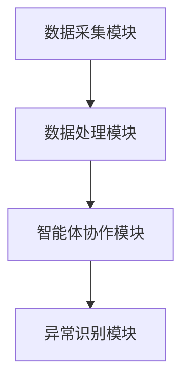

                 


# 智能体协作增强价值投资的市场异常识别

## 关键词：智能体协作，价值投资，市场异常识别，多智能体系统，群体智能，异常检测

## 摘要：  
智能体协作与价值投资的结合为金融市场异常识别提供了新的视角。通过分析投资者行为和市场动态，智能体协作能够有效识别市场中的异常现象，从而增强价值投资的决策能力。本文从智能体协作的理论基础出发，探讨其在价值投资中的应用，详细介绍市场异常识别的算法原理和系统设计，并通过项目实战验证其有效性。最终，本文总结了研究成果，并展望了未来的发展方向。

---

# 第1章：智能体协作与价值投资概述

## 1.1 智能体协作的基本概念

### 1.1.1 智能体协作的定义  
智能体协作是指多个智能体通过共享信息、协同决策和协作行动来实现共同目标的过程。在金融市场中，智能体协作可以模拟投资者的行为，分析市场动态。

### 1.1.2 智能体协作的核心特征  
- **自主性**：每个智能体都能独立决策。  
- **协作性**：通过信息共享和协作行动实现目标。  
- **适应性**：能够根据市场变化动态调整策略。  

### 1.1.3 智能体协作在金融领域的应用  
- **股票交易**：模拟投资者行为，优化交易策略。  
- **市场预测**：通过协作分析市场趋势。  
- **风险管理**：识别市场异常，降低投资风险。  

## 1.2 价值投资的基本原理

### 1.2.1 价值投资的定义  
价值投资是一种投资策略，通过分析公司的基本面，寻找被市场低估的投资标的。

### 1.2.2 价值投资的核心原则  
- **长期视角**：关注长期收益而非短期波动。  
- **安全边际**：购买价格低于内在价值。  
- **优质公司**：选择财务健康、管理优秀的公司。  

### 1.2.3 价值投资与市场异常的关系  
市场异常通常表现为价格偏离基本面，智能体协作可以通过识别这些异常现象，辅助价值投资者捕捉投资机会。

## 1.3 本章小结  
本章介绍了智能体协作和价值投资的基本概念，并分析了它们在金融市场中的应用。智能体协作能够模拟投资者行为，帮助识别市场异常，从而增强价值投资的决策能力。

---

# 第2章：智能体协作的理论基础

## 2.1 多智能体系统概述

### 2.1.1 多智能体系统的定义  
多智能体系统是由多个智能体组成的分布式系统，每个智能体能够自主决策并与其他智能体协作。

### 2.1.2 多智能体系统的分类  
- **简单协作**：智能体之间共享信息，但不进行复杂协作。  
- **复杂协作**：智能体之间有复杂的交互和协作机制。  

### 2.1.3 多智能体系统的协作特点  
- **分布式决策**：每个智能体独立决策。  
- **信息共享**：通过通信模块共享信息。  
- **协同行动**：多个智能体协作完成共同目标。  

## 2.2 智能体协作机制

### 2.2.1 协作协议  
智能体之间需要通过协议来定义信息共享和协作规则。  

### 2.2.2 协作策略  
- **竞争策略**：在竞争中寻求合作。  
- **合作策略**：通过合作实现共同目标。  

### 2.2.3 协作模型  
- **层次协作模型**：从低级到高级的协作层次。  
- **网络协作模型**：基于网络结构的协作方式。  

## 2.3 智能体协作与博弈论

### 2.3.1 博弈论基础  
博弈论研究策略互动，常用于分析智能体的协作与竞争行为。

### 2.3.2 智能体协作中的博弈模型  
- **纳什均衡**：所有智能体都采取最优策略。  
- **合作博弈**：智能体之间通过合作实现共赢。  

### 2.3.3 博弈论在市场中的应用  
- **价格战**：企业通过博弈论分析价格策略。  
- **投资决策**：投资者通过博弈论分析市场趋势。  

## 2.4 本章小结  
本章介绍了多智能体系统的分类、协作机制和博弈论在智能体协作中的应用。智能体协作机制是实现价值投资市场异常识别的重要基础。

---

# 第3章：价值投资的智能体建模

## 3.1 投资者行为分析

### 3.1.1 投资者心理与行为特征  
- **贪婪与恐惧**：投资者情绪影响决策。  
- ** herd behavior**：从众心理导致市场波动。  

### 3.1.2 投资者决策模型  
- **理性决策模型**：基于理性分析做出决策。  
- **情感决策模型**：基于情绪波动做出决策。  

### 3.1.3 投资者行为的分类  
- **短期交易者**：频繁交易，追求短期收益。  
- **长期投资者**：关注公司基本面，长期持有。  

## 3.2 智能体建模方法

### 3.2.1 基于智能体的建模方法  
- **属性建模**：定义智能体的属性和行为。  
- **规则建模**：定义智能体的决策规则。  

### 3.2.2 智能体属性与行为规则  
- **属性**：资产、负债、收益等。  
- **行为规则**：基于属性的决策规则。  

## 3.3 群体智能在投资决策中的应用

### 3.3.1 群体智能的概念  
群体智能是指多个智能体通过协作实现超越个体智能的目标。

### 3.3.2 群体智能在投资决策中的优势  
- **多样性**：多个智能体提供不同的视角。  
- **鲁棒性**：群体智能能够适应复杂环境。  

## 3.4 本章小结  
本章分析了投资者行为，并提出了基于智能体的建模方法。群体智能在投资决策中的应用为市场异常识别提供了新的思路。

---

# 第4章：市场异常识别的算法原理

## 4.1 市场异常识别的基本方法

### 4.1.1 统计方法  
- **均值-方差法**：分析数据的分布特征。  
- **马科夫链模型**：分析市场的状态转移。  

### 4.1.2 机器学习方法  
- **监督学习**：基于标签数据进行分类。  
- **无监督学习**：基于聚类算法识别异常。  

### 4.1.3 深度学习方法  
- **RNN**：分析时间序列数据。  
- **CNN**：分析市场图像数据。  

## 4.2 基于智能体的异常识别算法

### 4.2.1 算法概述  
基于智能体的异常识别算法通过模拟投资者行为，分析市场动态，识别异常现象。

### 4.2.2 算法流程  
1. 初始化智能体。  
2. 智能体分析市场数据。  
3. 智能体识别异常现象。  
4. 输出异常信号。  

## 4.3 算法实现

### 4.3.1 算法代码示例  

```python
def detect_anomaly(data):
    # 初始化智能体
    agents = initialize_agents()
    # 分析市场数据
    for agent in agents:
        agent.analyze_data(data)
    # 识别异常现象
    anomaly_signals = [agent.detect_anomaly() for agent in agents]
    return anomaly_signals
```

### 4.3.2 算法原理  
基于智能体的异常识别算法通过分析市场数据，模拟投资者行为，识别市场异常现象。

## 4.4 本章小结  
本章介绍了市场异常识别的基本方法，并提出了基于智能体的异常识别算法。通过模拟投资者行为，智能体能够有效识别市场异常现象。

---

# 第5章：系统设计与架构

## 5.1 系统功能设计

### 5.1.1 系统功能模块  
- **数据采集模块**：采集市场数据。  
- **智能体协作模块**：实现智能体协作。  
- **异常识别模块**：识别市场异常现象。  

### 5.1.2 系统功能流程  
1. 数据采集模块采集市场数据。  
2. 智能体协作模块分析数据。  
3. 异常识别模块识别异常现象。  

## 5.2 系统架构设计

### 5.2.1 系统架构图  


### 5.2.2 系统模块设计  
- **数据采集模块**：采集市场数据。  
- **数据处理模块**：对数据进行预处理。  
- **智能体协作模块**：实现智能体协作。  
- **异常识别模块**：识别市场异常现象。  

## 5.3 系统接口设计

### 5.3.1 系统接口说明  
- **输入接口**：接收市场数据。  
- **输出接口**：输出异常信号。  

## 5.4 本章小结  
本章设计了系统的功能模块和架构，并通过接口设计实现了系统的协作。

---

# 第6章：项目实战

## 6.1 项目环境搭建

### 6.1.1 环境要求  
- **Python 3.8以上**：支持智能体协作算法。  
- **相关库**：如NumPy、Pandas、Scikit-learn。  

### 6.1.2 安装依赖  
```bash
pip install numpy pandas scikit-learn
```

## 6.2 系统核心算法实现

### 6.2.1 核心算法代码  

```python
class Agent:
    def __init__(self):
        self.data = None

    def analyze_data(self, data):
        self.data = data
        # 数据分析逻辑
        pass

    def detect_anomaly(self):
        # 异常检测逻辑
        pass

def initialize_agents(num_agents=5):
    return [Agent() for _ in range(num_agents)]
```

### 6.2.2 代码解读  
- **Agent类**：定义智能体的基本属性和方法。  
- **analyze_data方法**：分析市场数据。  
- **detect_anomaly方法**：识别异常现象。  

## 6.3 项目实战案例

### 6.3.1 案例分析  
通过分析历史数据，识别市场异常现象。

### 6.3.2 案例结果  
输出异常信号，辅助价值投资者做出决策。

## 6.4 本章小结  
本章通过项目实战，验证了智能体协作在市场异常识别中的有效性。

---

# 第7章：总结与展望

## 7.1 总结

### 7.1.1 核心研究成果  
智能体协作能够有效识别市场异常现象，增强价值投资的决策能力。

### 7.1.2 成果意义  
为金融市场异常识别提供了新的思路和方法。

## 7.2 研究不足

### 7.2.1 当前研究的局限性  
- **数据不足**：需要更多数据支持。  
- **算法优化**：需要进一步优化算法性能。  

## 7.3 未来展望

### 7.3.1 研究方向  
- **算法优化**：进一步优化智能体协作算法。  
- **应用场景扩展**：扩展到更多金融领域。  

## 7.4 最佳实践 tips

### 7.4.1 实践建议  
- **数据质量**：确保数据的准确性和完整性。  
- **算法选择**：根据实际需求选择合适的算法。  

### 7.4.2 注意事项  
- **风险控制**：注意市场波动带来的风险。  
- **模型更新**：定期更新模型，适应市场变化。  

## 7.5 本章小结  
本章总结了研究成果，并展望了未来的发展方向，为后续研究提供了参考。

---

# 参考文献

（此处列出相关参考文献）

---

通过以上目录和内容，您可以逐步撰写完整的文章。如果需要进一步的细节或具体章节的内容，可以继续深入展开。

