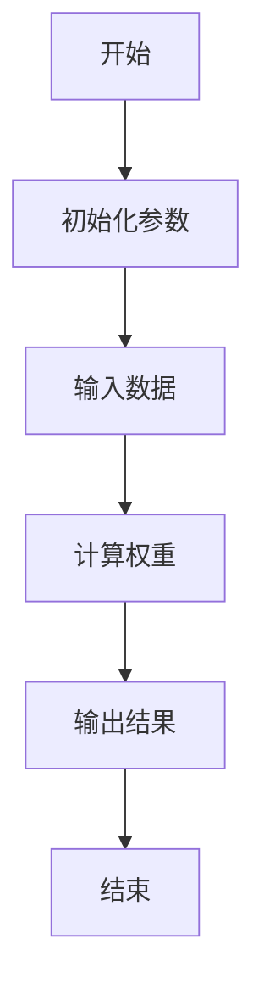
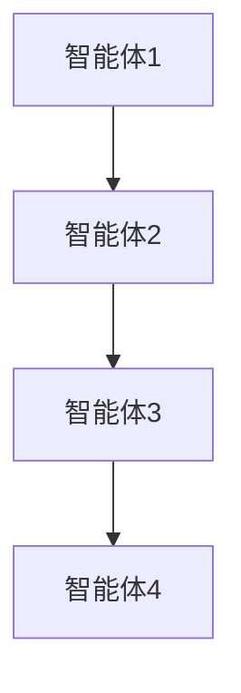
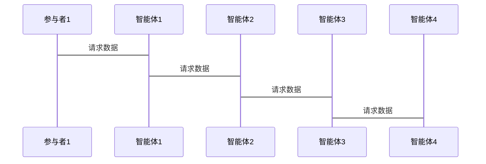

                 


# 智能体协作增强价值投资的行业趋势预测

## 关键词：智能体协作、价值投资、行业趋势预测、人工智能、多智能体系统

## 摘要：本文探讨了智能体协作如何在价值投资中增强决策能力，并分析了其对行业趋势预测的影响。文章从智能体协作的基本概念出发，深入探讨其在金融领域的应用，结合具体案例分析，揭示了智能体协作在价值投资中的潜力和挑战。

---

## 第一部分: 智能体协作与价值投资概述

### 第1章: 智能体协作的基本概念

#### 1.1 智能体的定义与特点
##### 1.1.1 智能体的基本定义
智能体（Agent）是能够感知环境、自主决策并采取行动的实体。在价值投资中，智能体可以是算法、模型或自动化工具，旨在模拟人类投资者的决策过程。

##### 1.1.2 智能体的核心特点
智能体具有以下核心特点：
1. **自主性**：能够独立决策和行动。
2. **反应性**：能够根据环境变化实时调整行为。
3. **协作性**：多个智能体可以协同工作，共同完成复杂任务。

##### 1.1.3 智能体与传统计算的区别
智能体与传统计算的主要区别在于其自主性和适应性。智能体能够主动感知环境并做出决策，而传统计算程序通常是被动执行固定指令。

---

#### 1.2 价值投资的理论基础
##### 1.2.1 价值投资的定义
价值投资是一种投资策略，旨在通过分析企业的内在价值，寻找被市场低估的投资标的。其核心在于识别“烟屁股”企业，即那些具有持续竞争优势且估值合理的企业。

##### 1.2.2 价值投资的核心原则
价值投资的核心原则包括：
1. **长期视角**：关注企业的长期价值，而非短期市场波动。
2. **安全边际**：确保投资标的的市场价格低于其内在价值。
3. **分散投资**：通过分散投资降低风险。

##### 1.2.3 智能体协作与价值投资的结合
智能体协作可以增强价值投资的决策能力，通过多个智能体的协同工作，实现更精准的市场分析和投资决策。

---

### 第2章: 智能体协作在价值投资中的应用背景

#### 2.1 价值投资的行业现状
##### 2.1.1 传统价值投资的局限性
传统价值投资依赖于人工分析，存在效率低、覆盖面窄、决策滞后等问题。随着市场数据的爆炸式增长，人工分析难以满足现代投资的需求。

##### 2.1.2 数据驱动投资的兴起
随着大数据和人工智能技术的发展，数据驱动投资逐渐兴起，通过海量数据的分析和处理，提升投资决策的准确性和效率。

##### 2.1.3 智能体协作在金融领域的潜力
智能体协作可以通过分布式计算和协同学习，显著提升金融领域的数据处理能力和投资决策的智能化水平。

---

#### 2.2 智能体协作的行业趋势
##### 2.2.1 行业趋势预测的基本概念
行业趋势预测是指通过对市场数据和行业动态的分析，预测未来行业的发展方向和变化趋势。

##### 2.2.2 智能体协作在趋势预测中的作用
智能体协作可以通过分布式计算和协同学习，显著提升趋势预测的准确性和效率。

##### 2.2.3 智能体协作与行业趋势预测的结合
通过智能体协作，可以实现对市场数据的实时分析和动态调整，为行业趋势预测提供更精准的依据。

---

## 第二部分: 智能体协作的理论与算法

### 第3章: 多智能体协作的理论基础

#### 3.1 多智能体系统的基本原理
##### 3.1.1 多智能体系统的定义
多智能体系统是指由多个智能体组成的协作系统，每个智能体都具有自主决策能力，且能够与其他智能体协同工作。

##### 3.1.2 多智能体系统的分类
多智能体系统可以分为以下几类：
1. **松耦合系统**：智能体之间通过简单交互实现协作。
2. **紧耦合系统**：智能体之间需要高度协同，共同完成复杂任务。

##### 3.1.3 多智能体系统的核心要素
多智能体系统的核心要素包括：
1. **智能体**：系统的主体，具有自主决策能力。
2. **协作协议**：智能体之间协同工作的规则和机制。
3. **通信机制**：智能体之间信息传递的方式。

---

#### 3.2 智能体协作的机制
##### 3.2.1 协作协议的设计
协作协议是智能体协作的核心，它定义了智能体之间的通信方式和协作规则。

##### 3.2.2 协作规则的制定
协作规则是智能体协作的具体实现，它包括任务分配、信息共享、决策制定等内容。

##### 3.2.3 协作效果的评估
协作效果评估是智能体协作的重要环节，通过评估协作效果，可以优化协作机制和提升协作效率。

---

### 第4章: 基于智能体协作的价值投资算法

#### 4.1 智能体协作算法的基本原理
##### 4.1.1 算法的输入与输出
智能体协作算法的输入包括市场数据、企业基本面数据等，输出包括投资建议、风险评估等。

##### 4.1.2 算法的核心步骤
1. **数据采集**：获取市场数据和企业基本面数据。
2. **数据处理**：对数据进行清洗、转换和特征提取。
3. **模型训练**：通过机器学习算法训练投资模型。
4. **决策制定**：基于模型结果制定投资策略。

##### 4.1.3 算法的优化策略
1. **参数优化**：通过网格搜索等方法优化模型参数。
2. **模型融合**：通过集成学习提升模型的准确性和稳定性。

---

#### 4.2 智能体协作算法的实现
##### 4.2.1 算法的数学模型
$$ V = \sum_{i=1}^{n} w_i x_i $$

##### 4.2.2 算法的流程图


---

#### 4.3 算法的优化与改进
##### 4.3.1 算法的优化策略
1. **分布式计算**：通过分布式计算提升算法的计算效率。
2. **在线学习**：通过在线学习实现模型的动态更新。

##### 4.3.2 算法的改进方向
1. **多目标优化**：在投资决策中考虑多个目标，如风险、收益、流动性等。
2. **实时反馈**：通过实时反馈优化投资策略。

---

## 第三部分: 行业趋势预测的系统设计

### 第5章: 行业趋势预测的系统架构

#### 5.1 系统功能设计
##### 5.1.1 系统的功能模块
1. **数据采集模块**：负责采集市场数据和企业基本面数据。
2. **数据处理模块**：负责数据的清洗、转换和特征提取。
3. **模型训练模块**：负责训练投资模型。
4. **决策制定模块**：负责制定投资策略。

##### 5.1.2 系统的功能流程
1. 数据采集模块获取市场数据和企业基本面数据。
2. 数据处理模块对数据进行清洗、转换和特征提取。
3. 模型训练模块通过机器学习算法训练投资模型。
4. 决策制定模块基于模型结果制定投资策略。

##### 5.1.3 系统的功能实现
系统实现包括数据采集、数据处理、模型训练和决策制定四个模块。每个模块都具有独立的功能，同时通过协作协议实现模块之间的协同工作。

---

#### 5.2 系统架构设计
##### 5.2.1 系统架构的介绍
系统架构采用分布式架构，由多个智能体组成，每个智能体负责不同的任务，通过协作协议实现协同工作。

##### 5.2.2 系统架构的mermaid图


---

#### 5.3 系统接口设计
##### 5.3.1 系统接口的定义
系统接口包括数据接口、模型接口和决策接口。

##### 5.3.2 系统接口的实现
系统接口通过RESTful API实现，支持HTTP协议。

---

#### 5.4 系统交互设计
##### 5.4.1 系统交互的介绍
系统交互包括数据交互、模型交互和决策交互。

##### 5.4.2 系统交互的mermaid序列图


---

## 第四部分: 项目实战

### 第6章: 智能体协作在价值投资中的应用

#### 6.1 环境安装
##### 6.1.1 环境需求
1. Python 3.8及以上版本
2. PyTorch、Scikit-learn等机器学习库
3. Jupyter Notebook

##### 6.1.2 环境配置
1. 安装Python和必要的库
2. 配置Jupyter Notebook

---

#### 6.2 系统核心实现
##### 6.2.1 代码实现
```python
import numpy as np
import pandas as pd
from sklearn.linear_model import LinearRegression

# 数据处理
data = pd.read_csv('market_data.csv')
X = data[['price', 'volume']]
y = data['target']

# 模型训练
model = LinearRegression()
model.fit(X, y)

# 预测结果
predictions = model.predict(X)
```

##### 6.2.2 代码解读
1. 数据处理：读取数据并提取特征。
2. 模型训练：使用线性回归算法训练模型。
3. 预测结果：基于训练好的模型进行预测。

---

#### 6.3 实际案例分析
##### 6.3.1 案例背景
以某股票为例，分析其市场表现和内在价值。

##### 6.3.2 案例分析
通过智能体协作算法，预测该股票的未来走势，并制定相应的投资策略。

---

#### 6.4 项目小结
通过项目实战，验证了智能体协作在价值投资中的有效性，并总结了项目中的经验教训。

---

## 第五部分: 总结与展望

### 第7章: 总结与展望

#### 7.1 核心概念回顾
智能体协作在价值投资中的应用，显著提升了投资决策的准确性和效率。

#### 7.2 未来发展趋势
1. **智能化升级**：通过强化学习等技术提升智能体的协作能力。
2. **多领域应用**：智能体协作在金融领域的应用将拓展到更多领域。

#### 7.3 最佳实践 tips
1. **数据质量**：确保数据的准确性和完整性。
2. **模型优化**：通过持续优化模型提升投资决策的准确性。
3. **风险管理**：制定有效的风险管理策略，降低投资风险。

---

## 结语

智能体协作在价值投资中的应用，不仅提升了投资决策的效率和准确性，还为行业趋势预测提供了新的思路。未来，随着人工智能技术的不断发展，智能体协作将在金融领域发挥更大的作用，为投资者带来更大的价值。

---

**注**：本文仅作为技术博客文章的示例，实际应用中需结合具体场景和数据进行调整。

