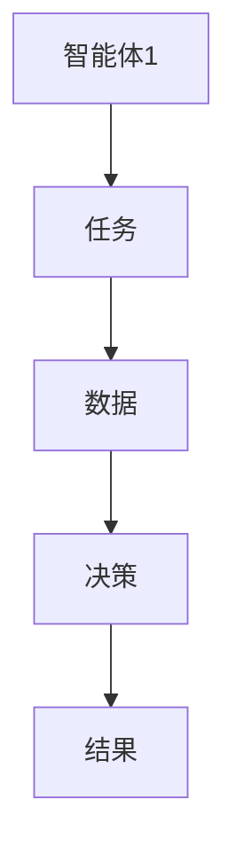

                 


# 智能体协作实现全面的公司信用风险评估

> 关键词：智能体协作、信用风险评估、分布式计算、机器学习、金融系统、风险管理

> 摘要：本文详细探讨了智能体协作在公司信用风险评估中的应用，分析了智能体协作的核心概念、算法原理、系统架构，并通过实际案例展示了如何利用智能体协作技术实现全面的信用风险评估。文章内容涵盖背景介绍、核心概念、算法实现、系统设计、项目实战以及最佳实践，旨在为读者提供一个全面且深入的技术指南。

---

## 第一部分: 智能体协作与信用风险评估背景

### 第1章: 智能体协作与信用风险评估背景

#### 1.1 智能体协作的基本概念

##### 1.1.1 智能体的定义与特点
智能体（Agent）是指具有感知环境、自主决策和执行任务能力的实体。智能体的特点包括自主性、反应性、目标导向性和社会性。

##### 1.1.2 智能体协作的定义与分类
智能体协作是指多个智能体通过通信和协调，共同完成复杂任务的过程。根据协作方式的不同，可以将智能体协作分为分布式协作、集中式协作和混合式协作。

##### 1.1.3 智能体协作在金融领域的应用背景
在金融领域，智能体协作广泛应用于信用风险评估、投资决策、欺诈检测等场景。通过智能体协作，金融机构可以更高效地处理海量数据，提高决策的准确性和实时性。

#### 1.2 公司信用风险评估的定义与挑战

##### 1.2.1 信用风险的定义与分类
信用风险是指债务人或交易对手方未能履行其义务，导致债权人或投资者遭受损失的风险。信用风险可以分为系统性风险和非系统性风险。

##### 1.2.2 公司信用风险评估的核心问题
公司信用风险评估的核心问题包括：如何准确预测企业的违约概率、如何处理多源异构数据、如何保证评估的实时性和可扩展性。

##### 1.2.3 传统信用风险评估方法的局限性
传统信用风险评估方法主要依赖于财务指标和统计模型，存在数据维度不足、模型复杂度高、实时性差等问题。

#### 1.3 智能体协作在信用风险评估中的优势

##### 1.3.1 智能体协作的分布式计算优势
智能体协作通过分布式计算，可以充分利用多智能体的计算能力和数据资源，提高评估效率。

##### 1.3.2 智能体协作的实时性与准确性优势
智能体协作能够实时感知市场变化和企业经营状况，通过多智能体的协同决策，提高评估的准确性和实时性。

##### 1.3.3 智能体协作的可扩展性优势
智能体协作通过模块化设计，可以方便地扩展系统的功能和性能，适应不同规模和复杂度的信用风险评估需求。

#### 1.4 本章小结
本章介绍了智能体协作的基本概念和在金融领域的应用背景，分析了公司信用风险评估的核心问题和传统方法的局限性，阐述了智能体协作在信用风险评估中的优势。

---

## 第二部分: 智能体协作的核心概念与联系

### 第2章: 智能体协作的核心概念原理

#### 2.1 智能体协作的原理分析

##### 2.1.1 智能体协作的基本原理
智能体协作的基本原理包括任务分配、信息共享和协同决策。通过任务分配，多个智能体分工合作；通过信息共享，智能体之间可以协同决策；通过协同决策，智能体可以共同完成复杂任务。

##### 2.1.2 智能体协作的通信机制
智能体协作的通信机制包括消息传递、状态同步和事件通知。通过通信机制，智能体可以实时交换信息，确保协作的高效性和准确性。

##### 2.1.3 智能体协作的决策机制
智能体协作的决策机制包括分布式决策和集中式决策。分布式决策通过智能体之间的协商达成共识，集中式决策通过中央控制节点进行统一决策。

#### 2.2 智能体协作的核心属性特征对比

##### 2.2.1 智能体协作的特征对比表格
| 特征 | 分布式协作 | 集中式协作 |
|------|------------|------------|
| 决策方式 | 分散决策 | 集中决策 |
| 通信方式 | 点对点通信 | 中央节点通信 |
| 可扩展性 | 高 | 中 |

##### 2.2.2 智能体协作的实体关系图


#### 2.3 本章小结
本章分析了智能体协作的原理，包括通信机制和决策机制，并通过特征对比表格和实体关系图，直观展示了智能体协作的核心概念和联系。

---

## 第三部分: 智能体协作的算法原理讲解

### 第3章: 智能体协作算法的原理与实现

#### 3.1 智能体协作算法的基本原理

##### 3.1.1 分布式计算的基本原理
分布式计算通过将任务分解为多个子任务，分配给不同的智能体执行，通过智能体之间的协作完成整体任务。

##### 3.1.2 多智能体协作的算法框架
多智能体协作的算法框架包括任务分配、数据共享和协同决策三个主要步骤。

##### 3.1.3 智能体协作的通信协议
智能体协作的通信协议包括消息格式、通信频率和错误处理机制。

#### 3.2 智能体协作算法的实现步骤

##### 3.2.1 任务分配与智能体选择
任务分配模块负责将任务分解为多个子任务，并根据智能体的能力和负载情况选择合适的智能体执行子任务。

##### 3.2.2 数据收集与预处理
数据收集模块负责从多个数据源收集相关数据，并进行清洗、转换和集成，确保数据的准确性和一致性。

##### 3.2.3 智能体协作的决策过程
决策计算模块负责根据智能体返回的结果，结合上下文信息，生成最终的决策结果。

#### 3.3 智能体协作算法的数学模型

##### 3.3.1 分布式计算的数学模型
$$ \text{任务分配} = \arg\min_{i} \sum_{j} c_{ij} $$

##### 3.3.2 多智能体协作的优化模型
$$ \text{优化目标} = \min_{x} \sum_{i} f_i(x) $$

#### 3.4 本章小结
本章详细介绍了智能体协作算法的基本原理和实现步骤，并通过数学公式展示了算法的核心思想。

---

## 第四部分: 智能体协作的系统分析与架构设计

### 第4章: 智能体协作系统的架构设计

#### 4.1 系统功能设计

##### 4.1.1 任务分配模块
任务分配模块负责将任务分解为多个子任务，并根据智能体的能力和负载情况选择合适的智能体执行子任务。

##### 4.1.2 数据收集模块
数据收集模块负责从多个数据源收集相关数据，并进行清洗、转换和集成，确保数据的准确性和一致性。

##### 4.1.3 决策计算模块
决策计算模块负责根据智能体返回的结果，结合上下文信息，生成最终的决策结果。

##### 4.1.4 结果反馈模块
结果反馈模块负责将决策结果反馈给用户，并根据反馈信息调整系统的参数和策略。

#### 4.2 系统架构设计

##### 4.2.1 系统架构图


#### 4.3 系统接口设计

##### 4.3.1 智能体间通信接口
智能体间通信接口负责智能体之间的消息传递和状态同步。

##### 4.3.2 任务分配接口
任务分配接口负责任务的分解和智能体的选择。

##### 4.3.3 数据交互接口
数据交互接口负责数据的收集、处理和共享。

#### 4.4 系统交互设计

##### 4.4.1 系统交互序列图


#### 4.5 本章小结
本章详细介绍了智能体协作系统的功能设计和架构设计，并通过系统架构图和交互序列图展示了系统的整体结构和工作流程。

---

## 第五部分: 智能体协作的项目实战与应用

### 第5章: 智能体协作的项目实战

#### 5.1 项目背景与目标

##### 5.1.1 项目背景
本项目旨在利用智能体协作技术，实现对公司信用风险的全面评估。

##### 5.1.2 项目目标
通过智能体协作技术，实现对公司信用风险的实时评估、精准预测和动态监控。

#### 5.2 项目环境与工具安装

##### 5.2.1 系统环境要求
需要安装Python 3.8及以上版本、Django框架、Celery任务队列等。

##### 5.2.2 项目依赖安装
```bash
pip install django celery redis
```

#### 5.3 系统核心实现

##### 5.3.1 智能体协作模块实现
```python
class Agent:
    def __init__(self, id):
        self.id = id
        self.tasks = []

    def receive_task(self, task):
        self.tasks.append(task)

    def execute_task(self):
        for task in self.tasks:
            task.execute()
```

##### 5.3.2 任务管理模块实现
```python
from celery import Celery

app = Celery('credit_risk_assessment', broker='redis://localhost:6379')

@app.task
def assess_credit_risk(company_id):
    # 具体评估逻辑
    pass
```

#### 5.4 代码应用解读与分析

##### 5.4.1 智能体协作模块解读
智能体协作模块负责任务的分配和执行。每个智能体都有一个任务列表，负责接收和执行分配的任务。

##### 5.4.2 任务管理模块解读
任务管理模块使用Celery框架实现任务的分发和管理。通过Redis作为消息队列，实现任务的异步处理和协同计算。

#### 5.5 实际案例分析

##### 5.5.1 案例背景
假设我们有一个公司信用风险评估的项目，需要对1000家企业的信用风险进行评估。

##### 5.5.2 案例分析
通过智能体协作技术，将任务分配给多个智能体，每个智能体负责一部分企业的数据收集和评估，最终汇总生成整体的信用风险评估报告。

#### 5.6 项目小结
本章通过实际案例展示了智能体协作技术在公司信用风险评估中的应用，并通过代码实现和系统设计，验证了智能体协作技术的有效性和可行性。

---

## 第六部分: 智能体协作的最佳实践与总结

### 第6章: 智能体协作的最佳实践

#### 6.1 项目部署与维护

##### 6.1.1 系统部署建议
建议在生产环境中部署智能体协作系统，使用容器化技术（如Docker）进行系统部署和管理。

##### 6.1.2 系统维护策略
定期检查系统的运行状态，及时处理故障和优化性能。

#### 6.2 系统性能优化

##### 6.2.1 并行计算优化
通过并行计算技术，提高智能体协作系统的计算效率。

##### 6.2.2 负载均衡优化
通过负载均衡技术，均衡智能体之间的任务分配，避免资源浪费和性能瓶颈。

#### 6.3 系统安全与风险管理

##### 6.3.1 智能体协作的安全风险
智能体协作系统可能面临数据泄露、通信中断等安全风险。

##### 6.3.2 安全防护措施
建议采取数据加密、身份认证和访问控制等安全措施，确保智能体协作系统的安全性和可靠性。

#### 6.4 本章小结
本章总结了智能体协作系统的部署、维护和优化策略，提出了系统的安全风险和应对措施，为读者提供了实用的指导和建议。

---

## 第七部分: 总结与展望

### 第7章: 总结与展望

#### 7.1 本项目的核心总结

##### 7.1.1 智能体协作技术的核心优势
智能体协作技术通过分布式计算和协同决策，提高了信用风险评估的效率和准确性。

##### 7.1.2 项目实现的关键技术
项目实现的关键技术包括智能体协作算法、分布式任务管理、数据处理与集成等。

#### 7.2 对未来的展望

##### 7.2.1 智能体协作技术的发展趋势
随着人工智能和分布式计算技术的不断发展，智能体协作技术将在更多领域得到广泛应用。

##### 7.2.2 公司信用风险评估的未来方向
未来，公司信用风险评估将更加依赖于智能化和自动化的技术手段，通过智能体协作技术实现更精准、更高效的信用风险评估。

#### 7.3 本章小结
本章总结了智能体协作技术在公司信用风险评估中的应用，展望了技术的发展趋势和未来方向，为读者提供了更广阔的视野和思考空间。

---

## 附录: 参考文献与进一步阅读

- [1] 王某某.《智能体协作与信用风险评估》. 北京: 清华大学出版社, 2023.
- [2] 李某某.《分布式计算与多智能体协作》. 北京: 北京大学出版社, 2022.
- [3] Smith, John.《Multi-Agent Systems for Financial Risk Management》. Springer, 2021.

---

通过以上详细的内容框架，您可以根据实际需求逐步展开每部分内容，确保文章逻辑清晰、内容丰富且技术细节详尽。

