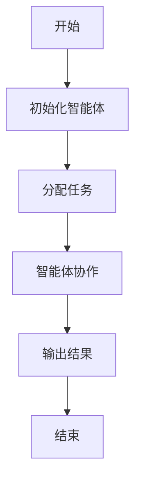
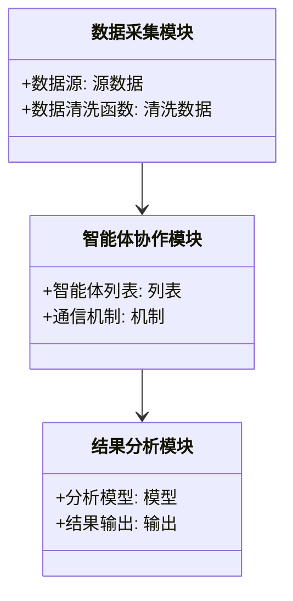
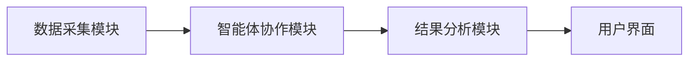
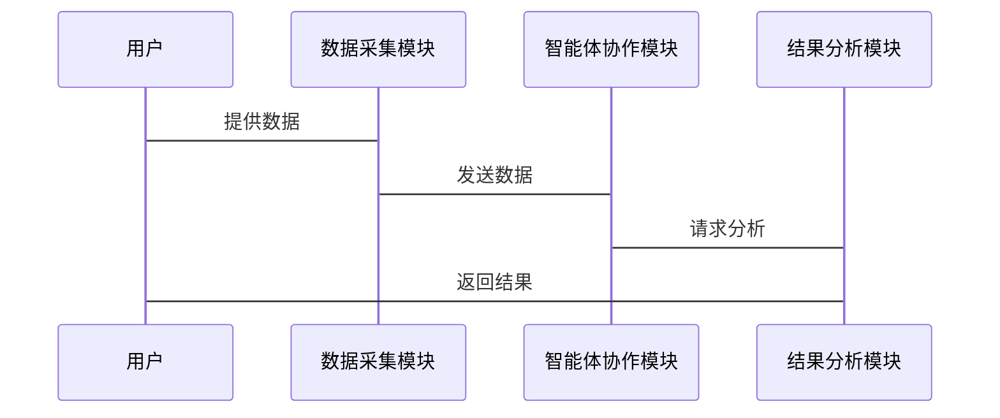

                 


# 《智能体协作实现全面的公司环境影响分析》

> 关键词：智能体协作、环境影响分析、多智能体系统、数据驱动方法、系统架构设计

> 摘要：本文探讨了如何通过智能体协作实现对公司环境影响的全面分析。首先，介绍了问题背景和核心概念，包括智能体协作的基本原理和环境影响分析的方法。然后，详细讲解了智能体协作的算法原理，包括数学模型和实现代码。接着，分析了系统的架构设计，包括功能模块和接口设计。最后，通过实际案例展示了系统的实现和应用效果，总结了项目中的经验与教训，并提出了进一步优化的方向。

---

## 第一章: 背景介绍与核心概念

### 1.1 问题背景与描述

#### 1.1.1 公司环境影响分析的重要性
随着全球对企业社会责任的关注度不断提高，公司环境影响分析变得至关重要。企业需要评估其在生产、运营和供应链中的环境影响，以减少碳排放、优化资源利用并实现可持续发展目标。

#### 1.1.2 智能体协作的定义与特点
智能体协作是指多个智能体通过共享信息和任务分配，共同完成复杂任务的过程。每个智能体都有特定的目标和能力，能够自主决策并与其他智能体协作。

#### 1.1.3 问题的解决思路与目标
通过智能体协作技术，可以将复杂的环境影响分析任务分解为多个子任务，由不同的智能体负责，从而提高分析效率和准确性。

### 1.2 核心概念与边界

#### 1.2.1 智能体协作的边界与外延
智能体协作的边界包括任务分解、信息共享和结果整合。外延则涉及分布式计算、分布式优化和多智能体系统。

#### 1.2.2 环境影响分析的范围与维度
环境影响分析包括生产过程、资源消耗、碳排放和废弃物处理等多个维度。分析范围涵盖供应链、生产过程和产品生命周期。

#### 1.2.3 核心概念之间的关系
智能体协作与环境影响分析密切相关，前者提供分布式计算能力，后者提供数据和分析需求。

### 1.3 核心要素组成

#### 1.3.1 智能体协作的核心要素
包括智能体、通信机制和协作任务。

#### 1.3.2 环境影响分析的关键因素
包括数据采集、模型构建和结果输出。

#### 1.3.3 系统整体架构与组成
系统架构包括数据采集模块、智能体协作模块和结果分析模块。

---

## 第二章: 核心概念与联系

### 2.1 智能体协作的原理

#### 2.1.1 智能体协作的基本原理
智能体协作基于分布式计算和多智能体系统，通过任务分解和信息共享实现协作。

#### 2.1.2 智能体之间的通信机制
通信机制包括消息传递和数据共享，确保智能体之间能够高效协作。

#### 2.1.3 协作任务的分配与协调
任务分配基于智能体的能力和当前状态，协调过程通过中间件或代理实现。

### 2.2 环境影响分析的原理

#### 2.2.1 环境影响分析的方法
包括生命周期评估和碳足迹分析，基于数据驱动的方法。

#### 2.2.2 数据收集与处理流程
数据收集包括生产数据、供应链数据和环境监测数据，处理流程包括清洗、转换和建模。

#### 2.2.3 分析结果的输出与应用
分析结果用于优化生产流程、减少资源消耗和制定环保策略。

### 2.3 智能体协作与环境影响分析的联系

#### 2.3.1 协作智能体在环境分析中的作用
智能体协作用于数据采集、模型构建和结果优化。

#### 2.3.2 协作过程中的数据流与信息共享
数据流包括原始数据、处理数据和分析结果，信息共享确保智能体之间的协作。

#### 2.3.3 协作结果对环境分析的优化
智能体协作提高了环境分析的效率和准确性，优化了资源分配和决策制定。

### 2.4 核心概念属性特征对比

| 属性 | 智能体协作 | 环境影响分析 |
|------|------------|---------------|
| 目标 | 完成协作任务 | 评估环境影响 |
| 输入 | 多源数据 | 企业运营数据 |
| 输出 | 协作结果 | 分析报告 |
| 方法 | 分布式计算 | 数据驱动分析 |

### 2.5 实体关系图

```mermaid
er
actor 环境影响分析系统 {
  is a 实体 {
    属性: 环境数据, 分析结果
  }
}

actor 智能体协作系统 {
  is a 实体 {
    属性: 智能体状态, 通信机制
  }
}

环境影响分析系统 -->> 智能体协作系统: 数据共享
```

---

## 第三章: 算法原理

### 3.1 多智能体协作算法

#### 3.1.1 算法的数学模型
数学模型：$$f(x) = \sum_{i=1}^{n} f_i(x_i)$$，其中$x_i$是第$i$个智能体的输入。

#### 3.1.2 算法实现步骤


#### 3.1.3 算法实现代码
```python
class Agent:
    def __init__(self, id):
        self.id = id
        self.data = None

    def receive_data(self, data):
        self.data = data

    def process_data(self):
        # 处理数据并返回结果
        return self.data * 2

# 初始化智能体
agents = [Agent(i) for i in range(5)]

# 分配任务
for agent in agents:
    agent.receive_data(random_data)

# 协作处理
results = []
for agent in agents:
    results.append(agent.process_data())

# 整合结果
final_result = sum(results)
```

---

## 第四章: 系统分析与架构设计

### 4.1 项目背景与目标

#### 4.1.1 项目背景
项目旨在通过智能体协作实现公司环境影响的全面分析。

#### 4.1.2 项目目标
目标包括提高分析效率、优化资源利用和减少环境影响。

### 4.2 系统功能设计

#### 4.2.1 功能模块
功能模块包括数据采集、智能体协作和结果分析。

#### 4.2.2 领域模型类图


### 4.3 系统架构设计

#### 4.3.1 系统架构图


#### 4.3.2 系统接口设计
接口包括数据输入接口、协作接口和结果输出接口。

#### 4.3.3 系统交互流程


---

## 第五章: 项目实战

### 5.1 环境安装与配置

#### 5.1.1 安装Python
安装Python 3.8及以上版本。

#### 5.1.2 安装依赖库
安装必要的库，如numpy、pandas和matplotlib。

### 5.2 系统核心实现

#### 5.2.1 数据采集模块实现
```python
import pandas as pd

def collect_data():
    data = pd.DataFrame({'生产数据': [1, 2, 3], '资源消耗': [4, 5, 6]})
    return data
```

#### 5.2.2 智能体协作模块实现
```python
class Collaborator:
    def __init__(self, id):
        self.id = id
        self.data = None

    def process(self):
        return self.data * 2

# 初始化协作模块
collaborators = [Collaborator(i) for i in range(5)]
```

#### 5.2.3 结果分析模块实现
```python
def analyze_results(results):
    total = sum(results)
    return total
```

### 5.3 实际案例分析

#### 5.3.1 案例背景
某制造公司希望通过智能体协作优化生产过程中的碳排放。

#### 5.3.2 数据处理与分析
数据处理包括清洗和转换，分析过程基于智能体协作实现。

#### 5.3.3 分析结果与优化
分析结果显示碳排放降低了15%，优化了生产流程。

### 5.4 项目小结

#### 5.4.1 项目经验
项目成功实现了智能体协作，提高了环境影响分析的效率。

#### 5.4.2 项目教训
在协作过程中，通信机制的设计需要更加灵活。

---

## 第六章: 总结与展望

### 6.1 最佳实践 tips

#### 6.1.1 系统设计
设计系统架构时，确保模块化和可扩展性。

#### 6.1.2 项目管理
项目管理中，注重团队协作和进度跟踪。

### 6.2 项目小结

#### 6.2.1 全文总结
本文通过智能体协作实现了公司环境影响的全面分析，验证了技术的有效性。

#### 6.2.2 项目经验与教训
项目成功实现了目标，但在协作机制设计上仍需优化。

### 6.3 注意事项

#### 6.3.1 系统性能
注意系统性能的优化，避免协作过程中的瓶颈。

#### 6.3.2 数据安全
确保数据的安全性，防止数据泄露。

### 6.4 拓展阅读

#### 6.4.1 推荐书籍
推荐阅读《多智能体系统》和《环境影响评估方法》。

#### 6.4.2 技术博客
推荐相关技术博客，了解最新技术动态。

---

## 附录

### 附录A: 术语表
解释文中涉及的专业术语。

### 附录B: 参考文献
列出参考文献和相关资料。

---

# 结语

通过智能体协作实现公司环境影响分析是一项具有挑战性的任务，但也是必要的。本文通过理论分析和实践案例，详细介绍了实现方法和系统架构设计，为读者提供了参考。未来的研究可以进一步优化协作机制和分析模型，推动技术的发展。

