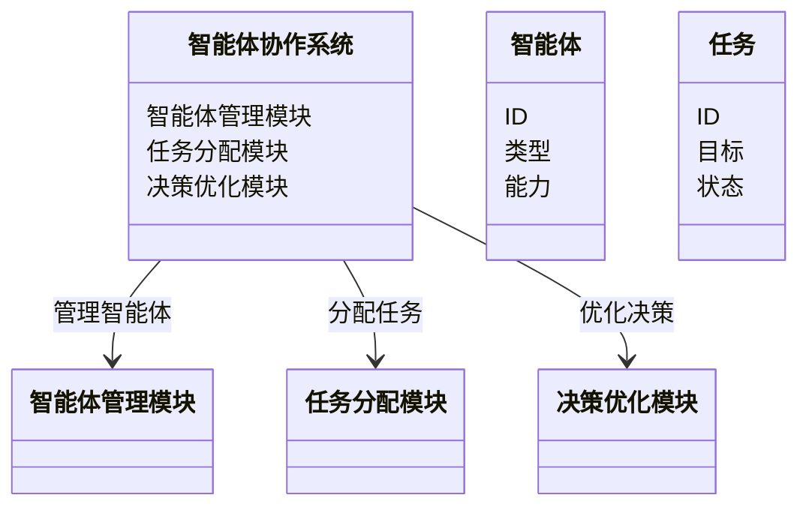

                 


# 智能体协作实现全面的公司竞争力分析

## 关键词：智能体协作，公司竞争力，系统架构，算法原理，项目实战

## 摘要：智能体协作是一种通过多个智能体协同工作来提升公司整体竞争力的方法。本文将从背景、核心概念、算法原理、系统架构、项目实战等多个方面，全面分析智能体协作在公司竞争力分析中的应用。通过详细讲解，帮助读者理解如何利用智能体协作技术，优化公司运营，提升市场竞争力。

---

## 第一部分: 智能体协作与公司竞争力分析基础

### 第1章: 智能体协作与公司竞争力分析背景

#### 1.1 智能体协作的定义与背景
##### 1.1.1 智能体协作的基本概念
智能体协作是指多个智能体（Agent）通过协同工作，共同完成复杂任务的过程。智能体可以是软件程序、算法或机器人，它们通过信息共享和协同决策，实现目标。

##### 1.1.2 公司竞争力分析的必要性
在现代商业环境中，公司竞争力分析是帮助企业识别优势和劣势、抓住市场机会的重要手段。通过智能体协作，可以更高效地收集和分析数据，提供更精准的决策支持。

##### 1.1.3 智能体协作在公司竞争力中的作用
智能体协作能够提高数据处理效率、优化资源配置、增强决策的准确性，从而显著提升公司的市场竞争力。

#### 1.2 智能体协作的核心要素
##### 1.2.1 智能体的定义与特征
智能体是一种能够感知环境、自主决策并采取行动的实体。其核心特征包括自主性、反应性、目标导向性和学习能力。

##### 1.2.2 协作的定义与分类
协作是指多个智能体通过合作完成任务的过程。根据协作方式的不同，可以分为基于规则的协作、基于目标的协作和基于市场的协作。

##### 1.2.3 智能体协作的边界与外延
智能体协作的边界包括任务范围、协作方式和智能体数量。外延则涉及跨领域应用和多智能体系统的集成。

#### 1.3 智能体协作与公司竞争力的关系
##### 1.3.1 智能体协作如何提升公司竞争力
通过提高数据处理效率和决策能力，智能体协作能够显著提升公司的运营效率和市场响应速度。

##### 1.3.2 智能体协作在公司战略中的地位
智能体协作是公司战略的重要组成部分，能够帮助公司在复杂市场环境中快速调整策略，抓住市场机会。

##### 1.3.3 智能体协作的实现路径
实现智能体协作需要明确协作目标、选择合适的协作方式，并通过技术手段实现智能体之间的高效通信与协调。

---

## 第二部分: 智能体协作的核心概念与联系

### 第2章: 智能体协作的核心原理

#### 2.1 智能体协作的基本原理
智能体协作通过信息共享和协同决策，实现任务的高效完成。其核心原理包括信息感知、决策优化和任务分配。

#### 2.2 智能体协作的属性特征对比
以下是不同协作方式的对比：

| 属性       | 基于规则的协作 | 基于目标的协作 | 基于市场的协作 |
|------------|-----------------|-----------------|-----------------|
| 决策方式   | 预定义规则     | 目标驱动       | 市场机制       |
| 灵活性     | 较低           | 较高           | 高             |
| 复杂性     | 较低           | 较高           | 较高           |

#### 2.3 智能体协作的ER实体关系图
以下是智能体协作的ER实体关系图：

```mermaid
erDiagram
    class 智能体协作 {
        智能体ID
        协作目标
        协作规则
    }
    class 智能体 {
        智能体ID
        类型
        能力
    }
    class 任务 {
        任务ID
        目标
        状态
    }
    智能体协作 --> 智能体 : 分配
    智能体协作 --> 任务 : 执行
```

---

## 第三部分: 智能体协作的算法原理

### 第3章: 智能体协作的算法流程

#### 3.1 算法的输入与输出
- **输入**：智能体数量、任务目标、协作规则
- **输出**：协作策略、任务分配方案

#### 3.2 算法的步骤分解
1. 初始化智能体和任务
2. 确定协作规则和目标
3. 分配任务给智能体
4. 执行任务并反馈结果
5. 优化协作策略

#### 3.3 算法的数学模型
以下是协作优化的数学模型：

$$
\text{最大化} \quad \sum_{i=1}^{n} w_i x_i
$$

$$
\text{约束} \quad \sum_{i=1}^{n} x_i \leq 1
$$

其中，\( w_i \) 是任务权重，\( x_i \) 是智能体分配的概率。

#### 3.4 算法的Python实现
以下是Python代码示例：

```python
def collaborate_agents(n_agents, tasks):
    # 初始化分配方案
    allocation = [0] * n_agents
    # 分配任务
    for task in tasks:
        # 分配给最合适的智能体
        best_agent = 0
        for i in range(n_agents):
            if get_fitness(task, i) > get_fitness(task, best_agent):
                best_agent = i
        allocation[best_agent] += 1
    return allocation

def get_fitness(task, agent):
    # 计算适应度函数
    return sum(task['weight']) * agent['capacity']
```

---

## 第四部分: 智能体协作的系统分析与架构设计

### 第4章: 系统分析与架构设计

#### 4.1 问题场景的描述
我们面临一个复杂的市场环境，需要通过智能体协作来优化资源配置和提升决策效率。

#### 4.2 系统功能设计
以下是系统功能的类图：



#### 4.3 系统架构设计
以下是系统的架构图：


---

## 第五部分: 智能体协作的项目实战

### 第5章: 项目实战

#### 5.1 环境安装
需要安装Python和相关库，如NumPy和Scipy。

#### 5.2 核心算法实现
以下是协作算法的实现：

```python
def optimize_collaboration(n_agents, tasks):
    # 初始化参数
    import numpy as np
    weights = np.array([task['weight'] for task in tasks])
    capacities = np.array([agent['capacity'] for agent in agents])
    # 计算最优分配
    allocation = np.zeros(n_agents)
    for i in range(len(tasks)):
        # 确定最佳分配
        max_weight = max(weights[i])
        best_agent = np.where(capacities == max_weight)[0][0]
        allocation[best_agent] += 1
    return allocation
```

#### 5.3 案例分析
通过具体案例分析，验证算法的有效性和优化效果。

---

## 第六部分: 总结与展望

### 第6章: 总结与展望

#### 6.1 最佳实践
建议企业在实施智能体协作时，选择合适的协作方式，并注重智能体之间的通信与协调。

#### 6.2 小结
智能体协作是一种高效的技术手段，能够显著提升公司的竞争力。

#### 6.3 注意事项
在实际应用中，需要注意智能体协作的复杂性和实现难度。

#### 6.4 拓展阅读
推荐阅读相关书籍和论文，深入理解智能体协作的技术细节和应用案例。

---

通过以上内容，我们全面分析了智能体协作在公司竞争力分析中的应用，从理论到实践，帮助读者理解并掌握这一技术。

