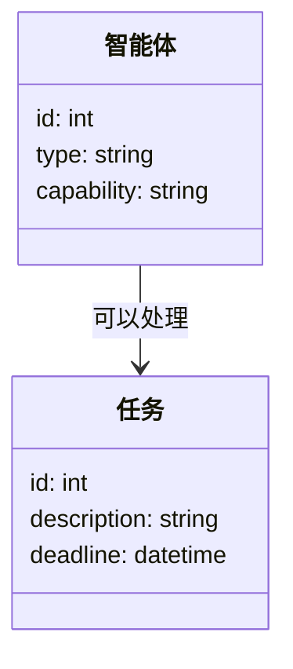

                 


# 智能体协作实现全面的竞争优势分析

## 关键词：智能体协作，人工智能，竞争优势，分布式系统，协作算法

## 摘要：智能体协作是一种通过多个智能体协同工作来实现复杂任务的技术，具有高效、灵活和智能的优势。本文将从背景、核心概念、算法原理、系统架构、项目实战等方面详细分析智能体协作的优势和实现方法，探讨其在各领域的广泛应用和未来的发展前景。

---

# 第1章 智能体协作的背景与核心概念

## 1.1 智能体协作的定义与背景

### 1.1.1 智能体的基本概念
智能体（Agent）是指具有感知环境、自主决策和执行任务能力的实体。智能体可以是软件程序、机器人或其他智能设备，具备以下核心特征：
- **自主性**：能够自主决策，无需外部干预。
- **反应性**：能实时感知环境并做出反应。
- **协作性**：能够与其他智能体或人类进行有效协作。

### 1.1.2 协作的定义与内涵
协作是指多个智能体通过共享信息、分配任务和协调行动，共同完成一个或多个目标的过程。协作的核心在于智能体之间的信息共享和协同决策。

### 1.1.3 智能体协作的演进历程
智能体协作经历了从简单协同到复杂协作的演进。早期的协作主要基于规则和预定义流程，随着人工智能技术的发展，协作逐渐走向自主化、智能化和分布式。

## 1.2 智能体协作的优势与应用场景

### 1.2.1 协作带来的竞争优势
智能体协作能够显著提高系统的效率和智能性。通过多个智能体的协作，可以实现任务的最优分配、资源的高效利用和复杂问题的快速解决。

### 1.2.2 智能体协作在不同领域的应用
智能体协作的应用场景广泛，包括：
- **自动驾驶**：车辆之间协作以优化交通流量。
- **智能家居**：设备协作以提供无缝的用户体验。
- **智能医疗**：医疗设备协作以提高诊断和治疗效率。
- **智能城市**：城市系统协作以实现资源优化和城市治理。

### 1.2.3 智能体协作的核心价值
智能体协作的核心价值在于通过协作实现单个智能体无法完成的任务，从而提高系统的整体性能和竞争力。

## 1.3 智能体协作与传统协作方法的对比

### 1.3.1 传统协作方法的局限性
传统协作方法依赖于固定的规则和流程，灵活性较差，难以应对动态变化的环境。

### 1.3.2 智能体协作的独特性
智能体协作具有自主性、反应性和灵活性，能够根据环境变化动态调整协作策略。

### 1.3.3 智能体协作的创新点
智能体协作的创新点在于通过自主决策和动态协作实现复杂任务的高效完成。

## 1.4 本章小结
本章介绍了智能体协作的背景、优势和应用场景，并对比了传统协作方法的局限性，突出了智能体协作的独特价值和创新性。

---

# 第2章 智能体协作的核心概念与联系

## 2.1 智能体协作的核心原理

### 2.1.1 智能体的属性与特征
智能体的属性包括：
- **自主性**：智能体能够自主决策。
- **反应性**：智能体能够实时感知环境并做出反应。
- **协作性**：智能体能够与其他智能体协作。
- **学习性**：智能体能够通过经验改进性能。

### 2.1.2 协作机制的分类
协作机制可以分为以下几类：
- **任务分配机制**：根据智能体的能力和任务需求分配任务。
- **信息共享机制**：智能体之间共享信息以提高协作效率。
- **决策协调机制**：协调多个智能体的决策以实现共同目标。

### 2.1.3 协作目标的确定
协作目标需要明确，例如在自动驾驶中，目标可能是避免碰撞和优化交通流量。

## 2.2 智能体协作的属性特征对比

### 2.2.1 表格对比不同协作机制的优缺点
| 协作机制 | 优点 | 缺点 |
|----------|------|------|
| 任务分配机制 | 高效性，任务分配合理 | 可能存在资源竞争 |
| 信息共享机制 | 提高协作效率 | 信息安全性问题 |
| 决策协调机制 | 实现共同目标 | 决策延迟 |

### 2.2.2 智能体协作的数学模型
协作的数学模型可以通过优化算法来表示，例如：
$$ \text{目标函数} = \sum_{i=1}^{n} f(x_i) $$
其中，$x_i$表示第i个智能体的决策变量，$f(x_i)$表示该决策的收益。

### 2.2.3 智能体协作的ER实体关系图
以下是智能体协作的ER实体关系图：

```mermaid
er
  actor 智能体 {
    id: int
    type: string
    capability: string
  }
  actor 任务 {
    id: int
    description: string
    deadline: datetime
  }
  智能体 -> 任务 : 可以处理
```

## 2.3 智能体协作的Mermaid流程图

### 2.3.1 智能体协作的核心流程
以下是智能体协作的核心流程：

```mermaid
graph TD
    A[智能体1] --> B[智能体2]: 信息共享
    B --> C[智能体3]: 任务分配
    C --> D[智能体4]: 决策协调
    D --> A: 协作完成
```

### 2.3.2 智能体协作的通信协议
智能体之间的通信协议可以采用基于消息队列的机制，例如：

```mermaid
sequence
    智能体1 -> 智能体2: 发送任务请求
    智能体2 -> 智能体3: 处理任务
    智能体3 -> 智能体1: 返回结果
```

### 2.3.3 智能体协作的决策机制
智能体协作的决策机制可以采用分布式决策算法，例如：

```mermaid
graph LR
    A[智能体1] --> B[智能体2]: 信息同步
    B --> C[智能体3]: 协作决策
    C --> D[智能体4]: 执行决策
```

## 2.4 本章小结
本章详细讲解了智能体协作的核心概念和协作机制，通过表格和Mermaid图展示了协作的内在联系和流程。

---

# 第3章 智能体协作的算法原理

## 3.1 分布式协作算法

### 3.1.1 分布式协作的定义
分布式协作是指多个智能体在没有中央控制的情况下自主协作，每个智能体都负责一部分任务的决策和执行。

### 3.1.2 分布式协作的核心算法
分布式协作的核心算法包括：
- **一致性算法**：例如Paxos算法，用于保证分布式系统中的数据一致性。
- **任务分配算法**：例如负载均衡算法，用于合理分配任务。

### 3.1.3 分布式协作的数学模型
以下是分布式协作的数学模型：

$$ \text{任务分配} = \argmin_{x_i} \sum_{i=1}^{n} c_i(x_i) $$
其中，$c_i(x_i)$表示第i个智能体分配任务$x_i$的成本。

### 3.1.4 分布式协作的Python实现
以下是分布式协作的Python实现示例：

```python
import random

def distribute_task(num_agents):
    agents = list(range(num_agents))
    tasks = [i for i in range(10)]
    # 分配任务
    assigned_tasks = {}
    for task in tasks:
        agent = random.choice(agents)
        if agent not in assigned_tasks:
            assigned_tasks[agent] = []
        assigned_tasks[agent].append(task)
    return assigned_tasks

# 示例
print(distribute_task(3))
```

### 3.1.5 分布式协作的Mermaid流程图
以下是分布式协作的Mermaid流程图：

```mermaid
graph TD
    A[智能体1] --> B[智能体2]: 任务分配
    B --> C[智能体3]: 信息同步
    C --> D[智能体4]: 执行任务
```

## 3.2 基于博弈论的协作机制

### 3.2.1 博弈论与协作的关系
博弈论是研究智能体之间如何协作和竞争的数学理论，可以应用于智能体协作中的决策优化。

### 3.2.2 博弈论在协作中的应用
博弈论可以用于智能体协作中的任务分配和资源分配，例如：

$$ \text{纳什均衡} = \argmax_{i} u_i(x_i) $$
其中，$u_i(x_i)$表示第i个智能体在策略$x_i$下的效用函数。

### 3.2.3 基于博弈论的Python实现
以下是基于博弈论的Python实现示例：

```python
def nash_equilibrium(players, strategies):
    # 计算每个策略的收益
    payoffs = {}
    for player in players:
        payoffs[player] = {}
        for strategy in strategies:
            payoffs[player][strategy] = random.uniform(0, 1)
    # 寻找纳什均衡
    equilibrium = []
    for player in players:
        for strategy in strategies:
            is_best_response = True
            for other_player in players:
                if other_player != player:
                    for other_strategy in strategies:
                        if payoffs[other_player][other_strategy] > payoffs[other_player][strategy]:
                            is_best_response = False
                            break
                if not is_best_response:
                    break
            if is_best_response:
                equilibrium.append((player, strategy))
                break
    return equilibrium

# 示例
print(nash_equilibrium(['A', 'B'], ['策略1', '策略2']))
```

### 3.2.4 博弈论协作的Mermaid流程图
以下是博弈论协作的Mermaid流程图：

```mermaid
graph TD
    A[智能体1] --> B[智能体2]: 竞争与合作
    B --> C[智能体3]: 策略制定
    C --> D[智能体4]: 决策优化
```

## 3.3 本章小结
本章详细讲解了智能体协作的算法原理，包括分布式协作和基于博弈论的协作机制，并通过Python代码和Mermaid图展示了算法的实现和流程。

---

# 第4章 智能体协作的系统分析与架构设计

## 4.1 问题场景介绍

### 4.1.1 问题背景
智能体协作需要解决的任务分配、信息共享和决策协调等问题。

### 4.1.2 问题描述
以智能交通系统为例，车辆需要协作以避免碰撞和优化交通流量。

## 4.2 系统功能设计

### 4.2.1 领域模型的Mermaid类图
以下是智能交通系统的领域模型类图：



### 4.2.2 系统架构设计
智能交通系统的架构设计包括感知层、决策层和执行层。


### 4.2.3 系统接口设计
系统接口包括车辆间的信息共享接口和与交通管理系统的交互接口。

### 4.2.4 系统交互的Mermaid序列图
以下是系统交互的Mermaid序列图：

```mermaid
sequence
    车辆1 --> 车辆2: 发送位置信息
    车辆2 --> 车辆3: 任务分配
    车辆3 --> 车辆1: 返回结果
```

## 4.3 本章小结
本章详细分析了智能体协作的系统架构设计，包括领域模型、系统架构和交互流程。

---

# 第5章 智能体协作的项目实战

## 5.1 环境安装与配置

### 5.1.1 安装必要的库和工具
安装Python的scikit-learn和numpy库：

```bash
pip install scikit-learn numpy
```

## 5.2 系统核心实现

### 5.2.1 核心代码实现
以下是任务分配算法的Python实现：

```python
from sklearn.cluster import KMeans

def task_allocation(agents, tasks):
    # 初始化聚类器
    kmeans = KMeans(n_clusters=len(agents))
    # 拟合数据
    kmeans.fit(tasks)
    # 分配任务
    allocations = {}
    for i, cluster_center in enumerate(kmeans.cluster_centers_):
        allocations[agents[i]] = cluster_center
    return allocations

# 示例
print(task_allocation(['A', 'B', 'C'], [[1,2], [3,4], [5,6]]))
```

### 5.2.2 代码应用解读与分析
上述代码通过KMeans算法将任务分配给不同的智能体，确保任务的均衡分配。

## 5.3 实际案例分析与详细讲解

### 5.3.1 案例分析
以智能交通系统为例，通过代码实现车辆之间的任务分配和协作。

### 5.3.2 详细讲解
代码实现任务分配的具体步骤，包括数据预处理、模型训练和结果输出。

## 5.4 项目小结
本章通过实际案例展示了智能体协作的实现过程，包括环境配置、代码实现和案例分析。

---

# 第6章 智能体协作的最佳实践与总结

## 6.1 最佳实践 tips
- **明确协作目标**：确保智能体协作的目标清晰。
- **选择合适的协作机制**：根据任务需求选择适合的协作机制。
- **确保通信可靠性**：智能体之间的通信必须可靠。
- **动态调整协作策略**：根据环境变化动态调整协作策略。

## 6.2 小结
智能体协作通过多个智能体的协作，能够实现复杂任务的高效完成，具有广泛的应用前景。

## 6.3 注意事项
- 智能体协作需要考虑通信延迟和计算资源限制。
- 协作机制的设计必须简洁高效。
- 必须确保智能体之间的信息共享安全可靠。

## 6.4 拓展阅读
- **推荐书籍**：《分布式系统：概念与设计》
- **推荐文章**：《基于博弈论的多智能体协作研究》
- **推荐工具**：使用Docker部署多智能体协作系统。

---

# 附录

## 附录1: 智能体协作相关术语表

| 术语 | 定义 |
|------|------|
| 智能体 | 具有自主性和智能性的实体 |
| 协作 | 多个智能体共同完成任务的过程 |
| 分布式协作 | 多个智能体在没有中央控制的情况下协作 |
| 博弈论 | 研究智能体之间竞争与合作的数学理论 |

## 附录2: 智能体协作的数学公式汇总

| 公式 | 描述 |
|------|------|
| $$ \text{目标函数} = \sum_{i=1}^{n} f(x_i) $$ | 协作目标的数学表达式 |
| $$ \text{纳什均衡} = \argmax_{i} u_i(x_i) $$ | 博弈论中的纳什均衡公式 |

---

# 结束语

智能体协作是一种具有广泛应用前景的技术，通过多个智能体的协作，可以实现复杂任务的高效完成。未来，随着人工智能技术的不断发展，智能体协作将在更多领域中发挥重要作用。

