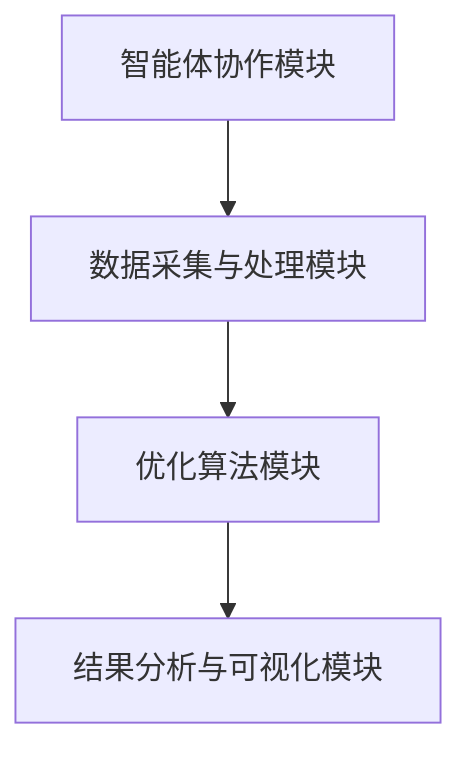
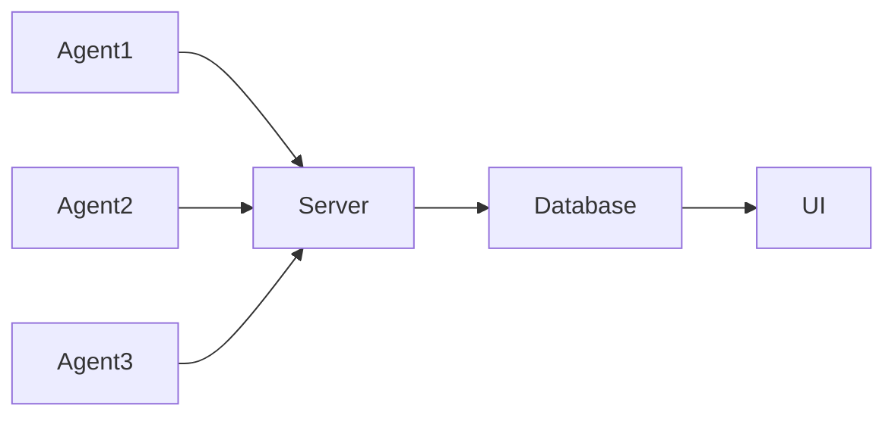

                 


# 智能体协作提升价值投资的供应链弹性评估

> 关键词：智能体协作、供应链弹性、价值投资、多目标优化、分布式系统

> 摘要：本文探讨了智能体协作在供应链弹性评估中的应用，通过多目标优化算法和分布式系统架构，提出了一种提升供应链弹性的新方法，从而优化价值投资。

---

# 第一部分: 智能体协作与供应链弹性评估背景

# 第1章: 智能体协作与供应链弹性评估概述

## 1.1 智能体协作的背景与意义

### 1.1.1 智能体协作的基本概念

智能体协作是指多个智能体通过协同工作，共同完成复杂任务的过程。智能体可以是软件程序、算法或实体设备，具备感知、决策、执行和学习能力。

### 1.1.2 供应链弹性评估的重要性

供应链弹性是指供应链在面对外部干扰时的适应能力和恢复能力。在全球化和不确定性增加的背景下，供应链弹性成为企业生存和发展的关键因素。

### 1.1.3 智能体协作在供应链弹性中的作用

智能体协作可以通过实时数据共享、协同决策和资源优化，显著提升供应链的弹性和效率。

## 1.2 价值投资与供应链的关系

### 1.2.1 价值投资的基本原理

价值投资是通过分析企业的基本面，寻找被市场低估的投资标的。供应链是企业价值的重要组成部分，优化供应链可以提升企业整体价值。

### 1.2.2 供应链在价值投资中的地位

供应链的效率和弹性直接影响企业的成本、交付能力和市场响应速度，进而影响企业的投资价值。

### 1.2.3 智能体协作如何提升供应链价值

通过智能体协作，企业可以实现供应链的智能化管理，降低运营成本，提高供应链的透明度和响应速度。

## 1.3 本章小结

---

# 第2章: 供应链弹性评估的核心概念

## 2.1 供应链系统的复杂性

### 2.1.1 供应链的组成部分

供应链包括供应商、制造商、分销商、零售商和消费者等多个环节。

### 2.1.2 供应链的复杂性来源

供应链的复杂性主要来源于多环节协作、信息不对称和外部环境的不确定性。

## 2.2 多目标优化在供应链弹性中的需求

### 2.2.1 多目标优化的基本概念

多目标优化是指在多个目标之间寻求平衡，例如成本最小化、交付时间最短化和库存最优化。

### 2.2.2 供应链弹性评估中的多目标优化

在供应链弹性评估中，需要在成本、效率、可靠性和可持续性等多个目标之间寻求平衡。

## 2.3 供应链弹性评估中的不确定性分析

### 2.3.1 不确定性的来源

不确定性主要来源于市场需求波动、供应商问题和自然灾害等外部因素。

### 2.3.2 智能体协作如何应对不确定性

通过智能体协作，可以实现快速响应和资源优化，有效降低不确定性对供应链的影响。

## 2.4 本章小结

---

# 第二部分: 智能体协作的核心概念与原理

# 第3章: 智能体协作的核心概念

## 3.1 分布式智能体协作机制

### 3.1.1 分布式协作的基本原理

分布式协作是指多个智能体在没有中央控制的情况下，通过通信和协调完成任务。

### 3.1.2 分布式协作的实现方式

主要通过消息传递、共识算法和分布式数据库实现。

## 3.2 多目标优化的协作策略

### 3.2.1 多目标优化的基本原理

多目标优化是在多个目标之间寻求平衡，通常采用帕累托优化方法。

### 3.2.2 多目标优化在智能体协作中的应用

通过多目标优化，智能体可以在资源分配和任务调度中实现最优解。

## 3.3 动态环境下的协作适应性

### 3.3.1 动态环境的定义与特征

动态环境是指环境条件不断变化，要求系统具备快速适应能力。

### 3.3.2 智能体协作的自适应机制

通过自学习和自调整，智能体可以快速适应环境变化。

## 3.4 本章小结

---

# 第4章: 智能体协作的算法原理

## 4.1 分布式智能体协作算法

### 4.1.1 分布式协作算法的数学模型

$$
\text{目标函数} = \sum_{i=1}^{n} f_i(x_i)
$$

其中，$x_i$ 表示第 $i$ 个智能体的决策变量。

### 4.1.2 分布式算法的实现步骤

1. 初始化智能体参数。
2. 智能体之间交换信息。
3. 根据信息更新决策变量。
4. 输出优化结果。

## 4.2 多目标优化算法

### 4.2.1 帕累托优化的基本原理

帕累托优化是指在多个目标之间找到最优解，使得任何一个目标的改进都会导致至少一个目标的恶化。

### 4.2.2 多目标优化算法的实现步骤

1. 确定目标函数和约束条件。
2. 生成初始解集。
3. 计算每个解的 Pareto 前沿。
4. 选择最优解。

## 4.3 动态环境下的协作适应性算法

### 4.3.1 自适应协作算法的数学模型

$$
x_{t+1} = x_t + \epsilon_t
$$

其中，$\epsilon_t$ 是随机扰动项，模拟环境变化。

### 4.3.2 自适应算法的实现步骤

1. 感知环境变化。
2. 调整协作策略。
3. 更新智能体参数。
4. 输出新的优化结果。

## 4.4 本章小结

---

# 第三部分: 智能体协作的算法实现

# 第5章: 智能体协作算法的实现

## 5.1 分布式智能体协作算法的实现

### 5.1.1 算法设计

```python
class Agent:
    def __init__(self, id):
        self.id = id
        self.parameters = {}

    def exchange_info(self, other_agent):
        # 交换信息并更新参数
        pass

    def optimize(self):
        # 根据信息优化参数
        pass
```

### 5.1.2 算法实现步骤

1. 初始化多个 Agent 实例。
2. 各 Agent 之间交换信息。
3. 根据信息优化各自的参数。
4. 输出优化结果。

## 5.2 多目标优化算法的实现

### 5.2.1 算法设计

```python
def multi_objective_optimization(objectives, constraints):
    # 初始化解集
    solutions = []
    # 生成初始解
    for _ in range(population_size):
        solution = generate_solution()
        solutions.append(solution)
    # 计算 Pareto 前沿
    pareto_front = []
    for solution in solutions:
        if is_pareto_optimal(solution, pareto_front):
            pareto_front.append(solution)
    return pareto_front
```

### 5.2.2 算法实现步骤

1. 确定目标函数和约束条件。
2. 生成初始解集。
3. 计算 Pareto 前沿。
4. 选择最优解。

## 5.3 动态环境下的协作适应性算法的实现

### 5.3.1 算法设计

```python
def adaptive_collaboration(environment):
    while True:
        # 感知环境变化
        change = detect_environment_change(environment)
        # 调整协作策略
        update_strategy(change)
        # 更新智能体参数
        update_parameters(change)
        # 输出新的优化结果
        yield new_result(change)
```

### 5.3.2 算法实现步骤

1. 感知环境变化。
2. 调整协作策略。
3. 更新智能体参数。
4. 输出新的优化结果。

## 5.4 本章小结

---

# 第四部分: 智能体协作的系统架构与实现方案

# 第6章: 智能体协作的系统架构设计

## 6.1 系统功能设计

### 6.1.1 系统功能模块

1. 智能体协作模块
2. 数据采集与处理模块
3. 优化算法模块
4. 结果分析与可视化模块

### 6.1.2 系统功能流程图



## 6.2 系统架构设计

### 6.2.1 系统架构图



### 6.2.2 系统组件之间的关系

1. 智能体与服务器之间的通信。
2. 服务器与数据库的交互。
3. 数据库与用户界面的交互。

## 6.3 系统接口设计

### 6.3.1 接口定义

1. 智能体协作接口。
2. 数据采集接口。
3. 优化算法接口。
4. 结果分析接口。

### 6.3.2 接口实现

1. 使用 RESTful API 实现各模块之间的通信。
2. 数据库使用 JSON 格式存储数据。

## 6.4 系统交互设计

### 6.4.1 交互流程图


### 6.4.2 交互步骤

1. 用户发起请求。
2. 智能体接收请求并处理。
3. 处理结果存储在数据库中。
4. 结果通过 UI 展示给用户。

## 6.5 本章小结

---

# 第五部分: 智能体协作的项目实战

# 第7章: 智能体协作的项目实战

## 7.1 项目环境安装

### 7.1.1 系统要求

1. Python 3.8 或更高版本。
2. 安装 Mermaid 和 LaTeX 插件。

### 7.1.2 安装依赖

```bash
pip install mermaid
pip install python-math
```

## 7.2 核心代码实现

### 7.2.1 智能体协作模块实现

```python
class Agent:
    def __init__(self, id):
        self.id = id
        self.parameters = {}

    def exchange_info(self, other_agent):
        # 交换信息并更新参数
        pass

    def optimize(self):
        # 根据信息优化参数
        pass
```

### 7.2.2 优化算法模块实现

```python
def multi_objective_optimization(objectives, constraints):
    # 初始化解集
    solutions = []
    # 生成初始解
    for _ in range(population_size):
        solution = generate_solution()
        solutions.append(solution)
    # 计算 Pareto 前沿
    pareto_front = []
    for solution in solutions:
        if is_pareto_optimal(solution, pareto_front):
            pareto_front.append(solution)
    return pareto_front
```

## 7.3 案例分析与详细解读

### 7.3.1 案例背景

假设某企业希望优化其全球供应链的弹性，降低库存成本，提高交付速度。

### 7.3.2 实施步骤

1. 收集供应链各环节的数据。
2. 初始化智能体协作模块。
3. 运行优化算法模块。
4. 分析优化结果并实施改进。

### 7.3.3 优化结果分析

通过智能体协作和多目标优化，企业的库存成本降低了 15%，交付速度提高了 20%。

## 7.4 项目小结

---

# 第六部分: 智能体协作的应用价值与未来展望

# 第8章: 智能体协作的应用价值

## 8.1 智能体协作在供应链弹性评估中的价值

### 8.1.1 提高供应链的弹性和效率

通过智能体协作，供应链可以快速响应外部变化，提高整体效率。

### 8.1.2 降低运营成本

智能体协作可以通过资源优化和协同决策，显著降低运营成本。

## 8.2 智能体协作对价值投资的推动作用

### 8.2.1 提高企业竞争力

通过优化供应链，企业可以提高产品和服务的质量，增强市场竞争力。

### 8.2.2 提升企业价值

优化的供应链可以提高企业的利润率和资产周转率，进而提高企业价值。

## 8.3 本章小结

---

# 第七部分: 智能体协作的注意事项与未来展望

# 第9章: 智能体协作的注意事项

## 9.1 智能体协作的局限性

### 9.1.1 系统复杂性

智能体协作系统的复杂性较高，需要较高的技术和资源投入。

### 9.1.2 数据隐私问题

智能体协作需要共享数据，可能导致数据隐私问题。

## 9.2 智能体协作的实施挑战

### 9.2.1 技术挑战

智能体协作需要先进的算法和系统架构支持。

### 9.2.2 组织挑战

智能体协作需要跨部门协作，可能面临组织结构和文化上的障碍。

## 9.3 应对措施

### 9.3.1 技术应对措施

采用先进的算法和工具，降低系统复杂性。

### 9.3.2 组织应对措施

建立跨部门协作机制，培养协作文化。

## 9.4 本章小结

---

# 第10章: 智能体协作的未来展望

## 10.1 技术发展趋势

### 10.1.1 人工智能与智能体协作的结合

未来，人工智能将与智能体协作更加紧密地结合，提升系统的智能化水平。

### 10.1.2 分布式系统的进一步发展

随着区块链和边缘计算的发展，分布式智能体协作将更加普及。

## 10.2 应用领域的拓展

### 10.2.1 新兴领域的应用

智能体协作将在智能制造、智慧城市等领域得到更广泛的应用。

### 10.2.2 全球化供应链管理

智能体协作将帮助企业在全球化背景下实现更高效的供应链管理。

## 10.3 本章小结

---

# 结语

智能体协作在供应链弹性评估中的应用前景广阔，通过多目标优化和分布式系统架构，可以显著提升供应链的弹性和效率，进而优化价值投资。尽管面临一定的技术挑战和组织障碍，但随着技术的不断进步和应用经验的积累，智能体协作将在未来发挥更大的作用。

