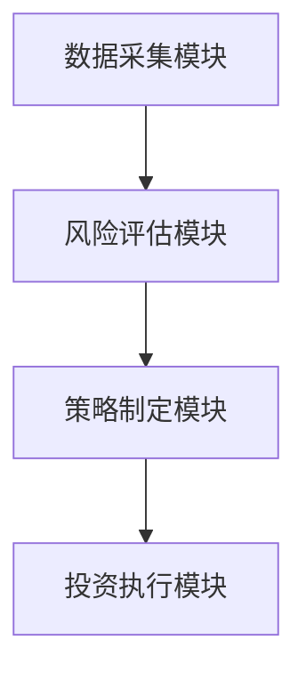
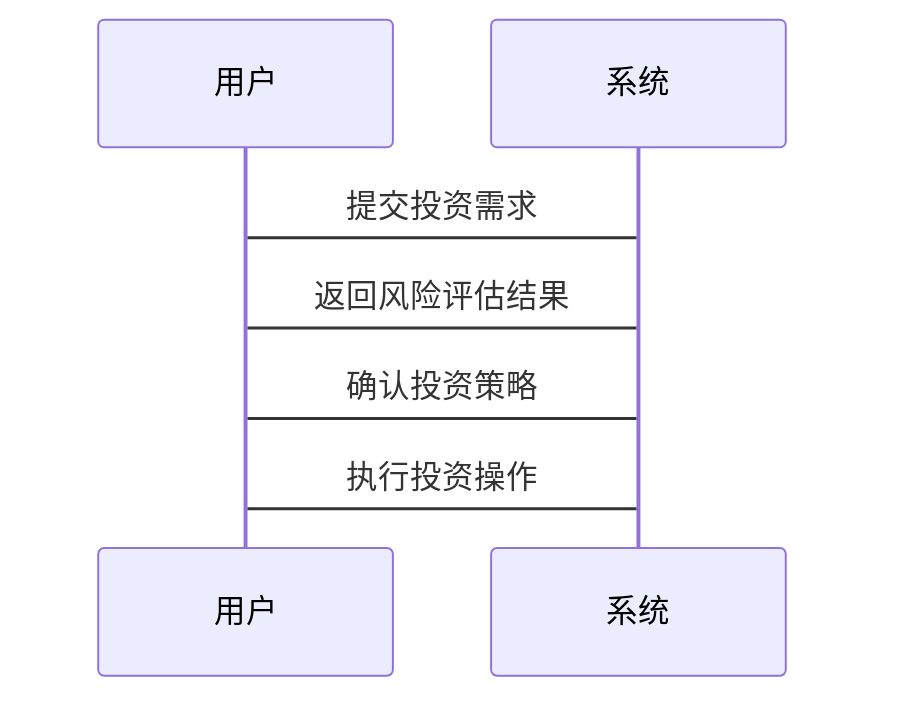

                 


# 智能体协作提升价值投资的地缘政治风险量化分析

**关键词**：智能体协作、价值投资、地缘政治风险量化分析、风险管理、投资策略、智能系统

**摘要**：  
本文探讨了智能体协作在价值投资中的应用，特别是如何通过智能体协作量化地缘政治风险。文章从地缘政治风险的定义、量化方法，到智能体协作的机制、算法实现，再到如何优化投资策略，系统地分析了智能体协作如何帮助投资者更好地应对地缘政治风险。通过理论分析和实际案例，本文展示了如何利用智能体协作技术提升价值投资的效率和准确性。

---

## 第1章: 智能体协作与地缘政治风险的背景介绍

### 1.1 智能体协作的概念与特点

#### 1.1.1 智能体协作的定义  
智能体协作是指多个智能体（Agent）通过共享信息、协同决策和联合行动，共同完成复杂任务的过程。智能体可以是软件程序、算法模型或分布式系统中的独立组件。

#### 1.1.2 智能体协作的核心特点  
智能体协作具有以下特点：  
1. **自主性**：每个智能体都具有独立决策的能力。  
2. **协作性**：智能体之间通过通信和协调完成共同目标。  
3. **动态性**：协作过程可以根据环境变化实时调整。  
4. **分布式性**：协作涉及多个智能体，分布于不同的节点或系统中。  

#### 1.1.3 智能体协作与传统协作的区别  
智能体协作与传统协作的主要区别在于：  
- 智能体协作依赖于技术手段（如算法、数据共享）；  
- 传统协作依赖于人工协调和沟通。  

### 1.2 地缘政治风险的定义与分类

#### 1.2.1 地缘政治风险的定义  
地缘政治风险是指由于政治、经济、社会、军事等因素的变化，导致某地区或国家的稳定性下降，从而对投资活动产生负面影响的可能性。

#### 1.2.2 地缘政治风险的主要分类  
地缘政治风险可以分为以下几类：  
1. **政治风险**：如政策变化、政权更迭等。  
2. **经济风险**：如经济衰退、通货膨胀等。  
3. **社会风险**：如社会动荡、民族冲突等。  
4. **军事风险**：如战争、制裁等。  

#### 1.2.3 地缘政治风险的量化方法  
地缘政治风险的量化方法包括：  
1. **指标法**：通过设定多个指标（如GDP增长率、政治稳定性指数）进行综合评估。  
2. **概率法**：通过历史数据和统计模型预测风险发生的概率。  
3. **情景分析法**：分析不同情景下的风险影响。  

### 1.3 价值投资与地缘政治风险的关系

#### 1.3.1 价值投资的基本概念  
价值投资是一种投资策略，强调以低于内在价值的价格买入优质资产，长期持有，等待其价值回归。

#### 1.3.2 地缘政治风险对价值投资的影响  
地缘政治风险可能影响企业的经营环境、资产价值和市场流动性。例如，地区冲突可能导致能源价格波动，进而影响企业的成本和收益。

#### 1.3.3 智能体协作在价值投资中的作用  
智能体协作可以帮助投资者快速分析地缘政治风险，优化投资决策。例如，通过智能体协作实时监控多个地区的政治经济动态，提供风险预警。

---

## 第2章: 智能体协作的机制与算法

### 2.1 智能体协作的核心机制

#### 2.1.1 智能体的通信机制  
智能体之间通过消息传递、数据共享等方式进行通信，确保信息的实时同步。

#### 2.1.2 协作决策算法  
协作决策算法包括以下步骤：  
1. **信息收集**：智能体收集相关数据。  
2. **信息融合**：将数据整合为统一的决策依据。  
3. **决策制定**：基于融合后的信息制定协作策略。  
4. **策略执行**：智能体根据策略采取行动。  

#### 2.1.3 协作目标的优化  
通过优化算法（如遗传算法、模拟退火算法）不断改进协作策略，提高决策的准确性。

### 2.2 智能体协作的算法实现

#### 2.2.1 协同过滤算法  
协同过滤算法是一种基于相似性推荐的算法，可以应用于智能体协作的风险评估。  
**步骤**：  
1. **数据预处理**：对地缘政治风险数据进行清洗和特征提取。  
2. **相似性计算**：计算不同地区的风险相似性。  
3. **推荐策略**：基于相似性推荐风险较高的地区。  

#### 2.2.2 博弈论模型  
博弈论模型可以用于模拟智能体之间的协作与竞争关系。  
**公式**：  
$$ V = \max_{i} \min_{j} \{ u_i, u_j \} $$  
其中，\( V \) 表示最终决策，\( u_i \) 和 \( u_j \) 分别表示两个智能体的收益。

---

## 第3章: 地缘政治风险的量化分析

### 3.1 地缘政治风险的量化模型

#### 3.1.1 风险评估指标的选取  
常用的风险评估指标包括：  
- **政治稳定性指数**：衡量一个地区的政治稳定性。  
- **经济风险指数**：衡量经济波动对投资的影响。  
- **社会风险指数**：衡量社会动荡的可能性。  

#### 3.1.2 风险评估的数学公式  
地缘政治风险的综合评估公式如下：  
$$ R = \alpha P + \beta E + \gamma S $$  
其中，\( R \) 表示综合风险，\( P \) 表示政治风险，\( E \) 表示经济风险，\( S \) 表示社会风险，\( \alpha, \beta, \gamma \) 为权重系数。

#### 3.1.3 风险概率的计算  
使用贝叶斯定理计算风险发生的概率：  
$$ P(A|B) = \frac{P(B|A)P(A)}{P(B)} $$  
其中，\( A \) 表示风险发生，\( B \) 表示相关证据。

---

## 第4章: 智能体协作优化投资策略

### 4.1 投资策略优化的核心思路

#### 4.1.1 风险-收益平衡  
通过智能体协作，找到风险与收益的最佳平衡点，制定最优的投资策略。

#### 4.1.2 动态调整策略  
根据地缘政治风险的变化，实时调整投资组合，降低风险敞口。

### 4.2 智能体协作的风险管理策略

#### 4.2.1 风险预警机制  
通过智能体协作实时监控风险，提前预警潜在风险。

#### 4.2.2 风险分散策略  
将投资分散到不同地区的资产，降低单一地区的风险影响。

---

## 第5章: 系统架构与实现方案

### 5.1 系统架构设计

#### 5.1.1 系统功能模块  
- **数据采集模块**：采集地缘政治数据。  
- **风险评估模块**：量化地缘政治风险。  
- **策略制定模块**：生成投资策略。  

#### 5.1.2 系统架构图  


### 5.2 接口与交互设计

#### 5.2.1 系统接口设计  
- 数据接口：与数据源对接，获取实时数据。  
- 用户接口：提供风险评估和投资策略的可视化界面。  

#### 5.2.2 交互流程图  


---

## 第6章: 项目实战与案例分析

### 6.1 项目环境配置

#### 6.1.1 系统环境  
- 操作系统：Linux  
- 开发工具：Python、Jupyter Notebook  
- 数据源：公开地缘政治数据集  

### 6.2 核心代码实现

#### 6.2.1 风险评估代码  
```python
import pandas as pd
import numpy as np

# 数据加载
data = pd.read_csv('geopolitical_risk.csv')

# 风险评估模型
def calculate_risk(data):
    P = data['政治风险'].mean()
    E = data['经济风险'].mean()
    S = data['社会风险'].mean()
    R = 0.4 * P + 0.3 * E + 0.3 * S
    return R

risk = calculate_risk(data)
print(f'综合风险：{risk}')
```

#### 6.2.2 投资策略优化代码  
```python
def optimize_strategy(risk):
    if risk > 0.7:
        return '减少投资'
    elif risk > 0.5:
        return '保持投资'
    else:
        return '增加投资'

strategy = optimize_strategy(risk)
print(f'投资策略：{strategy}')
```

### 6.3 案例分析

#### 6.3.1 案例背景  
假设我们分析中东地区的地缘政治风险，数据集包含该地区的政治、经济、社会风险指标。

#### 6.3.2 实施步骤  
1. 数据清洗与特征提取。  
2. 计算综合风险指数。  
3. 根据风险指数制定投资策略。  

#### 6.3.3 结果解读  
通过智能体协作，中东地区的综合风险指数为0.65，建议投资者“保持投资”，但需密切关注地区局势。

---

## 第7章: 结论与展望

### 7.1 研究总结  
智能体协作技术为价值投资中的地缘政治风险量化提供了新的思路，通过实时数据共享和协同决策，投资者可以更高效地制定和调整投资策略。

### 7.2 未来展望  
未来，随着人工智能和大数据技术的进一步发展，智能体协作将在更多领域发挥重要作用，如供应链管理、金融风险控制等。

### 7.3 最佳实践  
- **数据质量**：确保数据来源可靠，避免偏差。  
- **模型优化**：定期更新模型参数，提高风险评估的准确性。  
- **团队协作**：结合技术团队与投资专家，实现优势互补。  

---

通过以上内容，我们系统地分析了智能体协作在价值投资中的应用，特别是在地缘政治风险量化方面的潜力。希望本文能为投资者和技术开发者提供有价值的参考和启示。

