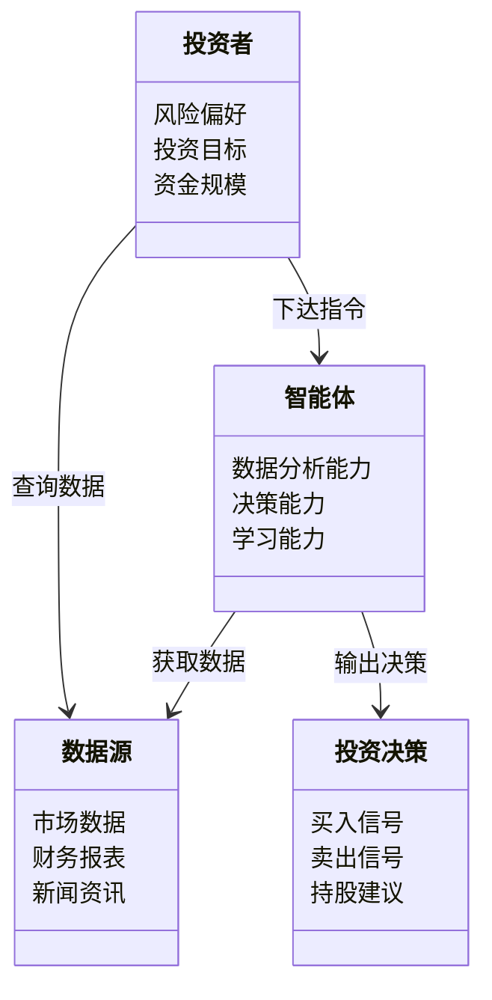
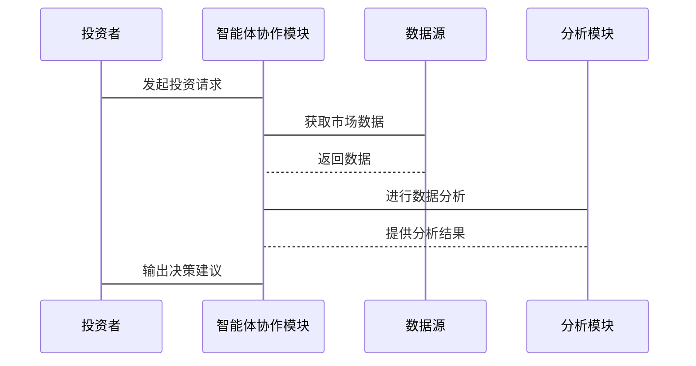

                 


---

# 第四章: 智能体协作在价值投资中的系统分析与架构设计

## 4.1 系统分析与设计背景
### 4.1.1 项目背景与目标
### 4.1.2 项目范围与约束条件
### 4.1.3 系统分析方法与工具

## 4.2 系统功能设计
### 4.2.1 领域模型设计（使用 mermaid 类图）
$$ 类图展示：投资者、智能体、数据源、投资决策等元素的关系 $$



## 4.3 系统架构设计
### 4.3.1 系统架构图（使用 mermaid 架构图）
$$ 系统架构图展示：前端、后端、数据库、智能体协作模块等 $$

```mermaid
container 前端 {
    Web界面
    用户交互
}
container 后端 {
    业务逻辑
    API接口
}
container 数据库 {
    用户数据
    投资记录
}
container 智能体协作模块 {
    数据分析
    决策支持
}
front --> back
back --> db
back --> 智能体协作模块
front --> back
```

## 4.4 系统接口与交互设计
### 4.4.1 系统接口设计
### 4.4.2 系统交互流程（使用 mermaid 序列图）
$$ 序列图展示：投资者与智能体协作模块的交互流程 $$



## 4.5 本章小结

---

# 第五章: 智能体协作提升价值投资的项目实战

## 5.1 项目背景与目标
### 5.1.1 项目背景介绍
### 5.1.2 项目目标设定
### 5.1.3 项目范围与关键任务

## 5.2 环境搭建与安装
### 5.2.1 系统环境要求
### 5.2.2 软件安装与配置
### 5.2.3 依赖库安装（如 Python、TensorFlow、etc.）

## 5.3 核心代码实现
### 5.3.1 数据获取与预处理
```python
import pandas as pd
data = pd.read_csv('投资数据.csv')
```

### 5.3.2 智能体协作算法实现
```python
class 投资决策智能体:
    def __init__(self):
        self.数据源 = 数据源实例
        self.分析模块 = 分析模块实例

    def 执行决策(self):
        数据 = self.数据源.获取数据()
        分析结果 = self.分析模块.分析数据(数据)
        return 分析结果.生成决策建议()
```

### 5.3.3 算法优化与调参
```python
def 优化算法(参数):
    # 算法优化逻辑
    return 最佳参数
```

## 5.4 项目案例分析
### 5.4.1 案例背景介绍
### 5.4.2 数据分析与处理
### 5.4.3 投资决策过程展示
### 5.4.4 实验结果与分析

## 5.5 本章小结

---

# 第六章: 智能体协作提升价值投资的技术风险与控制

## 6.1 技术风险识别
### 6.1.1 技术风险的定义与分类
### 6.1.2 智能体协作技术的主要风险点
### 6.1.3 风险识别的方法与工具

## 6.2 技术风险评估与控制
### 6.2.1 风险评估模型构建
### 6.2.2 风险控制策略制定
### 6.2.3 风险应对措施

## 6.3 技术风险的数学模型与公式
### 6.3.1 风险评估的数学模型
$$ 风险值 = \sum_{i=1}^{n} w_i r_i $$
### 6.3.2 风险控制的优化公式
$$ 最优控制参数 = \argmin_{\theta} \sum_{i=1}^{m} c_i(\theta) $$

## 6.4 本章小结

---

# 第七章: 智能体协作提升价值投资的总结与展望

## 7.1 本项目的核心总结
### 7.1.1 核心成果与创新点
### 7.1.2 项目经验与教训
### 7.1.3 未来改进方向

## 7.2 未来研究方向与展望
### 7.2.1 智能体协作技术的进一步优化
### 7.2.2 价值投资领域的技术革新
### 7.2.3 全球化视野下的技术发展趋势

## 7.3 本章小结

---

# 关键词：
智能体协作，价值投资，技术颠覆，风险评估，算法原理，系统架构，项目实战

# 摘要：
本文深入探讨了智能体协作在价值投资中的应用，分析了其对传统投资方式的技术颠覆性，并从算法原理、系统架构、项目实战等多维度进行了详细的技术风险评估。通过构建数学模型、设计系统架构、实现项目案例，本文为智能体协作技术在价值投资中的应用提供了理论与实践相结合的解决方案，同时提出了有效的风险控制策略和未来研究方向。

