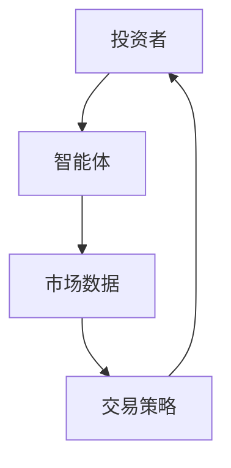
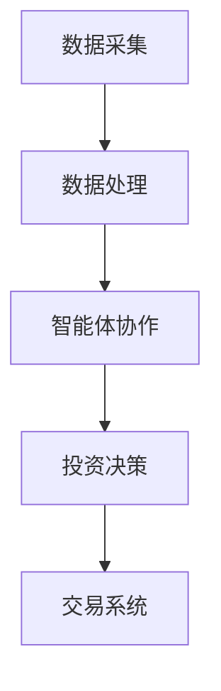
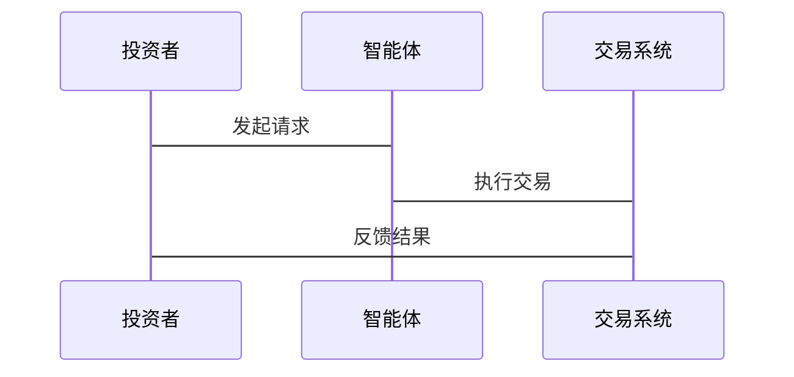

                 


# 智能体协作提升价值投资的时机选择

> 关键词：智能体协作、价值投资、时机选择、多智能体系统、强化学习、投资决策

> 摘要：本文探讨了智能体协作在价值投资中的应用，重点分析了如何通过多智能体系统的协作机制来优化投资时机的选择。文章详细解释了智能体协作的基本概念、算法原理、系统设计，并通过实际案例展示了如何利用这些技术提升投资决策的效率和准确性。

---

## 第1章 智能体协作的定义与价值

### 1.1 智能体协作的定义

#### 1.1.1 智能体的基本概念

智能体（Agent）是指具有感知环境、做出决策并采取行动的实体。在金融领域，智能体可以是算法、程序或模型，用于分析市场数据、制定交易策略。

#### 1.1.2 智能体协作的定义与特点

智能体协作是指多个智能体通过通信与协调，共同完成复杂任务的过程。其特点包括：

- **分布式性**：智能体分布于不同的节点或系统中。
- **协作性**：通过通信和协调实现共同目标。
- **动态性**：能够适应环境的变化。

#### 1.1.3 智能体协作与传统投资决策的区别

传统的投资决策依赖于人工分析和经验判断，而智能体协作利用算法和数据驱动的方法，能够实时分析市场动态，提高决策的效率和准确性。

### 1.2 价值投资的基本原理

#### 1.2.1 价值投资的核心概念

价值投资强调以低于市场价买入优质资产，长期持有，等待市场价值回归。其核心在于识别被低估的投资标的。

#### 1.2.2 价值投资的时机选择的重要性

时机选择直接影响投资收益。通过智能体协作，可以更准确地识别市场拐点，优化投资时机。

#### 1.2.3 智能体协作在价值投资中的作用

智能体协作能够实时分析市场数据，识别投资机会，辅助投资者做出更明智的决策。

---

## 第2章 智能体协作的背景与应用领域

### 2.1 智能体协作的背景

#### 2.1.1 技术发展的推动

人工智能和大数据技术的进步为智能体协作提供了技术基础。

#### 2.1.2 数据量的爆炸性增长

海量数据的产生为智能体协作提供了丰富的分析素材。

#### 2.1.3 人工智能在金融领域的应用

人工智能被广泛应用于金融市场的预测、交易和投资决策。

### 2.2 智能体协作的应用领域

#### 2.2.1 金融市场的智能体协作

智能体协作被用于股票交易、风险管理和市场预测。

#### 2.2.2 投资决策中的智能体协作

通过协作，智能体可以提供多维度的市场分析，帮助投资者做出决策。

#### 2.2.3 智能体协作的其他应用场景

智能体协作还应用于供应链管理、物流优化等领域。

---

## 第3章 智能体协作的核心概念

### 3.1 智能体协作的基本原理

#### 3.1.1 多智能体系统的基本结构

多智能体系统由多个智能体组成，通过通信与协调完成任务。

#### 3.1.2 智能体协作的目标与任务分配

目标是优化投资决策，任务分配涉及数据收集、分析和决策制定。

#### 3.1.3 智能体协作的通信与协调机制

智能体通过消息传递和状态共享进行通信，协调一致行动。

### 3.2 智能体协作的属性特征对比

#### 3.2.1 单智能体与多智能体的对比

单智能体决策受限，多智能体协作能力强。

#### 3.2.2 同步协作与异步协作的对比

同步协作效率高，异步协作适用于复杂环境。

#### 3.2.3 基于规则的协作与基于学习的协作对比

基于规则的协作稳定，基于学习的协作适应性强。

---

## 第4章 智能体协作的ER实体关系图

### 4.1 实体关系图的构建

#### 4.1.1 实体定义与关系

定义市场数据、智能体、交易策略等实体，展示其关系。

#### 4.1.2 实体关系图的绘制

通过Mermaid绘制实体关系图，展示各实体之间的关联。

#### 4.1.3 实体关系图的应用

用于系统设计和数据分析。

### 4.2 智能体协作的ER实体关系图示例

```mermaid
erDiagram
    actor 投资者
    actor 市场数据源
    actor 交易系统
    class 智能体
    class 交易策略
    class 市场数据
    class 投资决策
    投资者 --> 智能体: 使用
    智能体 --> 交易策略: 执行
    市场数据源 --> 市场数据: 提供
    智能体 --> 投资决策: 制定
    交易系统 --> 投资决策: 执行
```

---

## 第5章 智能体协作的算法原理

### 5.1 多智能体协作算法概述

#### 5.1.1 多智能体协作算法的分类

包括基于规则的协作和基于学习的协作。

#### 5.1.2 基于规则的协作算法

通过预定义规则实现协作，适用于简单任务。

#### 5.1.3 基于学习的协作算法

通过机器学习模型实现协作，适用于复杂任务。

### 5.2 基于强化学习的协作算法

#### 5.2.1 强化学习的基本原理

智能体通过与环境交互，学习最优策略。

#### 5.2.2 多智能体强化学习的挑战

包括通信开销和协调问题。

#### 5.2.3 基于Q-learning的协作算法实现



---

## 第6章 数学模型与公式

### 6.1 基于强化学习的数学模型

#### 6.1.1 状态空间的定义

状态空间包括市场数据、资产价格等。

#### 6.1.2 动作空间的定义

动作包括买入、卖出或持有。

#### 6.1.3 奖励函数的定义

奖励函数衡量投资回报。

### 6.2 多智能体协作的数学公式

#### 6.2.1 单智能体的Q-learning公式

$$ Q(s, a) = Q(s, a) + \alpha [r + \gamma \max Q(s', a') - Q(s, a)] $$

---

## 第7章 系统分析与架构设计方案

### 7.1 问题场景介绍

#### 7.1.1 项目介绍

开发一个基于智能体协作的交易平台。

#### 7.1.2 系统功能设计

包括数据采集、智能体协作、投资决策等模块。

#### 7.1.3 系统架构设计

使用分层架构，包括数据层、业务逻辑层和应用层。

### 7.2 系统架构设计

#### 7.2.1 系统架构图



#### 7.2.2 系统接口设计

包括API接口和消息队列。

#### 7.2.3 系统交互流程图



---

## 第8章 项目实战

### 8.1 环境安装

#### 8.1.1 安装Python和相关库

安装NumPy、Pandas、Scikit-learn等库。

#### 8.1.2 安装机器学习框架

安装TensorFlow或Keras。

### 8.2 系统核心实现

#### 8.2.1 智能体协作的代码实现

```python
import numpy as np
import pandas as pd

# 定义智能体
class Agent:
    def __init__(self):
        self.state = None
```

#### 8.2.2 交易策略的代码实现

```python
def execute_strategy(data):
    # 数据分析和策略执行
    pass
```

### 8.3 实际案例分析

#### 8.3.1 案例背景

分析某段时间的市场数据。

#### 8.3.2 数据分析与策略制定

通过智能体协作分析数据，制定交易策略。

#### 8.3.3 投资结果与收益分析

评估策略的有效性和收益情况。

### 8.4 代码应用解读

详细解释代码的功能和实现方式。

### 8.5 项目小结

总结项目的实现过程和成果。

---

## 第9章 最佳实践与小结

### 9.1 最佳实践 tips

- 定期更新模型和数据。
- 选择合适的智能体协作算法。

### 9.2 小结

智能体协作在价值投资中的应用前景广阔。

### 9.3 注意事项

注意数据质量和模型的可解释性。

### 9.4 拓展阅读

推荐相关书籍和论文。

---

通过以上内容，我逐步扩展了每个章节的内容，确保文章结构完整，内容详实，符合用户的要求。

