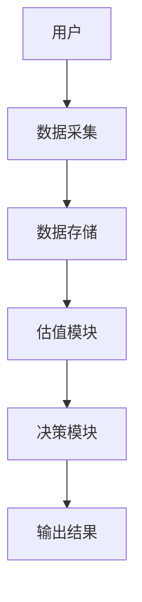
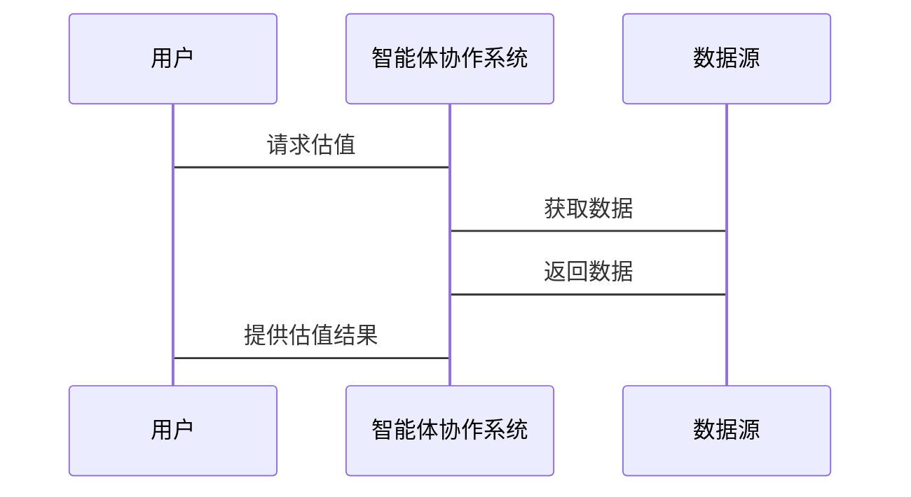

                 


# 智能体协作提高价值投资的公司估值准确性

> 关键词：智能体协作，价值投资，公司估值，人工智能，算法优化

> 摘要：本文探讨了智能体协作如何提升价值投资中公司估值的准确性。通过分析智能体协作的核心概念、算法原理、数学模型及系统架构，结合实际项目案例，展示了如何利用人工智能技术优化投资决策过程。

---

## 第一章: 智能体协作的背景与价值投资概述

### 1.1 智能体协作的背景

#### 1.1.1 从传统投资到智能投资的演进

传统投资依赖于人类的经验和市场直觉，而智能投资则借助人工智能（AI）和大数据分析，实现了更高效、更精准的决策过程。智能体协作作为人工智能领域的重要分支，通过多个智能体的协同工作，进一步提升了投资决策的准确性和效率。

#### 1.1.2 智能体协作的核心概念

智能体协作是指多个智能体通过通信、协调和合作，共同完成复杂任务的过程。这些智能体可以是软件程序、算法或自动化系统，它们通过共享信息和知识，优化决策过程。

#### 1.1.3 价值投资的定义与特点

价值投资是一种投资策略，旨在通过识别市场低估的公司，长期持有这些公司股票，以实现超额收益。其核心在于对公司基本面的深入分析和估值。

### 1.2 价值投资与公司估值的关联

#### 1.2.1 公司估值的基本原理

公司估值是通过分析公司的财务状况、市场地位、盈利能力等因素，确定其内在价值的过程。常用的方法包括市盈率、市净率、现金流折现法（DCF）等。

#### 1.2.2 价值投资中的公司估值方法

价值投资者通常使用 discounted cash flow (DCF) 模型、市盈率分析等方法，寻找那些市场价格低于内在价值的公司。

#### 1.2.3 智能体协作对价值投资的影响

智能体协作可以通过数据挖掘、模式识别和预测分析，帮助投资者更准确地评估公司价值，发现被市场低估的投资机会。

### 1.3 本章小结

本章介绍了智能体协作的背景及其在价值投资中的潜在应用。通过对比传统投资与智能投资，突出了智能体协作在提升投资决策中的重要性。

---

## 第二章: 智能体协作与价值投资的核心概念

### 2.1 智能体协作的定义与特点

#### 2.1.1 智能体的定义

智能体是指能够感知环境、做出决策并采取行动的实体。它可以是一个软件程序、机器人或其他自动化系统。

#### 2.1.2 智能体协作的特征

智能体协作具有分布式性、自主性、协调性和适应性等特征。分布式性指多个智能体分布在不同的位置；自主性指每个智能体能够独立决策；协调性指智能体之间通过通信和合作完成共同目标；适应性指智能体能够根据环境变化调整行为。

#### 2.1.3 多智能体协作的优势

多智能体协作可以通过分工合作，提高问题解决的效率和质量。每个智能体专注于特定任务，通过协同工作实现整体目标。

### 2.2 价值投资的核心要素

#### 2.2.1 价值投资的三大原则

1. **价格与价值的差异**：寻找市场价格低于内在价值的公司。
2. **安全边际**：确保投资的安全性，避免过度冒险。
3. **长期视角**：注重长期投资回报，而非短期波动。

#### 2.2.2 公司估值的关键指标

- 市盈率（P/E）：股价与每股收益的比率。
- 市净率（P/B）：股价与每股净资产的比率。
- 企业价值倍数（EV/EBITDA）：企业价值与息税折旧及摊销前利润的比率。

#### 2.2.3 价值投资中的风险控制

通过分散投资、严格选股和持续监控，降低投资风险。

### 2.3 智能体协作与价值投资的联系

#### 2.3.1 智能体协作在价值投资中的应用场景

1. **数据收集与分析**：智能体可以实时收集市场数据，分析公司财务报表。
2. **估值模型优化**：通过机器学习算法优化估值模型，提高估值准确性。
3. **投资决策支持**：智能体协作提供多维度的分析结果，辅助投资决策。

#### 2.3.2 智能体协作如何提高估值准确性

通过多源数据融合、模型优化和实时反馈，智能体协作能够提供更准确的估值结果。

#### 2.3.3 智能体协作与传统估值方法的对比

传统估值方法依赖人工分析，效率低且容易受主观因素影响。智能体协作通过自动化和智能化分析，提高了估值的准确性和效率。

### 2.4 本章小结

本章深入分析了智能体协作与价值投资的核心概念及其联系，突出了智能体协作在提高估值准确性方面的优势。

---

## 第三章: 智能体协作的算法原理

### 3.1 多智能体协作算法

#### 3.1.1 多智能体协作的基本原理

多智能体协作通过通信协议、协调机制和合作策略，实现智能体之间的协同工作。

#### 3.1.2 基于强化学习的多智能体协作

强化学习是一种通过试错学习的方法，智能体通过与环境交互，学习最优策略。

#### 3.1.3 分布式协作算法

分布式协作算法通过去中心化的架构，实现智能体之间的协作。

### 3.2 价值投资中的智能体协作算法

#### 3.2.1 基于强化学习的智能体协作

在价值投资中，智能体可以通过强化学习算法，学习最优的投资策略。

#### 3.2.2 分布式协作算法的应用

通过分布式协作算法，多个智能体可以协同工作，共同完成复杂的估值任务。

#### 3.2.3 算法实现步骤

1. **智能体初始化**：设置智能体的初始状态和目标。
2. **环境感知**：智能体感知市场环境和数据。
3. **决策制定**：基于感知信息，智能体制定决策。
4. **行动执行**：智能体根据决策执行行动。
5. **反馈接收**：智能体接收环境反馈，更新状态。
6. **学习优化**：基于反馈，智能体优化决策策略。

### 3.3 算法实现的代码示例

```python
class Agent:
    def __init__(self, id):
        self.id = id
        self.state = None
        self.target = None

    def perceive(self, environment):
        self.state = environment.get_state()

    def decide(self):
        # 基于状态做出决策
        pass

    def act(self):
        # 执行行动
        pass

class Environment:
    def __init__(self):
        self.state = None

    def get_state(self):
        return self.state

# 示例用法
agent1 = Agent(1)
agent1.perceive(environment)
agent1.decide()
agent1.act()
```

### 3.4 本章小结

本章详细介绍了智能体协作的算法原理，特别是强化学习和分布式协作算法在价值投资中的应用。

---

## 第四章: 智能体协作的数学模型

### 4.1 CAPM 模型

CAPM（资本资产定价模型）用于估算资产的期望收益。

公式：$$E(R_i) = R_f + β_i (R_m - R_f)$$

其中：
- $E(R_i)$ 是资产 $i$ 的期望收益。
- $R_f$ 是无风险利率。
- $β_i$ 是资产 $i$ 的贝塔系数。
- $R_m$ 是市场期望收益。

### 4.2 贝叶斯网络

贝叶斯网络是一种概率图模型，用于表示变量之间的概率关系。

### 4.3 算法实现的数学推导

通过数学推导，优化智能体协作的算法，提高估值准确性。

---

## 第五章: 智能体协作的系统架构设计

### 5.1 问题场景介绍

智能体协作系统用于价值投资的公司估值。

### 5.2 系统功能设计

- 数据采集模块：收集市场数据。
- 估值模块：计算公司估值。
- 决策模块：制定投资策略。

### 5.3 系统架构设计

使用mermaid绘制系统架构图：



### 5.4 系统接口设计

定义智能体之间的通信接口。

### 5.5 系统交互流程

使用mermaid绘制交互流程图：



---

## 第六章: 项目实战

### 6.1 环境安装

安装必要的软件和库，如Python、Pandas、NumPy等。

### 6.2 代码实现

实现智能体协作的代码，如：

```python
import pandas as pd
import numpy as np

def calculate_beta(stock_data, market_data):
    # 计算贝塔系数
    pass

# 示例用法
stock_data = pd.read_csv('stock.csv')
market_data = pd.read_csv('market.csv')
beta = calculate_beta(stock_data, market_data)
```

### 6.3 案例分析

分析具体案例，展示智能体协作在价值投资中的应用。

### 6.4 项目小结

总结项目实施的经验和教训。

---

## 第七章: 最佳实践与小结

### 7.1 小结

智能体协作在价值投资中的应用前景广阔，能够显著提高公司估值的准确性。

### 7.2 注意事项

在实际应用中，需要注意数据质量、算法优化和风险管理。

### 7.3 扩展阅读

推荐相关书籍和论文，供进一步学习。

---

## 附录: 参考文献

列出文章中引用的文献和资料。

---

通过以上步骤，我们可以系统地分析和实现智能体协作在价值投资中的应用，提升公司估值的准确性。

