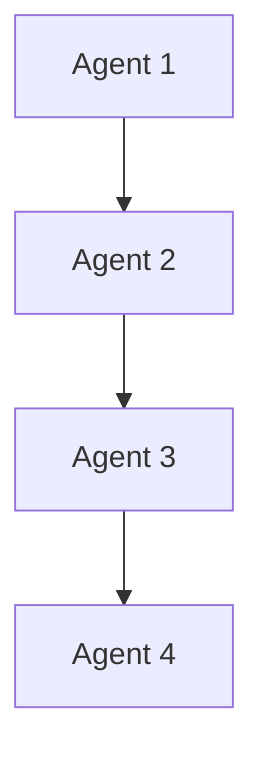

                 


# 智能体协作提高价值投资的行业整合预测

## 关键词：智能体协作，价值投资，行业整合预测，多智能体系统，强化学习

## 摘要：智能体协作是一种通过多个智能体协同工作来提高决策效率和准确性的技术。本文探讨了智能体协作在价值投资和行业整合预测中的应用，分析了其核心概念、算法原理和系统架构设计，通过实际案例展示了智能体协作如何提升投资决策的质量和预测的准确性。

---

## 第1章 智能体协作的基本概念

### 1.1 智能体协作的定义与特点

智能体（Agent）是指能够感知环境、自主决策并采取行动以实现目标的实体。智能体协作是指多个智能体通过信息共享和任务分配，共同完成复杂任务的过程。其特点包括：

- **自主性**：智能体能够独立决策和行动。
- **协作性**：智能体之间通过通信和协调共同完成任务。
- **分布式性**：任务分布在多个智能体之间，避免单点依赖。

### 1.2 价值投资的基本原理

价值投资是一种基于对公司内在价值评估的投资策略。核心原则包括：

- **安全边际**：买入价格低于内在价值。
- **长期视角**：关注公司的长期盈利能力。
- **分散投资**：降低风险。

### 1.3 行业整合预测的背景与意义

行业整合预测是指对行业内企业合并、收购等活动进行预测。其意义在于帮助投资者提前布局，优化资源配置。

---

## 第2章 价值投资与智能体协作的关系

### 2.1 价值投资中的信息处理需求

价值投资需要处理大量的市场数据、财务报表和行业趋势。智能体协作可以高效地处理这些信息。

### 2.2 智能体协作在价值投资中的应用

- **数据收集与分析**：智能体分工合作，分别负责收集和分析不同来源的数据。
- **风险评估**：通过协作，全面评估投资风险。

### 2.3 智能体协作如何提升价值投资效率

- **提高数据处理速度**：多个智能体同时处理数据，提升效率。
- **增强决策准确性**：通过协作，综合考虑多种因素。

---

## 第3章 智能体协作的算法原理

### 3.1 多智能体强化学习算法

多智能体强化学习是一种通过多个智能体协作完成任务的算法。其核心在于智能体之间的通信与协调。

#### 3.1.1 强化学习的基本原理

强化学习通过智能体与环境的交互，学习最优策略。公式表示为：

$$
Q(s, a) = r + \gamma \max_{a'} Q(s', a')
$$

其中，$Q$ 表示状态-动作值函数，$s$ 表示状态，$a$ 表示动作，$r$ 表示奖励，$\gamma$ 表示折扣因子。

### 3.2 分布式计算与智能体协作

分布式计算将任务分解为多个部分，分别在不同的计算节点上执行。这与智能体协作的分工机制相契合。

---

## 第4章 智能体协作的系统架构设计

### 4.1 系统功能设计

- **数据处理模块**：收集和整理市场数据。
- **分析模块**：进行财务分析和行业趋势分析。
- **协作控制模块**：协调智能体之间的任务分配。

### 4.2 系统架构设计

系统采用分层架构，包括数据层、业务逻辑层和表现层。各模块之间通过接口进行通信。

---

## 第5章 项目实战：智能体协作在价值投资中的应用

### 5.1 环境安装

需要安装Python、机器学习库（如TensorFlow、Scikit-learn）和智能体协作框架。

### 5.2 核心代码实现

以下是智能体协作的核心代码示例：

```python
class Agent:
    def __init__(self, id):
        self.id = id
        self.data = []

    def receive_data(self, data):
        self.data.append(data)

    def send_data(self, data, recipient):
        recipient.receive_data(data)
```

### 5.3 案例分析

以科技行业为例，智能体协作可以帮助预测行业的整合趋势，指导投资决策。

---

## 第6章 结论与展望

### 6.1 小结

智能体协作在价值投资和行业整合预测中具有重要作用，能够提高决策效率和准确性。

### 6.2 注意事项

- **数据隐私**：确保数据处理符合隐私保护法规。
- **系统稳定性**：确保智能体协作系统的稳定运行。

### 6.3 拓展阅读

建议进一步研究智能体协作在其他金融领域的应用，如风险管理、量化交易等。

---

## 附录

### 附录A：数学公式汇总

- **强化学习公式**：
  $$ Q(s, a) = r + \gamma \max_{a'} Q(s', a') $$
- **分布式计算公式**：
  $$ \text{Total Processing Time} = \sum \frac{\text{Task Time}}{\text{Number of Agents}} $$

### 附录B：系统架构图



---

通过以上结构，您可以撰写一篇详细的博客文章，探讨智能体协作在价值投资和行业整合预测中的应用。希望这篇文章能够帮助您更好地理解和应用相关技术。

