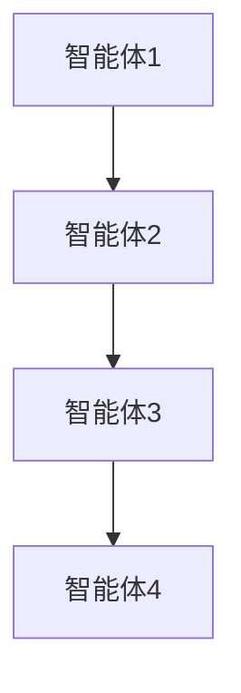
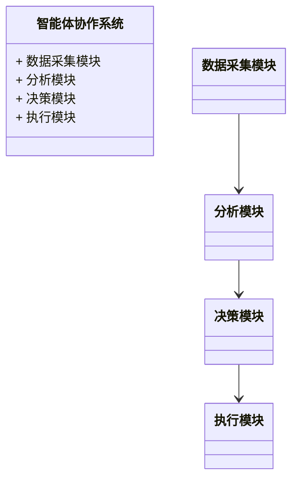
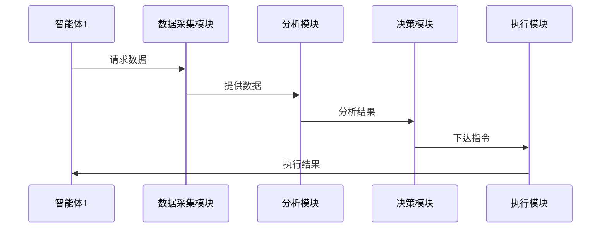

                 


# 智能体协作提高价值投资研究的深度和广度

## 关键词：智能体协作、价值投资、分布式计算、多智能体强化学习、系统架构

## 摘要：智能体协作是一种通过多个智能体协同工作来优化决策的过程，能够在价值投资领域中显著提升研究的深度和广度。本文将从智能体协作的基本概念出发，探讨其在价值投资中的应用，分析相关算法原理和系统架构设计，最后通过实际案例展示其在投资中的实践效果。

---

# 第一部分: 智能体协作与价值投资的背景

## 第1章: 智能体协作与价值投资的背景

### 1.1 智能体协作的定义与特点
#### 1.1.1 智能体协作的定义
智能体协作是指多个智能体通过协同工作，共同完成一个复杂任务的过程。智能体可以是软件程序、算法或模型，它们能够感知环境、自主决策并执行任务。

#### 1.1.2 智能体协作的核心特点
- **自主性**：每个智能体都具备自主决策的能力。
- **协作性**：智能体之间通过通信和协调完成任务。
- **分布式性**：任务分布在多个智能体之间，避免单点依赖。
- **适应性**：能够根据环境变化动态调整协作策略。

#### 1.1.3 智能体协作与传统协作方式的区别
智能体协作与传统协作方式的核心区别在于智能化和自主性。智能体能够自主决策、学习和优化，而传统协作方式依赖于人工干预或固定规则。

### 1.2 价值投资的定义与理论基础
#### 1.2.1 价值投资的基本概念
价值投资是一种投资策略，旨在通过识别市场价格低于其内在价值的资产进行投资。其核心在于寻找被市场低估的投资标的。

#### 1.2.2 价值投资的核心理论
价值投资的理论基础包括基本面分析、安全边际和长期视角。基本面分析关注企业的财务状况、行业地位和竞争优势；安全边际是指市场价格与内在价值之间的差距；长期视角强调投资的长期收益而非短期波动。

#### 1.2.3 价值投资与智能体协作的结合
智能体协作可以通过分析大量数据、识别市场趋势和优化投资组合，帮助投资者发现潜在的投资机会，提高投资决策的准确性和效率。

### 1.3 智能体协作在价值投资中的意义
#### 1.3.1 提高投资研究的深度
智能体协作能够从多个维度分析数据，识别传统方法难以发现的投资机会，提高研究的深度。

#### 1.3.2 扩展投资研究的广度
通过分布式计算和多智能体协作，智能体协作可以同时分析全球多个市场和资产类别，显著扩展研究的广度。

#### 1.3.3 智能体协作对投资决策的影响
智能体协作能够实时监控市场变化、预测价格波动，并动态调整投资策略，从而提升投资决策的科学性和及时性。

---

## 第2章: 智能体协作与价值投资的核心概念与联系

### 2.1 智能体协作的核心概念
#### 2.1.1 智能体的定义与属性
智能体具备感知、决策、执行和学习的能力，能够独立完成任务或与其它智能体协作完成复杂任务。

#### 2.1.2 协作的定义与模式
协作是指智能体之间通过信息共享和任务分工，共同完成一个目标的过程。常见的协作模式包括分布式计算、多智能体强化学习和协同决策。

#### 2.1.3 智能体协作的系统架构
智能体协作系统通常包括感知层、决策层和执行层，各层之间通过通信和协调完成任务。

### 2.2 智能体协作与价值投资的联系
#### 2.2.1 智能体协作在投资决策中的作用
智能体协作可以通过分析市场数据、预测价格走势和优化投资组合，帮助投资者做出更科学的决策。

#### 2.2.2 智能体协作对投资数据的处理能力
智能体协作能够处理海量数据，包括文本、图像和时间序列数据，通过分布式计算和并行处理提高数据处理效率。

#### 2.2.3 智能体协作对投资策略的优化
智能体协作可以通过多智能体强化学习优化投资策略，动态调整资产配置，降低投资风险。

---

## 第3章: 智能体协作的算法原理

### 3.1 智能体协作的算法概述
#### 3.1.1 分布式计算与智能体协作
分布式计算是智能体协作的核心算法之一，通过将任务分解为多个子任务并行处理，提高计算效率。

#### 3.1.2 多智能体强化学习
多智能体强化学习是一种通过多个智能体协作学习的方法，能够解决复杂环境中的决策问题。

#### 3.1.3 智能体协作的数学模型
智能体协作的数学模型通常包括状态空间、动作空间和奖励函数，通过优化目标函数实现协作目标。

### 3.2 算法原理的详细讲解
#### 3.2.1 分布式计算的流程图

#### 3.2.2 多智能体强化学习的代码实现
```python
class Agent:
    def __init__(self, state_space, action_space):
        self.state_space = state_space
        self.action_space = action_space
        # 初始化策略网络
        self.policy = ...
        
    def act(self, state):
        # 根据策略选择动作
        action = self.policy.act(state)
        return action
```

#### 3.2.3 分布式计算的数学模型
$$ f(x) = f_1(x) \parallel f_2(x) \parallel ... \parallel f_n(x) $$

#### 3.2.4 多智能体强化学习的数学公式
$$ Q(s, a) = \sum_{i=1}^{n} Q_i(s, a) $$

---

## 第4章: 智能体协作系统的架构设计

### 4.1 系统架构概述
#### 4.1.1 系统功能模块划分
智能体协作系统通常包括数据采集模块、分析模块、决策模块和执行模块。

#### 4.1.2 系统架构的层次结构
智能体协作系统的层次结构包括感知层、决策层和执行层，各层之间通过通信和协调完成任务。

#### 4.1.3 系统架构
智能体协作系统的架构设计需要考虑系统的扩展性、可维护性和高性能，通常采用分布式架构。

### 4.2 系统架构设计
#### 4.2.1 系统功能设计
智能体协作系统需要具备数据采集、分析、决策和执行功能，能够处理多种类型的数据并动态调整策略。

#### 4.2.2 系统架构的mermaid类图


#### 4.2.3 系统交互的mermaid序列图


---

## 第5章: 智能体协作的项目实战

### 5.1 项目环境安装
#### 5.1.1 安装Python和相关库
需要安装Python、TensorFlow、Keras和Scikit-learn等库，用于智能体协作的实现。

#### 5.1.2 安装必要的依赖项
安装分布式计算框架如Dask和多智能体强化学习库如Ray。

### 5.2 核心代码实现
#### 5.2.1 智能体类的实现
```python
class Agent:
    def __init__(self, state_space, action_space):
        self.state_space = state_space
        self.action_space = action_space
        self.policy = self._build_policy_network()
        
    def _build_policy_network(self):
        # 网络结构设计
        pass
        
    def act(self, state):
        action = self.policy.act(state)
        return action
```

#### 5.2.2 分布式计算的实现
```python
from dask import delayed, compute

@delayed
def process_task(task):
    # 处理任务
    return result

# 提交任务到分布式计算集群
compute(process_task(task1), process_task(task2))
```

### 5.3 项目实战解读
#### 5.3.1 代码功能解读
智能体类负责接收状态并输出动作，分布式计算部分将任务分解为多个子任务并行处理，提高计算效率。

#### 5.3.2 实际案例分析
通过智能体协作分析多个市场数据，预测价格走势，优化投资组合，实现价值投资策略的动态调整。

#### 5.3.3 案例分析小结
智能体协作能够显著提高投资研究的深度和广度，帮助投资者发现更多投资机会，降低投资风险。

---

## 第6章: 总结与展望

### 6.1 最佳实践 tips
- 在实际应用中，智能体协作需要结合具体的投资策略和市场环境。
- 数据质量和实时性对智能体协作的效果有重要影响，需要选择可靠的 数据源。
- 智能体协作的实现需要考虑系统的扩展性和可维护性，采用合适的架构设计。

### 6.2 小结
智能体协作通过分布式计算和多智能体强化学习，显著提升了价值投资研究的深度和广度，为投资者提供了更科学的投资决策支持。

### 6.3 注意事项
- 智能体协作的实现需要考虑系统的安全性和稳定性。
- 数据隐私和合规性问题需要特别注意，尤其是在处理敏感数据时。

### 6.4 拓展阅读
建议读者进一步学习分布式计算、多智能体强化学习和价值投资相关的知识，深入了解智能体协作在投资中的应用。

---

以上是《智能体协作提高价值投资研究的深度和广度》的技术博客文章的完整目录和内容概要。如需进一步扩展或修改，请随时告知！

