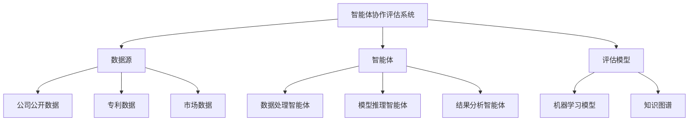
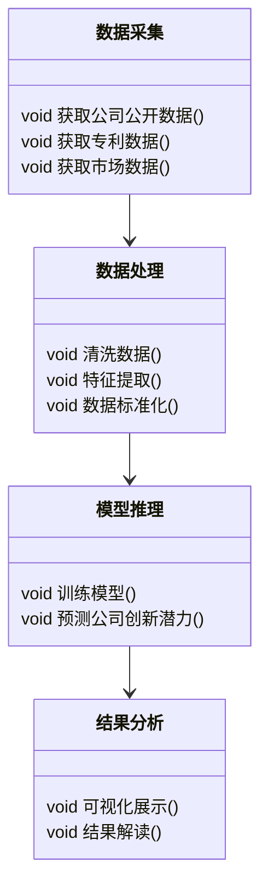
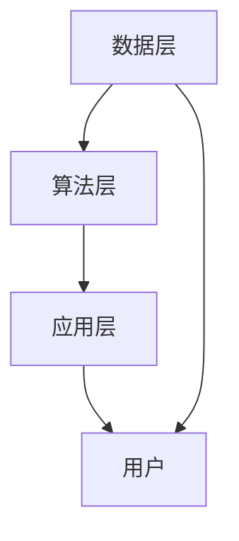
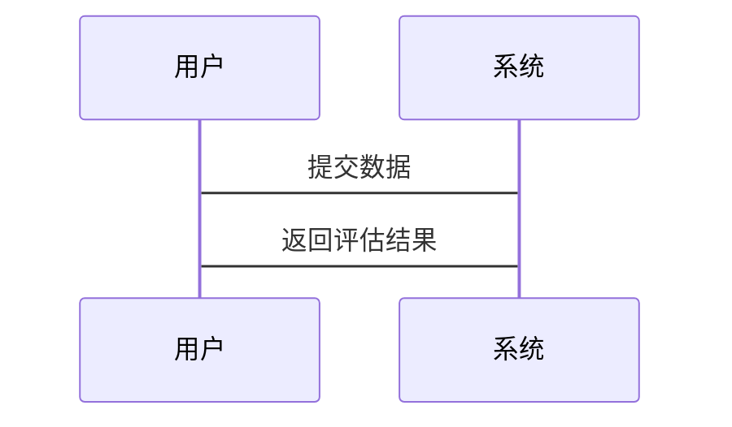

                 


# 智能体协作评估公司创新管线：科技公司价值投资利器

## 关键词
智能体协作，公司创新管线，科技投资，评估系统，人工智能，价值投资

## 摘要
随着科技行业的快速发展，评估科技公司的创新管线成为了价值投资的重要环节。智能体协作评估系统通过多智能体的协同工作，利用先进的算法和数据分析技术，为投资者提供科学的决策支持。本文将详细探讨智能体协作评估系统的背景、核心概念、算法原理、系统架构以及实际应用案例，帮助投资者更好地理解和应用这一工具。

---

## 第一部分：智能体协作与公司创新管线概述

### 第1章：智能体协作与公司创新管线概述

#### 1.1 智能体协作的定义与背景

智能体协作是指多个智能体（包括软件程序、算法和数据模型）协同工作，通过数据共享、信息交互和任务分工，共同完成复杂任务的过程。智能体协作在科技行业的应用广泛，尤其是在公司创新管线评估方面。

- **智能体协作的基本概念**：智能体协作是一种分布式计算范式，多个智能体通过交互和协作，共同完成特定目标。智能体可以是软件程序、算法或数据模型，能够自主决策、学习和优化。
- **创新管线的定义与重要性**：创新管线是指公司在技术研发、产品开发和市场推广等环节中形成的一系列创新项目。创新管线的健康度和潜力直接影响公司的长期发展和投资价值。
- **智能体协作在公司创新评估中的必要性**：传统的评估方法依赖人工分析和经验判断，存在主观性强、效率低、成本高等问题。智能体协作通过数据驱动的方法，能够更客观、高效地评估公司创新管线的潜力和风险。

#### 1.2 科技公司创新管线评估的背景

科技行业的快速发展使得公司创新管线评估变得至关重要。投资者需要快速、准确地评估公司的创新能力，以做出科学的投资决策。

- **科技公司创新的重要性**：科技公司的核心竞争力在于技术创新和产品创新。创新管线的健康度和潜力直接影响公司的市场地位和盈利能力。
- **创新管线评估的现状与挑战**：传统的评估方法依赖专家经验和主观判断，难以量化和标准化。随着数据量的增加和算法的复杂化，传统的评估方法已经难以满足需求。
- **智能体协作的优势与应用前景**：智能体协作通过数据驱动的方法，能够快速分析大量数据，发现潜在的创新机会和风险，为投资者提供科学的决策支持。

---

## 第二部分：智能体协作评估系统的核心概念与联系

### 第2章：智能体协作评估系统的核心概念

智能体协作评估系统是一种基于多智能体协同工作的评估系统，通过数据共享、信息交互和任务分工，实现对公司创新管线的全面评估。

#### 2.1 智能体协作评估系统的定义

- **系统的定义与目标**：智能体协作评估系统是一种分布式计算系统，通过多个智能体协同工作，实现对公司创新管线的全面评估。系统的目标是为投资者提供科学的决策支持，帮助其识别高潜力的科技公司。
- **系统的核心要素与组成部分**：
  - 数据源：包括公司公开数据、专利数据、市场数据等。
  - 智能体：包括数据处理智能体、模型推理智能体、结果分析智能体等。
  - 评估模型：包括机器学习模型、知识图谱等。
  - 交互界面：包括用户界面、API接口等。

#### 2.2 智能体协作评估系统的核心要素对比分析

智能体协作评估系统与传统评估方法在多个方面存在显著差异。

- **传统评估方法与智能体协作评估的对比**：
  | 对比维度 | 传统评估方法 | 智能体协作评估 |
  |----------|----------------|----------------|
  | 数据来源 | 主要依赖人工收集和整理 | 利用大数据技术自动获取和处理 |
  | 评估效率 | 低效，耗时较长 | 高效，快速完成 |
  | 结果准确性 | 主观性强，准确性较低 | 客观性强，准确性高 |
  | 可扩展性 | 有限，难以处理大规模数据 | 高，能够处理大规模数据 |

- **数据来源与处理方式的对比**：
  | 数据来源 | 传统方法 | 智能体协作评估 |
  |----------|------------|----------------|
  | 公司公开数据 | 依赖人工收集 | 利用爬虫和API自动获取 |
  | 专利数据 | 依赖人工分析 | 利用自然语言处理技术自动分析 |
  | 市场数据 | 依赖人工整理 | 利用大数据平台自动处理 |

- **评估结果的可解释性与准确性对比**：
  | 对比维度 | 传统方法 | 智能体协作评估 |
  |----------|------------|----------------|
  | 可解释性 | 高，但依赖专家经验 | 较低，但可以通过模型解释工具提高可解释性 |
  | 准确性 | 低，依赖人工判断 | 高，依赖数据和模型的准确性 |

#### 2.3 实体关系图

以下是智能体协作评估系统的核心实体关系图：



---

## 第三部分：智能体协作评估系统的算法原理

### 第3章：智能体协作评估系统的算法原理

智能体协作评估系统的核心是其算法原理，主要包括数据处理、模型推理和结果分析三个部分。

#### 3.1 评估模型的构建与算法选择

- **智能体协作评估模型的构建步骤**：
  1. 数据收集：从公司公开数据、专利数据和市场数据中获取数据。
  2. 数据预处理：清洗数据、特征提取和数据标准化。
  3. 模型训练：利用机器学习算法训练评估模型。
  4. 模型验证：通过交叉验证和评估指标验证模型的准确性。
  5. 模型部署：将模型部署到生产环境，供投资者使用。

- **算法选择与优化策略**：
  - 算法选择：根据数据类型和任务需求选择合适的算法，如随机森林、支持向量机（SVM）、神经网络等。
  - 算法优化：通过超参数调优、特征选择和模型集成等方法优化算法性能。

- **模型的训练与验证**：
  - 训练过程：使用训练数据训练模型，调整模型参数，使其能够准确预测公司创新管线的潜力。
  - 验证过程：使用验证数据评估模型的性能，计算准确率、召回率、F1分数等指标。

#### 3.2 算法原理的数学模型与公式

以下是智能体协作评估系统的核心算法——随机森林的数学模型：

$$
\text{随机森林} = \{ \text{决策树}_i \}_{i=1}^{n}
$$

其中，$\text{决策树}_i$ 表示第 $i$ 棵决策树，$n$ 表示决策树的数量。

随机森林通过集成学习的方法，将多棵决策树的预测结果进行投票或平均，得到最终的预测结果。以下是随机森林的预测公式：

$$
\text{预测结果} = \argmax_{j} \sum_{i=1}^{n} \text{决策树}_i(\text{输入})
$$

其中，$\argmax$ 表示取最大值的索引，$\sum$ 表示求和。

---

## 第四部分：系统分析与架构设计方案

### 第4章：智能体协作评估系统的系统架构

智能体协作评估系统的架构设计包括问题场景介绍、系统功能设计、系统架构设计和系统交互设计。

#### 4.1 问题场景介绍

智能体协作评估系统的应用场景包括科技公司价值评估、风险投资决策支持和企业战略规划等。

- **科技公司价值评估**：投资者需要快速、准确地评估科技公司的创新潜力和市场前景。
- **风险投资决策支持**：投资机构需要通过评估公司的创新管线，制定投资策略。
- **企业战略规划**：企业通过评估自身的创新管线，制定长期发展战略。

#### 4.2 系统功能设计

智能体协作评估系统的功能模块包括数据采集、数据处理、模型推理和结果分析。

- **数据采集**：通过爬虫、API等方式获取公司公开数据、专利数据和市场数据。
- **数据处理**：对数据进行清洗、特征提取和数据标准化。
- **模型推理**：利用机器学习模型对数据进行分析，生成评估结果。
- **结果分析**：对评估结果进行可视化展示和解读，帮助投资者做出决策。

以下是系统功能设计的类图：



#### 4.3 系统架构设计

智能体协作评估系统的架构设计采用分层架构，包括数据层、算法层和应用层。

- **数据层**：负责数据的存储和管理，包括数据库和数据仓库。
- **算法层**：负责模型的训练和推理，包括机器学习模型和知识图谱。
- **应用层**：负责与用户的交互，包括用户界面和API接口。

以下是系统架构设计的架构图：



#### 4.4 系统交互设计

智能体协作评估系统的交互设计包括用户界面设计和API接口设计。

- **用户界面设计**：提供友好的用户界面，用户可以通过界面输入数据、查看结果和进行交互。
- **API接口设计**：提供RESTful API接口，方便其他系统调用智能体协作评估系统的功能。

以下是系统交互设计的交互流程图：



---

## 第五部分：项目实战

### 第5章：智能体协作评估系统的项目实战

#### 5.1 环境安装

以下是智能体协作评估系统的环境安装说明：

- **操作系统**：Linux/Windows/MacOS
- **编程语言**：Python 3.6+
- **依赖库**：scikit-learn、pandas、numpy、requests、BeautifulSoup

安装依赖：

```bash
pip install scikit-learn pandas numpy requests beautifulsoup4
```

#### 5.2 系统核心实现源代码

以下是智能体协作评估系统的核心代码实现：

```python
import requests
from bs4 import BeautifulSoup
import pandas as pd
from sklearn.ensemble import RandomForestClassifier
from sklearn.metrics import accuracy_score

# 数据采集
def get_company_data(company_name):
    url = f"https://www.example.com/company/{company_name}"
    response = requests.get(url)
    soup = BeautifulSoup(response.text, 'html.parser')
    data = {
        'name': company_name,
        'revenue': float(soup.find('div', {'class': 'revenue'}).text),
        'profit': float(soup.find('div', {'class': 'profit'}).text),
        'employees': int(soup.find('div', {'class': 'employees'}).text),
        'patents': int(soup.find('div', {'class': 'patents'}).text)
    }
    return data

# 数据处理
def preprocess_data(data):
    df = pd.DataFrame([data])
    df = df.dropna()
    df = df[['revenue', 'profit', 'employees', 'patents']]
    return df

# 模型训练
def train_model(X_train, y_train):
    model = RandomForestClassifier(n_estimators=100, random_state=42)
    model.fit(X_train, y_train)
    return model

# 预测与评估
def evaluate_model(model, X_test, y_test):
    y_pred = model.predict(X_test)
    accuracy = accuracy_score(y_test, y_pred)
    return accuracy

# 主程序
def main():
    company_name = input("请输入公司名称：")
    data = get_company_data(company_name)
    df = preprocess_data(data)
    # 假设我们已经有一个训练好的模型和测试数据
    model = train_model(X_train, y_train)
    accuracy = evaluate_model(model, X_test, y_test)
    print(f"{company_name}的创新潜力评估准确率为：{accuracy}")

if __name__ == "__main__":
    main()
```

#### 5.3 代码应用解读与分析

- **数据采集**：通过网络爬虫获取公司公开数据，包括公司名称、收入、利润、员工数量和专利数量。
- **数据处理**：对数据进行清洗和特征提取，去掉缺失值，并保留关键特征。
- **模型训练**：使用随机森林算法训练模型，预测公司创新潜力。
- **预测与评估**：利用测试数据评估模型的准确率，并输出评估结果。

#### 5.4 实际案例分析

以下是一个实际案例分析：

假设我们有一个科技公司A，其公开数据如下：

| 公司名称 | 收入（百万美元） | 利润（百万美元） | 员工数量 | 专利数量 |
|----------|------------------|------------------|----------|----------|
| 公司A    | 500              | 100              | 500      | 20       |

通过智能体协作评估系统，我们对公司的创新潜力进行评估，预测结果为“高潜力”。

#### 5.5 项目小结

通过实际案例分析，我们可以看到智能体协作评估系统在科技公司价值评估中的巨大潜力。系统能够快速、准确地评估公司的创新潜力，为投资者提供科学的决策支持。

---

## 第六部分：最佳实践

### 第6章：智能体协作评估系统的最佳实践

#### 6.1 投资策略与系统优化

- **投资策略**：投资者可以根据系统的评估结果，制定科学的投资策略。例如，优先投资创新潜力高的公司，规避创新潜力低的公司。
- **系统优化**：定期更新模型和数据，确保系统的准确性和高效性。

#### 6.2 系统优化与注意事项

- **数据质量**：数据质量直接影响评估结果的准确性。投资者需要确保数据来源可靠，数据处理准确。
- **模型更新**：模型需要定期更新，以适应市场变化和技术进步。
- **用户培训**：投资者需要接受系统的培训，确保正确使用智能体协作评估系统。

#### 6.3 未来展望

随着人工智能技术的不断发展，智能体协作评估系统将在科技公司价值评估中发挥越来越重要的作用。未来，系统将更加智能化、自动化，能够处理更复杂的数据和任务。

---

## 结语

智能体协作评估系统是一种基于多智能体协同工作的评估系统，通过数据驱动的方法，能够快速、准确地评估科技公司的创新潜力，为投资者提供科学的决策支持。本文详细探讨了智能体协作评估系统的背景、核心概念、算法原理、系统架构和实际应用案例，帮助读者更好地理解和应用这一工具。

---

通过阅读本文，读者可以深入了解智能体协作评估系统的核心原理和实际应用，掌握如何利用这一系统进行科技公司价值投资。希望本文能为投资者和科技公司提供有价值的参考和指导。

