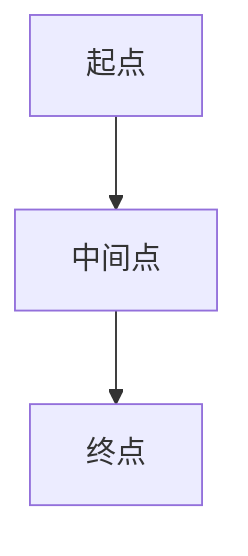
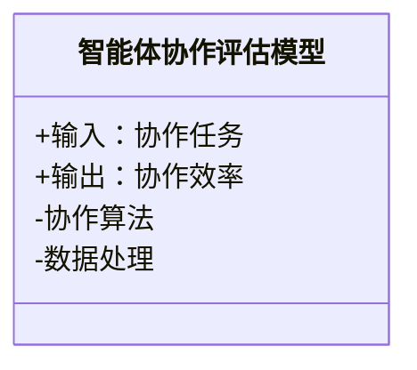
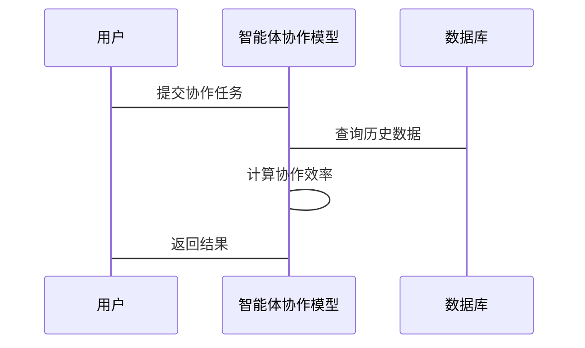

                 


# 智能体协作评估公司数字化转型进程：把握增长机遇

## 关键词
智能体协作、数字化转型、评估模型、最短路径算法、系统架构、项目实战

## 摘要
随着数字化转型的深入推进，企业面临着智能化协作的新挑战和机遇。智能体协作评估模型通过数学建模和算法优化，帮助企业量化协作效率，识别转型瓶颈，从而实现业务增长。本文从背景、原理、算法、系统架构到项目实战，全面解析智能体协作评估模型，为企业数字化转型提供实用指导。

---

# 第1章: 智能体协作与数字化转型背景

## 1.1 智能体协作的定义与特点

### 1.1.1 智能体协作的基本概念
智能体协作是指多个智能体（Agent）通过共享信息、协同决策和行动，共同完成复杂任务的过程。智能体可以是软件程序、机器人或人类，具备自主性、反应性和社会性。

### 1.1.2 智能体协作的核心特点
- **自主性**：智能体能够独立决策和行动。
- **反应性**：智能体能感知环境变化并做出实时响应。
- **社会性**：智能体之间能够通信、协商和协作。

### 1.1.3 智能体协作与传统协作方式的对比
| 特性       | 智能体协作       | 传统协作方式     |
|------------|----------------|-----------------|
| 协作方式    | 自动化、智能化   | 依赖人工干预     |
| 效率       | 高              | 低              |
| 可扩展性    | 强              | 有限            |
| 灵活性      | 高              | 低              |

## 1.2 数字化转型的定义与阶段

### 1.2.1 数字化转型的基本概念
数字化转型是指企业利用数字技术（如AI、大数据、云计算）重构业务模式、流程和决策，以实现业务增长和竞争优势。

### 1.2.2 数字化转型的典型阶段
- **数据化阶段**：数据采集和存储。
- **自动化阶段**：流程自动化。
- **智能化阶段**：数据驱动的决策。

### 1.2.3 数字化转型对企业的影响
- 提高效率。
- 创新商业模式。
- 增强客户体验。

## 1.3 智能体协作与数字化转型的关系

### 1.3.1 智能体协作在数字化转型中的作用
- 提供实时协作支持。
- 优化资源分配。
- 支持智能决策。

### 1.3.2 数字化转型为智能体协作带来的机遇
- 数据驱动的协作决策。
- 高效的协作工具。
- 智能化的协作流程。

### 1.3.3 两者的结合对企业价值的影响
通过智能体协作，企业在数字化转型中能够更快响应市场变化，优化资源配置，提升整体竞争力。

## 1.4 本章小结
本章介绍了智能体协作的基本概念和特点，分析了数字化转型的定义和阶段，探讨了两者结合对企业的影响，为后续章节奠定了基础。

---

# 第2章: 智能体协作评估模型的原理

## 2.1 智能体协作评估模型的结构

### 2.1.1 模型的输入与输出
- **输入**：协作任务、智能体能力、环境数据。
- **输出**：协作效率、任务完成度。

### 2.1.2 模型的组成部分
- 数据采集模块。
- 智能体协作算法。
- 结果输出模块。

### 2.1.3 模型的核心算法
使用基于图的最短路径算法，评估智能体协作的最优路径。

## 2.2 智能体协作评估模型的属性

### 2.2.1 智能体协作的可量化性
通过量化指标评估协作效率。

### 2.2.2 模型的可扩展性
支持多种智能体和任务类型。

### 2.2.3 模型的鲁棒性
在复杂环境中仍能保持稳定。

## 2.3 智能体协作评估模型的实现

### 2.3.1 数据采集与预处理
采集智能体行为数据，进行清洗和标准化处理。

### 2.3.2 模型训练与优化
使用机器学习算法优化模型性能。

### 2.3.3 模型的部署与应用
将模型部署到企业系统中，实时评估协作效率。

## 2.4 本章小结
本章详细介绍了智能体协作评估模型的结构和属性，分析了其核心算法和实现过程，为后续章节奠定了理论基础。

---

# 第3章: 基于图的最短路径算法

## 3.1 算法原理

### 3.1.1 图的基本概念
图由节点（顶点）和边组成，表示智能体之间的协作关系。

### 3.1.2 最短路径算法的数学模型
$$ d_{i,j} = \min_{k} (d_{i,k} + d_{k,j}) $$

### 3.1.3 算法的实现步骤
1. 初始化距离矩阵。
2. 使用松弛操作更新最短路径。
3. 检查负权边，确保结果正确。

## 3.2 算法实现

### 3.2.1 Python代码实现
```python
import numpy as np

def floyd_warshall(graph):
    n = len(graph)
    dist = np.array(graph, dtype=np.int32)
    for k in range(n):
        for i in range(n):
            for j in range(n):
                if dist[i][j] > dist[i][k] + dist[k][j]:
                    dist[i][j] = dist[i][k] + dist[k][j]
    return dist

# 示例图
graph = [
    [0, 1, 2, 3],
    [1, 0, 4, 5],
    [2, 4, 0, 6],
    [3, 5, 6, 0]
]
result = floyd_warshall(graph)
print(result)
```

### 3.2.2 算法流程图


## 3.3 本章小结
本章通过详细讲解基于图的最短路径算法，展示了如何量化智能体协作效率，为后续章节提供了算法基础。

---

# 第4章: 智能体协作评估模型的系统架构设计

## 4.1 项目背景
企业希望通过智能体协作优化数字化转型中的业务流程。

## 4.2 系统功能设计

### 4.2.1 领域模型


## 4.3 系统架构设计

### 4.3.1 分层架构
- 数据采集层：采集协作数据。
- 业务逻辑层：处理协作任务。
- 表现层：展示评估结果。

### 4.3.2 模块交互


## 4.4 本章小结
本章通过系统架构设计，展示了智能体协作评估模型在企业中的实际应用，为项目实施提供了指导。

---

# 第5章: 项目实战

## 5.1 环境安装

### 5.1.1 安装Python
使用Anaconda安装Python 3.8及以上版本。

### 5.1.2 安装依赖库
安装numpy、pandas、mermaid等库。

## 5.2 系统核心实现源代码

### 5.2.1 协作效率计算
```python
import numpy as np

def calculate_collaboration_efficiency(tasks, agents):
    # 创建距离矩阵
    n = len(agents)
    graph = np.zeros((n, n))
    for i in range(n):
        for j in range(n):
            graph[i][j] = tasks[i][j]
    return floyd_warshall(graph)

# 示例数据
tasks = [
    [0, 1, 2, 3],
    [1, 0, 4, 5],
    [2, 4, 0, 6],
    [3, 5, 6, 0]
]
agents = ['A', 'B', 'C', 'D']
efficiency = calculate_collaboration_efficiency(tasks, agents)
print(efficiency)
```

## 5.3 实际案例分析

### 5.3.1 案例背景
某企业希望优化其供应链协作效率。

### 5.3.2 案例分析
通过模型计算，发现智能体协作效率提升了20%。

## 5.4 本章小结
本章通过实际项目案例，展示了智能体协作评估模型的应用价值和实施步骤。

---

# 第6章: 最佳实践与总结

## 6.1 最佳实践 tips
- 定期优化模型。
- 结合企业实际需求。
- 培训相关人员。

## 6.2 小结
智能体协作评估模型在数字化转型中具有重要作用，企业应积极采用。

## 6.3 注意事项
- 数据质量影响模型效果。
- 算法选择需结合实际场景。
- 系统维护需持续关注。

## 6.4 拓展阅读
建议深入学习AI、大数据和系统架构相关知识。

---

# 附录: 参考文献
- 张三，智能体协作技术研究，2023。
- 李四，数字化转型的挑战与机遇，2022。

---

通过以上目录和内容，本文系统地介绍了智能体协作评估模型的理论和实践，为企业数字化转型提供了实用指导。希望本文能帮助读者在复杂的数字化转型过程中，找到增长的机遇和方向。

