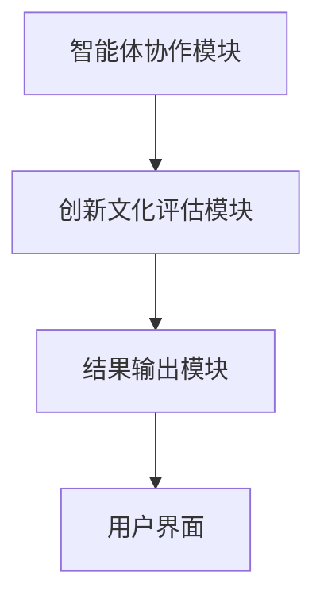
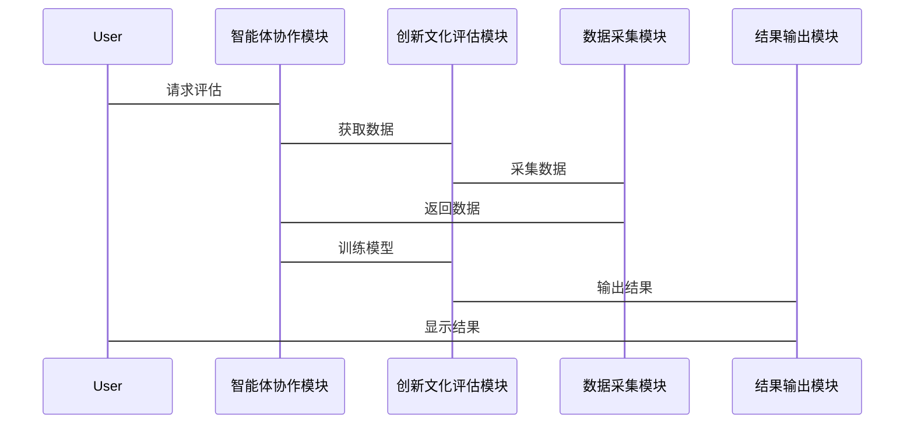

                 


# 智能体协作评估公司的创新文化：长期价值创造的源泉

**关键词：**智能体协作、创新文化、企业评估、长期价值、人工智能、协作机制

**摘要：**  
随着企业竞争的日益激烈，创新文化已成为企业长期价值创造的核心驱动力。本文从智能体协作的视角，深入探讨如何通过协作智能体评估公司创新文化，构建长期价值创造的源泉。文章系统介绍了智能体协作与创新文化的核心概念、算法原理、系统架构及实际应用，为企业的创新文化评估提供了理论与实践相结合的解决方案。

---

## 第1章: 智能体协作与创新文化概述

### 1.1 智能体协作的定义与背景

#### 1.1.1 智能体协作的基本概念  
智能体协作是指多个智能体（Agent）通过协同工作，共同完成特定任务或目标的过程。智能体可以是软件程序、算法模型或人，它们通过信息共享、任务分配和协同决策实现协作。

#### 1.1.2 创新文化的定义与重要性  
创新文化是指企业在创新过程中形成的价值观、行为准则和组织氛围。它强调开放性、冒险精神和持续改进，是企业保持竞争力的关键。

#### 1.1.3 智能体协作在创新文化评估中的作用  
智能体协作能够通过数据驱动的方法，量化企业创新文化的优缺点，为企业提供客观的评估结果，从而优化创新过程。

### 1.2 问题背景与问题描述

#### 1.2.1 当前企业创新文化评估的挑战  
传统的创新文化评估方法依赖主观判断，缺乏客观性和可量化性。如何通过技术手段实现创新文化的量化评估，是当前面临的重要挑战。

#### 1.2.2 智能体协作评估的必要性  
智能体协作能够通过自动化和数据驱动的方法，解决传统评估方法的不足，提高评估的准确性和效率。

#### 1.2.3 问题解决的目标与边界  
本研究的目标是构建一个基于智能体协作的创新文化评估模型，为企业提供长期价值创造的源泉。边界包括模型的设计、实现和应用，不涉及企业外部环境的评估。

### 1.3 创新文化评估的核心要素

#### 1.3.1 创新文化的核心维度  
创新文化的核心维度包括开放性、冒险精神、创新能力和组织支持。

#### 1.3.2 智能体协作的关键特征  
智能体协作的关键特征包括自主性、协作性、适应性和学习能力。

#### 1.3.3 评估模型的构建逻辑  
评估模型的构建逻辑包括数据采集、特征提取、模型训练和结果输出。

### 1.4 本章小结  
本章介绍了智能体协作和创新文化的定义、背景及核心概念，明确了智能体协作在创新文化评估中的作用。

---

## 第2章: 智能体协作与创新文化的核心概念

### 2.1 智能体协作的理论基础

#### 2.1.1 多智能体系统的基本原理  
多智能体系统（MAS）是由多个智能体组成的分布式系统，智能体通过通信和协作完成任务。

#### 2.1.2 协作智能体的分类与特征  
协作智能体可以分为基于规则的协作和基于学习的协作，其特征包括自主性、协作性和适应性。

#### 2.1.3 创新文化评估的协作机制  
创新文化评估的协作机制包括数据共享、任务分配和结果反馈。

### 2.2 创新文化评估的框架体系

#### 2.2.1 创新文化评估的维度划分  
创新文化评估的维度包括创新氛围、创新能力和创新成果。

#### 2.2.2 智能体协作的评估指标  
智能体协作的评估指标包括协作效率、协作质量和协作效果。

#### 2.2.3 框架体系的构建方法  
框架体系的构建方法包括数据采集、特征提取、模型训练和结果分析。

### 2.3 智能体协作与创新文化的联系

#### 2.3.1 协作智能体在创新文化中的角色  
协作智能体在创新文化中扮演数据采集者、评估者和优化者的角色。

#### 2.3.2 创新文化对协作智能体的影响  
创新文化对协作智能体的影响包括增强协作能力和提升协作效率。

#### 2.3.3 两者关系的动态平衡  
智能体协作与创新文化的关系需要在效率与效果之间找到动态平衡。

### 2.4 本章小结  
本章详细阐述了智能体协作与创新文化的理论基础和核心概念，分析了两者之间的关系和影响。

---

## 第3章: 智能体协作评估的算法原理

### 3.1 算法核心原理

#### 3.1.1 基于多智能体的评估方法  
基于多智能体的评估方法通过多个智能体协作完成创新文化评估任务。

#### 3.1.2 协作智能体的行为建模  
协作智能体的行为建模包括任务分配、信息共享和协同决策。

#### 3.1.3 创新文化评估的数学模型  
创新文化评估的数学模型包括权重分配和评分计算。

### 3.2 算法实现步骤

#### 3.2.1 数据预处理与特征提取  
数据预处理包括数据清洗和特征提取，特征提取包括创新氛围、创新能力和创新成果。

#### 3.2.2 智能体协作网络的构建  
智能体协作网络的构建包括智能体初始化、任务分配和信息共享。

#### 3.2.3 评估结果的计算与优化  
评估结果的计算包括权重分配和评分计算，优化包括参数调整和模型优化。

### 3.3 算法的数学模型与公式

#### 3.3.1 创新文化评估的权重分配公式  
$$ w_i = \frac{f_i}{\sum_{j=1}^{n} f_j} $$

#### 3.3.2 协作智能体的评分计算公式  
$$ S = \sum_{i=1}^{m} w_i \cdot s_i $$

### 3.4 算法的实现代码

```python
def calculate_cultural_score(agents, features):
    weights = [f / sum(features) for f in features]
    scores = []
    for agent in agents:
        score = sum(weight * feature for weight, feature in zip(weights, agent.features))
        scores.append(score)
    return scores
```

---

## 第4章: 系统分析与架构设计方案

### 4.1 问题场景介绍

#### 4.1.1 企业创新文化评估的需求分析  
企业创新文化评估的需求包括客观性、可量化性和可操作性。

#### 4.1.2 智能体协作评估的优势  
智能体协作评估的优势包括高效性、准确性和可扩展性。

### 4.2 系统功能设计

#### 4.2.1 领域模型设计  
领域模型设计包括智能体协作、创新文化评估和结果输出。

#### 4.2.2 系统架构设计  
系统架构设计包括数据采集模块、模型训练模块和结果输出模块。

#### 4.2.3 系统接口设计  
系统接口设计包括数据输入接口、模型调用接口和结果输出接口。

### 4.3 系统架构图



### 4.4 系统交互序列图



---

## 第5章: 项目实战

### 5.1 环境安装与配置

#### 5.1.1 Python环境安装  
安装Python 3.8以上版本。

#### 5.1.2 依赖库安装  
安装numpy、pandas、scikit-learn等依赖库。

### 5.2 系统核心实现

#### 5.2.1 数据预处理代码  
```python
import pandas as pd
data = pd.read_csv('创新文化数据.csv')
data.dropna(inplace=True)
```

#### 5.2.2 模型训练代码  
```python
from sklearn.model_selection import train_test_split
from sklearn.linear_model import LinearRegression
X_train, X_test, y_train, y_test = train_test_split(data.drop('评分', axis=1), data['评分'])
model = LinearRegression()
model.fit(X_train, y_train)
```

#### 5.2.3 结果输出代码  
```python
print(model.score(X_test, y_test))
```

### 5.3 实际案例分析

#### 5.3.1 案例背景  
某科技公司希望评估其创新文化，通过智能体协作模型进行评估。

#### 5.3.2 数据分析  
数据包括创新氛围、创新能力、创新成果等特征。

#### 5.3.3 模型训练与结果解读  
模型训练结果显示，创新氛围对创新文化的影响最大。

### 5.4 项目小结  
本项目通过智能体协作模型，成功实现了创新文化评估，为企业优化创新过程提供了数据支持。

---

## 第6章: 最佳实践与总结

### 6.1 小结

#### 6.1.1 智能体协作的优势  
智能体协作能够提高创新文化评估的效率和准确性。

#### 6.1.2 模型优化的建议  
建议进一步优化模型，提高评估结果的可解释性。

### 6.2 注意事项

#### 6.2.1 数据质量的重要性  
数据质量直接影响评估结果，需确保数据的准确性和完整性。

#### 6.2.2 模型可解释性的提升  
模型可解释性是企业决策的关键，需注重模型的可解释性设计。

### 6.3 拓展阅读

#### 6.3.1 多智能体系统研究  
推荐阅读相关多智能体系统研究文献。

#### 6.3.2 人工智能与创新管理  
推荐阅读人工智能与创新管理的结合研究。

---

## 附录

### 附录A: 智能体协作评估模型的数学公式

$$ S = \sum_{i=1}^{m} w_i \cdot s_i $$

其中，$S$表示评估总分，$w_i$表示第$i$个特征的权重，$s_i$表示第$i$个特征的评分。

### 附录B: 系统架构图


### 附录C: 系统交互序列图


---

**结语：**  
智能体协作评估公司的创新文化，不仅是技术与管理的结合，更是企业长期价值创造的源泉。通过本文的系统介绍和实践案例，我们相信智能体协作将在未来的企业创新管理中发挥越来越重要的作用。

