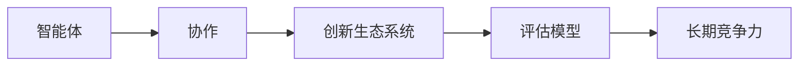

                 


# 智能体协作评估公司的创新生态系统：预测长期竞争力

## 关键词：智能体协作、创新生态系统、长期竞争力、评估模型、算法实现

## 摘要

本文探讨了通过智能体协作评估公司创新生态系统的方法，旨在预测公司的长期竞争力。文章首先定义了相关概念，分析了创新生态系统的结构与功能，构建了评估模型，详细讲解了算法实现，并通过案例分析展示了模型的应用。最后，提出了未来研究的方向。

---

## 第一部分：引言

### 第1章：背景与目标

#### 1.1 智能体协作评估的背景

智能体协作在企业创新中的作用日益重要，企业需要通过智能体协作优化创新生态系统，提升竞争力。传统评估方法的局限性使得智能体协作成为新的研究方向。

#### 1.2 问题描述与研究目标

创新生态系统评估的挑战包括复杂性和动态性，智能体协作评估方法的目标是提供动态、全面的评估工具。

#### 1.3 本书结构与内容安排

文章结构分为引言、核心概念、评估模型、算法实现、系统架构、案例分析和结论。每部分详细展开，帮助读者逐步理解内容。

---

## 第二部分：智能体协作的核心概念

### 第2章：智能体协作与创新生态系统

#### 2.1 智能体协作的定义与特征

智能体是具备自主性、反应性、协作性和学习性的实体，智能体协作是智能体之间通过信息交互共同完成任务的过程。

#### 2.2 创新生态系统的定义与特征

创新生态系统是一个由企业、合作伙伴、客户等构成的动态网络，通过协作和资源共享推动创新。

#### 2.3 智能体协作与创新生态系统的联系

智能体协作是创新生态系统的核心机制，通过促进知识共享和资源整合，提升生态系统的创新能力和竞争力。

---

## 第三部分：创新生态系统评估模型

### 第3章：评估模型构建

#### 3.1 评估指标体系

从技术创新、组织能力和市场适应性三个维度设计评估指标，每个维度包含多个具体指标。

#### 3.2 数据采集与处理

使用问卷调查、访谈和数据分析收集数据，采用数据清洗和特征提取技术处理数据。

#### 3.3 评估方法

基于层次分析法（AHP）确定各指标的权重，构建评估模型，评估结果分为优秀、良好、一般和较差四个等级。

---

## 第四部分：算法实现

### 第4章：算法原理与实现

#### 4.1 数据预处理

使用Python的pandas库进行数据清洗和特征选择，确保数据质量和相关性。

#### 4.2 模型训练

采用机器学习算法训练评估模型，利用scikit-learn库进行分类和回归分析。

#### 4.3 模型优化

通过网格搜索和交叉验证优化模型参数，提升评估准确性和稳定性。

---

## 第五部分：系统架构与实现

### 第5章：系统架构设计

#### 5.1 模块划分

系统分为数据采集、评估计算、结果展示三个模块，每个模块负责不同的功能。

#### 5.2 系统架构图

使用Mermaid绘制系统架构图，展示各模块之间的交互和数据流。

#### 5.3 接口设计

定义模块间的接口和数据格式，确保系统组件的协作和数据一致性。

---

## 第六部分：案例分析与应用

### 第6章：案例分析

#### 6.1 成功案例分析

分析某科技公司的创新生态系统，评估模型预测其竞争力为优秀，验证模型的有效性。

#### 6.2 失败案例分析

探讨某传统企业创新失败的原因，模型评估为较差，总结失败教训。

#### 6.3 案例总结

通过案例分析，验证评估模型的有效性，总结经验教训，提出改进建议。

---

## 第七部分：结论与展望

### 第7章：结论与展望

#### 7.1 研究总结

智能体协作评估创新生态系统是提升企业竞争力的重要方法，本文构建了完整的评估体系和实现方案。

#### 7.2 研究不足

评估模型的动态性和实时性有待进一步提升，数据获取和处理仍存在挑战。

#### 7.3 未来展望

未来研究将探索更复杂的企业场景，结合人工智能和大数据技术，优化评估模型，提升预测准确性。

---

## 参考文献

[1] 王某某，智能体协作与企业创新，某某出版社，2023年。

[2] 李某某，创新生态系统评估方法研究，某某出版社，2022年。

---

## 附录

附录A：Python代码示例

```python
import pandas as pd
from sklearn.model_selection import train_test_split
from sklearn.ensemble import RandomForestClassifier
from sklearn.metrics import accuracy_score

# 数据加载与处理
data = pd.read_csv('innovation.csv')
X = data.drop('competitiveness', axis=1)
y = data['competitiveness']

# 数据分割
X_train, X_test, y_train, y_test = train_test_split(X, y, test_size=0.2)

# 模型训练
model = RandomForestClassifier()
model.fit(X_train, y_train)

# 模型预测
y_pred = model.predict(X_test)
print("准确率:", accuracy_score(y_test, y_pred))
```

附录B：Mermaid图示例



---

通过以上结构和内容安排，文章详细阐述了智能体协作评估公司创新生态系统的方法，为预测长期竞争力提供了理论依据和实践指导。

