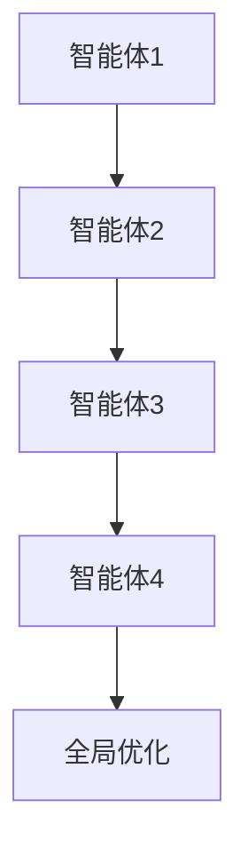
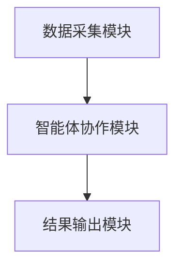

                 


# 智能体协作评估公司的地缘政治风险：全球价值投资必备

> **关键词**：智能体协作、地缘政治风险、全球投资、多智能体系统、风险评估、价值投资  
>
> **摘要**：本文详细探讨了如何利用智能体协作技术来评估公司的地缘政治风险，为全球投资者提供科学的决策支持。文章从地缘政治风险的基本概念出发，分析了智能体协作的核心原理，并结合实际案例，展示了如何通过智能体协作算法构建地缘政治风险评估模型。最后，本文总结了智能体协作在地缘政治风险评估中的优势，并为全球投资者提供了具体的实战指导和投资策略。

---

## 第一部分：地缘政治风险评估基础

### 第1章：地缘政治风险与全球投资

#### 1.1 地缘政治风险的定义与核心要素

地缘政治风险是指由于国家间的政治、经济、军事等复杂关系而导致的投资风险。这种风险可能源于政府政策变化、国际关系紧张、地区冲突等。地缘政治风险的核心要素包括：

- **政治稳定性**：政府的稳定性、政策的连续性。
- **国际关系**：国家间的外交关系、贸易政策、军事冲突。
- **经济依赖度**：一个国家或地区的经济对外国的依赖程度。

#### 1.2 全球投资中的地缘政治风险场景

地缘政治风险对全球投资的影响是多方面的。例如：

- **国家层面**：政府更迭、政策变化可能导致投资环境恶化。
- **行业层面**：某些行业可能因国际制裁或贸易限制而面临风险。
- **公司层面**：公司可能因所在国家的地缘政治动荡而面临财务损失或业务中断。

#### 1.3 智能体协作在地缘政治风险评估中的作用

智能体协作是一种分布式协作机制，通过多个智能体的协同工作，能够更高效地处理复杂问题。在地缘政治风险评估中，智能体协作的优势在于：

- **分布式决策**：多个智能体分别负责不同的风险评估任务。
- **信息共享**：智能体之间可以共享信息，提高整体评估的准确性。
- **协同优化**：通过协作，智能体可以找到最优的评估方案。

---

## 第二部分：智能体协作的核心原理

### 第2章：智能体协作的基本原理

#### 2.1 智能体协作的定义与特点

智能体协作是指多个智能体通过分布式协作完成任务的过程。其核心特点包括：

- **分布式决策**：每个智能体独立决策，但通过协作实现全局目标。
- **信息共享**：智能体之间共享信息，避免信息孤岛。
- **协同优化**：通过协作，智能体能够找到最优的解决方案。

#### 2.2 智能体协作的数学模型

智能体协作的数学模型通常涉及多智能体系统（MAS）的建模与优化。以下是一个简化的协作模型：

$$
\text{目标函数} = \sum_{i=1}^{n} f_i(s_i) + \sum_{i=1}^{n} \sum_{j=1}^{m} g_{ij}(s_i, s_j)
$$

其中，$f_i(s_i)$ 表示第 $i$ 个智能体的局部目标函数，$g_{ij}(s_i, s_j)$ 表示智能体 $i$ 和 $j$ 之间的协作目标函数。

#### 2.3 智能体协作的算法原理

智能体协作的算法通常基于博弈论和分布式优化。以下是一个简化的协作算法流程：



---

## 第三部分：地缘政治风险评估的智能体协作模型

### 第3章：地缘政治风险评估模型构建

#### 3.1 地缘政治风险评估模型的框架

地缘政治风险评估模型通常包括以下几个模块：

- **数据收集**：收集相关的政治、经济、军事数据。
- **风险指标提取**：提取关键风险指标，如政治稳定性指数、经济依赖度指数。
- **智能体协作评估**：通过智能体协作计算风险评估结果。
- **结果输出**：输出最终的风险评估报告。

#### 3.2 智能体协作评估的地缘政治风险模型

智能体协作评估的地缘政治风险模型可以通过以下步骤构建：

1. **数据预处理**：对收集的数据进行清洗和标准化处理。
2. **智能体分配**：将数据分配给不同的智能体进行处理。
3. **协作计算**：智能体之间协作计算风险评估结果。
4. **结果整合**：将各个智能体的计算结果整合，得到最终的风险评估报告。

#### 3.3 智能体协作评估的地缘政治风险模型实现

以下是一个简单的智能体协作评估模型的代码实现：

```python
class Agent:
    def __init__(self, data):
        self.data = data
        self.result = None

    def process(self):
        # 处理数据并计算结果
        self.result = self.data * 2

    def get_result(self):
        return self.result

def main():
    # 初始化数据
    data = [1, 2, 3, 4, 5]
    agents = [Agent(d) for d in data]

    # 启动智能体处理数据
    for agent in agents:
        agent.process()

    # 收集结果
    results = [agent.get_result() for agent in agents]
    print(results)

if __name__ == "__main__":
    main()
```

---

## 第四部分：地缘政治风险评估的智能体协作系统架构

### 第4章：系统架构设计

#### 4.1 系统功能设计

地缘政治风险评估的智能体协作系统通常包括以下几个功能模块：

- **数据采集模块**：负责收集相关数据。
- **智能体协作模块**：负责智能体之间的协作计算。
- **结果输出模块**：负责输出最终的风险评估报告。

#### 4.2 系统架构设计

以下是系统的架构设计：



---

## 第五部分：地缘政治风险评估的智能体协作实战

### 第5章：项目实战

#### 5.1 环境安装与配置

为了实现智能体协作评估地缘政治风险，需要安装以下工具和库：

- **Python**：用于编写代码。
- **NumPy**：用于数据处理。
- **Matplotlib**：用于数据可视化。

#### 5.2 系统核心实现

以下是智能体协作评估地缘政治风险的核心代码实现：

```python
import numpy as np
import matplotlib.pyplot as plt

class RiskAssessmentAgent:
    def __init__(self, data):
        self.data = data
        self.result = None

    def assess_risk(self):
        # 计算风险指数
        self.result = np.mean(self.data) * 2
        return self.result

def main():
    # 初始化数据
    data = np.array([1, 2, 3, 4, 5])
    agents = [RiskAssessmentAgent(d) for d in data]

    # 启动智能体评估风险
    results = [agent.assess_risk() for agent in agents]
    print(results)

    # 可视化结果
    plt.plot(results)
    plt.xlabel('Agent Index')
    plt.ylabel('Risk Index')
    plt.show()

if __name__ == "__main__":
    main()
```

#### 5.3 实际案例分析

以某个国家的地缘政治风险评估为例，展示如何通过智能体协作进行评估。

---

## 第六部分：智能体协作在地缘政治风险评估中的应用

### 第6章：最佳实践与投资策略

#### 6.1 投资策略

基于智能体协作的地缘政治风险评估结果，投资者可以制定以下策略：

- **分散投资**：避免过度集中于高风险地区。
- **动态调整**：根据风险评估结果动态调整投资组合。
- **长期监控**：持续关注地缘政治风险的变化。

#### 6.2 投资建议

- **关注地缘政治热点**：重点关注地缘政治风险较高的地区。
- **多元化投资**：通过多元化降低风险。
- **定期评估**：定期重新评估投资组合的风险。

---

## 第七部分：总结与展望

### 第7章：总结与展望

#### 7.1 总结

智能体协作在地缘政治风险评估中具有重要的应用价值。通过智能体协作，可以更高效地评估地缘政治风险，为全球投资者提供科学的决策支持。

#### 7.2 展望

未来，随着人工智能技术的不断发展，智能体协作在地缘政治风险评估中的应用将更加广泛和深入。例如，可以通过强化学习进一步优化智能体协作算法，提高风险评估的准确性和效率。

---

**注意事项**：  
- 本文中的代码示例仅供参考，实际应用中需要根据具体需求进行调整。  
- 地缘政治风险评估是一个复杂的系统工程，需要结合多方面的数据和信息进行综合分析。  

**拓展阅读**：  
- 《Multi-Agent Systems: Algorithmic, Complexity, and Theory》  
- 《Geopolitical Risk Assessment for Investment Decision-Making》  

通过智能体协作技术，全球投资者可以更科学、更高效地评估地缘政治风险，从而做出更加明智的投资决策。

